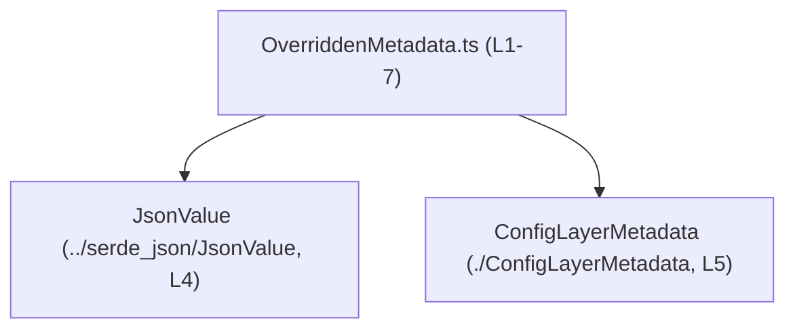
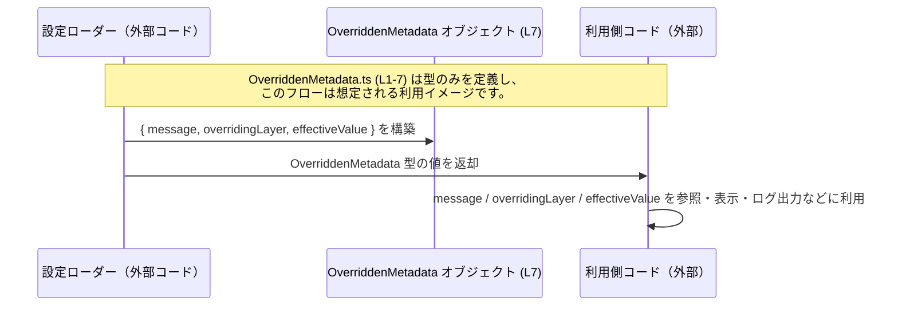

# app-server-protocol\schema\typescript\v2\OverriddenMetadata.ts コード解説

## 0. ざっくり一言

このファイルは、自動生成された `OverriddenMetadata` という TypeScript 型エイリアスを定義し、特定の値が「どのレイヤーにより上書きされたか」といったメタデータ構造を表現するためのスキーマを提供します（ファイル名とフィールド名からの推測を含みます / 実際の利用箇所はこのチャンクには現れません）。

---

## 1. このモジュールの役割

### 1.1 概要

- 冒頭コメントにより、このファイルは `ts-rs` によって自動生成されたコードであり、手動編集は想定されていません（`OverriddenMetadata.ts:L1-3`）。
- `OverriddenMetadata` という型エイリアスを 1 つエクスポートし、3 つのフィールドを持つオブジェクト型を定義します（`OverriddenMetadata.ts:L7-7`）。
- 他のモジュールが `OverriddenMetadata` を型として利用することで、「message / overridingLayer / effectiveValue」という構造のオブジェクトを型安全に扱えるようにする役割を持ちます。

### 1.2 アーキテクチャ内での位置づけ

- このモジュールは以下 2 つの型に依存しています。
  - `JsonValue`（`../serde_json/JsonValue` からの型インポート, `OverriddenMetadata.ts:L4-4`）
  - `ConfigLayerMetadata`（`./ConfigLayerMetadata` からの型インポート, `OverriddenMetadata.ts:L5-5`）
- いずれも `import type` を用いて型としてのみ参照されており、ランタイムには影響しない依存関係です（`OverriddenMetadata.ts:L4-5`）。

Mermaid による依存関係図（このファイルの全範囲 `L1-7` を対象とした概念図）です。



### 1.3 設計上のポイント

- **自動生成コード**  
  - 冒頭コメントに「GENERATED CODE! DO NOT MODIFY BY HAND!」と明記され、`ts-rs` による生成であることが示されています（`OverriddenMetadata.ts:L1-3`）。
- **型専用インポート**  
  - 依存型は `import type` で読み込まれており、コンパイル後の JavaScript にはインポートが出力されないことが意図される構成です（`OverriddenMetadata.ts:L4-5`）。
- **純粋なスキーマ定義**  
  - このファイルには関数やクラスはなく、`export type OverriddenMetadata = { ... }` の 1 定義のみで、完全に型レベルの定義に特化しています（`OverriddenMetadata.ts:L7-7`）。
- **必須プロパティのみ**  
  - 3 つのプロパティはいずれも `?` 修飾子が付いておらず、すべて必須プロパティとして定義されています（`OverriddenMetadata.ts:L7-7`）。

---

## 2. 主要な機能一覧

このモジュールが提供する機能は、型レベルのものに限定されます。

- `OverriddenMetadata` 型:  
  `message: string`, `overridingLayer: ConfigLayerMetadata`, `effectiveValue: JsonValue` から成るオブジェクト構造を表す型エイリアス（`OverriddenMetadata.ts:L7-7`）。

---

## 3. 公開 API と詳細解説

### 3.1 型一覧（構造体・列挙体など）

#### このファイルで定義される型

| 名前                | 種別        | 役割 / 用途                                                                                                    | 定義箇所                        |
|---------------------|-------------|----------------------------------------------------------------------------------------------------------------|---------------------------------|
| `OverriddenMetadata` | 型エイリアス | 3 つのプロパティ（`message`, `overridingLayer`, `effectiveValue`）を持つオブジェクト型を表現するスキーマ。設定値の上書きに関するメタデータを表す用途が名前から想定されます。 | `OverriddenMetadata.ts:L7-7` |

#### 依存している外部型（このファイルでは定義されない）

| 名前                 | 種別 | 役割 / 関係                                                                                             | 参照箇所                        | 定義の有無 |
|----------------------|------|---------------------------------------------------------------------------------------------------------|---------------------------------|------------|
| `JsonValue`          | 型   | `effectiveValue` プロパティの型。JSON 形式の値を表す型であることが名称から推測されますが、構造は不明です。 | `OverriddenMetadata.ts:L4-4, L7-7` | このチャンクには定義が現れません |
| `ConfigLayerMetadata` | 型   | `overridingLayer` プロパティの型。設定レイヤーに関するメタデータである可能性がありますが、詳細は不明です。  | `OverriddenMetadata.ts:L5-5, L7-7` | このチャンクには定義が現れません |

> `JsonValue` および `ConfigLayerMetadata` の具体的なフィールドや仕様は、このチャンクに含まれていないため不明です。

#### `OverriddenMetadata` のフィールド

`OverriddenMetadata` は次の 3 プロパティを持つオブジェクト型として定義されています（`OverriddenMetadata.ts:L7-7`）。

| フィールド名       | 型                    | 必須 / 任意 | 説明                                                                                         | 定義箇所                 |
|--------------------|-----------------------|-------------|----------------------------------------------------------------------------------------------|--------------------------|
| `message`          | `string`              | 必須        | 上書きに関する説明メッセージを格納する文字列であると推測されます。                           | `OverriddenMetadata.ts:L7-7` |
| `overridingLayer`  | `ConfigLayerMetadata` | 必須        | どの設定レイヤーが値を上書きしたかを表現するメタデータであると推測されます。                 | `OverriddenMetadata.ts:L7-7` |
| `effectiveValue`   | `JsonValue`           | 必須        | 上書きの結果として有効になった値そのもの（JSON 表現）を保持すると考えられます。              | `OverriddenMetadata.ts:L7-7` |

> 上記の「説明」は、フィールド名と型名からの推測を含みます。厳密な仕様（例: `message` にどのような文言を入れるか）は、このチャンクからは分かりません。

### 3.2 関数詳細（最大 7 件）

このファイルには関数・メソッドの定義が存在しないため、詳細解説対象の関数はありません（`OverriddenMetadata.ts:L1-7` 全体を確認）。

### 3.3 その他の関数

同様に、補助的な関数やラッパー関数も定義されていません。

| 関数名 | 役割（1 行） | 備考 |
|--------|--------------|------|
| なし   | なし         | このファイルは型定義のみを含みます。 |

---

## 4. データフロー

このファイル自体には実行時ロジックがなく、データフローは型の利用側コードに依存します。ここでは、`OverriddenMetadata` がどのようにデータを表現しうるかの典型的なイメージを、概念的なシーケンス図として示します。

> 注意: 以下のシーケンス図は「ありうる利用シナリオ」を示す概念図であり、実際にこのリポジトリ内でこの通りの呼び出しが行われていることを示すものではありません。このチャンクに利用コードは現れていません。



要点:

- `OverriddenMetadata` 自体は **コンパイル時の型** であり、ランタイムでは単なるオブジェクトとして扱われます。
- 型により「`message` は必ず `string`」「`effectiveValue` は `JsonValue` 型でなければならない」といった **コンパイル時の契約** を提供します。
- 実際の生成タイミング・保存方法・転送方法（HTTP なのか、RPC なのか等）は、このチャンクからは不明です。

---

## 5. 使い方（How to Use）

### 5.1 基本的な使用方法

ここでは、他の TypeScript ファイルから `OverriddenMetadata` を利用してオブジェクトの型安全性を確保する基本的な例を示します。

```typescript
// OverriddenMetadata 型を型としてインポートする（型だけなので import type を使うのが安全）
// OverriddenMetadata.ts:L7-7 で定義された型を参照
import type { OverriddenMetadata } from "./OverriddenMetadata"; // パスは利用側からの相対パスの例

// （補助：依存する型も型としてインポートする例）
import type { ConfigLayerMetadata } from "./ConfigLayerMetadata"; // OverriddenMetadata.ts:L5
import type { JsonValue } from "../serde_json/JsonValue";         // OverriddenMetadata.ts:L4

// OverriddenMetadata 型の値を作成する例
const layer: ConfigLayerMetadata = {
    // ConfigLayerMetadata の具体的なフィールドはこのチャンクには現れないため、
// 実際には定義に合わせてプロパティを埋める必要があります。
// ここでは例として型アサーションのみ行います。
} as ConfigLayerMetadata;

const value: JsonValue = "example" as JsonValue; // JsonValue の実際のユニオン型は不明

const metadata: OverriddenMetadata = {
    message: "Environment variable overrides default configuration.", // string 必須フィールド
    overridingLayer: layer,    // ConfigLayerMetadata 型の値
    effectiveValue: value,     // JsonValue 型の値
};

// metadata はコンパイル時に OverriddenMetadata 構造に従っているかチェックされます。
```

この例から分かる点:

- `OverriddenMetadata` は **型レベルでのみ存在** し、ランタイムには `metadata` というプレーンなオブジェクトとして現れます。
- すべての必須フィールド（`message`, `overridingLayer`, `effectiveValue`）を指定しないとコンパイルエラーになります（`OverriddenMetadata.ts:L7-7` に `?` がないため）。

### 5.2 よくある使用パターン

以下はいずれも「ありうる利用方法」の例であり、このリポジトリ内に実際に存在するとは限りません。

#### パターン 1: 設定項目と組み合わせて利用する

```typescript
import type { JsonValue } from "../serde_json/JsonValue";
import type { OverriddenMetadata } from "./OverriddenMetadata";

type SettingWithOverride = {
    key: string;                   // 設定キー
    value: JsonValue;              // 現在有効な値
    override?: OverriddenMetadata; // 上書きが発生している場合のメタデータ（任意）
};

function printSetting(setting: SettingWithOverride) {
    console.log(`key=${setting.key}, value=${JSON.stringify(setting.value)}`);

    if (setting.override) {
        // override が存在する場合にメッセージを表示
        console.log(`overridden because: ${setting.override.message}`);
    }
}
```

このパターンでは、`OverriddenMetadata` は「設定値の追加情報」として利用されます。

#### パターン 2: ログやトレース情報としてシリアライズする

```typescript
import type { OverriddenMetadata } from "./OverriddenMetadata";

function logOverride(meta: OverriddenMetadata) {
    // meta は JSON シリアライズ可能な構造であると期待されます（JsonValue 型からの推測）
    const record = {
        message: meta.message,
        layer: meta.overridingLayer,  // 実際のフィールド構造は不明
        value: meta.effectiveValue,
    };

    console.log(JSON.stringify(record));
}
```

ここでは `JsonValue` を利用しているため、`effectiveValue` はそのまま JSON 変換できる形であることが期待されますが、実際の制約は `JsonValue` の定義次第です（このチャンクには現れません）。

### 5.3 よくある間違い

この型を利用する際に起こりがちな誤用と、その修正例を示します。

#### 誤り 1: 値として `OverriddenMetadata` を扱おうとする

```typescript
// 誤り例: OverriddenMetadata を値として使おうとしている
import { OverriddenMetadata } from "./OverriddenMetadata";

const meta = new OverriddenMetadata(); // エラーになる
```

- `OverriddenMetadata` は `export type` で定義された **型** であり、クラスやコンストラクタ関数ではありません（`OverriddenMetadata.ts:L7-7`）。
- 上記のように `new` でインスタンス化しようとすると、TypeScript コンパイラから  
  「`OverriddenMetadata` は型名であり、値として使用できない」といったエラーが出ることが期待されます。

**正しい例**

```typescript
import type { OverriddenMetadata } from "./OverriddenMetadata";

const meta: OverriddenMetadata = {
    message: "some explanation",
    overridingLayer: {} as any, // 実際は ConfigLayerMetadata 構造に従う必要がある
    effectiveValue: null as any,
};
```

#### 誤り 2: 必須フィールドを省略する

```typescript
import type { OverriddenMetadata } from "./OverriddenMetadata";

const meta: OverriddenMetadata = {
    // message を指定していないためコンパイルエラー
    overridingLayer: {} as any,
    effectiveValue: null as any,
};
```

- `OverriddenMetadata` の全てのフィールドは必須であるため、`message` がないとコンパイルエラーとなります（`OverriddenMetadata.ts:L7-7`）。

**正しい例**

```typescript
const meta: OverriddenMetadata = {
    message: "reason is required", // 必須フィールドを設定
    overridingLayer: {} as any,
    effectiveValue: null as any,
};
```

### 5.4 使用上の注意点（まとめ）

- **型としてのみ存在**  
  - `OverriddenMetadata` は `export type` で定義された型であり、ランタイム値・コンストラクタとしては存在しません（`OverriddenMetadata.ts:L7-7`）。  
    値として利用したい場合は、オブジェクトリテラルなどを作成し、それに型を付ける必要があります。
- **必須プロパティの完全指定**  
  - `message`, `overridingLayer`, `effectiveValue` はすべて必須プロパティです（`OverriddenMetadata.ts:L7-7`）。  
    不足しているとコンパイルエラーになります。
- **JSON 値の取り扱い**  
  - `effectiveValue` は `JsonValue` 型であり、おそらく JSON としてシリアライズ可能な値を指しますが、具体的な制約は `JsonValue` 型の定義に依存します。このチャンクからは詳細が分からないため、利用時には `JsonValue` の定義を確認する必要があります。
- **並行性 / スレッド安全性**  
  - このファイルは純粋な型定義のみであり、共有状態やミューテーションは含まれません。そのため、並行処理に伴う競合状態やレースコンディションは、このモジュール単体では発生しません。
- **ランタイムバリデーションは行われない**  
  - TypeScript の型はコンパイル時のみ有効であり、ランタイムで値を検証するコードはこのファイルには含まれていません。外部から入ってくるデータ（例: JSON）を `OverriddenMetadata` として扱う場合は、別途バリデーションを行う必要があります。

---

## 6. 変更の仕方（How to Modify）

### 6.1 新しい機能を追加する場合

- ファイル冒頭コメントに「GENERATED CODE! DO NOT MODIFY BY HAND!」とあり（`OverriddenMetadata.ts:L1-3`）、このファイルは `ts-rs` により生成されていることが明記されています。
- そのため、**この TypeScript ファイルを直接編集することは想定されていません。**
- `OverriddenMetadata` に新しいフィールドを追加したい場合などは、通常は:
  - 元になっている Rust 側の型定義（`ts-rs` が参照する構造体や属性）を変更し、
  - その後 `ts-rs` のコード生成プロセスを再実行する
  という手順になると考えられます（これはコメントにある `ts-rs` からの一般的な推測であり、具体的な生成フローはこのチャンクからは分かりません）。

### 6.2 既存の機能を変更する場合

- 既存フィールド (`message`, `overridingLayer`, `effectiveValue`) の型や名前を変更したい場合も、直接このファイルを修正するのではなく、**生成元のスキーマや Rust 側の定義** を変更する必要があります。
- 変更時に注意すべき契約:

  - **型の互換性**  
    - 既存の利用コードは `OverriddenMetadata` の 3 フィールドを前提としているはずです。  
      フィールド名や型を変更すると、利用側でコンパイルエラーや型不整合が発生します。
  - **シリアライズ / デシリアライズ**  
    - `JsonValue` を通じて外部システムと JSON でやり取りしている場合、フィールド追加・削除はプロトコル変更となり、互換性に影響します。  
      ただし、このチャンクからは実際にどのようにシリアライズされているかは分かりません。

- 変更後は、`OverriddenMetadata` を利用している TypeScript コード全体を再コンパイルし、型エラーの有無を確認することが重要です。

---

## 7. 関連ファイル

このモジュールと直接的に関係するファイルは、`import type` によって参照されている次の 2 つです。

| パス                               | 役割 / 関係                                                                                           | 根拠                      |
|------------------------------------|--------------------------------------------------------------------------------------------------------|---------------------------|
| `../serde_json/JsonValue`         | `JsonValue` 型を提供します。`OverriddenMetadata` の `effectiveValue` プロパティの型として利用されます。 | `OverriddenMetadata.ts:L4-4, L7-7` |
| `./ConfigLayerMetadata`           | `ConfigLayerMetadata` 型を提供します。`OverriddenMetadata` の `overridingLayer` プロパティの型として利用されます。 | `OverriddenMetadata.ts:L5-5, L7-7` |

> これらのファイルの内部構造や追加の関連ファイルについては、このチャンクには情報が含まれておらず、「不明」です。

---

### Bugs / Security / Contracts / Edge Cases / Tests / Performance の観点（このファイルに限定したまとめ）

- **Bugs（バグ）**  
  - このファイルは型定義のみであり、ロジックが存在しないため、単体ではランタイムバグを引き起こす処理は含みません。
- **Security（セキュリティ）**  
  - セキュリティチェックや入力検証は一切含まれません。外部から受け取ったデータを `OverriddenMetadata` 型として扱う場合は、別途バリデーション層が必要です。
- **Contracts（契約）**  
  - `message: string`, `overridingLayer: ConfigLayerMetadata`, `effectiveValue: JsonValue` が必須であることが、型レベルの契約です（`OverriddenMetadata.ts:L7-7`）。
- **Edge Cases（エッジケース）**  
  - `message` が空文字列であるケースや、`JsonValue` が `null` など特定の値を取りうるかどうかは、このチャンクからは分かりません。  
    それらの扱いは利用側のロジックに依存します。
- **Tests（テスト）**  
  - このファイル内や周辺にテストコードは存在しません。この型を前提としたロジックのテストは、別ファイルで実装されている可能性がありますが、このチャンクには現れません。
- **Performance / Scalability（性能 / スケーラビリティ）**  
  - 型定義のみであるため、実行時の性能に直接影響はありません。  
    大量の `OverriddenMetadata` オブジェクトを生成・送信する場合の性能は、利用側の実装に依存します。

以上が、`app-server-protocol\schema\typescript\v2\OverriddenMetadata.ts` のコードから読み取れる範囲での客観的な解説です。
