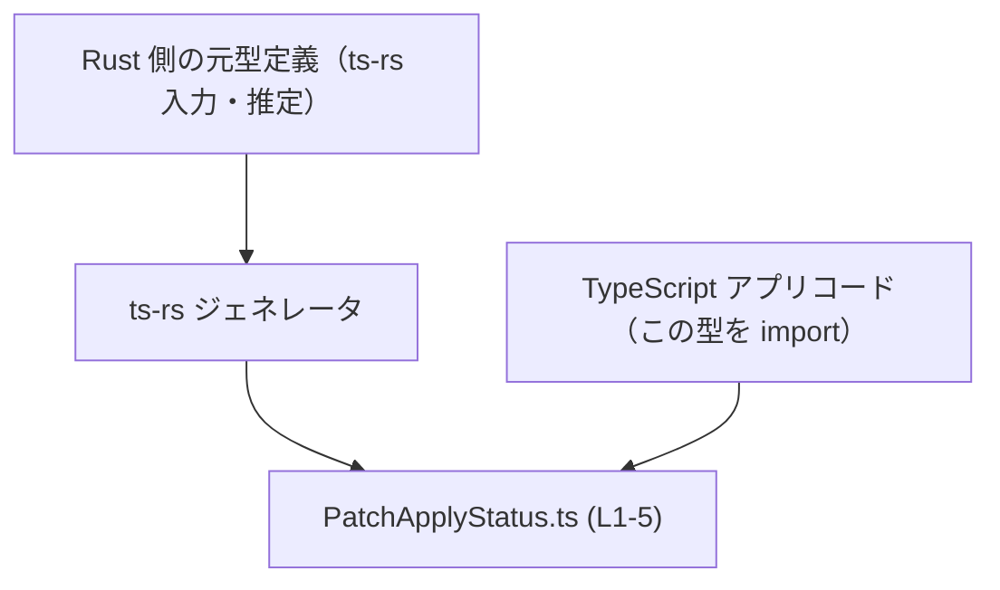
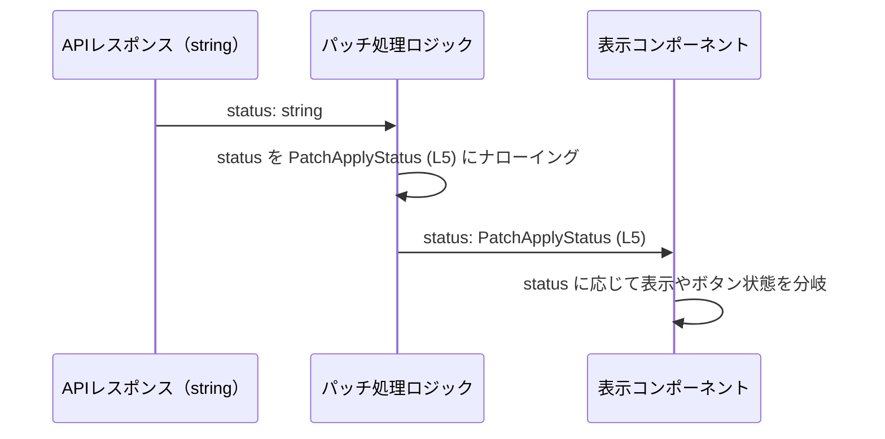

# app-server-protocol/schema/typescript/v2/PatchApplyStatus.ts コード解説

（行番号は、このファイル先頭行を 1 として付番しています）

---

## 0. ざっくり一言

`PatchApplyStatus` という **パッチ適用状態を表す文字列リテラルユニオン型** を 1 行だけ定義した、自動生成の型定義ファイルです。（`PatchApplyStatus.ts:L1-5`）

---

## 1. このモジュールの役割

### 1.1 概要

- このモジュールは、`PatchApplyStatus` という TypeScript の **型エイリアス（type alias）** を公開します。（`PatchApplyStatus.ts:L5-5`）
- `PatchApplyStatus` は `"inProgress" | "completed" | "failed" | "declined"` のいずれかの文字列だけを許容する、**文字列リテラルユニオン型** です。（`PatchApplyStatus.ts:L5-5`）
- ファイル先頭には `ts-rs` による自動生成コードであり、手で編集しないよう明示されています。（`PatchApplyStatus.ts:L1-3`）

### 1.2 アーキテクチャ内での位置づけ

- このファイルは `app-server-protocol/schema/typescript/v2` ディレクトリ配下にあり、**アプリケーションサーバのプロトコルスキーマの TypeScript 表現の一部**と位置づけられます。（パス情報より）
- 先頭コメントにある通り `ts-rs` によって生成されており、通常は **Rust 側の型定義から TypeScript 型へ変換した成果物**として利用されます。（`PatchApplyStatus.ts:L1-3`）
- 実際の利用コード（インポート元）はこのチャンクには現れていませんが、この型をインポートして API レスポンスやドメインオブジェクトの `status` フィールドなどに付けて使う構成が想定されます。

依存関係のイメージ（概念図）を Mermaid で示します。本ファイルに対応するノードには行範囲を付しています。



※ Rust 側の型定義および具体的な TypeScript アプリコードは、このチャンクには現れません。

### 1.3 設計上のポイント

- **自動生成コード**  
  - ファイル先頭に「GENERATED CODE」「Do not edit manually」と明記されており、手動変更は禁止されています。（`PatchApplyStatus.ts:L1-3`）
- **状態列挙のための文字列リテラルユニオン型**  
  - `"inProgress" | "completed" | "failed" | "declined"` の 4 値に限定することで、TypeScript のコンパイル時に状態値の誤りを検出できる構造になっています。（`PatchApplyStatus.ts:L5-5`）
- **実行時の挙動を持たない純粋な型定義**  
  - 関数やクラスは一切定義されておらず、実行時には削除されるコンパイル時専用の型情報のみを提供します。（`PatchApplyStatus.ts:L5-5`）
- **エラーハンドリング・並行性**  
  - 型定義のみのため、このファイル単体としてはエラーハンドリングや並行処理に関するロジックは持ちません。これらは、この型を使う側のコードに委ねられます。

---

## 2. 主要な機能一覧

このモジュールが提供する機能は 1 つです。

- `PatchApplyStatus` 型エイリアス: パッチ適用状態を 4 つの文字列に限定するための文字列リテラルユニオン型（`PatchApplyStatus.ts:L5-5`）

---

## 3. 公開 API と詳細解説

### 3.1 型一覧（構造体・列挙体など）

このファイルで公開されている型は次の 1 つです。

| 名前               | 種別                | 役割 / 用途                                                                 | 定義位置                       |
|--------------------|---------------------|-------------------------------------------------------------------------------|--------------------------------|
| `PatchApplyStatus` | 型エイリアス（type）| パッチ適用状態を `"inProgress" | "completed" | "failed" | "declined"` のいずれかに限定する | `PatchApplyStatus.ts:L5-5` |

`PatchApplyStatus` の定義（コード）:

```typescript
export type PatchApplyStatus = "inProgress" | "completed" | "failed" | "declined";
```

（`PatchApplyStatus.ts:L5-5`）

### 3.2 主要型の詳細: `PatchApplyStatus`

#### `PatchApplyStatus`

**概要**

- `PatchApplyStatus` は、**パッチ適用処理の状態**を表すために用いられると考えられる文字列リテラルユニオン型です。（`PatchApplyStatus.ts:L5-5`）
- 型としては `"inProgress"`, `"completed"`, `"failed"`, `"declined"` の 4 種類の文字列だけを許容します。（`PatchApplyStatus.ts:L5-5`）

**定義**

```typescript
export type PatchApplyStatus = "inProgress" | "completed" | "failed" | "declined";
```

（`PatchApplyStatus.ts:L5-5`）

**値のバリエーション（意味は名前からの推定）**

| 値            | 説明（命名からの推定。実際の意味仕様はこのファイル単体からは不明） |
|---------------|--------------------------------------------------------------------|
| `"inProgress"`| パッチ適用が進行中で完了していない状態                             |
| `"completed"` | パッチ適用が正常に完了した状態                                     |
| `"failed"`    | パッチ適用が何らかの理由で失敗した状態                             |
| `"declined"`  | パッチ適用が拒否された、あるいはキャンセルされた状態               |

※ 具体的なビジネス仕様（例えば誰が「declined」するのか等）は、このチャンクには現れません。

**Examples（使用例）**

以下では、同一ディレクトリから `PatchApplyStatus` をインポートして使う典型例を示します。  
（実際のインポートパスはプロジェクト構成によりますが、ここではファイル名に基づく例です）

```typescript
// app-server-protocol/schema/typescript/v2/SomeClient.ts からの利用例（仮）
// 型をインポートする。`type` インポートにすることでバンドルから除外できる（TS 4.5+）。
import type { PatchApplyStatus } from "./PatchApplyStatus";

// パッチ適用結果を表すオブジェクトの型を定義する
interface PatchResult {
    id: string;                     // パッチを識別するID
    status: PatchApplyStatus;       // 状態を PatchApplyStatus 型で表現
}

// status の値に応じて処理を分岐する関数
function handlePatchResult(result: PatchResult): void {
    switch (result.status) {        // コンパイル時に4つの値に限定される
        case "inProgress":
            console.log("パッチ適用中です");
            break;
        case "completed":
            console.log("パッチ適用が完了しました");
            break;
        case "failed":
            console.log("パッチ適用に失敗しました");
            break;
        case "declined":
            console.log("パッチ適用が拒否されました");
            break;
        // 上記以外の case はコンパイルエラーになるか、
        // never チェックにより検知できる
    }
}
```

この例では、`status` に `"completed"` など以外の文字列を指定すると TypeScript のコンパイル時にエラーとなり、状態値の typo を防げます。

**Errors / Panics**

- この型自体は **コンパイル時の型情報のみ** であり、実行時に `throw` したり panic したりすることはありません。
- TypeScript のコンパイラは、`PatchApplyStatus` として宣言された変数に対し、4 つ以外の文字列を代入しようとすると **コンパイルエラー** を報告します（TypeScript の通常の型チェック機能）。
- ただし TypeScript の型は実行時には消えるため、**外部から任意の `string` が入ってくる場合には、実行時検証をしない限り不正な文字列が入ってしまう可能性があります**。これは TypeScript 共通の性質です。

**Edge cases（エッジケース）**

- `null` / `undefined`  
  - 定義上、`PatchApplyStatus` には `null` や `undefined` は含まれていません。（`PatchApplyStatus.ts:L5-5`）  
  - したがって、`status: PatchApplyStatus` に `null` や `undefined` を代入すると型エラーになります（`strictNullChecks` の有無により挙動は変わり得ますが、型定義としては含まれていません）。
- 4 つ以外の文字列  
  - `"in_progress"`, `"Complete"`, `"done"` など、微妙に異なる文字列はすべて不正な値となり、コンパイル時に拒否されます。
- 大文字 / 小文字の違い  
  - `"Completed"` と `"completed"` は異なる文字列として扱われるため、誤って大文字を混ぜるとコンパイルエラーで検出できます。
- 文字列以外の型  
  - 数値や真偽値など、文字列以外の値はユニオンに含まれないため、`PatchApplyStatus` 型の変数への代入は型エラーになります。

**使用上の注意点**

- **自動生成ファイルを直接編集しない**  
  - ファイル先頭に「Do not edit this file manually」とあるため、自分で値を追加・変更したい場合は Rust 側の元定義を変更し、`ts-rs` による再生成を行う必要があります。（`PatchApplyStatus.ts:L1-3`）
- **外部入力の検証が必要**  
  - API レスポンスなど外部から `string` が渡される場合、TypeScript の型だけでは実行時に値の正当性を保証できません。  
    ランタイムで `"inProgress"`, `"completed"`, `"failed"`, `"declined"` のいずれかかをチェックするか、ジェネレータが生成したバリデーションを利用する必要があります（このチャンクにはバリデーション処理は現れません）。
- **ユニオンに値を追加・削除する影響**  
  - Rust 側の定義を変更してこのユニオンに新しい状態値を追加した場合、`switch` 文などで `PatchApplyStatus` を exhaustiveness チェックしていれば、コンパイル時に未対応の case が検出されます。  
  - 逆に値を削除した場合は、既存コードで使われている削除済みの値に対しコンパイルエラーが発生します。

### 3.3 その他の関数

- このファイルには関数・メソッドは一切定義されていません。（`PatchApplyStatus.ts:L1-5`）

---

## 4. データフロー

このファイル自体は型定義のみですが、**典型的な利用シナリオ**として、API レスポンスから `PatchApplyStatus` 型を介して UI で表示するまでのデータフローを示します。  
実際のコードはこのチャンクには現れませんが、`PatchApplyStatus`（L5）を用いる場合の一例です。



この流れの要点:

1. API から生の `string` として状態が渡される（型情報は実行時に存在しないため、バリデーションが必要）。
2. ロジック層で値の検証を行い、4 つのいずれかであると判定できたら TypeScript 上で `PatchApplyStatus` 型として扱う。
3. UI コンポーネントでは、`PatchApplyStatus` 型で受け取ることで、`switch` 文や条件分岐において **コンパイル時に扱い漏れがないか確認**できる。

---

## 5. 使い方（How to Use）

### 5.1 基本的な使用方法

同じディレクトリ内の TypeScript ファイルから `PatchApplyStatus` を利用する最も基本的な例です。

```typescript
// app-server-protocol/schema/typescript/v2/patch-client.ts （仮のファイル名）

// PatchApplyStatus 型をインポートする
import type { PatchApplyStatus } from "./PatchApplyStatus";

// パッチ適用ジョブを表すインターフェース
interface PatchJob {
    jobId: string;                // ジョブID
    status: PatchApplyStatus;     // 現在の状態
}

// 状態を更新する関数の例
function updateStatus(job: PatchJob, newStatus: PatchApplyStatus): PatchJob {
    // newStatus は 4 つの文字列のいずれかに限定されている
    return {
        ...job,                   // 既存のフィールドをコピー
        status: newStatus,        // 状態のみ更新
    };
}

// 使用例
const job: PatchJob = {
    jobId: "123",
    status: "inProgress",         // OK: PatchApplyStatus の値
};

// コンパイルエラーになる例（コメントアウト）
// job.status = "running";       // エラー: "running" は PatchApplyStatus に含まれない
```

このように型エイリアスとしてインポートしておくことで、状態文字列の typo をコンパイル時に検知できます。

### 5.2 よくある使用パターン

1. **`switch` 文による状態ごとの処理分岐**

    ```typescript
    import type { PatchApplyStatus } from "./PatchApplyStatus";

    function getStatusLabel(status: PatchApplyStatus): string {
        switch (status) {
            case "inProgress":
                return "適用中";
            case "completed":
                return "完了";
            case "failed":
                return "失敗";
            case "declined":
                return "拒否";
            // default を書かずに、never チェックで新しい状態の追加を検知することも可能
        }
    }
    ```

2. **API 型の一部として利用**

    ```typescript
    import type { PatchApplyStatus } from "./PatchApplyStatus";

    // API レスポンスの型
    interface PatchStatusResponse {
        patchId: string;
        status: PatchApplyStatus;        // サーバーから返ってくる状態
        updatedAt: string;               // ISO 8601 などの日時文字列
    }
    ```

### 5.3 よくある間違い

```typescript
import type { PatchApplyStatus } from "./PatchApplyStatus";

// 間違い例: string 型をそのまま使ってしまう
interface BadPatchJob {
    status: string;               // 何でも入ってしまい、typo が検出できない
}

// 正しい例: PatchApplyStatus 型を使う
interface GoodPatchJob {
    status: PatchApplyStatus;     // 4 つの文字列以外はコンパイルエラーになる
}
```

```typescript
import type { PatchApplyStatus } from "./PatchApplyStatus";

// 間違い例: any を使って型安全性を失う
function setStatusBad(status: any) {     // any だと何でも入る
    // ...
}

// 正しい例: PatchApplyStatus を受け取る
function setStatusGood(status: PatchApplyStatus) {
    // status は 4 値に限定される
}
```

### 5.4 使用上の注意点（まとめ）

- **手動編集禁止**: 値の追加・変更は Rust 側の元定義から行い、`ts-rs` で再生成する必要があります。（`PatchApplyStatus.ts:L1-3`）
- **ランタイム検証の不足**: TypeScript の型はコンパイル時のみ有効なため、外部入力には別途バリデーションが必要です。
- **`null` / `undefined` 非許容**: 型には `null` や `undefined` は含まれないので、それらが来る可能性がある場合はユニオンの拡張や別の型定義が必要です。
- **並行性**: この型は単なるラベルであり、スレッドセーフティやロックなどの並行性制御は関与しません。並行処理環境でも特別な配慮は不要です（値がイミュータブルな文字列であるため）。

---

## 6. 変更の仕方（How to Modify）

### 6.1 新しい機能を追加する場合（状態値の追加など）

このファイルは自動生成されているため、**直接編集してはいけません**。（`PatchApplyStatus.ts:L1-3`）

新しい状態値（例: `"queued"` など）を追加したい場合の一般的な手順は次のようになります。

1. **Rust 側の元型定義を変更する**  
   - `ts-rs` 対応の Rust 型に新しいバリアントやフィールドを追加する（元ファイルの場所はこのチャンクからは分かりません）。
2. **`ts-rs` によるコード生成を再実行する**  
   - プロジェクトで用意されているビルド／コード生成コマンドを実行する。  
     （具体的なコマンドはこのチャンクには現れないため不明です。）
3. **生成された `PatchApplyStatus.ts` に新しい文字列リテラルが追加されていることを確認する**  
   - 例: `"queued"` がユニオンに追加されているか確認する。
4. **TypeScript 側の利用コードを更新する**  
   - `switch` 文や UI 表示などで新しい状態を扱うようロジックを追加する。  
   - コンパイル時に `never` チェックなどを利用して、未対応の状態がないか確認する。

### 6.2 既存の機能を変更する場合（状態値の変更・削除）

状態値のリネームや削除は **広い影響範囲** を持つ可能性があります。

- **影響範囲の確認方法**
  - `PatchApplyStatus` を参照している TypeScript ファイル（import している箇所）を検索します。
  - 各ファイルで、`switch` 文や `if` チェックで状態値を文字列リテラルとして比較している箇所を確認します。
- **契約（前提条件・返り値の意味など）**
  - 4 つの状態値は、API 仕様やビジネスロジック上の「契約」として扱われている可能性があります。  
    意味を変更する場合は、バックエンド／フロントエンド双方の仕様調整が必要です。
- **変更時の注意点**
  - 値を削除すると、既存コードでその文字列を使用している箇所がコンパイルエラーになります。これは安全側の挙動ですが、ビルドが通らなくなるため、計画的な変更が必要です。
  - 値をリネームするときは、Rust 側と TypeScript 側の両方で一貫して変更する必要があります。
- **テスト**
  - 型そのものはテスト対象になりにくいですが、この型を使った **状態遷移ロジック** や **UI 表示ロジック** のテストケースを更新し、新しい／変更された状態値をカバーすることが重要です。

---

## 7. 関連ファイル

このチャンクから直接参照できる関連情報は限定的です。

| パス / 種別                                       | 役割 / 関係 |
|--------------------------------------------------|------------|
| `app-server-protocol/schema/typescript/v2/PatchApplyStatus.ts` | 本ファイル。`PatchApplyStatus` 型エイリアスの定義を提供する。（`PatchApplyStatus.ts:L5-5`） |
| Rust 側の元型定義ファイル（推定、パス不明）      | `ts-rs` によるコード生成の入力。`PatchApplyStatus` に対応する Rust 型が定義されていると考えられますが、このチャンクには現れません。 |
| 同ディレクトリ内の他の TypeScript スキーマファイル（存在はパスから推測） | 同じプロトコルバージョン `v2` における他の型定義を提供している可能性がありますが、このチャンクには内容が含まれていません。 |

---

### まとめ

- `PatchApplyStatus.ts` は、**単一の文字列リテラルユニオン型 `PatchApplyStatus` をエクスポートするだけの自動生成ファイル**です。（`PatchApplyStatus.ts:L1-5`）
- 実行時ロジックやエラー処理・並行性制御は一切含まれず、**コンパイル時の型安全性を高めるための補助**として機能します。
- 変更したい場合は、必ず Rust 側の元定義を編集し、`ts-rs` による再生成を行う必要があります。
