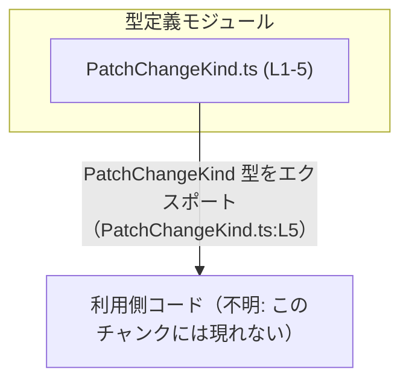
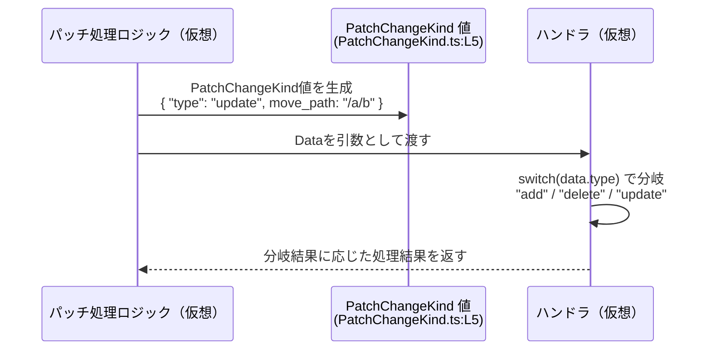

# app-server-protocol\schema\typescript\v2\PatchChangeKind.ts

## 0. ざっくり一言

- `PatchChangeKind` は、`"add" / "delete" / "update"` という 3 種類の変更種別を表す **TypeScript の共用体型（ユニオン型）** の定義です（PatchChangeKind.ts:L5）。
- このファイルは `ts-rs` により自動生成されており、手動で編集しない前提になっています（PatchChangeKind.ts:L1-3）。

> ※ 以下では、表示されたコードを 1 行目から順に番号付けしています。

---

## 1. このモジュールの役割

### 1.1 概要

- このモジュールは、`PatchChangeKind` という **型エイリアス（type alias）** を 1 つだけエクスポートします（PatchChangeKind.ts:L5）。
- `PatchChangeKind` は、`"type"` プロパティの値により `"add" / "delete" / "update"` のいずれかを表す **判別可能なユニオン型（discriminated union）** になっています（PatchChangeKind.ts:L5）。
- `"update"` の場合のみ、追加で `move_path: string | null` というプロパティを持つ形になっています（PatchChangeKind.ts:L5）。

### 1.2 アーキテクチャ内での位置づけ

- このファイルは TypeScript のモジュールであり、他モジュールから `PatchChangeKind` 型としてインポートされることを意図した設計とみなせます（`export type` による公開のため、PatchChangeKind.ts:L5）。
- このチャンクには、どのファイルが `PatchChangeKind` を利用しているかは現れません。そのため利用側は「不明」として扱います。



### 1.3 設計上のポイント

- **自動生成コード**  
  - 先頭コメントに「GENERATED CODE」「Do not edit this file manually」とあり、`ts-rs` による自動生成であることが明示されています（PatchChangeKind.ts:L1-3）。
- **判別可能ユニオン（discriminated union）**  
  - `"type"` プロパティが `"add" | "delete" | "update"` のリテラル型となっており、これをキーとして TypeScript が分岐ごとに型を絞り込める構造になっています（PatchChangeKind.ts:L5）。
- **バリアント固有のフィールド**  
  - `"update"` バリアントだけが `move_path: string | null` を持ち、それ以外 (`"add"`, `"delete"`) には `move_path` がありません（PatchChangeKind.ts:L5）。
- **エラーハンドリング・並行性**  
  - このファイルは型定義のみであり、実行時の処理・エラー発生箇所・並行処理は一切含みません（PatchChangeKind.ts:L1-5）。  
    したがって、エラーや並行性に関する性質は、あくまでこの型を利用する側のコードの設計に依存します。

---

## 2. 主要な機能一覧

このモジュールが提供する機能は 1 つだけです。

- `PatchChangeKind` 型: `"add" / "delete" / "update"` の 3 種類の変更種別を表す判別可能ユニオン型（PatchChangeKind.ts:L5）。

---

## 3. 公開 API と詳細解説

### 3.1 型一覧（構造体・列挙体など）

| 名前              | 種別            | 役割 / 用途（解釈）                                                                 | 定義概要                                                                                                                                                   | 根拠 |
|-------------------|-----------------|--------------------------------------------------------------------------------------|------------------------------------------------------------------------------------------------------------------------------------------------------------|------|
| `PatchChangeKind` | 型エイリアス    | 3 種類の変更種別（add / delete / update）を表す共用体型と解釈できる（※用途は命名からの推測） | `{ "type": "add" }` または `{ "type": "delete" }` または `{ "type": "update", move_path: string \| null }` のいずれかとなるユニオン型                     | PatchChangeKind.ts:L5 |

> 用途について: 型名 `PatchChangeKind` やファイルパスから「パッチ変更の種別」を表すものと考えられますが、このチャンクだけでは実際の利用箇所は分かりません。

#### `PatchChangeKind` の詳細

定義:

```typescript
export type PatchChangeKind =
    { "type": "add" }                                  // 1つ目のバリアント
  | { "type": "delete" }                               // 2つ目のバリアント
  | { "type": "update", move_path: string | null, };   // 3つ目のバリアント（update用）
```

（整形のみ・意味は原コードと同一。元は PatchChangeKind.ts:L5）

- **共通フィールド**
  - すべてのバリアントに `"type"` プロパティが存在し、  
    値は `"add"` / `"delete"` / `"update"` のいずれかの **文字列リテラル型** です（PatchChangeKind.ts:L5）。
- **各バリアント**
  - `"add"` バリアント: `{ "type": "add" }`
  - `"delete"` バリアント: `{ "type": "delete" }`
  - `"update"` バリアント: `{ "type": "update", move_path: string | null }`
    - `move_path` は `string` または `null` を許容します（PatchChangeKind.ts:L5）。
    - `?` が付いていないため `"update"` バリアントにおいて `move_path` プロパティ自体は必須ですが、その値は `null` になりうる、という設計です。

**TypeScript における安全性**

- この構造により、`switch (value.type)` のようなコードを書くと、
  各 `case` ブロック内で `value` の型が自動的に絞り込まれます（判別可能ユニオン）。
  - 例: `case "update":` の中では `value.move_path` へのアクセスが型安全に行えます。
- 一方で、TypeScript の型は **コンパイル時にのみ存在し、実行時には消える** ため、
  実際のランタイム値がこの型どおりであるかどうかは、呼び出し側の入力検証に依存します。

### 3.2 関数詳細（最大 7 件）

- このファイルには **関数・メソッドの定義は一切存在しません**（PatchChangeKind.ts:L1-5）。
- したがって、本セクションで詳細を記載すべき対象関数はありません。

### 3.3 その他の関数

- 補助関数やラッパー関数も定義されていません（PatchChangeKind.ts:L1-5）。

---

## 4. データフロー

このファイル自体には関数や処理フローはありませんが、`PatchChangeKind` がどのように使われるかの **典型例** を示すために、仮想的なデータフローを図示します。

> 注意: 以下の図と説明は、この型の一般的な使い方を示すための「例」であり、  
> 実際にこのリポジトリ内に存在するコードフローを示すものではありません。



この例では:

- 呼び出し側 (`Caller`) が `PatchChangeKind` 型の値を生成（PatchChangeKind.ts:L5 に従った構造）。
- ハンドラ (`Handler`) が `data.type` をもとに処理を分岐し、`"update"` の場合のみ `data.move_path` を参照します。
- 実際の処理内容や戻り値の型は、このチャンクからは分かりません（不明）。

---

## 5. 使い方（How to Use）

### 5.1 基本的な使用方法

`PatchChangeKind` を利用して、変更種別ごとに処理を分岐する基本的なコード例です。

```typescript
// PatchChangeKind 型をインポートする例                           // このファイルから型をインポートする（パスは例）
import type { PatchChangeKind } from "./PatchChangeKind";       // 実際の相対パスはプロジェクト構成に依存

// "add" バリアントの値を作る                                   // type が "add" のオブジェクト
const addChange: PatchChangeKind = {                            // PatchChangeKind 型の変数を宣言
    type: "add",                                                // "type" プロパティに "add" を指定
};

// "update" バリアントの値を作る                                // type が "update" のオブジェクト
const updateChange: PatchChangeKind = {                         // PatchChangeKind 型の変数を宣言
    type: "update",                                             // "type" は "update"
    move_path: "/foo/bar",                                      // move_path は string。null も可
};

// PatchChangeKind を受け取って処理を分岐する関数                // 型を引数として受け取る
function handleChange(change: PatchChangeKind) {                // change の型は PatchChangeKind
    switch (change.type) {                                      // 判別プロパティ "type" で分岐
        case "add":                                             // "add" バリアントのとき
            console.log("add 処理");                            // add 用の処理
            break;

        case "delete":                                          // "delete" バリアントのとき
            console.log("delete 処理");                         // delete 用の処理
            break;

        case "update":                                          // "update" バリアントのとき
            // ここでは change は { type: "update", move_path: string | null } とみなされる
            if (change.move_path !== null) {                    // move_path が null でないかチェック
                console.log("update: move to", change.move_path);
            } else {
                console.log("update: move_path なし");          // null の場合の処理
            }
            break;

        // TypeScript の型チェックを有効にすると、               // すべてのリテラルを列挙すれば
        // ここに default が不要であることを検出できる          // switch が網羅的かどうか検査される
    }
}

// 作成した値を処理関数に渡す
handleChange(addChange);
handleChange(updateChange);
```

**ポイント**

- `change.type` に対する `switch` により、TypeScript が各 `case` ブロック内の `change` の型を自動で絞り込みます。
- `"update"` の場合のみ `move_path` プロパティにアクセスできます（他のバリアントには `move_path` は存在しないため）。
- `move_path` は `string | null` なので、`null` チェックを行うことで実行時エラー（`null` へのメソッドアクセスなど）を防げます。

### 5.2 よくある使用パターン

1. **引数・戻り値としての利用**

```typescript
// PatchChangeKind を引数として受け取り、別の値に変換する関数    // 判別ユニオンから文字列に変換する例
function toLabel(kind: PatchChangeKind): string {               // 戻り値型は string
    switch (kind.type) {
        case "add":
            return "追加";
        case "delete":
            return "削除";
        case "update":
            return "更新";
    }
}
```

- API 層や UI 層で、「変更種別 → ラベル文字列」などの変換に使うのが典型的です。
- すべてのバリアントを `switch` で列挙することで、新しいバリアント追加時にコンパイルエラーで気づきやすくなります。

1. **配列やコレクションでの利用**

```typescript
// 複数の変更をまとめて扱う例                                  // PatchChangeKind の配列
const changes: PatchChangeKind[] = [
    { type: "add" },
    { type: "update", move_path: null },
    { type: "delete" },
];
```

- 変更履歴やバッチ処理などで、`PatchChangeKind[]` のような配列として扱うケースが考えられます。

### 5.3 よくある間違い

1. `"update"` バリアントで `move_path` を付け忘れる

```typescript
// 間違い例: "update" なのに move_path がない
const wrongUpdate: PatchChangeKind = {
    // @ts-expect-error: Property 'move_path' is missing      // 型エラーになるはずの例
    type: "update",
};
```

- 定義上、`"update"` バリアントでは `move_path` プロパティが必須です（値は `null` でもよい）（PatchChangeKind.ts:L5）。
- そのため、`move_path` を省略すると TypeScript の型チェックでエラーになります。

1. `move_path` が `string` であると決め打ちして null を考慮しない

```typescript
function handleUpdate(kind: PatchChangeKind) {
    if (kind.type === "update") {
        // 間違い例: kind.move_path を string 前提で使ってしまう
        // console.log(kind.move_path.toUpperCase());          // 実行時に null の可能性があり危険

        // 正しい例: null チェックをしてから使う
        if (kind.move_path !== null) {
            console.log(kind.move_path.toUpperCase());
        }
    }
}
```

- `move_path` は `string | null` のため、null チェックをしないと実行時エラーの原因になります（PatchChangeKind.ts:L5）。

### 5.4 使用上の注意点（まとめ）

- **自動生成コードを直接編集しないこと**  
  - 先頭コメントにあるとおり、このファイルは `ts-rs` による自動生成コードであり、手動編集は想定されていません（PatchChangeKind.ts:L1-3）。  
    仕様変更が必要な場合は、元となる定義（おそらく Rust 側）を変更し、再生成する必要があります（これはコメントと `ts-rs` の一般的な使い方からの推測です）。
- **`move_path` の `null` 取り扱い**  
  - `"update"` バリアントの `move_path` は `string | null` なので、使用時は必ず `null` チェックを行う必要があります（PatchChangeKind.ts:L5）。
- **実行時の入力検証**  
  - TypeScript の型はコンパイル時のみ有効であり、外部から入ってくる JSON がこの型に適合しているかは別途検証が必要です。  
    検証を行わずに `move_path` などにアクセスすると、実行時エラーやセキュリティ上の問題（想定外の値混入）につながる可能性があります。
- **並行性について**  
  - この型は純粋なデータ構造であり、JavaScript/TypeScript の単一スレッド実行モデルに従います。  
    共有状態やミューテーションはこのファイルには存在せず（PatchChangeKind.ts:L1-5）、並行性に固有の注意点はこの型自体からは発生しません。

---

## 6. 変更の仕方（How to Modify）

### 6.1 新しい機能を追加する場合

例として、新しい変更種別 `"rename"` を追加したいケースを考えます。

1. **直接編集しない**  
   - コメントにより、手動編集は禁止されています（PatchChangeKind.ts:L1-3）。
   - そのため、このファイルを直接書き換えるのではなく、**生成元の定義**（おそらく Rust 側）を変更する必要があります。
2. **生成元で新しいバリアントを追加**  
   - Rust 側の enum 等に `"Rename"` などのバリアントを追加し、`ts-rs` がそれを `PatchChangeKind` に反映するようにします。  
     （このステップの詳細は、生成元のコードがこのチャンクには現れないため不明です。）
3. **コード生成を再実行**  
   - `ts-rs` によるコード生成を再実行し、新しいバリアントを含む `PatchChangeKind.ts` を再生成します。
4. **利用側の更新**  
   - `switch (kind.type)` などで `PatchChangeKind` を使っている箇所があれば、新しい `"rename"` バリアントを扱う分岐を追加します。  
     ここで TypeScript の型チェックが、抜け漏れている箇所をコンパイルエラーとして知らせてくれることが期待できます。

### 6.2 既存の機能を変更する場合

1. **変更の影響範囲**  
   - `"type"` の文字列や `move_path` の型を変えると、この型を用いるすべてのコードに影響します。  
   - たとえば `"update"` を `"modify"` に変更すると、`case "update"` と書かれているすべての箇所がコンパイルエラーになります。
2. **契約（前提条件）の確認**
   - `"update"` バリアントが `move_path` を必ず持つ、という契約を変更すると、利用側で `move_path` を前提としたロジックが壊れる可能性があります。
3. **テスト・利用箇所の再確認**
   - このファイルにはテストコードは含まれていません（PatchChangeKind.ts:L1-5）。  
   - 変更後は、生成された型を使う側のテスト（単体テストや統合テスト）で、すべてのバリアントが期待どおり扱われているかを確認する必要があります。
4. **自動生成前提の保持**
   - 変更は必ず生成元の定義に対して行い、再生成されても意図した定義が維持されるようにする必要があります。

---

## 7. 関連ファイル

このチャンクには、`PatchChangeKind` を利用するコードや生成元の Rust コードは含まれていません。そのため、関連ファイルの具体的なパスは不明です。

| パス                            | 役割 / 関係 |
|---------------------------------|-------------|
| 不明（ts-rs の生成元 Rust ファイル） | コメントから、この TypeScript 型は `ts-rs` により別の言語（通常は Rust）の型定義から生成されていると推測できますが、具体的なファイルパスはこのチャンクには現れません（PatchChangeKind.ts:L1-3）。 |
| app-server-protocol/schema/typescript/v2/ 内の他ファイル | ディレクトリ名から、同一プロトコルスキーマに属する他の TypeScript 型定義ファイルが存在する可能性がありますが、実際の内容やパスはこのチャンクには現れません（推測）。 |

---

## Bugs / Security / Contracts / Edge Cases / Tests / Performance の要点

**Bugs（潜在的な不具合要因）**

- `"update"` バリアントの `move_path` が `null` である可能性を無視して実装すると、`toUpperCase` などのメソッド呼び出しで実行時エラーが発生しうる点に注意が必要です（PatchChangeKind.ts:L5）。

**Security（セキュリティ）**

- この型自体にはセキュリティ上の処理は含まれません（PatchChangeKind.ts:L1-5）。
- ただし、外部入力から構築される値を `PatchChangeKind` として扱う場合、`type` や `move_path` に想定外の値が入らないよう、バリデーション（入力検証）が必要です。

**Contracts / Edge Cases（契約・エッジケース）**

- `"update"` バリアントでは `move_path` プロパティが必須で、値は `string` または `null`（PatchChangeKind.ts:L5）。
  - エッジケース: `move_path` が意図的に `null` に設定されるケースを、利用側で適切に扱う必要があります。
- `"add"` / `"delete"` バリアントには `move_path` が存在しない前提になります（PatchChangeKind.ts:L5）。

**Tests（テスト）**

- このファイルにはテストコードは含まれていません（PatchChangeKind.ts:L1-5）。
- 判別ユニオンに基づく分岐ロジックは、利用側でユニットテストを追加して検証する必要があります。

**Performance / Scalability（性能・スケーラビリティ）**

- 型定義のみであり、実行時コストはありません（PatchChangeKind.ts:L1-5）。
- 配列やマップなどで大量に `PatchChangeKind` を扱う場合も、性能への影響は実際の処理内容次第で、この型定義自体がボトルネックになることはありません。
