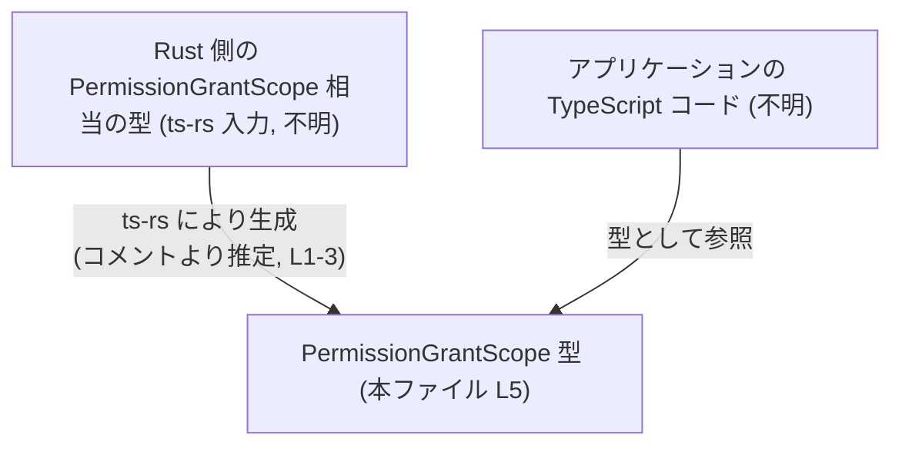
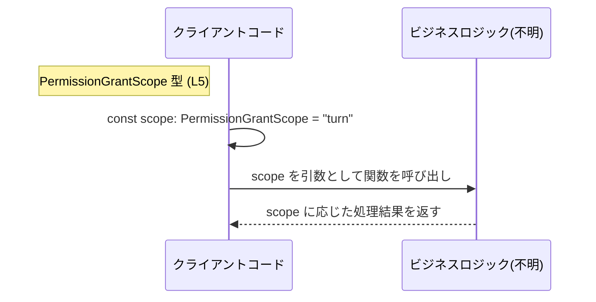

# app-server-protocol/schema/typescript/v2/PermissionGrantScope.ts コード解説

## 0. ざっくり一言

- `PermissionGrantScope` という **文字列リテラル・ユニオン型**（`"turn"` または `"session"`）を 1 つだけ公開している、自動生成された型定義ファイルです。（PermissionGrantScope.ts:L1-5）

---

## 1. このモジュールの役割

### 1.1 概要

- このモジュールは、TypeScript 側で **`PermissionGrantScope` 型**を提供します。（PermissionGrantScope.ts:L5-5）
- `PermissionGrantScope` は `"turn"` か `"session"` のどちらかのみを許容する **限定された文字列型**です。（PermissionGrantScope.ts:L5-5）
- 型名と値からは「権限付与（permission grant）のスコープ」を区別する識別子として使われることが示唆されますが、具体的な用途はこのチャンクからは分かりません。（PermissionGrantScope.ts:L5-5）

### 1.2 アーキテクチャ内での位置づけ

- ファイル先頭のコメントから、この型は **`ts-rs` ツールによって Rust 側の型定義から自動生成された**ものであることが分かります。（PermissionGrantScope.ts:L1-3）
- 本ファイル自身は **型定義のみをエクスポート**し、他の TypeScript コードからインポートされて利用される位置づけです。（PermissionGrantScope.ts:L5-5）
- 実際にどのモジュールから参照されているか、どのフィールド名で使われるかなどは、このチャンクには現れません。



### 1.3 設計上のポイント

- **自動生成コード**  
  - 冒頭に「GENERATED CODE! DO NOT MODIFY BY HAND!」と明記されており、手動変更しない前提のファイルです。（PermissionGrantScope.ts:L1-3）
- **閉じた集合の文字列ユニオン型**  
  - `"turn"` と `"session"` 以外の文字列をコンパイル時に拒否できるため、誤字などを型レベルで防止できます。（PermissionGrantScope.ts:L5-5）
- **ランタイムオーバーヘッド無し**  
  - 型エイリアスのみであり、JavaScript にコンパイルされた際に実行時コードは生成されません。
- **状態や副作用なし**  
  - 関数・クラス・変数定義は無く、並行性やエラーハンドリングに関わるロジックは存在しません。（PermissionGrantScope.ts:L1-5）

---

## 2. 主要な機能一覧（コンポーネントインベントリー）

このファイルが提供する「コンポーネント」（型）の一覧です。

| 種別 | 名前 | 説明 | 定義位置 |
|------|------|------|----------|
| 型エイリアス（文字列リテラル・ユニオン） | `PermissionGrantScope` | `"turn"` または `"session"` のどちらかのみを許容する型。権限付与スコープを表す識別子として使われることが想定されます（用途自体はこのチャンクからは不明）。 | PermissionGrantScope.ts:L5-5 |

機能としては事実上、この 1 つの型エイリアスだけを提供しています。（PermissionGrantScope.ts:L5-5）

---

## 3. 公開 API と詳細解説

### 3.1 型一覧（構造体・列挙体など）

| 名前 | 種別 | 役割 / 用途 | 定義位置 |
|------|------|-------------|----------|
| `PermissionGrantScope` | 型エイリアス（`"turn" \| "session"`） | 許可されるスコープを `"turn"` か `"session"` に限定する型です。型名からは、「1回ごと（turn）」と「セッション全体（session）」などの分類を表していると推測されますが、正確な意味は本ファイルからは分かりません。 | PermissionGrantScope.ts:L5-5 |

#### 型の意味（TypeScript 観点）

- **型エイリアス**  
  `export type PermissionGrantScope = ...` という形で宣言されており、`PermissionGrantScope` は別名であり、実体は二つの文字列リテラルのユニオンです。（PermissionGrantScope.ts:L5-5）

- **文字列リテラル・ユニオン**  
  - `"turn"` と `"session"` という二つの固定文字列のみを値として取る型です。
  - これにより、`PermissionGrantScope` 型の変数には他の任意の `string` を代入できません。

#### 契約（Contracts）

- `PermissionGrantScope` と宣言された値は、**コンパイル時点で** `"turn"` または `"session"` のいずれかでなければなりません。（PermissionGrantScope.ts:L5-5）
- それ以外の文字列リテラル（例: `"Turn"`, `"SESSION"`, `"global"`）は **コンパイルエラー** になります（TypeScript の型チェック仕様に基づく一般的な性質）。

#### Edge cases（エッジケース）

この型はユニオンの要素が 2 つだけのため、エッジケースは限定的です。

- **大文字・小文字の違い**  
  - `"Turn"` や `"Session"` のような表記は `PermissionGrantScope` には代入できません。
- **動的な文字列**  
  - たとえば外部から `string` 型で入ってきた値をそのまま `PermissionGrantScope` 変数に代入しようとすると、型が `string` のままではコンパイルが通りません。
  - その場合は値の事前検証や、型ガード関数を導入する必要がありますが、そのようなロジックは本ファイルには含まれません（このチャンクには現れません）。

#### 使用上の注意点

- **値の取りうる範囲は固定**  
  - 新しいスコープ（例: `"global"`）を追加したい場合、このファイルを直接編集するのではなく、生成元の Rust 型（ts-rs の入力）を変更し、再生成する必要があります（コメントより推測）。 （PermissionGrantScope.ts:L1-3）
- **自動生成ファイルであること**  
  - 手動編集は意図されておらず、変更すると次回コード生成で上書きされる可能性があります。（PermissionGrantScope.ts:L1-3）

### 3.2 関数詳細（最大 7 件）

- このファイルには **関数・メソッドは一切定義されていません**。（PermissionGrantScope.ts:L1-5）

### 3.3 その他の関数

- 該当なしです。（PermissionGrantScope.ts:L1-5）

---

## 4. データフロー

本ファイルには **関数やクラスが存在しないため、実際の処理フローや呼び出し関係をコードから直接たどることはできません**。（PermissionGrantScope.ts:L1-5）

ただし、`PermissionGrantScope` のようなスキーマ型は、一般に次のようなデータフローで利用されることが多いため、**あくまで推測的な例**として示します。

- クライアントまたはサーバー側のコードで `PermissionGrantScope` 型の変数を宣言する。
- 値として `"turn"` または `"session"` を設定する。
- その値を API リクエストや内部ロジックに渡し、スコープに応じた処理が行われる。



> 上図は、`PermissionGrantScope` を使うであろう典型的な流れを示した **概念図** であり、具体的な関数名やモジュール構成はこのチャンクには現れません。

---

## 5. 使い方（How to Use）

### 5.1 基本的な使用方法

この型を外部で利用する最も基本的なパターンは、変数・フィールド・関数引数の型として指定することです。

> ※ インポートパスはプロジェクト構成に依存するため、下記はあくまで例です。実際のパスはこのチャンクからは分かりません。

```typescript
// PermissionGrantScope 型をインポートする（パスは例）
import type { PermissionGrantScope } from "./PermissionGrantScope"; // 本ファイル

// PermissionGrantScope を引数に取る関数の例
function handlePermission(scope: PermissionGrantScope) {      // scope は "turn" か "session" のみ
    switch (scope) {                                          // ユニオン型なので、分岐が網羅可能
        case "turn":
            // 1回の操作（ターン）に限定された権限を処理する、など
            break;
        case "session":
            // セッション全体に対する権限を処理する、など
            break;
        // ここに他の case は書けない（型によって制限されている）
    }
}

// 代入例
const scope1: PermissionGrantScope = "turn";                  // OK
const scope2: PermissionGrantScope = "session";               // OK
// const scope3: PermissionGrantScope = "global";             // コンパイルエラー
```

このように、`PermissionGrantScope` を使うことで、誤った文字列を渡してしまうミスを **コンパイル時** に検出できます。（PermissionGrantScope.ts:L5-5）

### 5.2 よくある使用パターン

1. **データ構造内のフィールドとして使う**

```typescript
import type { PermissionGrantScope } from "./PermissionGrantScope";

// 権限付与情報を表すデータ構造の例（本ファイル外のコード）
interface PermissionGrant {
    scope: PermissionGrantScope;                        // "turn" or "session"
    // 他に userId などのフィールドがあるかどうかは、このチャンクからは不明
}

const grant: PermissionGrant = {
    scope: "turn",                                      // OK
};
```

1. **API パラメータとして利用する**

```typescript
import type { PermissionGrantScope } from "./PermissionGrantScope";

async function requestGrant(scope: PermissionGrantScope): Promise<void> {
    // 実際にどの API を呼ぶかはこのチャンクに現れませんが、
    // scope をシリアライズして送信するような用途が想定されます。
    await fetch("/grant", {
        method: "POST",
        body: JSON.stringify({ scope }),               // "turn" または "session"
    });
}
```

### 5.3 よくある間違い

`PermissionGrantScope` のような文字列リテラル・ユニオンで起こりがちな誤りを例示します。

```typescript
import type { PermissionGrantScope } from "./PermissionGrantScope";

// 間違い例: 大文字・小文字を誤っている
// const scope: PermissionGrantScope = "Turn";  // コンパイルエラー: "Turn" は許容されない

// 間違い例: 任意文字列をそのまま代入
declare const dynamicScope: string;
// const scope2: PermissionGrantScope = dynamicScope;   // コンパイルエラー: string から狭い型へは代入できない

// 正しい例: 値を検証してから代入
function isPermissionGrantScope(value: string): value is PermissionGrantScope {
    return value === "turn" || value === "session";
}

if (isPermissionGrantScope(dynamicScope)) {
    const scope3: PermissionGrantScope = dynamicScope; // OK: 型ガードにより絞り込み
}
```

### 5.4 使用上の注意点（まとめ）

- **取りうる値を把握すること**  
  - `"turn"` と `"session"` の二つだけであることを前提に、`switch` 文等で **すべてのケースを網羅**する設計が可能です。（PermissionGrantScope.ts:L5-5）
- **動的入力の検証が必要**  
  - 外部入力（HTTP リクエストやユーザー入力）は通常 `string` 型になるため、`PermissionGrantScope` に変換する前に検証／変換処理を用意する必要があります。  
  - どのように検証するかは本ファイルからは分かりません（このチャンクには現れません）。
- **セキュリティ上の観点**  
  - この型自体は実行時のチェックを行いません。  
  - 攻撃者が任意の文字列を送信できる環境では、サーバー側や境界層でのバリデーションが不可欠です。
- **並行性・スレッド安全性**  
  - 型定義のみであり、共有状態やミューテーションは一切ないため、並行性に関する懸念は直接はありません。

---

## 6. 変更の仕方（How to Modify）

### 6.1 新しい機能を追加する場合

このファイルはコメントで **「GENERATED CODE! DO NOT MODIFY BY HAND!」** と宣言されており、直接編集しないことが前提です。（PermissionGrantScope.ts:L1-3）

- `"global"` のような新たなスコープを追加したい場合:
  1. `ts-rs` によって生成される **元の Rust 型定義** を特定する必要があります。（コメントから ts-rs 使用が分かります: PermissionGrantScope.ts:L3）
  2. その Rust 型に新しいバリアント／値を追加する。
  3. `ts-rs` によるコード生成を再実行し、`PermissionGrantScope` が `"turn" | "session" | "global"` のような形で再生成されるようにします。
- このチャンクには元の Rust ファイルのパスや具体的な定義は現れないため、どこを修正するかはここからは分かりません。

変更後は、`PermissionGrantScope` を使っている全ての TypeScript コードで、新しい値を考慮した分岐やバリデーションになっているかを確認する必要があります（これは一般的な型変更時の注意点です）。

### 6.2 既存の機能を変更する場合

例として、`"turn"` を `"step"` に名称変更したい場合を考えます。

- 影響範囲:
  - すべての `PermissionGrantScope` 型の値比較箇所（`if (scope === "turn")`, `switch` 文など）
  - 文字列として `"turn"` を期待している外部 API や保存データ
- 変更時の注意:
  - 直接このファイルを編集すると、次回 `ts-rs` による生成で上書きされる可能性が高いため、**必ず生成元（Rust 型）を変更する**必要があります。（PermissionGrantScope.ts:L1-3）
  - 型の意味（契約）が変わるため、既存データとの互換性やマイグレーションにも注意が必要です。この点については、本チャンクからは具体的な情報は得られません。

---

## 7. 関連ファイル

このモジュールと密接に関係すると考えられるファイル／コンポーネントについて、コメントや命名から読み取れる範囲で整理します。

| パス / 名前 | 役割 / 関係 |
|-------------|------------|
| （不明）ts-rs の入力となる Rust 型定義 | 本ファイルの先頭コメントに「This file was generated by ts-rs」とあるため、元となる Rust の型定義が存在しますが、その具体的なパスやファイル名はこのチャンクには現れません。（PermissionGrantScope.ts:L1-3） |
| （不明）PermissionGrantScope を利用する TypeScript コード | `PermissionGrantScope` 型をインポートして利用するアプリケーションコードが存在するはずですが、このチャンク内には現れません。 |

このファイル単体からは、テストコードや他のスキーマ型との関係、実際の API 構造などは特定できません。
