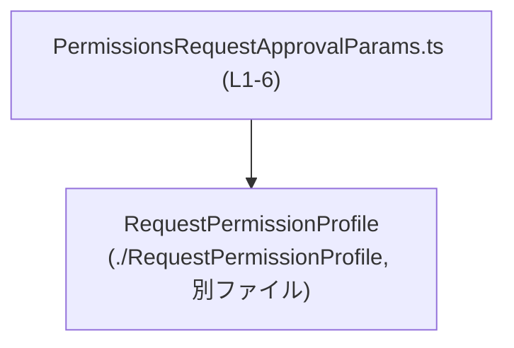
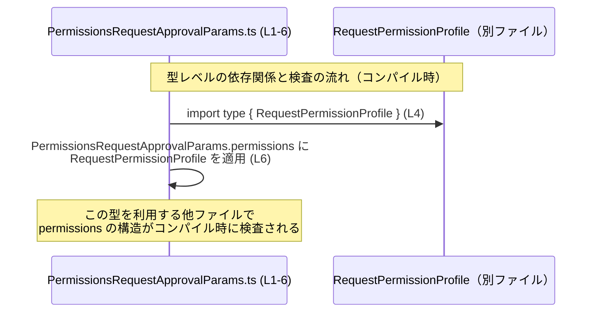

# app-server-protocol\schema\typescript\v2\PermissionsRequestApprovalParams.ts

## 0. ざっくり一言

権限リクエストの「承認パラメータ」の構造を表す TypeScript の型エイリアスを定義した、自動生成ファイルです（手動編集禁止のコメント付きです。`PermissionsRequestApprovalParams.ts:L1-3`）。

---

## 1. このモジュールの役割

### 1.1 概要

このモジュールは、権限リクエストを承認するときに必要となる情報（スレッド ID、ターン ID、アイテム ID、理由、権限プロファイル）を 1 つのオブジェクトとしてまとめるための型 `PermissionsRequestApprovalParams` を提供します（`PermissionsRequestApprovalParams.ts:L6-6`）。

### 1.2 アーキテクチャ内での位置づけ

このファイルは、別ファイルで定義された `RequestPermissionProfile` 型をインポートし（`PermissionsRequestApprovalParams.ts:L4-4`）、それを `permissions` プロパティの型として利用しています（`PermissionsRequestApprovalParams.ts:L6-6`）。



- `PermissionsRequestApprovalParams.ts` は `RequestPermissionProfile` に依存する「DTO 的な型定義」として機能している、と解釈できます。
- `PermissionsRequestApprovalParams` 型は `export` されているため、他モジュールから型注釈として参照される公開 API になっています（`PermissionsRequestApprovalParams.ts:L6-6`）。

### 1.3 設計上のポイント

- 自動生成コードであり、手動編集しないことが明示されています  
  （`// GENERATED CODE! DO NOT MODIFY BY HAND!` および ts-rs のコメント。`PermissionsRequestApprovalParams.ts:L1-3`）。
- `PermissionsRequestApprovalParams` は **オブジェクト型の型エイリアス** として定義されています（`PermissionsRequestApprovalParams.ts:L6-6`）。
- `reason` プロパティのみ `string | null` であり、「プロパティは必須だが値として null を許可」という契約になっています（`PermissionsRequestApprovalParams.ts:L6-6`）。
- `permissions` プロパティは `RequestPermissionProfile` 型であり、権限の詳細は別ファイルに委譲されています  
  （インポートと利用が同一行で確認できます。`PermissionsRequestApprovalParams.ts:L4-4, L6-6`）。
- このファイルは型定義のみで、関数や実行時ロジックは一切含まれていません（`PermissionsRequestApprovalParams.ts:L1-6`）。

---

## 2. 主要な機能一覧

- `PermissionsRequestApprovalParams` 型定義:  
  権限リクエスト承認処理に必要な ID 群・理由・権限プロファイルを 1 つのパラメータオブジェクトとして表現する型です（`PermissionsRequestApprovalParams.ts:L6-6`）。

---

## 3. 公開 API と詳細解説

### 3.1 型一覧（構造体・列挙体など）

| 名前 | 種別 | 役割 / 用途 | 定義位置 / 出典 |
|------|------|-------------|------------------|
| `PermissionsRequestApprovalParams` | 型エイリアス（オブジェクト型） | 権限リクエストの承認に必要な `threadId`, `turnId`, `itemId`, `reason`, `permissions` をまとめたパラメータ型。外部 API やサービス層のメソッドに渡す DTO 的な役割と解釈できます。 | `PermissionsRequestApprovalParams.ts:L6-6` |
| `RequestPermissionProfile` | 型（外部定義） | `permissions` プロパティの型として利用される権限プロファイル定義。具体的なフィールド構造はこのチャンクには現れません。 | 定義: `RequestPermissionProfile.ts:不明（このチャンクには現れない）` / インポート箇所: `PermissionsRequestApprovalParams.ts:L4-4` |

#### `PermissionsRequestApprovalParams` のフィールド構造（型レベルの契約）

`PermissionsRequestApprovalParams.ts:L6-6` より、以下のプロパティが確認できます。

| プロパティ名 | 型 | 説明 | 備考 |
|-------------|----|------|------|
| `threadId`  | `string` | スレッド（会話や処理単位など）を識別する ID。 | 空文字列であっても型的には許可されます（値の妥当性チェックは別途必要）。 |
| `turnId`    | `string` | ターン（会話ステップなど）を識別する ID。 | 同上。 |
| `itemId`    | `string` | 対象アイテムを識別する ID。 | 同上。 |
| `reason`    | `string \| null` | 承認理由。文字列または `null`。 | プロパティ自体は必須（省略不可）で、値として `null` をとることができます。 |
| `permissions` | `RequestPermissionProfile` | 権限内容の詳細を表すプロファイル。 | 構造は `RequestPermissionProfile` 側に委譲されています。 |

> いずれのプロパティも **オプショナル（`?`）ではなく必須** である点が重要です（`PermissionsRequestApprovalParams.ts:L6-6`）。

### 3.2 関数詳細（最大 7 件）

このファイルには関数やメソッドは定義されていません（`PermissionsRequestApprovalParams.ts:L1-6`）。  
したがって、関数詳細テンプレートに従って解説すべき対象はありません。

### 3.3 その他の関数

- 該当なし（このファイルには関数定義が存在しません）。

---

## 4. データフロー

このファイルには実行時処理はありませんが、「型レベル」での依存関係とデータ（オブジェクト構造）の流れを表現すると次のようになります。

- `PermissionsRequestApprovalParams.ts` は `RequestPermissionProfile` 型をインポートし（`PermissionsRequestApprovalParams.ts:L4-4`）、`permissions` プロパティの型として適用します（`PermissionsRequestApprovalParams.ts:L6-6`）。
- TypeScript コンパイル時には、この依存関係に基づいて `permissions` プロパティの構造が検証されます。  
  これにより、`PermissionsRequestApprovalParams` 型を使うコードは `permissions` に不適切な構造のオブジェクトを代入できなくなります。



実際のランタイムでの「承認処理」や「ネットワーク送信」のフローは、このチャンクには現れません（関数や I/O が存在しないため不明です）。

---

## 5. 使い方（How to Use）

### 5.1 基本的な使用方法

`PermissionsRequestApprovalParams` 型を利用して、権限承認のためのパラメータオブジェクトを組み立てる例です。

```typescript
// PermissionsRequestApprovalParams 型と RequestPermissionProfile 型を型としてインポートする
import type { PermissionsRequestApprovalParams } from "./PermissionsRequestApprovalParams"; // このファイルで定義された型
import type { RequestPermissionProfile } from "./RequestPermissionProfile";                 // permissions プロパティの型

// RequestPermissionProfile 型に一致する値を用意する
const profile: RequestPermissionProfile = /* RequestPermissionProfile.ts 側の定義に合う値 */;

// PermissionsRequestApprovalParams 型のオブジェクトを作成する
const params: PermissionsRequestApprovalParams = {
    threadId: "thread-123",                             // スレッドを識別する ID
    turnId: "turn-001",                                 // ターンを識別する ID
    itemId: "item-42",                                  // 対象アイテム ID
    reason: "管理者が明示的に承認したため",              // 承認理由（なければ null も可）
    permissions: profile,                               // 権限プロファイル
};

// params を何らかの承認処理関数に渡すことが想定されますが、
// そのような関数定義はこのチャンクには現れません。
```

ポイント（TypeScript の安全性）:

- `threadId`, `turnId`, `itemId`, `permissions` を省略するとコンパイルエラーになります（必須プロパティのため）。
- `reason` も **必須プロパティ** ですが、`string` か `null` のいずれかを代入できます。値を指定しない（プロパティ自体を欠落させる）ことはできません（`PermissionsRequestApprovalParams.ts:L6-6`）。

### 5.2 よくある使用パターン

1. **理由を省略したい場合（`null` を使う）**

```typescript
// 理由が特にない／記録しない場合の例
const paramsWithoutReason: PermissionsRequestApprovalParams = {
    threadId: "thread-123",   // 必須
    turnId: "turn-002",       // 必須
    itemId: "item-99",        // 必須
    reason: null,             // プロパティは必須だが、値として null を使う
    permissions: profile,     // RequestPermissionProfile 型の値
};
```

1. **関数の引数型として利用する**

```typescript
// PermissionsRequestApprovalParams 型を引数として受け取る関数の例
function approve(params: PermissionsRequestApprovalParams) {
    // params.threadId, params.permissions などに型安全にアクセスできる
    // 実際の承認ロジックはこのファイルには定義されていません。
}
```

このように、DTO（データ転送用オブジェクト）として扱うことで、呼び出し元と呼び出し先の間で期待するデータ構造を明確に共有できます。

### 5.3 よくある間違い

1. **`reason` プロパティを省略してしまう**

```typescript
// 誤り例: 必須プロパティ reason を省略している
const badParams: PermissionsRequestApprovalParams = {
    threadId: "thread-123",
    turnId: "turn-001",
    itemId: "item-42",
    // reason が欠けているためコンパイルエラー
    permissions: profile,
};
```

```typescript
// 正しい例: reason を null で明示的に指定する
const correctParams: PermissionsRequestApprovalParams = {
    threadId: "thread-123",
    turnId: "turn-001",
    itemId: "item-42",
    reason: null,         // 「理由なし」を明示
    permissions: profile,
};
```

1. **`permissions` に不適切な型を入れてしまう**

`permissions` は `RequestPermissionProfile` 型であり（`PermissionsRequestApprovalParams.ts:L6-6`）、単なるオブジェクトリテラル `{}` などを代入するとコンパイルエラーになります。  
`RequestPermissionProfile` の具体的な構造はこのチャンクには現れませんが、その定義に沿った値を渡す必要があります。

### 5.4 使用上の注意点（まとめ）

- **型情報はコンパイル後に消える**  
  TypeScript の型は JavaScript にトランスパイルされる際に削除されます。そのため、実行時に `PermissionsRequestApprovalParams` の構造が自動検証されるわけではありません。入力検証が必要な場合は、別途ランタイムのバリデーション（例えば JSON スキーマや手書きのチェック）が必要です。
- **`reason` は「存在必須・値は null 許容」**  
  `reason` プロパティを完全に省略することはできません。理由なしを表現したい場合は `null` を指定する必要があります（`PermissionsRequestApprovalParams.ts:L6-6`）。
- **並行性・エラーハンドリング**  
  このファイルは型定義のみで、非同期処理やスレッド、エラーハンドリングのロジックは含みません。並行性やエラー処理は、この型を利用する側のコードに依存します（このチャンクからは不明です）。
- **セキュリティ**  
  この型自体はセキュリティ機構を提供しませんが、権限情報（`permissions`）を運ぶコンテナであるため、実際の利用コードではなりすましや改ざんに対する検証・認可チェックが別途必要になります。これらの処理はこのチャンクには現れません。

---

## 6. 変更の仕方（How to Modify）

### 6.1 新しい機能を追加する場合

ファイル先頭に「GENERATED CODE! DO NOT MODIFY BY HAND!」と明記されているため（`PermissionsRequestApprovalParams.ts:L1-1`）、このファイルを直接編集するのは想定されていません。

- `ts-rs` コメントから、この型は ts-rs によって自動生成されていることが分かります（`PermissionsRequestApprovalParams.ts:L3-3`）。
- ts-rs は一般に「Rust 側などの元定義」から TypeScript 型を生成するライブラリとして知られていますが、このリポジトリ内の具体的な元定義がどこにあるかはこのチャンクからは分かりません。

新しいプロパティを追加したい場合の一般的な流れ（このチャンクから分かる範囲）:

1. 元となる定義（ts-rs の入力）側にプロパティを追加する。  
   （どのファイルかはこのチャンクからは不明です。）
2. ts-rs によるコード生成を再実行し、このファイルを再生成する。
3. 生成後、この型を利用している箇所で新プロパティの扱いを追加する。

直接このファイルを編集すると、次回の自動生成で上書きされる可能性が高いため、推奨されません。

### 6.2 既存の機能を変更する場合

`PermissionsRequestApprovalParams` のプロパティ名や型を変更したい場合も、同様に元定義側を変更し、ts-rs で再生成するのが前提になります。

変更時の注意点（型契約の観点）:

- 既存プロパティの型をより制約的に変える（例: `string` → 特定リテラル型）と、既存の使用箇所がコンパイルエラーになる可能性があります。
- プロパティを削除したりオプショナル化したりすると、この型を前提にしていた処理の要件が変わるため、全使用箇所で影響を確認する必要があります。
- 型定義は実行時チェックを行わないため、ランタイムのシリアライズ／デシリアライズ（JSON など）との整合性も別途確認が必要です。このチャンクにはその処理は現れません。

---

## 7. 関連ファイル

このモジュールと密接に関係するファイルは、インポート文から次の 1 つが確認できます。

| パス / モジュール指定 | 役割 / 関係 |
|----------------------|------------|
| `./RequestPermissionProfile` | `RequestPermissionProfile` 型を提供するモジュールです（`PermissionsRequestApprovalParams.ts:L4-4`）。`permissions` プロパティの型として利用され、権限プロファイルの具体的な構造を定義していると考えられますが、その中身はこのチャンクには現れません。 |

この他に、`PermissionsRequestApprovalParams` 型を実際に利用しているモジュール（API ハンドラやサービス層など）が存在する可能性がありますが、それらのファイル名や場所はこのチャンクからは分かりません。
