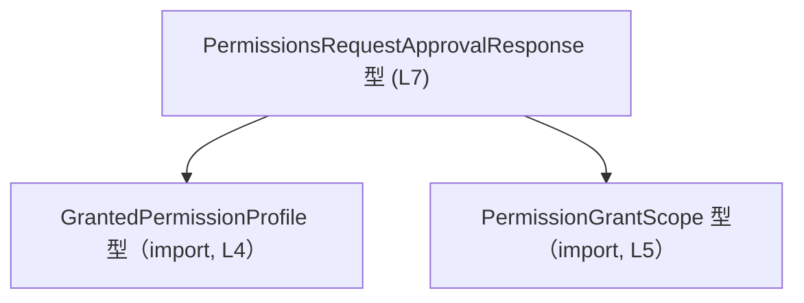
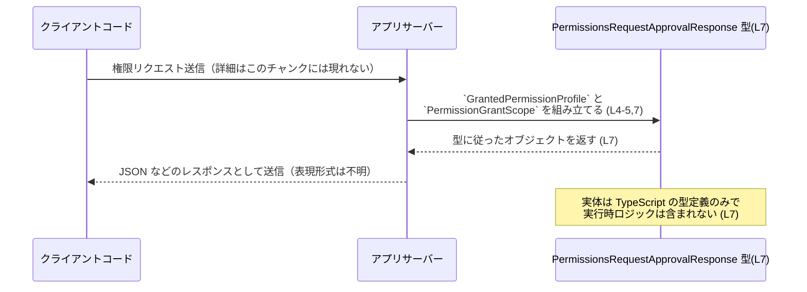

# app-server-protocol/schema/typescript/v2/PermissionsRequestApprovalResponse.ts

## 0. ざっくり一言

権限リクエストの「承認結果レスポンス」を表す、TypeScript のオブジェクト型エイリアスを 1 つだけ定義した、自動生成ファイルです（PermissionsRequestApprovalResponse.ts:L1-7）。

---

## 1. このモジュールの役割

### 1.1 概要

- このモジュールは、権限に関連する「リクエスト承認のレスポンス構造」を TypeScript 型として表現するために存在します（型名・フィールド名からの推測）。
- 実装コード（関数やクラス）は含まず、API スキーマ（データ構造）のみを提供します（PermissionsRequestApprovalResponse.ts:L4-5,7）。
- Rust から TypeScript への型生成ツールである `ts-rs` により自動生成されることがコメントにより示されています（PermissionsRequestApprovalResponse.ts:L1-3）。

### 1.2 アーキテクチャ内での位置づけ

このファイルは、TypeScript 側のプロトコル／スキーマ定義群の一部として、他のコードから参照される立場にあります。

- `GrantedPermissionProfile` 型に依存しています（PermissionsRequestApprovalResponse.ts:L4）。
- `PermissionGrantScope` 型に依存しています（PermissionsRequestApprovalResponse.ts:L5）。
- 逆方向に、この `PermissionsRequestApprovalResponse` 型を参照するコードは、このチャンクには現れません。

依存関係を簡略図で表すと次のようになります。



図は、このファイルに現れる依存関係のみを示しています。

### 1.3 設計上のポイント

コードから読み取れる特徴は次のとおりです。

- **自動生成であること**  
  - `// GENERATED CODE! DO NOT MODIFY BY HAND!` というコメントにより、手動編集禁止の方針が明示されています（PermissionsRequestApprovalResponse.ts:L1）。
  - `ts-rs` による生成であることも明示されています（PermissionsRequestApprovalResponse.ts:L3）。
- **型専用モジュールであること**  
  - `import type` 構文のみを使用しており、実行時に残る値を一切インポートしていません（PermissionsRequestApprovalResponse.ts:L4-5）。
  - `export type` により型エイリアスのみを公開し、ランタイムの関数やクラスは存在しません（PermissionsRequestApprovalResponse.ts:L7）。
- **状態やロジックを持たないこと**  
  - フィールドを持つオブジェクト型の定義だけであり、状態遷移やエラーハンドリングのロジックは含まれていません（PermissionsRequestApprovalResponse.ts:L7）。

---

## 2. 主要な機能一覧（コンポーネントインベントリー）

このファイルが提供・利用している要素を一覧にします。

### 2.1 コンポーネント一覧

| 名前                               | 種別        | 定義/宣言位置                             | 役割 / 用途                                                                                         |
|------------------------------------|-------------|-------------------------------------------|------------------------------------------------------------------------------------------------------|
| `GrantedPermissionProfile`         | 型（import）| PermissionsRequestApprovalResponse.ts:L4  | レスポンス内 `permissions` プロパティの型。具体的な中身はこのチャンクには現れません。               |
| `PermissionGrantScope`             | 型（import）| PermissionsRequestApprovalResponse.ts:L5  | レスポンス内 `scope` プロパティの型。具体的な中身はこのチャンクには現れません。                    |
| `PermissionsRequestApprovalResponse` | 型エイリアス | PermissionsRequestApprovalResponse.ts:L7 | `permissions` と `scope` から成るオブジェクト構造を表す公開 API 用のレスポンス型です。            |

### 2.2 主要な機能（役割ベース）

- `PermissionsRequestApprovalResponse` 型:  
  権限リクエスト承認時のレスポンスとして、  
  - `permissions`: 権限プロファイル（`GrantedPermissionProfile` 型）  
  - `scope`: 権限付与のスコープ（`PermissionGrantScope` 型）  
  の 2 つをまとめて表現するデータ構造です（PermissionsRequestApprovalResponse.ts:L4-5,7）。  
  ※ 意味内容は型名からの推測であり、コードだけでは詳細な仕様は分かりません。

---

## 3. 公開 API と詳細解説

### 3.1 型一覧（構造体・列挙体など）

#### 3.1.1 `PermissionsRequestApprovalResponse`

`export type PermissionsRequestApprovalResponse = { permissions: GrantedPermissionProfile, scope: PermissionGrantScope, };`  
（PermissionsRequestApprovalResponse.ts:L7）

| 項目      | 内容                                                                                       |
|-----------|--------------------------------------------------------------------------------------------|
| 名前      | `PermissionsRequestApprovalResponse`                                                       |
| 種別      | オブジェクト型エイリアス                                                                   |
| 公開範囲  | `export type` により、このモジュールをインポートした他のモジュールから利用可能（L7）      |
| フィールド| `permissions: GrantedPermissionProfile`, `scope: PermissionGrantScope` （L7）             |
| 役割      | 権限リクエスト承認のレスポンスとして、必要な情報を 1 つのオブジェクトにまとめる用途が想定されます（命名からの推測） |

**フィールド詳細**

| フィールド名 | 型                      | 必須 / 任意 | 説明 / 備考                                                                                                      |
|--------------|-------------------------|-------------|-------------------------------------------------------------------------------------------------------------------|
| `permissions`| `GrantedPermissionProfile` | 必須       | 権限プロファイルを表す型です。このチャンクには定義がないため具体的な構造は不明ですが、インポートされていることは確認できます（L4, L7）。 |
| `scope`      | `PermissionGrantScope`  | 必須       | 権限付与のスコープを表す型です。こちらも定義はこのチャンクには現れませんが、型として参照されていることは確認できます（L5, L7）。 |

- いずれのフィールドにも `?`（オプショナルマーク）が付いていないため、**両方とも必須プロパティ**です（PermissionsRequestApprovalResponse.ts:L7）。

**TypeScript の安全性に関するポイント**

- `import type` により、これらはコンパイル時にのみ存在する型として扱われ、バンドル後の JavaScript には影響しません（PermissionsRequestApprovalResponse.ts:L4-5）。
- 呼び出し側で `PermissionsRequestApprovalResponse` 型を使うことで、
  - `permissions` と `scope` の **取り忘れ** や、
  - プロパティ名の **タイプミス**
  をコンパイル時に検出しやすくなります（必須プロパティであるため）。

### 3.2 関数詳細

このファイルには、関数・メソッド・クラスコンストラクタなどの**実行時ロジックを持つ要素は一切定義されていません**（PermissionsRequestApprovalResponse.ts:L1-7）。

そのため:

- エラーハンドリング（`try` / `catch` や `Result` 相当の扱い）
- 非同期処理（`Promise`, `async/await`）
- 並行性（Web ワーカーやマルチスレッド）

に関する実装は、このファイルには存在しません。

### 3.3 その他の関数

- 該当なし（このチャンクには補助関数・ラッパー関数なども存在しません）（PermissionsRequestApprovalResponse.ts:L1-7）。

---

## 4. データフロー

ここでは、**命名から推測できる範囲**で、この型が関わる典型的なデータフローのイメージを示します。  
実際の呼び出しコードはこのチャンクには現れないため、利用側はあくまで想定です。

### 4.1 想定シナリオの概要

- サーバーが権限リクエストを処理し、その結果として
  - 付与された権限プロファイル（`GrantedPermissionProfile` 型）
  - 付与のスコープ（`PermissionGrantScope` 型）
- をまとめたオブジェクトをレスポンスとして返す際に、この `PermissionsRequestApprovalResponse` 型が使われる、という設計が名前から想定されます。

### 4.2 シーケンス図（イメージ）



- 図中の `RespType` は、このファイルで定義されている `PermissionsRequestApprovalResponse` 型を指します（PermissionsRequestApprovalResponse.ts:L7）。

---

## 5. 使い方（How to Use）

### 5.1 基本的な使用方法

この型を利用する典型的なパターンは、**API レスポンスを型付けする**ことです。

```typescript
// 型定義をインポートする（相対パスはこのファイルの配置に依存）
// 実際の import パスはプロジェクト構成によります。
import type { PermissionsRequestApprovalResponse } from "./PermissionsRequestApprovalResponse"; // このファイル（L7）

// API からのレスポンスを受け取って処理する例
function handleApprovalResponse(
    response: PermissionsRequestApprovalResponse, // 型により構造が保証される
): void {
    // プロパティアクセス時、TypeScript が補完や型チェックを行う
    const permissions = response.permissions; // GrantedPermissionProfile 型（L4, L7）
    const scope = response.scope;             // PermissionGrantScope 型（L5, L7）

    // ここで permissions / scope に基づいて処理を行う
    // 具体的なフィールドやロジックは、このチャンクには現れません。
}
```

このように、関数の引数や戻り値に `PermissionsRequestApprovalResponse` を指定することで、  
`permissions` と `scope` が揃ったオブジェクトであることをコンパイル時に保証できます。

### 5.2 よくある使用パターン

1. **レスポンスの型注釈として使う**

```typescript
import type { PermissionsRequestApprovalResponse } from "./PermissionsRequestApprovalResponse";

// 例: Fetch ラッパーの戻り値に型を付ける
async function fetchApprovalResponse(): Promise<PermissionsRequestApprovalResponse> {
    const res = await fetch("/api/permissions/approve");
    // ここでは JSON 形式で来ると仮定し、パース結果に型を付ける
    const data = (await res.json()) as PermissionsRequestApprovalResponse; // 型アサーション
    return data;
}
```

- 実際に受け取る JSON の形がこの型と一致している必要があります。
- ずれている場合でも、`as` による型アサーションはコンパイル時には検出できないため、**実行時の検証は別途必要**です。

1. **分割代入でプロパティを取り出す**

```typescript
import type { PermissionsRequestApprovalResponse } from "./PermissionsRequestApprovalResponse";

function logApproval(response: PermissionsRequestApprovalResponse): void {
    const { permissions, scope } = response; // 両フィールドが存在することが型で保証される (L7)
    console.log("Permissions:", permissions);
    console.log("Scope:", scope);
}
```

### 5.3 よくある間違い

#### 1. 必須プロパティの欠落

`PermissionsRequestApprovalResponse` は `permissions` と `scope` を**必須プロパティ**として定義しています（PermissionsRequestApprovalResponse.ts:L7）。

```typescript
import type { PermissionsRequestApprovalResponse } from "./PermissionsRequestApprovalResponse";

// 間違い例: scope を指定していない
const invalidResponse: PermissionsRequestApprovalResponse = {
    // permissions: ...; // OK: ここを入れてもよい
    // scope プロパティがないため、コンパイルエラーになる
};
```

- これは TypeScript の型チェックによりコンパイル時エラーとなることが期待されます。
- どのような値を `permissions` / `scope` に渡せるかは、それぞれの型定義（別ファイル）に依存します。

#### 2. 自動生成ファイルを直接編集する

コメントに明示されているように、このファイルは **自動生成されており手動編集禁止** です（PermissionsRequestApprovalResponse.ts:L1-3）。

```typescript
// 間違い例（しないほうがよい）:
// export type PermissionsRequestApprovalResponse = { ... フィールドを手で追加 ... };
```

- このような編集は、次回のコード生成時に上書きされ、変更が失われる可能性があります。
- 仕様変更が必要な場合は、**元となる定義（おそらく Rust 側の型定義）を変更**し、再生成するのが前提です（`ts-rs` 利用コメントより推測、PermissionsRequestApprovalResponse.ts:L3）。

### 5.4 使用上の注意点（まとめ）

- **前提条件**
  - `PermissionsRequestApprovalResponse` 型の値には、`permissions` と `scope` の 2 プロパティが必ず存在する前提で処理を書くことになります（L7）。
- **型安全性と実行時検証**
  - TypeScript の型はコンパイル時のみ有効であり、実行時に JSON を受け取る場面では型整合性が保証されません。必要に応じて実行時バリデーションが必要です。
- **自動生成ファイルであること**
  - 仕様変更は元のソース（Rust など）で行い、このファイルは再生成する想定です（L1-3）。
- **スレッド安全性・並行性**
  - このファイルは型のみを定義しており、実行時状態や共有リソースを扱わないため、並行性に関する注意点は特にありません。

---

## 6. 変更の仕方（How to Modify）

### 6.1 新しい機能を追加する場合

このファイルは「GENERATED CODE」「Do not edit this file manually」と明示されているため（PermissionsRequestApprovalResponse.ts:L1-3）、**直接修正するのではなく生成元を変更する必要があります**。

一般的な手順（コメントから推測）:

1. **生成元の型定義を特定する**
   - `ts-rs` を使っているため、Rust 側に `PermissionsRequestApprovalResponse` に対応する構造体または型が存在することが推測されます（L3）。
   - そのファイルでフィールド追加・削除などを行います。
2. **コード生成の設定を確認する**
   - `ts-rs` の derive 設定や出力先パスを管理しているビルドスクリプト／設定ファイルを確認します（このチャンクには現れません）。
3. **コードを再生成する**
   - ビルドスクリプトや `cargo` コマンドなどを用いて TypeScript コードを再生成します。
4. **TypeScript 側で利用箇所を更新する**
   - 新しいフィールドの出力／使用に合わせて、フロントエンド側のコードを修正します。

### 6.2 既存の機能を変更する場合

`PermissionsRequestApprovalResponse` 型の形を変える場合の注意点です。

- **影響範囲の確認**
  - この型を参照している TypeScript ファイル（`import type { PermissionsRequestApprovalResponse } ...`）を全て検索し、影響範囲を把握する必要があります。
- **契約（コントラクト）の維持**
  - `permissions` と `scope` を必須として扱うコードが多い場合、プロパティ名や必須/任意の変更は後方互換性に影響します。
  - API のクライアントとサーバーの両方で同時に更新される前提かどうかを考慮する必要があります。
- **テスト**
  - このチャンクにはテストコードは存在しないため、利用側の単体テスト・統合テストで、レスポンス構造の変更が問題ないかを確認する必要があります。
- **生成ファイル直接編集の禁止**
  - 繰り返しになりますが、変更は生成元に対して実施し、このファイルは再生成するのが前提です（L1-3）。

---

## 7. 関連ファイル

このモジュールと密接に関係するのは、インポートされている型定義ファイルです。

| パス                                 | 役割 / 関係                                                                                         |
|--------------------------------------|----------------------------------------------------------------------------------------------------|
| `./GrantedPermissionProfile`         | `permissions` プロパティの型を定義しているファイルです（import 元として指定、PermissionsRequestApprovalResponse.ts:L4）。具体的な構造はこのチャンクには現れません。 |
| `./PermissionGrantScope`             | `scope` プロパティの型を定義しているファイルです（import 元として指定、PermissionsRequestApprovalResponse.ts:L5）。具体的な構造はこのチャンクには現れません。 |

※ これらのファイルの中身はこのチャンクには現れないため、`GrantedPermissionProfile` や `PermissionGrantScope` の詳細なフィールド構造や列挙値は不明です。
