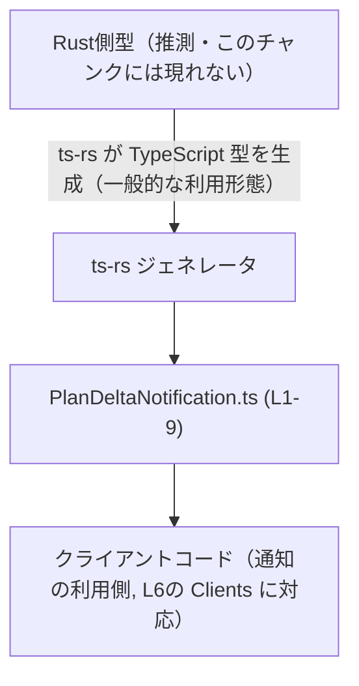
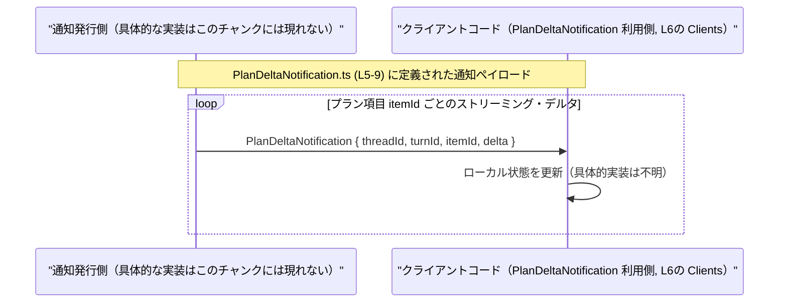

# app-server-protocol/schema/typescript/v2/PlanDeltaNotification.ts

## 0. ざっくり一言

`PlanDeltaNotification` は、「プラン項目のストリーミング・デルタ（差分）通知」を表す TypeScript の型エイリアスです。Rust 用クレート `ts-rs` によって自動生成された、クライアント向けのスキーマ定義になっています（PlanDeltaNotification.ts:L1-3, L5-9）。

---

## 1. このモジュールの役割

### 1.1 概要

- このモジュールは、**プラン項目に対する実験的なストリーミング・デルタ通知のペイロード**を表現するために存在します（PlanDeltaNotification.ts:L5-7）。
- TypeScript 側で `PlanDeltaNotification` 型として参照・型チェックできるようにすることで、通知の構造をコンパイル時に保証します（PlanDeltaNotification.ts:L9）。

### 1.2 アーキテクチャ内での位置づけ

- 先頭コメントから、このファイルは `ts-rs` による **自動生成された TypeScript 型定義**であることが分かります（PlanDeltaNotification.ts:L1-3）。
- `ts-rs` は Rust の型から TypeScript 定義を生成するクレートであるため、**Rust 側に対応する型が存在する可能性が高い**ですが、このチャンクには Rust 側のコードは現れません。
- JSDoc コメントに「Clients」とあるため、この型を利用するのは何らかのクライアントコードであることが示されています（PlanDeltaNotification.ts:L6）。

この関係を簡略化して示すと、次のようになります（Rust 側などは推測であることを明記します）。



### 1.3 設計上のポイント

コードから読み取れる特徴は次のとおりです。

- **自動生成コード**  
  - 先頭コメントに「GENERATED CODE」「Do not edit this file manually」とあるため、手動編集は想定されていない設計です（PlanDeltaNotification.ts:L1-3）。
- **状態を持たない純粋な型定義**  
  - 関数やクラスは一切なく、`export type` による型エイリアスのみが定義されています（PlanDeltaNotification.ts:L9）。
- **全フィールドが文字列型**  
  - `threadId`, `turnId`, `itemId`, `delta` の 4 つのプロパティを持ち、すべて `string` 型です（PlanDeltaNotification.ts:L9）。  
  - ID や差分内容のフォーマットに関する制約はこの型レベルでは定義されておらず、実行時のバリデーションに委ねられていると考えられます（このチャンクには制約ロジックは現れません）。
- **実験的な仕様**  
  - コメントに `EXPERIMENTAL` とあり、「結合したデルタが完成形のコンテンツと一致するとは限らない」と明記されています（PlanDeltaNotification.ts:L5-7）。  
  - これはクライアント側の扱いに関する重要な契約（後述の Contracts/Edge Cases）です。

---

## 2. 主要な機能一覧（コンポーネントインベントリー）

このファイルに含まれるコンポーネントは 1 つだけです。

| 名前                     | 種別         | 行      | 役割 / 用途                                                                                          |
|--------------------------|--------------|---------|-------------------------------------------------------------------------------------------------------|
| `PlanDeltaNotification` | 型エイリアス | L9      | プラン項目に関するストリーミング・デルタ通知のペイロード構造を表す。クライアント側での型チェックに利用。 |

フィールド構成（補足）:

| フィールド名 | 型      | 説明（コードから分かる範囲）                                                | 根拠 |
|--------------|---------|-------------------------------------------------------------------------------|------|
| `threadId`   | string  | 通知が属するスレッドを識別する ID（命名からの推測。型定義自体は単なる string） | L9   |
| `turnId`     | string  | どのターン（会話の1往復など）に紐づくかを識別する ID（命名からの推測）        | L9   |
| `itemId`     | string  | どのプラン項目に対するデルタかを識別する ID（命名からの推測）                | L9   |
| `delta`      | string  | プラン項目内容の「デルタ（差分）」を表す文字列（コメント文脈からの推測）     | L5-7, L9 |

> フィールドの意味は名前と JSDoc コメントから推測できますが、具体的なフォーマットや制約はこのチャンクには現れません。

---

## 3. 公開 API と詳細解説

### 3.1 型一覧（構造体・列挙体など）

| 名前                     | 種別         | フィールド                              | 役割 / 用途                                                                                          | 根拠 |
|--------------------------|--------------|-----------------------------------------|-------------------------------------------------------------------------------------------------------|------|
| `PlanDeltaNotification` | 型エイリアス | `threadId`, `turnId`, `itemId`, `delta` | プラン項目のストリーミング・デルタ通知のペイロード。クライアントはこの構造で通知を受け取ることを想定。 | L5-7, L9 |

TypeScript 的には次のような意味を持ちます（PlanDeltaNotification.ts:L9）:

```typescript
export type PlanDeltaNotification = {
    threadId: string;  // スレッド ID（文字列）
    turnId: string;    // ターン ID（文字列）
    itemId: string;    // 項目 ID（文字列）
    delta: string;     // 差分内容（文字列）
};
```

- `export type ...` は **型エイリアス** であり、実行時には存在しない純粋な型情報です。
- すべてのプロパティが必須（オプショナル `?` が付いていない）であるため、コンパイル時には **4 つすべてのプロパティを持つオブジェクトのみが `PlanDeltaNotification` として扱われます**。

### 3.2 関数詳細（最大 7 件）

このファイルには **関数・メソッドは定義されていません**（PlanDeltaNotification.ts:L1-9）。  
そのため、関数テンプレートに基づく詳細解説の対象はありません。

### 3.3 その他の関数

上記のとおり、補助関数やラッパー関数も存在しません（PlanDeltaNotification.ts:L1-9）。

---

## 4. データフロー

このファイル自体には処理ロジックや通信コードは含まれていませんが、JSDoc コメントから次のようなデータフローが想定されます。

- 「ストリーミング・デルタ」を生成する側が、あるプラン項目（`itemId`）に対する部分的な更新を `delta` として表現する（PlanDeltaNotification.ts:L5-7, L9）。
- それをクライアントが `PlanDeltaNotification` として受け取り、表示や内部状態の更新に利用する（クライアントという語はコメントに明示, PlanDeltaNotification.ts:L6）。

これをシーケンス図で表現すると、以下のようになります（通信手段はこのチャンクには現れないため「不明」としています）。



> 実際に WebSocket・HTTP・gRPC などどの通信手段を使っているか、このチャンクからは分かりません。

---

## 5. 使い方（How to Use）

### 5.1 基本的な使用方法

この型は、通知を受け取る側（クライアントコード）で型安全に扱うためのものです。  
典型的な使用例を示します。

```typescript
// PlanDeltaNotification 型をインポートする（相対パスはプロジェクト構成に依存）
import type { PlanDeltaNotification } from "./PlanDeltaNotification";  // このファイル (L9) のエクスポート

// 受信したデルタ通知を処理する例
function handlePlanDelta(notification: PlanDeltaNotification) {       // notification は厳密に 4 フィールドを持つ必要がある
    const { threadId, turnId, itemId, delta } = notification;        // 分割代入で各フィールドを取り出す

    // ここで threadId / turnId / itemId に応じて適切な状態に delta を反映する
    // 具体的なロジックはこのリポジトリの他の部分に依存し、このチャンクのみからは分かりません。
    console.log("thread:", threadId, "turn:", turnId, "item:", itemId, "delta:", delta);
}
```

ポイント:

- コンパイル時に `PlanDeltaNotification` 型と一致しないオブジェクトを渡すと TypeScript がエラーを報告します。
- 実行時には単なるオブジェクトであり、型情報は存在しないため、**外部から受け取るデータに対しては別途バリデーションが必要**です。

### 5.2 よくある使用パターン（例）

このチャンクには利用コードは含まれていませんが、フィールド構造とコメントから次のような利用パターンが考えられます（あくまで一例であり、実際の実装は不明です）。

1. **プラン項目ごとにデルタを蓄積する（実験的な利用例）**

```typescript
import type { PlanDeltaNotification } from "./PlanDeltaNotification";

const planBuffers = new Map<string, string>();  // itemId ごとのバッファ（例）

function onDelta(notification: PlanDeltaNotification) {
    const { itemId, delta } = notification;

    const current = planBuffers.get(itemId) ?? "";
    // ※ コメントにある通り、単純連結で完成形と一致するとは限らない点に注意（L5-7）
    planBuffers.set(itemId, current + delta);
}
```

> 上記は「単純連結」の例ですが、コメントにあるように **連結結果が完成形と一致しない可能性**があるため、「途中経過のプレビュー」程度にとどめるべきことが示唆されています（PlanDeltaNotification.ts:L5-7）。

1. **threadId / turnId でフィルタする**

```typescript
function isSameTurn(
    notification: PlanDeltaNotification,
    threadId: string,
    turnId: string,
): boolean {
    return notification.threadId === threadId && notification.turnId === turnId;
}
```

- 特定のスレッド・ターンに属するデルタだけを処理したい場合に利用できます。

### 5.3 よくある間違い（コメントから分かる契約違反）

JSDoc コメントは、クライアント側の **誤った前提**を明示的に否定しています（PlanDeltaNotification.ts:L5-7）。

```typescript
// ❌ 間違い例: delta をすべて連結すれば「完成したプラン項目の内容」と一致すると仮定している
let fullContent = "";
for (const notification of deltas) {
    fullContent += notification.delta;  // コメント(L5-7)が否定している前提
}
// fullContent を「完成形」として扱う -> 契約に反する可能性がある

// ✅ コメントに沿った扱い方の一例:
let preview = "";
for (const notification of deltas) {
    preview += notification.delta;      // あくまで「途中経過のプレビュー」として利用する例
}
// 最終的な確定内容は、別の確定通知や API レスポンスから取得する（このチャンクには実装は現れない）
```

コメントより:

> Clients should not assume concatenated deltas match the completed plan item content.（PlanDeltaNotification.ts:L6-7）

とあるため、**単純連結で復元できるとみなすのは契約違反**になります。

### 5.4 使用上の注意点（まとめ）

**契約 / Edge Cases**

- **デルタ連結の非保証**  
  - 「デルタを全部つなげれば完成形になる」という保証は明示的に否定されています（PlanDeltaNotification.ts:L5-7）。  
  - 完成形を必要とする処理は、別の確定情報源（確定イベントや API レスポンスなど）に依存する必要があります（実装はこのチャンクには現れません）。
- **文字列以外の制約は型レベルでは表現されていない**  
  - `threadId`, `turnId`, `itemId`, `delta` はすべて単なる `string` であり、空文字・不正フォーマット・異常に長い文字列などに対する制約は型定義からは読み取れません（PlanDeltaNotification.ts:L9）。  
  - これらの検証は、実行時の別のロジックに委ねられます。

**Bugs / Security 観点**

- このファイルには実行時ロジックがないため、**直接的なバグ（ロジックエラー）や脆弱性は含まれていません**（PlanDeltaNotification.ts:L1-9）。
- ただし、`delta` や各種 ID にどのような情報を入れるかによっては、ログ出力やクライアント表示で機微情報が露出する可能性があります。  
  具体的な機密性要件はシステム全体の設計に依存し、このチャンクだけからは判断できません。

**Tests**

- このチャンクにはテストコードやコメントによるテストの言及は一切ありません（PlanDeltaNotification.ts:L1-9）。  
  テストは Rust 側の型定義あるいは ts-rs の生成結果に対して行われている可能性がありますが、詳細は不明です。

**Performance / Scalability**

- この型定義自体はコンパイル時にのみ影響するため、**パフォーマンスやスケーラビリティへの直接の影響はありません**（PlanDeltaNotification.ts:L9）。
- ただし、`delta` が非常に長くなったり、ストリーミング頻度が高い場合、クライアント側のメモリや描画性能に影響する可能性があります。これは型定義からは読み取れない運用上の問題です。

**並行性 / スレッド安全性**

- TypeScript の型定義のみであり、ランタイムのスレッドや並行性に関するコードは含まれていません（PlanDeltaNotification.ts:L1-9）。  
  並行処理の安全性は、この型を使う実装側に委ねられます。

**自動生成コードとしての注意点**

- ファイル先頭に「GENERATED CODE! DO NOT MODIFY BY HAND!」と明記されています（PlanDeltaNotification.ts:L1-3）。  
  - 直接編集すると、次回のコード生成で上書きされる、または Rust 側のスキーマと不整合が生じる可能性があります。
  - 仕様変更は **生成元（Rust 型 + ts-rs 設定）** 側で行う必要があります（生成元はこのチャンクには現れません）。

---

## 6. 変更の仕方（How to Modify）

### 6.1 新しい機能を追加する場合

このファイルは `ts-rs` による自動生成であり、手動編集は前提とされていません（PlanDeltaNotification.ts:L1-3）。  
そのため、型にフィールドを追加したい場合の一般的な手順は次のようになります（ts-rs の一般的な利用形態に基づく説明であり、このチャンクには具体的な生成手順は現れません）。

1. **生成元の Rust 側型定義を変更する（推測）**  
   - Rust 側に `PlanDeltaNotification` に対応する構造体などがある場合、そこに新しいフィールドを追加する。
2. **ts-rs によるコード生成を再実行する**  
   - ビルドスクリプトや生成コマンドなどを通じて TypeScript 定義を再生成する。
3. **TypeScript 側で新フィールドを利用する**  
   - 生成された新しい `PlanDeltaNotification` 型をインポートし、利用コードを更新する。

> このチャンクのみからは、具体的な Rust ファイル名や生成スクリプトは分かりません。

### 6.2 既存の機能を変更する場合

`PlanDeltaNotification` の構造を変更する（フィールド名の変更、削除、型変更など）場合も、基本的には上記と同様に **生成元側で変更**する必要があります。

変更時の注意点:

- **契約の維持**  
  - JSDoc コメントに書かれた契約（特に「連結すると完成形になるとは限らない」点）は、型定義を変えても変わらない可能性があります（PlanDeltaNotification.ts:L5-7）。  
  - 仕様を変える場合は、このコメントの更新も含めて検討する必要があります。
- **利用箇所の影響調査**  
  - `threadId`, `turnId`, `itemId`, `delta` というフィールド名や型に依存している TypeScript コード全体に影響します。  
  - IDE の参照検索などで利用箇所を洗い出してから変更することが重要です（このチャンクには利用箇所は現れないため、別ファイルを確認する必要があります）。

---

## 7. 関連ファイル

このチャンクから確実に分かる関連は、ファイルパスと自動生成元に関する情報のみです。

| パス / 要素                                                | 役割 / 関係                                                                                                 |
|------------------------------------------------------------|--------------------------------------------------------------------------------------------------------------|
| `app-server-protocol/schema/typescript/v2/`               | 本ファイルが属するディレクトリ。v2 スキーマ版の TypeScript 型定義が他にも存在する可能性があるが、このチャンクには現れない。 |
| `app-server-protocol/schema/typescript/v2/PlanDeltaNotification.ts` | 本ドキュメント対象のファイル。`PlanDeltaNotification` 型を 1 つエクスポートする（PlanDeltaNotification.ts:L9）。          |
| `ts-rs`（Rust クレート, コメント中のリンク）             | この TypeScript ファイルの自動生成ツール。Rust 側の型から本ファイルを生成していることがコメントから分かる（L1-3）。     |

> 具体的な Rust ファイル名や、他の通知型（例: 「確定通知」）などはこのチャンクには現れません。そのため、より広いデータフローや API 全体像を把握するには、リポジトリ内の他のファイルを確認する必要があります。
