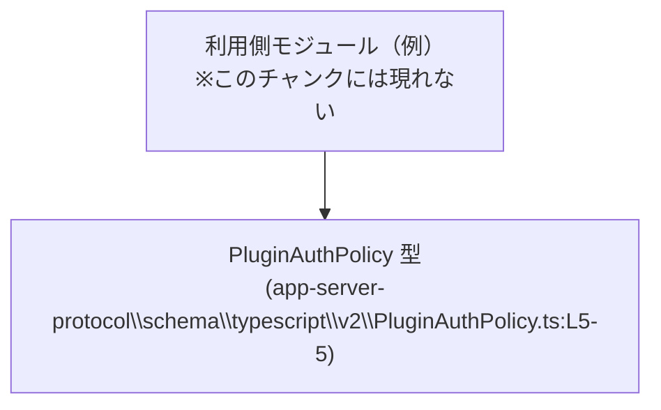
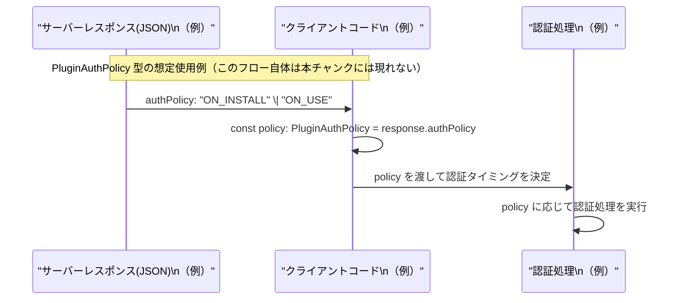

# app-server-protocol\schema\typescript\v2\PluginAuthPolicy.ts コード解説

## 0. ざっくり一言

`PluginAuthPolicy` は、プラグインの「認証をいつ行うか」を表す **文字列リテラルのユニオン型** を定義する TypeScript ファイルです（`"ON_INSTALL"` または `"ON_USE"` のどちらか）（app-server-protocol\schema\typescript\v2\PluginAuthPolicy.ts:L5-5）。

---

## 1. このモジュールの役割

### 1.1 概要

- このモジュールは、プラグインの認証ポリシーを型として表現するために存在します。
- `PluginAuthPolicy` 型は `"ON_INSTALL"` または `"ON_USE"` の 2 値のみを取ることをコンパイル時に保証します（L5-5）。
- ファイル先頭のコメントから、この型定義は `ts-rs` により自動生成されており、手動編集しない前提になっています（L1-3）。

### 1.2 アーキテクチャ内での位置づけ

このファイル自体は他モジュールを import しておらず、**依存先はゼロ** です（L1-5）。  
一方で、他の TypeScript コードから `PluginAuthPolicy` が import されて利用されることが想定されますが、その具体的なモジュールはこのチャンクには現れません。



この図は、「他のモジュールが `PluginAuthPolicy` に依存している」という一般的な関係を示したものであり、**具体的な利用モジュール名や場所はこのチャンクからは不明**です。

### 1.3 設計上のポイント

コードから読み取れる特徴は次のとおりです。

- 自動生成コード  
  - `// GENERATED CODE! DO NOT MODIFY BY HAND!`（L1-1）  
  - `// This file was generated by [ts-rs](...)`（L3-3）  
  から、`ts-rs` による自動生成ファイルであり、直接編集しない設計になっています。
- 文字列リテラル・ユニオン型  
  - `export type PluginAuthPolicy = "ON_INSTALL" | "ON_USE";`（L5-5）  
  により、**実行時オーバーヘッドのないコンパイル時専用の型**として設計されています。
- 状態やロジックを持たない  
  - 関数・クラス・変数定義はなく、単一の型エイリアスのみで構成されています（L5-5）。
- エラー・並行性  
  - 型定義のみであり、**実行時エラーや並行処理に関する挙動は一切持ちません**。  
    エラーや競合は、あくまでこの型を利用する側のロジックで決まります。

---

## 2. 主要な機能一覧

このモジュールが提供する機能は 1 点のみです。

- `PluginAuthPolicy` 型定義: プラグイン認証ポリシーを `"ON_INSTALL"` または `"ON_USE"` の 2 値に制約する文字列リテラルユニオン型（L5-5）

---

## 3. 公開 API と詳細解説

### 3.1 型一覧（構造体・列挙体など）

| 名前               | 種別           | 役割 / 用途                                                                 | 値のバリエーション                     | 定義位置 |
|--------------------|----------------|-------------------------------------------------------------------------------|----------------------------------------|----------|
| `PluginAuthPolicy` | 型エイリアス   | プラグインの認証ポリシー種別を表す文字列リテラル・ユニオン型。プロトコル上の定義を型で表現する。 | `"ON_INSTALL"` / `"ON_USE"` の 2 種類 | app-server-protocol\\schema\\typescript\\v2\\PluginAuthPolicy.ts:L5-5 |

#### 型の内容（TypeScript 観点）

- **種別**: 文字列リテラル・ユニオン型  
  `type PluginAuthPolicy = "ON_INSTALL" | "ON_USE";`（L5-5）
- **意味（推測を含むが名称に基づく）**:
  - `"ON_INSTALL"`: プラグインのインストール時に認証を行うポリシー
  - `"ON_USE"`: プラグインの利用時（呼び出し時など）に認証を行うポリシー  
  これらの正確な業務的意味やタイミングは、このファイル単体からは確定できませんが、識別子名からそのように解釈できます。

### 3.2 関数詳細（最大 7 件）

このファイルには **関数・メソッド・クラスは一切定義されていません**（L1-5）。  
したがって、詳細解説対象となる公開関数はありません。

- 関数定義が存在しないことの根拠:  
  - ファイル内容はコメント 2 行＋空行＋`export type ...` の 1 行のみであり（L1-5）、`function` や `=>` を含む記述がありません。

### 3.3 その他の関数

- このファイルには補助的な関数やラッパー関数も存在しません（L1-5）。

---

## 4. データフロー

このファイル自体には実行時処理やデータフローは定義されていません（L1-5）。  
ここでは **`PluginAuthPolicy` の代表的な「想定される」使用フロー** を例として示します。  
※このフローは設計上の典型例であり、実際の実装が本リポジトリ内に存在するかどうかは、このチャンクからは分かりません。

### 想定されるデータフロー（例）

- サーバからのレスポンス JSON に `authPolicy` フィールドが含まれる（例）。
- クライアントの TypeScript コードがその値を `PluginAuthPolicy` 型として扱う。
- 認証ロジック側が `authPolicy` の値に応じて処理を分岐する。



**要点**

- `PluginAuthPolicy` 型は **「文字列の取りうる値を制約する」コンパイル時情報** であり、実行時にはただの文字列として扱われます。
- そのため、実際のデータフロー上では `"ON_INSTALL"` / `"ON_USE"` という文字列が流れますが、TypeScript コード内では `PluginAuthPolicy` 型で注釈することで、**誤った文字列をコンパイル時に防ぐ**ことができます。

---

## 5. 使い方（How to Use）

ここでは、`PluginAuthPolicy` 型の典型的な使用例をいくつか示します。  
コード例の import パスは一例であり、実際のプロジェクト構成に合わせて変更が必要です。

### 5.1 基本的な使用方法

**目的**: `PluginAuthPolicy` 型を使って、変数やフィールドに許可される文字列を制限します。

```typescript
// PluginAuthPolicy 型をインポートする
import type { PluginAuthPolicy } from "./PluginAuthPolicy";  // 実際の相対パスはプロジェクト構成に依存

// プラグイン設定を表す型を定義する
interface PluginConfig {
    name: string;                  // プラグイン名
    authPolicy: PluginAuthPolicy;  // 認証ポリシー: "ON_INSTALL" または "ON_USE" のみ
}

// 型安全に値を設定する
const config: PluginConfig = {
    name: "example-plugin",
    authPolicy: "ON_INSTALL",      // OK: 許可された文字列
    // authPolicy: "ALWAYS",       // コンパイルエラー: "ALWAYS" は PluginAuthPolicy に含まれない
};
```

このように、`PluginAuthPolicy` を使うことで、**IDE 補完やコンパイルエラーを通じて誤った値の代入を防止**できます。

### 5.2 よくある使用パターン

#### パターン 1: 分岐処理に使う

```typescript
import type { PluginAuthPolicy } from "./PluginAuthPolicy";

// 認証ポリシーに応じて処理を分ける例
function shouldAuthenticateNow(policy: PluginAuthPolicy, isInstallPhase: boolean): boolean {
    if (policy === "ON_INSTALL") {     // "ON_INSTALL" かどうかを判定
        return isInstallPhase;         // インストールフェーズのみ認証
    }

    // ここまで来ると policy は "ON_USE" に絞られる（型推論）
    return !isInstallPhase;            // 利用フェーズのみ認証
}
```

- `policy` の型が `PluginAuthPolicy` なので、`if (policy === "ON_INSTALL")` の分岐後は、  
  else ブロック内で `policy` が `"ON_USE"` に絞り込まれます（TypeScript の型推論）。

#### パターン 2: オブジェクトの一部として流通させる

```typescript
import type { PluginAuthPolicy } from "./PluginAuthPolicy";

interface PluginMeta {
    id: string;
    authPolicy: PluginAuthPolicy;
}

// どこかから取得したメタ情報を受け取り、ポリシーに応じて処理する
function handlePlugin(meta: PluginMeta) {
    switch (meta.authPolicy) {
        case "ON_INSTALL":
            // インストール時認証の処理
            break;
        case "ON_USE":
            // 利用時認証の処理
            break;
        // デフォルト分岐は不要: 2 パターンを網羅しているためコンパイラがチェック
    }
}
```

- `switch` 文で **全てのユニオン成分を列挙**することで、将来新しい値が追加されたときに  
  コンパイラが「未処理のケース」を検出しやすくなります。

### 5.3 よくある間違い

```typescript
import type { PluginAuthPolicy } from "./PluginAuthPolicy";

// 誤り例: 型を string にしてしまう
interface BadConfig {
    authPolicy: string;              // 型がゆるすぎる
}

const badConfig: BadConfig = {
    authPolicy: "SOMETHING_WRONG",   // コンパイルは通るが、実行時に想定外の値になる
};

// 正しい例: PluginAuthPolicy を使う
interface GoodConfig {
    authPolicy: PluginAuthPolicy;    // 許可された値だけに制限
}

const goodConfig: GoodConfig = {
    authPolicy: "ON_USE",            // OK
    // authPolicy: "SOMETHING_WRONG" // コンパイルエラー
};
```

**ポイント**

- 単なる `string` 型を使うと、**タイポや不正な値をコンパイル時に検出できません**。
- `PluginAuthPolicy` を使うことで、IDE で候補が `"ON_INSTALL"` / `"ON_USE"` に限定され、誤りを減らせます。

### 5.4 使用上の注意点（まとめ）

- **値の制約**:  
  - `PluginAuthPolicy` に代入できるのは `"ON_INSTALL"` または `"ON_USE"` のみです（L5-5）。
- **外部入力の扱い**:  
  - ネットワークや設定ファイルから文字列を受け取り、そのまま `PluginAuthPolicy` に代入するときは、  
    事前に `"ON_INSTALL"` / `"ON_USE"` のどちらかをチェックし、**不正な文字列をフィルタする必要**があります。
  - 不正な値を `as PluginAuthPolicy` で無理に型アサーションすると、**型安全性が失われる**ため注意が必要です。
- **並行性・エラー**:  
  - この型自体は単なるコンパイル時の型定義であり、実行時エラーやスレッドセーフティに直接の影響はありません。

---

## 6. 変更の仕方（How to Modify）

### 6.1 新しい機能を追加する場合（例: 新しいポリシー値を増やす）

コメントから、このファイルは `ts-rs` によって自動生成されていることが明示されています（L1-3）。  
したがって、**直接このファイルを編集するべきではありません**。

- 根拠:
  - `// GENERATED CODE! DO NOT MODIFY BY HAND!`（L1-1）
  - `Do not edit this file manually.`（L3-3）

**一般的な手順（推測を含む）**

1. 生成元のスキーマ（おそらく Rust 側の型定義）に新しい値を追加する。  
   - この生成元ファイルのパスや内容は、このチャンクには現れないため不明です。
2. `ts-rs` を用いて TypeScript コードを再生成する。
3. 生成後、`PluginAuthPolicy` に新しいリテラルが追加されていることを確認する。

例（生成後のイメージ・コード例）:

```typescript
// 例: 新しい "ALWAYS" ポリシーが追加された場合のイメージ
export type PluginAuthPolicy = "ON_INSTALL" | "ON_USE" | "ALWAYS";
```

※上記はあくまで「こう生成されるだろう」という例であり、**実際の生成結果や仕様はこのチャンクからは確定できません。**

### 6.2 既存の機能を変更する場合

`"ON_INSTALL"` や `"ON_USE"` の文字列そのものを変更・削除する場合は、プロトコル互換性に大きな影響があります。

- 影響範囲の確認
  - この型を import している全てのモジュールの分岐・比較ロジックに影響します。  
    具体的な利用箇所は、このチャンクには現れません。
- 契約（Contract）
  - 現在の契約は「`PluginAuthPolicy` 型の値は `"ON_INSTALL"` または `"ON_USE"` である」というものです（L5-5）。
  - この契約を破る変更（値の削除・名称変更）は**既存コードを壊す可能性が高い**ため、プロトコル全体の合意が必要です。
- 変更手順の一般論
  - まず生成元（Rust 側など）で値の変更を行い、`ts-rs` で再生成する（L1-3）。
  - その後、TypeScript 側ですべての `switch` / `if` 分岐を見直し、  
    追加・削除されたケースを適切に処理する。

---

## 7. 関連ファイル

このチャンクには import / export 先の情報が含まれていないため、**具体的なファイルパスは不明**です（L1-5）。  
ただし、コメントから推測できる関連は次のとおりです。

| パス / 種別 | 役割 / 関係 |
|-------------|------------|
| （不明）Rust 側の型定義ファイル | コメントの `ts-rs` 記述（L3-3）から、通常は Rust の構造体・列挙体などからこの TypeScript 型が生成されていると考えられます。ただし、具体的なファイル名・モジュール名はこのチャンクには現れません。 |
| （不明）`PluginAuthPolicy` を import する TypeScript ファイル群 | 実際に `PluginAuthPolicy` を利用しているであろうクライアントコード。プロジェクト内のどこに存在するか、このチャンクからは分かりません。 |

---

### まとめ（安全性・エラー・並行性の観点）

- **安全性（型安全性）**
  - `PluginAuthPolicy` は TypeScript の文字列リテラルユニオン型により、  
    認証ポリシー値を `"ON_INSTALL"` / `"ON_USE"` に制約し、コンパイル時の型チェックを提供します（L5-5）。
- **エラー**
  - このファイル自体には実行時ロジックがないため、直接の実行時エラーは発生しません。
  - 利用側が不正な文字列を `as PluginAuthPolicy` でキャストした場合など、**利用側の誤用に起因するエラー**の可能性はあります。
- **並行性**
  - 単なる型エイリアスであり、スレッドセーフティや非同期制御に関わる要素はありません。  
    並行性に関する問題は、すべてこの型を用いる側の設計に依存します。
