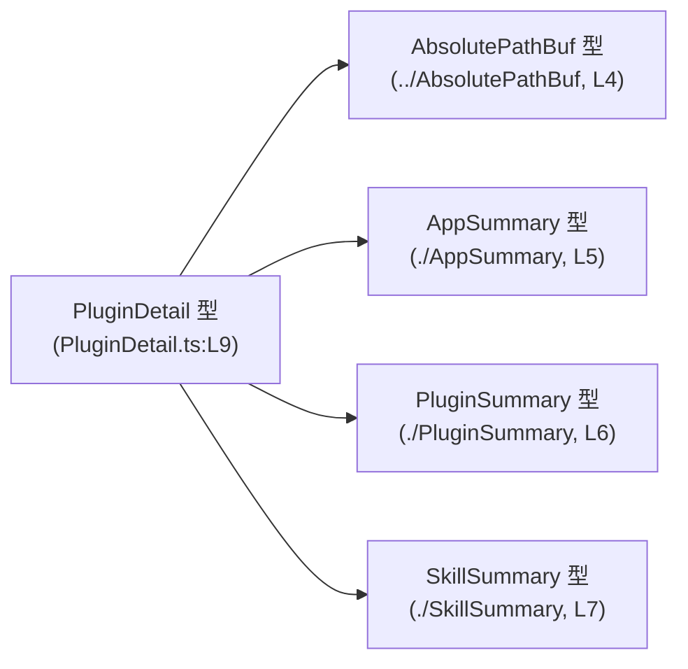
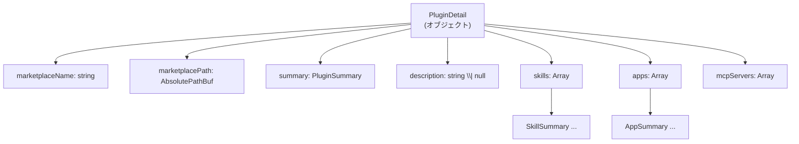
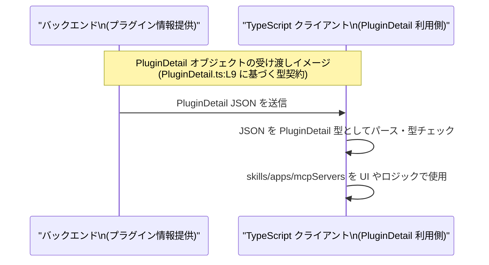

# app-server-protocol/schema/typescript/v2/PluginDetail.ts

## 0. ざっくり一言

`PluginDetail` は、プラグインの詳細情報（マーケットプレイス上の識別情報、概要、説明文、保有スキル、関連アプリ、MCP サーバ一覧など）を表現するための **自動生成された TypeScript 型定義** です（`PluginDetail.ts:L1-3,9`）。

---

## 1. このモジュールの役割

### 1.1 概要

- このモジュールは、Rust 側の定義から `ts-rs` によって生成された **プラグイン詳細のデータ構造** を TypeScript で提供します（`PluginDetail.ts:L1-3`）。
- プラグインのマーケットプレイス上の名前とパス、サマリ情報、説明文、スキル一覧、アプリ一覧、MCP サーバ識別子一覧を 1 つのオブジェクトとしてまとめる役割を持ちます（`PluginDetail.ts:L9`）。
- 実行時のロジックは含まず、**データ形状の契約（スキーマ）** のみを表現します（`PluginDetail.ts:L4-9`）。

### 1.2 アーキテクチャ内での位置づけ

このモジュールは、他のスキーマ型（`AbsolutePathBuf`, `AppSummary`, `PluginSummary`, `SkillSummary`）に依存し、`PluginDetail` 型を構成しています（`PluginDetail.ts:L4-7,9`）。



- `PluginDetail` は、上記 4 つの型をフィールドとして利用する **集約型** になっています（`PluginDetail.ts:L4-7,9`）。
- コメントから、この TypeScript 型は Rust 側の型定義をソースとする **コード生成物** であり、直接編集しない前提で運用される位置づけであることが分かります（`PluginDetail.ts:L1-3`）。

### 1.3 設計上のポイント

- **自動生成 & 非編集前提**  
  - ファイル冒頭に「GENERATED CODE」「Do not edit manually」と明記されています（`PluginDetail.ts:L1-3`）。
- **純粋な型定義（データのみ）**  
  - 実行時コードはなく、`export type` による型エイリアスのみを提供します（`PluginDetail.ts:L9`）。
- **依存型の再利用**  
  - パス表現には `AbsolutePathBuf`、概要には `PluginSummary`、関連情報には `SkillSummary`・`AppSummary` を使用しています（`PluginDetail.ts:L4-7,9`）。
- **TypeScript の型限定インポート**  
  - すべて `import type` でインポートしており、ビルド後には実行時依存を持たない純粋な型参照になっています（`PluginDetail.ts:L4-7`）。
- **可 null フィールドの明示**  
  - 説明文 `description` は `string | null` として、「文字列か、説明が存在しないことを表す null」のどちらかであることを示します（`PluginDetail.ts:L9`）。
- **リストは配列で表現**  
  - `skills`, `apps`, `mcpServers` はすべて `Array<T>` で表現され、0 件も許容する可変長リストです（`PluginDetail.ts:L9`）。

---

## 2. 主要な機能一覧

このファイルは関数を持たないため、「機能」は型定義としての役割で整理します。

- `PluginDetail` 型: プラグインの詳細情報をまとめたオブジェクト型を提供します（`PluginDetail.ts:L9`）。
  - マーケットプレイス上の名前とパスを保持
  - プラグイン概要や説明文を保持
  - プラグインが提供するスキル・アプリ・MCP サーバ一覧を保持

---

## 3. 公開 API と詳細解説

### 3.1 型一覧（構造体・列挙体など）

このファイルで **定義・公開されている型** と **参照している型** の一覧です。

| 名前             | 種別        | 定義位置 / 参照位置                        | 役割 / 用途                                                                                     |
|------------------|-------------|--------------------------------------------|--------------------------------------------------------------------------------------------------|
| `PluginDetail`   | 型エイリアス | 定義: `PluginDetail.ts:L9`                 | プラグインの詳細情報を表現するオブジェクト型。マーケット情報、概要、説明文、スキル・アプリ・MCP サーバ一覧をまとめる。 |
| `AbsolutePathBuf`| 型（別ファイル） | インポート: `PluginDetail.ts:L4`         | `marketplacePath` フィールドの型。プラグインのマーケットプレイスタイトルの絶対パス表現に使われると解釈できますが、このファイル単体では詳細不明です。 |
| `AppSummary`     | 型（別ファイル） | インポート: `PluginDetail.ts:L5`         | `apps` 配列要素の型。プラグインに関連するアプリの概要情報を表すと推測できますが、定義はこのチャンクには現れません。 |
| `PluginSummary`  | 型（別ファイル） | インポート: `PluginDetail.ts:L6`         | `summary` フィールドの型。プラグインの要約情報を表す型ですが、詳細は他ファイル側の定義に依存します。 |
| `SkillSummary`   | 型（別ファイル） | インポート: `PluginDetail.ts:L7`         | `skills` 配列要素の型。プラグインが提供するスキルの概要情報を表すと解釈できますが、このチャンクには定義がありません。 |

> 補足: 上記のうち、`AbsolutePathBuf`, `AppSummary`, `PluginSummary`, `SkillSummary` は **このファイルでは定義されていません**（`PluginDetail.ts:L4-7`）。役割の説明は名称からの推測であり、正確な構造はそれぞれの定義ファイルを確認する必要があります。

#### `PluginDetail` のフィールド一覧

`PluginDetail` は次のフィールドを持つオブジェクト型です（`PluginDetail.ts:L9`）。

| フィールド名        | 型                         | 説明（読み取れる範囲）                                                                 |
|---------------------|----------------------------|----------------------------------------------------------------------------------------|
| `marketplaceName`   | `string`                   | プラグインのマーケットプレイス上の名前（人間向け・識別用の文字列）と解釈できますが、空文字許容かなどは不明です。 |
| `marketplacePath`   | `AbsolutePathBuf`          | マーケットプレイスにおけるパス情報。絶対パス表現をする型と推測されますが、詳細な仕様は別ファイル依存です。 |
| `summary`           | `PluginSummary`            | プラグインのサマリ情報。タイトルや簡易説明などを含む可能性がありますが、このチャンクには構造が現れません。 |
| `description`       | `string \| null`           | プラグインの詳細な説明文。存在しない場合は `null` で表現されます。                      |
| `skills`            | `Array<SkillSummary>`      | プラグインが提供するスキル一覧。0 個以上の `SkillSummary` オブジェクトを保持します。     |
| `apps`              | `Array<AppSummary>`        | プラグインに関連するアプリ一覧。0 個以上の `AppSummary` オブジェクトを保持します。       |
| `mcpServers`        | `Array<string>`            | MCP サーバを識別する文字列一覧。具体的なフォーマット（URL など）はこの型からは分かりません。 |

### 3.2 関数詳細（最大 7 件）

このファイルには **関数・メソッドの定義は存在しません**（`PluginDetail.ts:L1-9`）。  
そのため、関数詳細テンプレートに基づく解説は該当しません。

### 3.3 その他の関数

同様に、補助関数やラッパー関数も定義されていません（`PluginDetail.ts:L1-9`）。

---

## 4. データフロー

### 4.1 型内部のデータ構造フロー

`PluginDetail` という 1 つのオブジェクトの中に、複数のサマリ情報やリストがどのようにネストされるかを図示します（`PluginDetail.ts:L4-9`）。



- 1 つの `PluginDetail` が「プラグイン」という概念単位に対応し、その内部に関連する複数の情報を内包する構造になっています（`PluginDetail.ts:L9`）。
- `skills`, `apps`, `mcpServers` はいずれも「0 個以上」の要素を取り得る配列です。空配列が特別扱いされている記述はないため、「要素が 1 つもない場合でも有効」であると解釈できます（`PluginDetail.ts:L9`）。

### 4.2 典型的な受け渡しイメージ（概念図）

実際の呼び出し元やストレージはこのファイルからは分かりませんが、「`PluginDetail` 型のオブジェクトがどのように流れるか」の一般的なイメージを sequence diagram で示します。  
※これは **命名とパス構造からの推測であり、このファイル単体から保証できる挙動ではありません。**



- この図のポイントは、`PluginDetail` が「1 回の API レスポンスなどでまとめて渡されるプラグイン情報のバンドル」として扱われることが想定しやすい、という点です（ただし、このファイルはその経路を規定していません）。

---

## 5. 使い方（How to Use）

### 5.1 基本的な使用方法

`PluginDetail` 型を利用する側の典型的なコード例です。  
ここでは、同一ディレクトリからの相対インポートを仮定しています。

```typescript
// PluginDetail 型をインポートする（同一ディレクトリを仮定した例）
import type { PluginDetail } from "./PluginDetail";   // 実際のパスはプロジェクト構成に依存する

// 他の関連型も必要に応じてインポートする
import type { AppSummary } from "./AppSummary";
import type { PluginSummary } from "./PluginSummary";
import type { SkillSummary } from "./SkillSummary";
import type { AbsolutePathBuf } from "../AbsolutePathBuf";

// PluginDetail 型の値を組み立てる例
const plugin: PluginDetail = {
    marketplaceName: "example-plugin",                 // プラグインのマーケット名
    marketplacePath: {                                 // AbsolutePathBuf の具体構造は別ファイル依存
        // ここには AbsolutePathBuf の定義に従ったフィールドを記述する
    } as AbsolutePathBuf,
    summary: {
        // PluginSummary のフィールドを定義する
    } as PluginSummary,
    description: "Example plugin for demonstration.",  // 説明文（ない場合は null）
    skills: [
        {
            // SkillSummary のフィールドを定義する
        } as SkillSummary,
    ],
    apps: [
        {
            // AppSummary のフィールドを定義する
        } as AppSummary,
    ],
    mcpServers: ["server-1", "server-2"],              // MCP サーバを表す文字列
};

// PluginDetail 型のおかげで、フィールドの書き漏れや型の間違いはコンパイル時に検出されます
```

**ポイント（TypeScript 特有の安全性観点）**

- `PluginDetail` を明示的な型として付けることで、  
  - 必須フィールドの書き忘れ  
  - `description` に `undefined` を入れるなど型と合わない代入  
  - `skills` に `SkillSummary` ではない型を入れるミス  
  をコンパイル時に検出できます（`PluginDetail.ts:L9`）。
- `import type` を使うことで、型だけを参照し、バンドルのサイズや実行時依存に影響を与えません（`PluginDetail.ts:L4-7`）。

### 5.2 よくある使用パターン

1. **API レスポンスの型注釈として利用**

   ```typescript
   async function fetchPluginDetail(id: string): Promise<PluginDetail> {
       const res = await fetch(`/api/plugins/${id}`);
       const json = await res.json();
       // ここで json を PluginDetail として扱う前に、必要ならランタイムバリデーションを行う
       return json as PluginDetail;  // 型アサーション例（安全性には注意）
   }
   ```

   - コンパイル時の型チェックには有効ですが、実行時には `as PluginDetail` による検証は行われないため、
     入力データが信頼できない場合は別途ランタイム型チェックが必要です。

2. **フロントエンドコンポーネントの Props 型として利用**

   ```typescript
   interface PluginDetailProps {
       detail: PluginDetail;
   }

   function PluginDetailView(props: PluginDetailProps) {
       return (
           <div>
               <h1>{props.detail.marketplaceName}</h1>
               {props.detail.description && <p>{props.detail.description}</p>}
               {/* skills, apps, mcpServers を適宜レンダリングする */}
           </div>
       );
   }
   ```

   - `description` が `string | null` であるため、使用時は **null チェック** を挟む必要があります（`PluginDetail.ts:L9`）。

### 5.3 よくある間違い

```typescript
// 間違い例: description に undefined を使っている
const badPlugin: PluginDetail = {
    marketplaceName: "bad-plugin",
    marketplacePath: {} as AbsolutePathBuf,
    summary: {} as PluginSummary,
    description: undefined,            // エラー: 型は string | null であり、undefined は許容されない
    skills: [],
    apps: [],
    mcpServers: [],
};

// 正しい例: 説明がない場合は null を明示する
const okPlugin: PluginDetail = {
    marketplaceName: "ok-plugin",
    marketplacePath: {} as AbsolutePathBuf,
    summary: {} as PluginSummary,
    description: null,                 // null で「説明なし」を表現
    skills: [],
    apps: [],
    mcpServers: [],
};
```

### 5.4 使用上の注意点（まとめ）

- **ランタイム検証は別途必要**  
  - この型は静的な型チェックにのみ影響し、実行時に JSON などの値が本当に `PluginDetail` に従っているかは保証しません。
- **`description` の null 取り扱い**  
  - 説明が存在しない状態は `null` で表現されるため、UI などで利用する際は null チェックを明示的に行う必要があります（`PluginDetail.ts:L9`）。
- **配列フィールドの空配列**  
  - `skills`, `apps`, `mcpServers` は空配列も有効な値であり、「何もない状態」として扱う必要があります（`PluginDetail.ts:L9`）。
- **並行性・エラー処理**  
  - このファイル自体には並行処理やエラー処理ロジックは含まれていません。非同期処理やエラーハンドリングは呼び出し側の責務となります。

---

## 6. 変更の仕方（How to Modify）

### 6.1 新しい機能を追加する場合

- ファイル先頭コメントにある通り、**この TypeScript ファイルは手で編集すべきではありません**（`PluginDetail.ts:L1-3`）。
- 新たなフィールドを `PluginDetail` に追加したい場合は、以下のようなフローが想定されます（コメント内容に基づく一般的な ts-rs 運用パターンであり、このリポジトリ固有の手順はこのチャンクには現れません）:
  1. 元になっている Rust の型定義（`ts-rs` の `#[derive(TS)]` などが付与されている構造体）を変更する。
  2. `ts-rs` によるコード生成フロー（ビルドスクリプトや専用コマンド）を実行し、この `PluginDetail.ts` を再生成する。
  3. 変更された TypeScript 型に合わせて、利用側コードを更新する。
- 直接このファイルにフィールドを追加すると、次回のコード生成で上書きされる可能性が高いため、**変更は必ず元ソースに対して行う必要がある**と考えられます（`PluginDetail.ts:L1-3`）。

### 6.2 既存の機能を変更する場合

- 例えば `description` を必須にしたい、`mcpServers` の型を別の型でラップしたい、といった変更も、同様に Rust 側の定義から行うことが安全です。
- 変更時に注意すべき点:
  - `PluginDetail` を利用しているすべての TypeScript コードがコンパイルエラーになる可能性があるため、利用箇所を検索して確認する必要があります。
  - API との契約（シリアライズ形式）も変わるため、バックエンドとの整合性や既存データとの互換性を事前に確認することが重要です（この点はこのファイルから直接は読み取れませんが、スキーマ変更一般の注意点です）。
- テスト観点:
  - このファイル自体にはロジックがないためテスト対象にはなりませんが、  
    - Rust 側の型定義  
    - 生成コードとの整合性  
    - API レスポンスのスナップショットテスト  
    などで契約を検証するのが一般的です。

---

## 7. 関連ファイル

このモジュールと密接に関係するファイル・型（インポート先）を一覧にします。

| パス                               | 役割 / 関係                                                                                  | 根拠 |
|------------------------------------|---------------------------------------------------------------------------------------------|------|
| `../AbsolutePathBuf`              | `AbsolutePathBuf` 型を提供するファイル。このファイルでは `marketplacePath` の型として利用されます。 | `PluginDetail.ts:L4,9` |
| `./AppSummary`                    | `AppSummary` 型を提供するファイル。このファイルでは `apps` 配列の要素型として利用されます。         | `PluginDetail.ts:L5,9` |
| `./PluginSummary`                 | `PluginSummary` 型を提供するファイル。このファイルでは `summary` フィールドの型として利用されます。 | `PluginDetail.ts:L6,9` |
| `./SkillSummary`                  | `SkillSummary` 型を提供するファイル。このファイルでは `skills` 配列の要素型として利用されます。     | `PluginDetail.ts:L7,9` |
| Rust 側の元定義（ファイル名不明） | コメントによると、`ts-rs` によってこの TypeScript が生成されており、元となる Rust 型が存在します。ファイルパスはこのチャンクには現れません。 | `PluginDetail.ts:L1-3` |

---

### 付録: コンポーネントインベントリー（このチャンクのまとめ）

| コンポーネント         | 種類              | 概要                                                | 定義 / 出現行 |
|------------------------|-------------------|-----------------------------------------------------|---------------|
| ファイルヘッダコメント | コメント          | 自動生成コードであり手動編集禁止であることを示す。 | `PluginDetail.ts:L1-3` |
| `AbsolutePathBuf`      | 型インポート      | プラグインのマーケットプレイスパスの型。            | `PluginDetail.ts:L4` |
| `AppSummary`           | 型インポート      | 関連アプリ概要の型。                                | `PluginDetail.ts:L5` |
| `PluginSummary`        | 型インポート      | プラグイン概要の型。                                | `PluginDetail.ts:L6` |
| `SkillSummary`         | 型インポート      | スキル概要の型。                                    | `PluginDetail.ts:L7` |
| `PluginDetail`         | 型エイリアス定義  | プラグイン詳細情報をまとめたメインの公開 API。      | `PluginDetail.ts:L9` |

このチャンク以外に関数や追加の構造体は存在しないため、ここでインベントリーは完結します。
