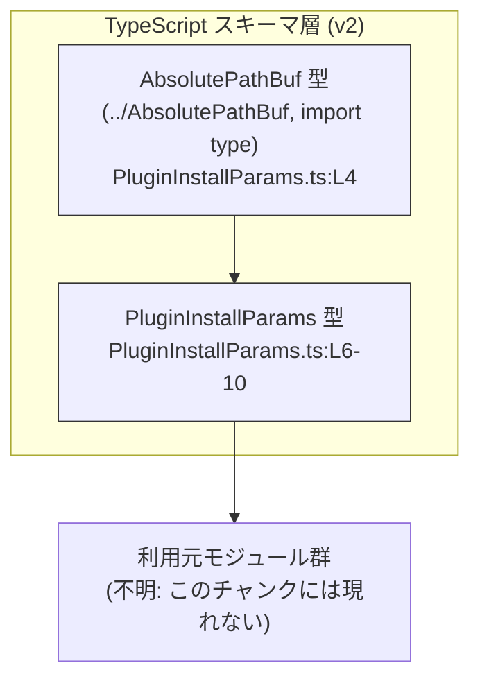
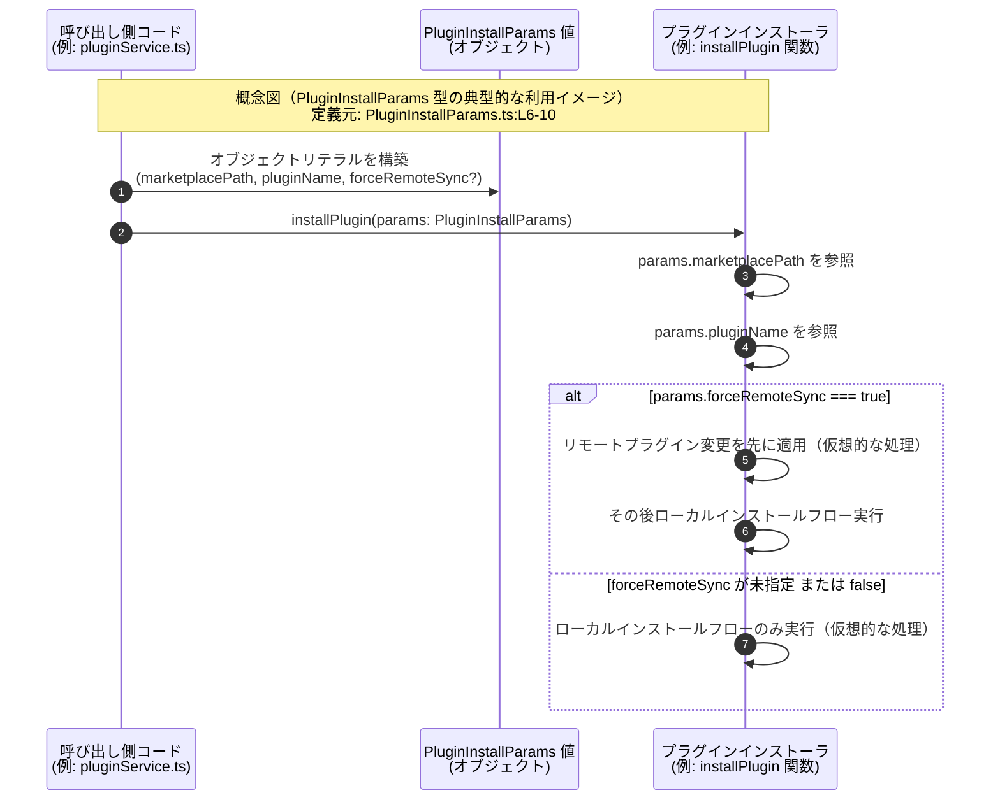

# app-server-protocol/schema/typescript/v2/PluginInstallParams.ts コード解説

## 0. ざっくり一言

`PluginInstallParams` 型を定義し、プラグインインストール処理に必要なパラメータ（マーケットプレイス上のパス・プラグイン名・リモート同期フラグ）を表現するための **型定義のみ** を提供するファイルです（`PluginInstallParams.ts:L4-10`）。

---

## 1. このモジュールの役割

### 1.1 概要

- このモジュールは、プラグインのインストール処理に渡されるパラメータの **構造（型）** を表現するために存在します。
- 実行時のロジック（インストール処理本体）は含まれておらず、あくまで TypeScript 側の **静的型付け情報** を提供します。
- コメントから、この型は Rust 側の構造体などから `ts-rs` によって自動生成されていることが分かります（`PluginInstallParams.ts:L1-3`）。

### 1.2 アーキテクチャ内での位置づけ

このモジュールは、`AbsolutePathBuf` 型（おそらく「絶対パス」を表す型）を利用して、プラグインのマーケットプレイス上のパスを型安全に扱うための中間レイヤとして位置づけられています。

- 依存関係（このチャンクから分かる範囲）



- `PluginInstallParams` は `AbsolutePathBuf` に依存します（型 import のみ）。
- この型を **どのモジュールが利用しているか** は、このチャンクには現れないため不明です。

### 1.3 設計上のポイント

- **自動生成コード**  
  - 先頭コメントにより、このファイルは `ts-rs` により生成されていることが明示されています（`PluginInstallParams.ts:L1-3`）。
  - 手動編集は想定されていません。
- **型のみ（type-only import と type alias）**  
  - `import type` により `AbsolutePathBuf` を型としてのみ読み込んでおり、実行時には参照されません（`PluginInstallParams.ts:L4`）。
  - `export type ... = { ... }` でオブジェクト型をエイリアスとして公開しています（`PluginInstallParams.ts:L6-10`）。
- **オプショナルプロパティ**  
  - `forceRemoteSync?: boolean` により、「指定されるかもしれない」真偽値フラグとして設計されています（`PluginInstallParams.ts:L8-10`）。
  - 利用側では `boolean | undefined` として扱う必要があります（`strictNullChecks` が有効な前提）。

---

## 2. 主要な機能一覧

本ファイルは **関数やクラスは持たず、1 つの型エイリアスのみ** を提供します。

- `PluginInstallParams`: プラグインインストール時のパラメータを収めるオブジェクト型

---

## 3. 公開 API と詳細解説

### 3.1 型一覧（構造体・列挙体など）

| 名前                 | 種別        | 役割 / 用途                                                                                       | 根拠 |
|----------------------|-------------|----------------------------------------------------------------------------------------------------|------|
| `AbsolutePathBuf`    | 型（外部）  | 絶対パスを表す型。プラグインマーケットプレイス上のパスとして利用される。定義は別ファイルに存在。 | `PluginInstallParams.ts:L4` |
| `PluginInstallParams`| 型エイリアス| プラグインインストール処理に必要なパラメータをまとめたオブジェクト型。                           | `PluginInstallParams.ts:L6-10` |

`AbsolutePathBuf` の内部構造はこのチャンクには現れないため不明です。

#### `PluginInstallParams` 型の構造

```ts
export type PluginInstallParams = {
    marketplacePath: AbsolutePathBuf;
    pluginName: string;
    /**
     * When true, apply the remote plugin change before the local install flow.
     */
    forceRemoteSync?: boolean;
};
```

- `marketplacePath: AbsolutePathBuf`  
  プラグインが存在するマーケットプレイス上の絶対パスを表すプロパティです（`PluginInstallParams.ts:L6`）。
- `pluginName: string`  
  インストール対象のプラグイン名を表します（`PluginInstallParams.ts:L6`）。
- `forceRemoteSync?: boolean`  
  true の場合、ローカルインストールフローの前にリモート側のプラグイン変更を適用する、という意味のフラグとしてコメントが付与されています（`PluginInstallParams.ts:L7-9`）。  
  プロパティは「オプショナル」であり、省略される可能性があります（`PluginInstallParams.ts:L10`）。

### 3.2 関数詳細

このファイルには関数が定義されていないため、「関数詳細」セクションは **型の契約と利用上の注意点** の補足に置き換えます。

#### `PluginInstallParams` の契約（Contract）

**概要**

- プラグインインストール処理に渡されるパラメータオブジェクトの **最低限満たすべき構造** を表現します。
- 実際のインストール処理は別モジュールで実装される前提です（このチャンクには現れません）。

**フィールド**

| フィールド名        | 型                 | 必須/任意 | 説明 |
|---------------------|--------------------|-----------|------|
| `marketplacePath`   | `AbsolutePathBuf`  | 必須      | プラグインが配置されているマーケットプレイス上の絶対パス。 |
| `pluginName`        | `string`           | 必須      | インストール対象プラグインの名前。 |
| `forceRemoteSync`   | `boolean`          | 任意      | true の場合、ローカルインストールより前にリモートのプラグイン変更を適用するフラグ（コメント由来）。 |

**戻り値**

- 型であり、関数ではないため戻り値の概念はありません。

**内部処理の流れ**

- 実行時処理は存在せず、コンパイル時の型チェックのみ行われます。

**Examples（使用例）**

以下は、この型を利用する典型的な TypeScript コード例です（例であり、このチャンクには現れません）。

```ts
import type { PluginInstallParams } from "./schema/typescript/v2/PluginInstallParams";  // 型のインポートのみ

// プラグインインストール用の関数（例）
async function installPlugin(params: PluginInstallParams): Promise<void> {  // params に型を付けている
    // marketplacePath, pluginName は必須なので必ず存在する
    console.log("Installing plugin:", params.pluginName);
    console.log("From marketplace path:", params.marketplacePath);

    // forceRemoteSync は boolean | undefined なので厳密にはチェックが必要
    if (params.forceRemoteSync === true) {                 // true のときだけ特別な処理を行う
        // ここでリモートのプラグイン同期を先に行う（仮想的な処理）
    }

    // ここでローカルのインストール処理を行う（仮想的な処理）
}

// 呼び出し例
const params: PluginInstallParams = {
    marketplacePath: "/marketplace/plugins/example",       // AbsolutePathBuf を string で表した例（実際の型は別ファイルに依存）
    pluginName: "example-plugin",                          // プラグイン名
    forceRemoteSync: true,                                 // リモート同期を優先したい場合
};
installPlugin(params);
```

**Errors / Panics**

- このファイル単体には実行時コードが存在しないため、直接的なエラー発生箇所はありません。
- 利用側では、主に次のような型関連のエラーが発生し得ます（TypeScript コンパイル時）:
  - `marketplacePath` や `pluginName` を指定し忘れた場合に、必須プロパティ不足の型エラー。
  - `forceRemoteSync` に `string` など `boolean` 以外を渡した場合の型エラー。

**Edge cases（エッジケース）**

- `forceRemoteSync` が省略される場合  
  - 型としては `boolean | undefined` になり得ます。  
  - 利用側のコードが `if (params.forceRemoteSync)` のように書かれていると、`undefined` の場合は `false` とみなされる動きになります。
- `AbsolutePathBuf` の実体  
  - このチャンクには定義がないため、どのような形式の値を期待するかは不明です。  
  - 文字列として扱うのか、独自のクラス/オブジェクトなのかは `../AbsolutePathBuf` の実装に依存します。

**使用上の注意点**

- `forceRemoteSync` はオプショナルであるため、利用側では必ず `undefined` の可能性を意識する必要があります（`forceRemoteSync === true` など明示的な比較が安全です）。
- このファイルは自動生成されているため、**手動で修正しても再生成で上書きされる** 可能性があります。Rust 側の元定義を変更して `ts-rs` で再生成するのが前提と考えられます（コメントより、ただし元定義はこのチャンクには現れません）。

### 3.3 その他の関数

- 本ファイルには関数が存在しません。

---

## 4. データフロー

このファイルには実行時ロジックがないため、**実際のランタイムデータフローは定義されていません**。  
以下の sequence diagram は、`PluginInstallParams` 型が **どのように使われ得るかの概念的な例** です（利用元モジュール名などは仮想的なものです）。



この図で示した `installPlugin` やインストールフロー自体は **このチャンクには存在せず、あくまで利用イメージ** です。

---

## 5. 使い方（How to Use）

### 5.1 基本的な使用方法

このモジュールを利用する典型的なコードフローは、次のようになります（例であり、このチャンクには現れません）。

```ts
// 型定義のインポート（型のみなので import type を推奨）
import type { PluginInstallParams } from "./schema/typescript/v2/PluginInstallParams";

// 何らかのインストール処理を行う関数（例）
async function runInstall(params: PluginInstallParams): Promise<void> {
    // 型のおかげで marketplacePath, pluginName が必ず存在することが保証される
    console.log("Install from:", params.marketplacePath);
    console.log("Plugin name:", params.pluginName);

    if (params.forceRemoteSync === true) {
        // リモート同期を優先する処理（仮想的な処理）
    }

    // ローカルインストール処理（仮想的な処理）
}

// 呼び出し側
const params: PluginInstallParams = {
    marketplacePath: "/absolute/path/to/plugin",  // 実際には AbsolutePathBuf 型に合わせる必要がある
    pluginName: "my-plugin",
    // forceRemoteSync を省略すると undefined 相当になる
};

runInstall(params);
```

### 5.2 よくある使用パターン

1. **`forceRemoteSync` を true で明示するパターン**

```ts
const params: PluginInstallParams = {
    marketplacePath: "/marketplace/plugins/foo",
    pluginName: "foo",
    forceRemoteSync: true,         // リモート変更を必ず先に適用したい場合
};
```

1. **`forceRemoteSync` を指定しない（デフォルト動作に任せる）パターン**

```ts
const params: PluginInstallParams = {
    marketplacePath: "/marketplace/plugins/bar",
    pluginName: "bar",
    // forceRemoteSync は省略。利用側で undefined を false 同等として扱うかは実装次第
};
```

1. **`forceRemoteSync` を明示的に false にするパターン**

```ts
const params: PluginInstallParams = {
    marketplacePath: "/marketplace/plugins/baz",
    pluginName: "baz",
    forceRemoteSync: false,       // 誤って true になるのを防ぐために false を明示する
};
```

### 5.3 よくある間違い

```ts
// 間違い例: オプショナルを boolean としてそのまま扱ってしまう
function install(params: PluginInstallParams) {
    if (params.forceRemoteSync) {     // 型は boolean | undefined なので、strictNullChecks 環境では警告が出る場合がある
        // ...
    }
}

// 正しい例: true のときだけ特別扱いする
function install(params: PluginInstallParams) {
    if (params.forceRemoteSync === true) {     // undefined と false を区別
        // ...
    }
}
```

```ts
// 間違い例: 必須プロパティを省略している
const badParams: PluginInstallParams = {
    pluginName: "foo",
    // marketplacePath がない → コンパイルエラー
};

// 正しい例: すべての必須プロパティを指定する
const goodParams: PluginInstallParams = {
    marketplacePath: "/marketplace/plugins/foo",
    pluginName: "foo",
};
```

### 5.4 使用上の注意点（まとめ）

- `forceRemoteSync` は **オプショナル** であり、利用側では `undefined` になり得ることを考慮する必要があります。
- `AbsolutePathBuf` の具体的な型に従って `marketplacePath` を構築する必要があります（このチャンクからは詳細不明）。
- このファイルは `ts-rs` による自動生成であるため、変更したい場合は **Rust 側の元定義** を修正して再生成するのが前提です（`PluginInstallParams.ts:L1-3`）。

---

## 6. 変更の仕方（How to Modify）

### 6.1 新しい機能を追加する場合

このファイルは「GENERATED CODE」と明記されているため（`PluginInstallParams.ts:L1-3`）、**直接変更することは推奨されません**。

一般的なフロー（コードから推測できる範囲）は次の通りです。

1. Rust 側の元となる型（構造体など）にフィールドを追加・変更する。  
   - この元定義の場所はこのチャンクには現れないため不明です。
2. `ts-rs` を実行し、TypeScript 側の定義を再生成する。
3. 生成された `PluginInstallParams` に新しいフィールドが反映される。
4. TypeScript 側の利用コードで、その新しいフィールドを使う。

### 6.2 既存の機能を変更する場合

- **影響範囲の確認**
  - `PluginInstallParams` 型を import しているすべての TypeScript ファイルが影響対象になります。
  - 利用箇所はこのチャンクには現れないため、エディタのリファレンス検索などで確認する必要があります。
- **契約の維持**
  - 必須プロパティを削除したり名前を変更すると、多数のコンパイルエラーが発生する可能性があります。
  - `forceRemoteSync` のオプショナル性を変える（必須にする/削除する）場合、呼び出し元のコードがすべて修正対象になります。
- **テスト**
  - 型定義自体はテスト対象になりにくいため、`PluginInstallParams` を受け取る関数・メソッドのテストで挙動を確認するのが一般的です。

---

## 7. 関連ファイル

| パス                                       | 役割 / 関係 |
|-------------------------------------------|-------------|
| `app-server-protocol/schema/typescript/v2/AbsolutePathBuf.ts` | `AbsolutePathBuf` 型の定義が存在すると推測されるファイル。`PluginInstallParams` の `marketplacePath` が依存する（`PluginInstallParams.ts:L4`）。実際の内容はこのチャンクには現れません。 |

※ 利用元のモジュール（`installPlugin` など）はこのチャンクには現れないため不明です。
