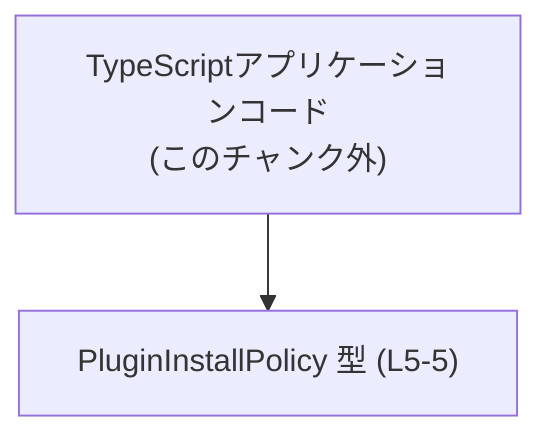
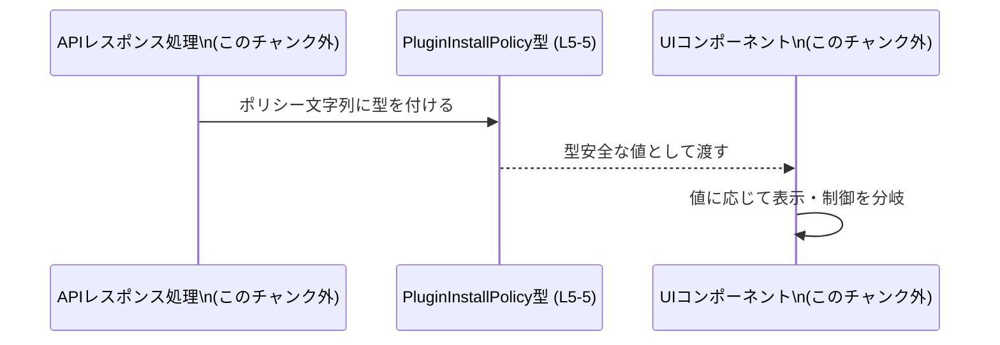

# app-server-protocol/schema/typescript/v2/PluginInstallPolicy.ts コード解説

## 0. ざっくり一言

- プラグインのインストールポリシー（インストール可否やデフォルト状態）を、3 種類の文字列リテラルで表現する TypeScript の型エイリアスです（`PluginInstallPolicy.ts:L5-5`）。
- ファイル先頭のコメントから、この型は `ts-rs` によって自動生成されており、手作業で編集しないことが明示されています（`PluginInstallPolicy.ts:L1-1`, `L3-3`）。

---

## 1. このモジュールの役割

### 1.1 概要

- このモジュールは、**プラグインがインストール可能かどうか、およびデフォルトでインストールされるかどうか**を表すための列挙的な型を提供します（`PluginInstallPolicy.ts:L5-5`）。
- 型は `"NOT_AVAILABLE" | "AVAILABLE" | "INSTALLED_BY_DEFAULT"` の 3 つの文字列リテラルのユニオン型として定義されており、許可された文字列以外を TypeScript コンパイラが静的に弾けるようになっています（`PluginInstallPolicy.ts:L5-5`）。
- 実行時のロジックや関数は一切含まれておらず、**型レベルの契約（contract）** のみを提供します。

### 1.2 アーキテクチャ内での位置づけ

- ファイルパス `app-server-protocol/schema/typescript/v2/` から、この型が「アプリケーションサーバのプロトコルスキーマ」の一部として利用される TypeScript 型定義であることが分かります（`PluginInstallPolicy.ts:L5-5`）。
- 実際にどのモジュールから参照されているかは、このチャンクには現れていませんが、**他の TypeScript コードからインポートされて利用される前提の公開型**になっています（`export type` で公開されているため, `PluginInstallPolicy.ts:L5-5`）。

この関係を簡略化した依存関係図を示します（アプリケーション側はこのチャンク外のコードです）。



> 図は「この型を他の TypeScript コードが参照する」という構造だけを表した概念図です。どの具体的なファイルが参照しているかは、このチャンクからは分かりません。

### 1.3 設計上のポイント

- **自動生成コード**  
  - ファイル先頭に「GENERATED CODE! DO NOT MODIFY BY HAND!」とあり（`PluginInstallPolicy.ts:L1-1`）、さらに `ts-rs` によって生成されたことがコメントされています（`PluginInstallPolicy.ts:L3-3`）。
  - 設計上、このファイルは**手作業で編集せず、元となるスキーマ定義から再生成する前提**になっています。
- **ユニオン型による表現**  
  - プラグインのインストールポリシーを、`"NOT_AVAILABLE" | "AVAILABLE" | "INSTALLED_BY_DEFAULT"` の文字列ユニオンで表現しています（`PluginInstallPolicy.ts:L5-5`）。
  - これにより、任意の文字列ではなく**3 種類に限定された値だけが許容される**ようになります（型安全性）。
- **状態管理のための純粋な型**  
  - 実行時の状態や副作用は一切持たず、コンパイル時の型チェックのみに利用される純粋な型定義です（`PluginInstallPolicy.ts:L5-5`）。
- **エラーハンドリング・並行性**  
  - 関数や実行時処理が存在しないため、このファイル単独ではエラーハンドリングや並行性に関わるロジックはありません。

---

## 2. 主要な機能一覧

このファイルが提供する機能（＝型レベルの機能）は次の 1 点に集約されます。

- `PluginInstallPolicy` 型: プラグインのインストールポリシーを 3 状態の文字列リテラルで表現する公開型（`PluginInstallPolicy.ts:L5-5`）

---

## 3. 公開 API と詳細解説

### 3.1 型一覧（構造体・列挙体など）

このチャンクに現れる公開型は 1 つです。

| 名前                 | 種別                     | 役割 / 用途                                                                                 | 定義位置                         |
|----------------------|--------------------------|----------------------------------------------------------------------------------------------|----------------------------------|
| `PluginInstallPolicy` | 型エイリアス（文字列ユニオン） | プラグインが「利用不可」「利用可能」「デフォルトインストール」のどれに当たるかを表す型        | `PluginInstallPolicy.ts:L5-5` |

#### `PluginInstallPolicy` の各値（命名から読み取れる意味）

※ 以下は文字列リテラルの命名からの解釈であり、実際のビジネスロジックはこのチャンクには現れていません。根拠はいずれも `PluginInstallPolicy.ts:L5-5` です。

- `"NOT_AVAILABLE"`  
  - 「プラグインを利用できない状態」を表す文字列として解釈できます。
- `"AVAILABLE"`  
  - 「プラグインは利用可能だが、必ずしもインストール済みとは限らない状態」を表す文字列として解釈できます。
- `"INSTALLED_BY_DEFAULT"`  
  - 「プラグインがデフォルトでインストールされる状態」を表す文字列として解釈できます。

### 3.2 関数詳細

- このファイルには関数・メソッド・クラスなどの**実行時に呼び出される API は一切定義されていません**（`PluginInstallPolicy.ts:L1-5` を通して確認できます）。
- そのため、「関数詳細」テンプレートに沿って説明できる対象はありません。

### 3.3 その他の関数

- 補助関数やラッパー関数も、このチャンクには存在しません（`PluginInstallPolicy.ts:L1-5`）。

---

## 4. データフロー

このファイル自体には関数や処理フローは存在しませんが、`PluginInstallPolicy` 型を使う典型的なデータフローの**利用イメージ**を示します。  
（あくまでこの型の想定される使い方の例であり、このリポジトリ内の実装を直接反映したものではありません。）

### 4.1 データフローの概要（想定例）

- API などで取得したプラグイン情報に「インストールポリシー」が含まれているとします。
- TypeScript コードは、そのフィールドに `PluginInstallPolicy` 型を付けることで、値が 3 状態のいずれかに限定されるようにします。
- UI コンポーネントやビジネスロジックは、その値に応じて表示や挙動を分岐します。



> この図は「PluginInstallPolicy がデータのラベル付け（型付け）として使われる」という一般的な利用イメージを示しています。具体的な呼び出し元・呼び出し先のファイル名やクラス名は、このチャンクには現れません。

---

## 5. 使い方（How to Use）

ここからは、`PluginInstallPolicy` 型を TypeScript コードで利用する典型的な例を示します。  
（すべて、この型の正しい使い方のサンプルであり、このリポジトリ内の既存コードをそのまま再現したものではありません。）

### 5.1 基本的な使用方法

`PluginInstallPolicy` をインポートし、関数の引数やオブジェクトのプロパティに型として付与する例です。

```typescript
// PluginInstallPolicy 型を型としてだけインポートする                       // 実際のパスはプロジェクト構成によって異なる
import type { PluginInstallPolicy } from "./PluginInstallPolicy";             // export type なので、import type が利用可能

// プラグイン情報を表す型を定義する                                          // PluginInstallPolicy をフィールドに使う
interface PluginInfo {                                                        // プラグインのメタ情報
    id: string;                                                               // プラグインID
    name: string;                                                             // プラグイン名
    installPolicy: PluginInstallPolicy;                                       // インストールポリシー（3状態のいずれか）
}

// インストールポリシーに応じて文言を返す関数                                 // 引数に PluginInstallPolicy を使う
function getInstallLabel(policy: PluginInstallPolicy): string {               // policy は 3 値のいずれか
    switch (policy) {                                                         // ユニオン型に対する switch
        case "NOT_AVAILABLE":                                                 // 利用不可の場合
            return "インストール不可";
        case "AVAILABLE":                                                     // 利用可能だがデフォルトではない場合
            return "インストール可能";
        case "INSTALLED_BY_DEFAULT":                                          // デフォルトでインストールされる場合
            return "デフォルトでインストール";
    }
}

// 具体的な値を使う例                                                          // 文字列リテラルは型チェックされる
const plugin: PluginInfo = {                                                  // PluginInfo 型の値を作る
    id: "example",                                                            // ID
    name: "Example Plugin",                                                   // 名前
    installPolicy: "AVAILABLE",                                               // 3 値のうちの 1 つを指定
};

console.log(getInstallLabel(plugin.installPolicy));                           // "インストール可能" が出力される
```

### 5.2 よくある使用パターン

#### パターン 1: API レスポンスの型付け

API から返ってくる JSON に `installPolicy` フィールドがある場合の型定義例です。

```typescript
import type { PluginInstallPolicy } from "./PluginInstallPolicy";             // 型をインポート

// API レスポンスの 1 要素を表す型                                            // installPolicy に PluginInstallPolicy を利用
type PluginResponseItem = {
    id: string;                                                               // プラグインID
    name: string;                                                             // プラグイン名
    installPolicy: PluginInstallPolicy;                                       // インストールポリシー
};

// レスポンス配列を受け取り UI 用にマッピングする関数                          // policy によってフラグを立てる
function toViewModel(item: PluginResponseItem) {                              // item は型付けされたレスポンス要素
    const isDefault = item.installPolicy === "INSTALLED_BY_DEFAULT";          // デフォルトインストールかどうかを判定
    const isInstallable = item.installPolicy !== "NOT_AVAILABLE";             // インストール可能かどうかを判定

    return {                                                                  // UI 用のオブジェクトを返す
        id: item.id,
        name: item.name,
        isDefault,
        isInstallable,
    };
}
```

#### パターン 2: 型ガード・補助関数

未知の文字列から安全に `PluginInstallPolicy` へ変換する補助関数の例です。  
（このような補助を実装しない限り、コンパイル時に型付けされていない文字列は実行時に自由な値を取り得ます。）

```typescript
import type { PluginInstallPolicy } from "./PluginInstallPolicy";             // 型をインポート

// 任意の文字列を受け取り、PluginInstallPolicy かどうか判定する型ガード関数       // 実行時に文字列の妥当性をチェック
function isPluginInstallPolicy(value: string): value is PluginInstallPolicy { // 戻り値型に value is ... を使う
    return value === "NOT_AVAILABLE"                                          // 3 値のいずれかかどうかを検査
        || value === "AVAILABLE"
        || value === "INSTALLED_BY_DEFAULT";
}
```

### 5.3 よくある間違い

#### 誤った文字列を代入する

```typescript
import type { PluginInstallPolicy } from "./PluginInstallPolicy";

let policy: PluginInstallPolicy;

// 間違い例: スペルミスした文字列を代入している
// policy = "NOT_AVAILBLE";   // コンパイルエラー: 型 '"NOT_AVAILBLE"' を 'PluginInstallPolicy' に割り当てられない

// 正しい例: 定義されているリテラルのみ使用する
policy = "NOT_AVAILABLE";      // OK
```

#### 型を `string` に広げてしまう

```typescript
import type { PluginInstallPolicy } from "./PluginInstallPolicy";

const policy: PluginInstallPolicy = "AVAILABLE";

// 間違い例: 一旦 string 型の変数に代入してしまい、型が緩くなる
// const tmp: string = policy;        // tmp は単なる string になり、別の文字列も入り得る

// 正しい例: PluginInstallPolicy 型のまま扱う
const samePolicy: PluginInstallPolicy = policy;  // 依然として 3 値に限定される
```

### 5.4 使用上の注意点（まとめ）

- **コンパイル時のみ有効な安全性**  
  - `PluginInstallPolicy` はあくまで TypeScript の型であり、**実行時には存在しません**。  
    外部から受け取った任意の文字列（JSON など）に対しては、上記のような実行時チェック（型ガード）を実装しない限り、不正な値を防ぐことはできません。
- **値の追加・変更は元スキーマが前提**  
  - ファイル冒頭のコメントにより、このファイルは自動生成であり手動編集が禁止されています（`PluginInstallPolicy.ts:L1-1`, `L3-3`）。  
    新しい値を追加したり既存値を変更する場合、このファイルを直接書き換えるのではなく、**元のスキーマ定義（おそらく Rust 側）を変更して再生成する必要**があります。
- **並行性への影響**  
  - このファイルは型定義のみであり、スレッドや Web Worker などの並行処理・非同期処理に関わるコードは含まれていません。  
    並行性の安全性は、この型を利用する側の実装に依存します。

---

## 6. 変更の仕方（How to Modify）

### 6.1 新しい機能（新しい値）を追加する場合

このファイル自体は自動生成であり、コメントにより「手作業で編集しないこと」が明示されています（`PluginInstallPolicy.ts:L1-1`, `L3-3`）。したがって、実際に変更を行う場合の一般的な流れは次のようになります。

1. **元スキーマの変更**  
   - `ts-rs` によって生成されていることから、元のスキーマは Rust 側の型定義である可能性が高いです（`PluginInstallPolicy.ts:L3-3` にある `ts-rs` の説明は一般知識に基づく）。  
   - そこに新しい状態（例: `"MANDATORY"` など）を追加します。  
   - このチャンクには元スキーマの場所が現れていないため、具体的なファイル名やパスは不明です。

2. **コード生成を再実行**  
   - `ts-rs` を使って TypeScript の型定義を再生成します。  
   - これにより、この `PluginInstallPolicy` 型に新しい文字列リテラルが自動的に追加されます。

3. **利用箇所の追従**  
   - TypeScript 側で `switch` 文などに `PluginInstallPolicy` を使っている場合、新しいケースをハンドリングする必要があります。  
   - コンパイラの「網羅性チェック（exhaustiveness check）」を利用して、抜け漏れを検出できます。

### 6.2 既存の機能を変更する場合

- **既存のリテラル値を変更する**  
  - 例えば `"AVAILABLE"` を `"OPTIONAL"` に変更すると、既存の TypeScript コードで `"AVAILABLE"` を使っている箇所がコンパイルエラーになります。  
  - これは**破壊的変更（breaking change）**であり、利用箇所の修正が必要です。
- **値を削除する**  
  - `"NOT_AVAILABLE"` を削除すると、その値を扱っていた分岐やロジックがコンパイルエラーになります。  
  - 状態そのものをなくす設計変更でない限り、代替のロジックやマイグレーション方針が必要です。
- **テストの影響**  
  - このチャンクにはテストコードは含まれておらず、関連するテストファイルも現れていません（`PluginInstallPolicy.ts:L1-5`）。  
  - 実際に変更を行う場合は、`PluginInstallPolicy` を前提にしたモジュールのテスト（このチャンク外）を確認する必要があります。

---

## 7. 関連ファイル

このチャンクから直接分かる情報は限られていますが、関連しうるファイル／ディレクトリについて整理します。

| パス                           | 役割 / 関係 |
|--------------------------------|------------|
| `app-server-protocol/schema/typescript/v2/PluginInstallPolicy.ts` | 本ファイルそのもの。`PluginInstallPolicy` 型を定義する自動生成の TypeScript スキーマ（`PluginInstallPolicy.ts:L1-5`）。 |
| （不明）                       | このチャンクには、`PluginInstallPolicy` を利用している他ファイルや、元となる Rust 側スキーマのパスは現れていません。「どのファイルがこの型を使っているか」「どこから生成されているか」は別チャンクまたは外部情報が必要です。 |

---

### まとめ

- `PluginInstallPolicy` は **3 つの文字列リテラルからなるユニオン型**であり、プラグインのインストールポリシー状態を型安全に表現するための公開 API です（`PluginInstallPolicy.ts:L5-5`）。
- ファイルは `ts-rs` による**自動生成コード**であり、手動編集は想定されていません（`PluginInstallPolicy.ts:L1-1`, `L3-3`）。
- 実行時ロジックやエラーハンドリング・並行性の制御は含まれず、純粋に**データ契約（contract）としての型**を提供するモジュールになっています。
