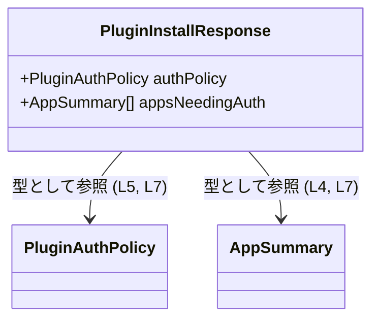
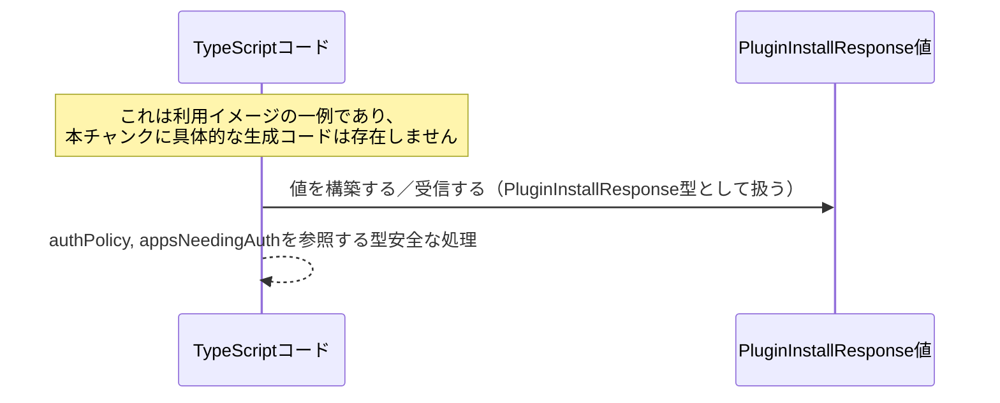

# app-server-protocol/schema/typescript/v2/PluginInstallResponse.ts

## 0. ざっくり一言

`PluginInstallResponse` という **プラグインインストール結果のレスポンス構造** を表す TypeScript の型定義ファイルです（生成コード）  
（PluginInstallResponse.ts:L1-3, L7-7）

---

## 1. このモジュールの役割

### 1.1 概要

- このファイルは、プラグインインストールに関連するレスポンスの型 `PluginInstallResponse` を定義します（PluginInstallResponse.ts:L7-7）。
- レスポンスは、
  - 認可ポリシー `authPolicy: PluginAuthPolicy`
  - 認証が必要なアプリ一覧 `appsNeedingAuth: Array<AppSummary>`
  の 2 プロパティからなるオブジェクトとして表現されます（PluginInstallResponse.ts:L4-5, L7-7）。
- ファイル冒頭のコメントから、この型定義は `ts-rs` によって自動生成されていることが分かります（PluginInstallResponse.ts:L1-3）。

### 1.2 アーキテクチャ内での位置づけ

- `PluginInstallResponse` は、`AppSummary` と `PluginAuthPolicy` という 2 つの型に依存しています（PluginInstallResponse.ts:L4-5, L7-7）。
- これらの依存は `import type` による **型専用インポート** であり、実行時の JavaScript にインポートが残らないことが TypeScript の仕様から分かります（PluginInstallResponse.ts:L4-5）。

型間の依存関係を Mermaid 図で示します。



> 補足: `PluginAuthPolicy` および `AppSummary` の中身は、このチャンクには現れません（PluginInstallResponse.ts:L4-5）。

### 1.3 設計上のポイント

- **自動生成コード**  
  - ファイル先頭コメントにより、このファイルは `ts-rs` によって生成されており、手動編集は想定されていないことが明示されています（PluginInstallResponse.ts:L1-3）。
- **型専用インポート**  
  - `import type` を用いることで、型情報のみを参照し、実行時バンドルからは除外されます（PluginInstallResponse.ts:L4-5）。
- **単純なオブジェクト型**  
  - `PluginInstallResponse` は 2 つの必須プロパティを持つ単一のオブジェクト型として定義されています（PluginInstallResponse.ts:L7-7）。
- **エラー・並行性**  
  - このファイルには関数・実行時ロジックが存在せず、エラー処理や並行処理に直接関わるコードは含まれていません（PluginInstallResponse.ts:L1-7）。

---

## 2. 主要な機能一覧

このモジュールが提供する機能は、型定義に限定されています。

- `PluginInstallResponse` 型: プラグインインストールレスポンスの構造（認可ポリシーと認証が必要なアプリ一覧）を表す（PluginInstallResponse.ts:L7-7）。

---

## 3. 公開 API と詳細解説

### 3.1 型一覧（構造体・列挙体など）

このファイルに定義・登場する主な型の一覧です。

| 名前                    | 種別                      | 定義/取得元                                     | 行範囲                                     | 役割 / 用途 |
|-------------------------|---------------------------|------------------------------------------------|--------------------------------------------|-------------|
| `PluginInstallResponse` | 型エイリアス（オブジェクト型） | `export type` により本ファイルで定義           | PluginInstallResponse.ts:L7-7              | 認可ポリシーと、認証が必要なアプリ一覧をまとめたレスポンス構造を表します。 |
| `PluginAuthPolicy`      | 型（詳細不明）           | `import type` により `./PluginAuthPolicy` から取得 | PluginInstallResponse.ts:L5-5, L7-7        | `authPolicy` プロパティの型として使われる認可ポリシー表現です（中身はこのチャンクには現れません）。 |
| `AppSummary`            | 型（詳細不明）           | `import type` により `./AppSummary` から取得   | PluginInstallResponse.ts:L4-4, L7-7        | `appsNeedingAuth` 配列要素の型として使われるアプリ概要表現です（中身はこのチャンクには現れません）。 |

#### `PluginInstallResponse` の構造

```typescript
export type PluginInstallResponse = {
    authPolicy: PluginAuthPolicy,
    appsNeedingAuth: Array<AppSummary>,
};
```

（PluginInstallResponse.ts:L7-7）

- `authPolicy: PluginAuthPolicy`  
  - 認可ポリシーを表す必須プロパティです（PluginInstallResponse.ts:L5, L7）。
- `appsNeedingAuth: Array<AppSummary>`  
  - `AppSummary` の配列で、認証が必要なアプリの情報を表す必須プロパティです（PluginInstallResponse.ts:L4, L7）。
  - TypeScript の型としては、空配列も許容されます。

### 3.2 関数詳細

このファイルには関数・メソッド定義は一切存在しません（PluginInstallResponse.ts:L1-7）。  
そのため、関数詳細テンプレートに基づいて解説すべき公開関数はありません。

### 3.3 その他の関数

- 該当なし（関数定義自体が存在しません）（PluginInstallResponse.ts:L1-7）。

---

## 4. データフロー

このファイルには実行時ロジックや関数呼び出しが含まれていないため、**静的な型レベルのデータ構造の流れ**のみが分かります。

- `PluginInstallResponse` は、2 つの外部型 `PluginAuthPolicy` と `AppSummary` を組み合わせた **複合オブジェクト** です（PluginInstallResponse.ts:L4-5, L7-7）。
- 実際にどの関数から生成され、どのようにシリアライズ／デシリアライズされるかは、このチャンクからは分かりません。

型の利用イメージとしてのシーケンス図（あくまで一般的な利用例であり、本チャンクから特定される具体的呼び出しではありません）を示します。



> 実際のデータフロー（どの API から返るか・どの層で使われるか）は、このファイル単体からは不明です。

---

## 5. 使い方（How to Use）

### 5.1 基本的な使用方法

`PluginInstallResponse` 型を用いて、プラグインインストールのレスポンスオブジェクトを型安全に扱う基本的な例です。

```typescript
// 他の型定義ファイルから型をインポートする                         // PluginInstallResponse, AppSummary, PluginAuthPolicy が定義されていると仮定
import type { PluginInstallResponse } from "./PluginInstallResponse";  // このファイル自身を別モジュールから参照する例
import type { PluginAuthPolicy } from "./PluginAuthPolicy";
import type { AppSummary } from "./AppSummary";

// 認可ポリシーを用意する（詳細構造は PluginAuthPolicy の定義に依存）  // 中身はこのチャンク外
const authPolicy: PluginAuthPolicy = /* ... */;

// 認証が必要なアプリ一覧を用意する                                  // AppSummary の配列
const appsNeedingAuth: AppSummary[] = [
    /* ... */
];

// PluginInstallResponse 型としてのレスポンスオブジェクトを構築する
const response: PluginInstallResponse = {
    authPolicy,                                                        // PluginAuthPolicy 型
    appsNeedingAuth,                                                   // AppSummary[] 型
};

// プロパティへアクセスする（TypeScript の型チェックが有効）
console.log(response.authPolicy);                                      // PluginAuthPolicy 型として扱われる
console.log(response.appsNeedingAuth.length);                          // AppSummary[] 型なので length が使用可能
```

- 2 つのプロパティは **いずれも必須** であり、欠けているとコンパイルエラーになります（PluginInstallResponse.ts:L7-7）。
- ランタイム上は JavaScript のオブジェクトであり、実行時型チェックは行われません（TypeScript の一般的な仕様）。

### 5.2 よくある使用パターン

このファイルから直接は分かりませんが、一般的には次のようなパターンが想定されます（あくまで利用イメージです）。

1. **API レスポンスの型注釈**

```typescript
async function installPlugin(/* ... */): Promise<PluginInstallResponse> {  // 戻り値として型を付ける
    const res = await fetch(/* ... */);
    const json = await res.json();
    return json as PluginInstallResponse;                                  // JSON を型アサーションで扱う
}
```

> 実際にこのような関数が存在するかは、このチャンクからは分かりません。

### 5.3 よくある間違い

`PluginInstallResponse` 型に対して起こりうる典型的な型レベルの誤り例です。

```typescript
import type { PluginInstallResponse } from "./PluginInstallResponse";

// 間違い例: 必須プロパティを省略している
const badResponse1: PluginInstallResponse = {
    // authPolicy がない -> コンパイルエラー                         // PluginInstallResponse.ts:L7-7 の必須プロパティに違反
    appsNeedingAuth: [],
};

// 間違い例: appsNeedingAuth の型が不正
const badResponse2: PluginInstallResponse = {
    authPolicy: /* PluginAuthPolicy 型の値 */ {} as any,
    appsNeedingAuth: {} as any,                                          // 配列ではなくオブジェクト -> コンパイルエラー
};

// 正しい例: 両方のプロパティを正しい型で指定する
const goodResponse: PluginInstallResponse = {
    authPolicy: {} as any,                                               // 実際には PluginAuthPolicy 型に従う必要あり
    appsNeedingAuth: [],                                                 // AppSummary[] として空配列も可
};
```

### 5.4 使用上の注意点（まとめ）

- **必須プロパティ**  
  - `authPolicy` と `appsNeedingAuth` は省略不可です（PluginInstallResponse.ts:L7-7）。
- **配列の内容**  
  - `appsNeedingAuth` は `Array<AppSummary>` のため、要素は必ず `AppSummary` 型であることが求められます（PluginInstallResponse.ts:L4, L7）。
- **静的型チェックのみ**  
  - TypeScript の型定義にとどまり、実行時には型情報が消えるため、受信データのバリデーションは別途行う必要があります（一般的な TypeScript の性質）。
- **並行性・エラー処理**  
  - この型自体は並行処理やエラー処理の仕組みを含まず、それらはこの型を利用する上位ロジック側の責任になります（PluginInstallResponse.ts:L1-7）。

---

## 6. 変更の仕方（How to Modify）

### 6.1 新しい機能を追加する場合

- ファイル先頭コメントに「GENERATED CODE! DO NOT MODIFY BY HAND!」とあるため、**このファイルを直接編集すべきではありません**（PluginInstallResponse.ts:L1-3）。
- この型にフィールドを追加・変更したい場合は、通常は
  - ts-rs が参照する元の定義（一般には Rust 側の型定義）や
  - ts-rs の設定  
  を変更し、再生成することが前提になります。
- 具体的にどのファイルを修正すべきかは、このチャンクからは分かりません（コメントには生成ツール名のみが記載されています）（PluginInstallResponse.ts:L1-3）。

### 6.2 既存の機能を変更する場合

- **影響範囲の確認**  
  - `PluginInstallResponse` を参照している TypeScript コード全体に影響するため、プロパティ名や型を変更するときは利用箇所を検索して確認する必要があります。
- **契約（前提条件）の維持**  
  - `authPolicy` と `appsNeedingAuth` が必須であるという契約を変更する場合（オプショナルにするなど）、クライアントコードが `undefined` を扱えるように修正されているかを確認する必要があります。
- **再生成の重要性**  
  - 手動でこのファイルを編集すると、次回の自動生成で上書きされる可能性が高いため、変更は元定義側に行う必要があります（PluginInstallResponse.ts:L1-3）。

---

## 7. 関連ファイル

このモジュールと密接に関係するファイル・ディレクトリ（このチャンクから参照が分かるもの）の一覧です。

| パス                                      | 役割 / 関係 |
|-------------------------------------------|-------------|
| `./AppSummary`                            | `AppSummary` 型の定義が含まれるモジュールです。`PluginInstallResponse.appsNeedingAuth` の要素型として参照されます（PluginInstallResponse.ts:L4, L7）。 |
| `./PluginAuthPolicy`                      | `PluginAuthPolicy` 型の定義が含まれるモジュールです。`PluginInstallResponse.authPolicy` の型として参照されます（PluginInstallResponse.ts:L5, L7）。 |
| Rust / ts-rs 側の元定義（パス不明）      | コメントから、この型定義は `ts-rs` によって生成されていることが分かりますが、元となるファイルパスや構造はこのチャンクには現れません（PluginInstallResponse.ts:L1-3）。 |

---

### バグ・セキュリティ・エッジケースに関する補足

- **バグ / セキュリティ**  
  - このファイルは純粋な型定義のみで、実行時処理を含まないため、このファイル単体から直接的なバグやセキュリティホールは読み取れません（PluginInstallResponse.ts:L1-7）。
  - ただし、TypeScript 型と実際の送受信データが不整合な場合は、実行時エラーや検証漏れにつながる可能性があるため、上位層でのバリデーションが重要です（一般的な注意点）。
- **エッジケース**  
  - `appsNeedingAuth` は空配列も許容されるため、「認証が必要なアプリが 0 件」のケースを表現できます（PluginInstallResponse.ts:L7-7）。このときの意味付けはこのチャンクからは分かりません。
  - `null` や `undefined` は型上許可されていないため、それらを含む値は TypeScript のコンパイル時エラーになりますが、実行時にそのような値が来る可能性は別途考慮が必要です。
