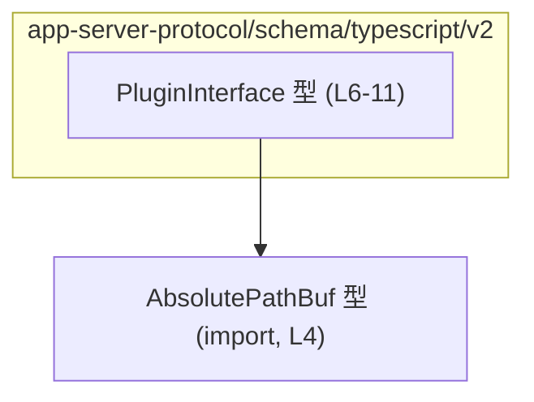
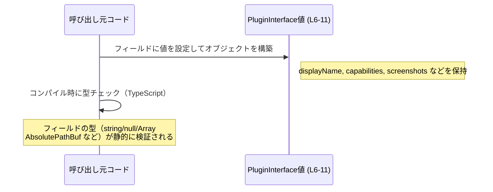

# app-server-protocol\schema\typescript\v2\PluginInterface.ts コード解説

## 0. ざっくり一言

`PluginInterface.ts` は、プラグインのメタデータと UI 表示用情報をまとめた **型定義（TypeScript の型エイリアス）** を公開するファイルです（`PluginInterface.ts:L6-11`）。  
この型は生成コードであり、コメントにある通り **手動で編集しない前提** になっています（`PluginInterface.ts:L1-3`）。

---

## 1. このモジュールの役割

### 1.1 概要

- このモジュールは、プラグインに関する基本情報・表示情報・リンク情報などをひとまとめにした **`PluginInterface` 型** を提供します（`PluginInterface.ts:L6-11`）。
- 画像パスなどには、専用の `AbsolutePathBuf` 型を利用することで、パス表現を統一する設計になっています（`PluginInterface.ts:L4, L11`）。
- コード全体は `ts-rs` により生成されており、型定義のソースは別の場所（生成元）に存在します（`PluginInterface.ts:L1-3`）。

### 1.2 アーキテクチャ内での位置づけ

このファイル内で確認できる依存関係は、`PluginInterface` が `AbsolutePathBuf` 型を利用していることだけです。



- `AbsolutePathBuf` の実体はこのチャンクには現れず、`../AbsolutePathBuf` から型としてのみインポートされています（`PluginInterface.ts:L4`）。
- 他のモジュールから `PluginInterface` がどのように利用されているかは、このチャンクには現れません（不明）。

### 1.3 設計上のポイント

コードから読み取れる設計上の特徴は次の通りです。

- **手動変更禁止の生成コード**  
  - 冒頭コメントで「GENERATED CODE」「Do not edit this file manually」と明示されています（`PluginInterface.ts:L1-3`）。
- **データ保持専用の構造**  
  - 関数やメソッドは存在せず、フィールドのみのプレーンなデータ構造です（`PluginInterface.ts:L6-11`）。
- **null を用いたオプショナル表現**  
  - 多くのテキストフィールドは `string | null` で表現されており、「値が存在しない」状態を `null` で表す契約になっています（`PluginInterface.ts:L6, L11`）。
- **配列とコメントによる制約表現**  
  - `capabilities` や `screenshots` は必須の配列です（`PluginInterface.ts:L6, L11`）。
  - `defaultPrompt` には「最大 3 件・1 件 128 文字まで」というコメント上の制約がありますが、型システムでは表現されていません（`PluginInterface.ts:L7-10`）。
- **パス型の分離**  
  - 画像やアイコンなどのパスには `AbsolutePathBuf` 型を使用し、文字列パスとその他の文字列を区別しています（`PluginInterface.ts:L4, L11`）。

---

## 2. 主要な機能一覧

このファイルは関数を持たず、`PluginInterface` 型のみを提供します。  
主要な「機能」は、型の各フィールドが表す情報とみなせます。

- `PluginInterface`: プラグインの表示名・説明・開発者名・カテゴリ・機能一覧・各種 URL・プロンプト・ブランドカラー・アイコン／ロゴ画像パス・スクリーンショットパスを保持するデータ構造（`PluginInterface.ts:L6-11`）。

---

## 3. 公開 API と詳細解説

### 3.1 型一覧（構造体・列挙体など）

このチャンクに現れる公開型は 1 つです。

| 名前              | 種別        | 役割 / 用途                                                                                          | 定義位置                    |
|-------------------|-------------|------------------------------------------------------------------------------------------------------|-----------------------------|
| `PluginInterface` | 型エイリアス | プラグインの基本情報・説明文・URL・アイコン・スクリーンショットなど、UI やメタデータに必要な情報を保持 | `PluginInterface.ts:L6-11` |

補助的に利用される型（他ファイル定義）:

| 名前             | 種別   | 役割 / 用途                                              | 参照位置               |
|------------------|--------|----------------------------------------------------------|------------------------|
| `AbsolutePathBuf` | 型（詳細不明） | 画像やアイコンのパスを表す型。詳細は別ファイルに定義されている | `PluginInterface.ts:L4` |

> `AbsolutePathBuf` の具体的な中身はこのチャンクには現れません。名前からは「絶対パスを表す型」と推測できますが、定義がないため断定はできません。

#### `PluginInterface` フィールド一覧

`PluginInterface` は次のフィールドを持つオブジェクト型です（`PluginInterface.ts:L6-11`）。

| フィールド名              | 型                         | 必須/任意      | 説明                                                                                                              |
|---------------------------|----------------------------|----------------|-------------------------------------------------------------------------------------------------------------------|
| `displayName`             | `string \| null`           | 任意 (`null`)  | プラグインの表示名。`null` の場合、名前が未設定または別の箇所から補われることを許す設計です。                   |
| `shortDescription`        | `string \| null`           | 任意           | 短い説明文（概要）。UI 等で簡易表示に使われることを想定できますが、このチャンクからの断定はできません。        |
| `longDescription`         | `string \| null`           | 任意           | 詳細な説明文。                                                                                                   |
| `developerName`           | `string \| null`           | 任意           | 開発者名や組織名。                                                                                                |
| `category`                | `string \| null`           | 任意           | プラグインのカテゴリ名。                                                                                          |
| `capabilities`            | `Array<string>`            | 必須           | プラグインが提供する機能や権限などを表す文字列の配列。空配列が許容されるかどうかはこのチャンクからは不明です。 |
| `websiteUrl`              | `string \| null`           | 任意           | 公式サイト URL。                                                                                                   |
| `privacyPolicyUrl`        | `string \| null`           | 任意           | プライバシーポリシーの URL。                                                                                      |
| `termsOfServiceUrl`       | `string \| null`           | 任意           | 利用規約の URL。                                                                                                  |
| `defaultPrompt`           | `Array<string> \| null`    | 任意           | スタータープロンプト一覧。コメント上は「最大 3 件・1 件 128 文字まで」と記載（`L7-10`）されています。           |
| `brandColor`              | `string \| null`           | 任意           | ブランドカラー。CSS カラーコードなどの文字列表現を想定できますが、型上は単なる文字列です。                      |
| `composerIcon`            | `AbsolutePathBuf \| null`  | 任意           | プラグインのアイコン画像のパス。                                                                                  |
| `logo`                    | `AbsolutePathBuf \| null`  | 任意           | ロゴ画像のパス。                                                                                                  |
| `screenshots`             | `Array<AbsolutePathBuf>`   | 必須           | スクリーンショット画像のパス一覧。                                                                                |

### コンポーネントインベントリー（このチャンク）

| 種別   | 名前              | 説明                                        | 定義/使用位置                     |
|--------|-------------------|---------------------------------------------|----------------------------------|
| import | `AbsolutePathBuf` | 画像パスなどに使われる型（詳細は別ファイル） | `PluginInterface.ts:L4`          |
| type   | `PluginInterface` | プラグインのメタ情報を表現する型            | `PluginInterface.ts:L6-11`       |

### 3.2 関数詳細

このファイルには **関数定義は存在しません**（`PluginInterface.ts:L1-11` すべてを確認）。  
そのため、関数詳細テンプレートに基づいて解説すべき対象はありません。

### 3.3 その他の関数

- なし（このチャンクには関数・メソッド・クラスは現れません）。

---

## 4. データフロー

このファイル自体は型定義のみで、ロジックや処理フローは含みません。  
ここでは、「任意の呼び出し元コードが `PluginInterface` 型の値を構築して利用する」という **抽象的な利用イメージ** を示します。



- 実際にどのモジュールが `PluginInterface` を生成・受け渡ししているかは、このチャンクには現れません（不明）。
- データフロー上の重要点は、「`defaultPrompt` の件数・文字数制限はコメントでのみ表現されており、**型レベルでは強制されない**」ことです（`PluginInterface.ts:L7-10`）。

---

## 5. 使い方（How to Use）

### 5.1 基本的な使用方法

`PluginInterface` 型の値を直接リテラルで作成する基本例です。

```typescript
import type { PluginInterface } from "./PluginInterface";              // PluginInterface 型をインポートする
import type { AbsolutePathBuf } from "../AbsolutePathBuf";             // パス用の AbsolutePathBuf 型をインポートする

// AbsolutePathBuf 型の値を用意する（実際の生成方法は AbsolutePathBuf の定義側に依存します）
const screenshotPath: AbsolutePathBuf = /* ... */;                     // ここでは生成方法は不明なためコメントで表現

const plugin: PluginInterface = {                                      // PluginInterface 型のオブジェクトを構築
    displayName: "Sample Plugin",                                      // 表示名（null も許容）
    shortDescription: "短い説明",                                      // 短い説明（null も許容）
    longDescription: null,                                             // 詳細説明をまだ用意していない場合は null
    developerName: "Example Inc.",                                     // 開発者名
    category: "Productivity",                                          // カテゴリ名（任意の文字列）
    capabilities: ["search", "summarize"],                             // 機能を表す文字列配列（必須）
    websiteUrl: "https://example.com",                                 // Web サイト URL（null も許容）
    privacyPolicyUrl: null,                                            // プライバシーポリシー未設定
    termsOfServiceUrl: "https://example.com/terms",                    // 利用規約 URL
    defaultPrompt: ["最初の質問を入力してください"],                   // スタータープロンプト（null も許容）
    brandColor: "#ff6600",                                             // ブランドカラー（CSS カラーコードなど）
    composerIcon: null,                                                // アイコン未設定
    logo: null,                                                        // ロゴ未設定
    screenshots: [screenshotPath],                                     // スクリーンショットのパス一覧（空配列も型上は許可）
};
```

このコードのポイント:

- `PluginInterface` は「すべてのフィールドが必ず存在する」オブジェクト型ですが、多くのフィールドは `null` 選択肢を持つため、**null の扱い**に注意が必要です。
- `AbsolutePathBuf` の具体的な生成方法は、このチャンクには現れません（不明）。そのため例ではコメントで表現しています。

### 5.2 よくある使用パターン

#### パターン 1: 関数の引数として `PluginInterface` を受け取る

プラグイン情報を処理する関数の引数として利用するパターンです。

```typescript
import type { PluginInterface } from "./PluginInterface";              // PluginInterface をインポート

// PluginInterface 型の情報から、表示用のタイトル文字列を組み立てる
function formatPluginTitle(plugin: PluginInterface): string {          // 引数 plugin は PluginInterface 型
    const name = plugin.displayName ?? "Unnamed Plugin";               // displayName が null の場合のデフォルト名
    const developer = plugin.developerName ?? "Unknown Developer";     // developerName が null の場合のデフォルト表記
    return `${name} by ${developer}`;                                  // "名前 by 開発者" の形式で文字列を返す
}
```

- `string | null` 型のフィールドは、そのままでは `string` として扱えないため、`??`（null 合体演算子）などでのフォールバックが実用的です。
- TypeScript の null 安全性はコンパイル時にのみ検証され、実行時には別途チェックが必要な点は他のコードと同様です。

#### パターン 2: `defaultPrompt` の制約に配慮したセット

コメントで指定されている「最大 3 件・1 件 128 文字まで」を守る例です。

```typescript
import type { PluginInterface } from "./PluginInterface";              // PluginInterface をインポート

function createPluginWithPrompts(prompts: string[]): PluginInterface { // スタータープロンプト配列を受け取る
    const limitedPrompts = prompts.slice(0, 3).map(p => p.slice(0, 128)); // 最大 3 件、各 128 文字に切り詰める

    return {
        displayName: "Prompt Sample",                                  // 必須フィールドをすべて埋める
        shortDescription: null,
        longDescription: null,
        developerName: null,
        category: null,
        capabilities: [],                                              // 必須配列だが空配列を許容するかは仕様次第（このチャンクからは不明）
        websiteUrl: null,
        privacyPolicyUrl: null,
        termsOfServiceUrl: null,
        defaultPrompt: limitedPrompts,                                 // コメント上の制約をコードで担保する
        brandColor: null,
        composerIcon: null,
        logo: null,
        screenshots: [],                                               // スクリーンショット一覧（ここでは空）
    };
}
```

- コメント（`PluginInterface.ts:L7-10`）の制約は **型では表現されていない** ため、このように利用側コードでチェックする必要があります。

### 5.3 よくある間違い

このファイルから推測できる「起こりやすそうな誤用」の例です。

```typescript
import type { PluginInterface } from "./PluginInterface";

// 間違い例: null の可能性を考慮せずに string として扱っている
function badUsage(plugin: PluginInterface) {
    // plugin.displayName は string | null 型なので、
    // そのまま toUpperCase を呼び出すとコンパイルエラーになる可能性が高い
    // （strictNullChecks の設定に依存）
    // const upper = plugin.displayName.toUpperCase();                // ← 望ましくない書き方

    // 正しい例: null を考慮した上で扱う
    const upper =
        plugin.displayName !== null
            ? plugin.displayName.toUpperCase()
            : "UNNAMED PLUGIN";                                       // デフォルト文字列に置き換える
    console.log(upper);
}
```

```typescript
import type { PluginInterface } from "./PluginInterface";

// 間違い例: defaultPrompt の件数・文字数制限を無視している
const plugin: PluginInterface = {
    displayName: "Too Many Prompts",                                  // 他フィールドは省略
    shortDescription: null,
    longDescription: null,
    developerName: null,
    category: null,
    capabilities: [],
    websiteUrl: null,
    privacyPolicyUrl: null,
    termsOfServiceUrl: null,
    defaultPrompt: new Array(10).fill("x".repeat(1000)),               // コメントでの制約を大きく超えている
    brandColor: null,
    composerIcon: null,
    logo: null,
    screenshots: [],
};

// 型レベルでは許容されてしまうため、利用側で別途バリデーションを行う必要がある
```

- **ポイント**:
  - `string | null` をそのまま `string` として扱うのは型安全性の観点から誤りです。
  - `defaultPrompt` のドキュメント上の制約は型システムに反映されていないため、バリデーション抜けが起こりやすい構造になっています。

### 5.4 使用上の注意点（まとめ）

- **null の扱い**  
  - 多くのフィールドが `string | null` / `AbsolutePathBuf | null` です。利用側では必ず null チェックやデフォルト値設定が必要です。
- **配列フィールド**  
  - `capabilities` と `screenshots` は配列として必須ですが、空配列を許可するかどうかはこのチャンクからは分かりません。仕様側のドキュメントで確認する必要があります（不明）。
- **コメントと型の不一致**  
  - `defaultPrompt` の件数・文字数制限はコメントでのみ記載されており、型では表現されていません（`PluginInterface.ts:L7-10`）。  
    → 利用側コードで明示的なバリデーションを行わないと、仕様外の値が紛れ込む可能性があります。
- **生成コードであること**  
  - コメントに「Do not edit this file manually」とあるため（`PluginInterface.ts:L1-3`）、**直接編集は避ける**必要があります。変更は生成元の定義側で行う前提です。
- **並行性・スレッド安全性**  
  - TypeScript のプレーンなオブジェクト型であり、このファイルには非同期処理や共有状態は登場しません。  
    → 並行性の問題はこの型自体ではなく、利用側コードの設計に依存します。

---

## 6. 変更の仕方（How to Modify）

### 6.1 新しい機能を追加する場合

このファイルは `ts-rs` による生成コードであり、コメントで手動編集禁止が明示されています（`PluginInterface.ts:L1-3`）。  
そのため、「新しいフィールドを追加したい」といった変更は、**通常は生成元（おそらく Rust 側の型定義など）で行う必要があります**。

一般的な手順イメージ（このチャンクには生成元がないため、具体的なファイル名などは不明です）:

1. **生成元の型定義を探す**  
   - `ts-rs` を利用しているプロジェクトでは、多くの場合 Rust の構造体や型定義が生成元になりますが、どのファイルかはこのチャンクからは分かりません（不明）。
2. **生成元にフィールドを追加**  
   - 新しいメタ情報が必要な場合、生成元の型にフィールドを追加し、その型に `ts-rs` 用の属性を付与するなどの対応を行います。
3. **コード生成を再実行**  
   - `ts-rs` のビルド／コード生成を再実行し、この TypeScript ファイルを再生成します。
4. **利用側コードの追従**  
   - 新しいフィールドを利用する箇所で、`PluginInterface` の新フィールドにアクセスするよう修正します。

> このチャンクだけでは、`ts-rs` の設定や生成方法の詳細は分かりません。

### 6.2 既存の機能を変更する場合

既存のフィールドの型や意味を変更したい場合も、基本的な流れは 6.1 と同様に「生成元から変更する」ことになります。

注意点:

- **互換性の確認**  
  - `string | null` を `string` に変更するなどの破壊的変更は、既存の利用コードに影響します。  
    → 利用箇所のコンパイルエラーやランタイム挙動を確認する必要があります。
- **コメント（仕様）の更新**  
  - `defaultPrompt` の件数や文字数制限など、コメントで表現されている仕様を変更する場合は、生成元のコメント・ドキュメントも同時に更新する必要があります。
- **テスト**  
  - このチャンクにはテストに関する情報は一切含まれていません（不明）。  
    → プロジェクト側のテスト（もしあれば）で `PluginInterface` に関するテストケースを追加・更新する必要があります。

---

## 7. 関連ファイル

このチャンクから直接分かる関連ファイルは 1 つです。

| パス                       | 役割 / 関係                                                                 |
|----------------------------|------------------------------------------------------------------------------|
| `../AbsolutePathBuf`       | `AbsolutePathBuf` 型を提供するモジュール。`composerIcon`・`logo`・`screenshots` の型として利用されている（`PluginInterface.ts:L4, L11`）。 |

その他の関連ファイル（例: Rust 側の生成元、テストコードなど）は、このチャンクには現れません（不明）。

---
