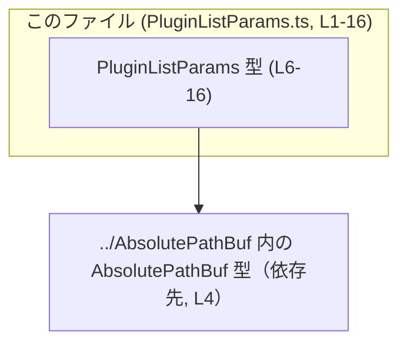
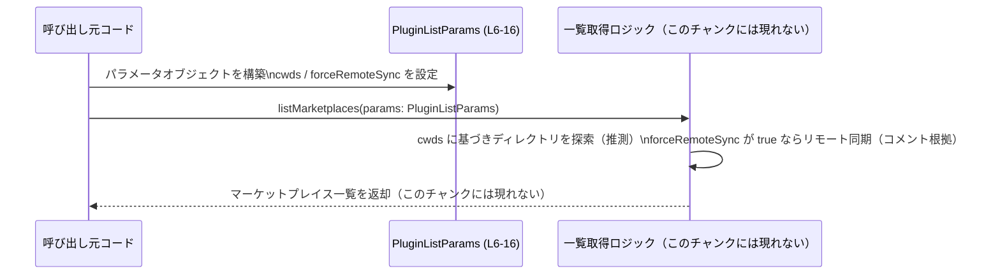

# app-server-protocol/schema/typescript/v2/PluginListParams.ts コード解説

## 0. ざっくり一言

`PluginListParams` は、プラグイン／マーケットプレイスの一覧取得処理に渡されるパラメータを表す **TypeScript の型定義**です（`PluginListParams.ts:L6-16`）。  
探索に使う作業ディレクトリと、リモート状態と同期するかどうかを指定できます。

---

## 1. このモジュールの役割

### 1.1 概要

- このモジュールは、プラグインマーケットプレイスを一覧取得する処理に対し、  
  「どのディレクトリを探索対象にするか」および「リモート状態と突き合わせるかどうか」を伝えるための **リクエストパラメータ型**を提供します（`PluginListParams.ts:L6-16`）。
- 実装ロジックは含まず、**型情報のみ**を提供する、純粋なスキーマ定義です。
- ファイル先頭コメントから、この型は Rust から `ts-rs` によって自動生成されていることが分かります（`PluginListParams.ts:L1-3`）。

### 1.2 アーキテクチャ内での位置づけ

- 依存関係として、このモジュールは `AbsolutePathBuf` 型を `../AbsolutePathBuf` からインポートしています（`PluginListParams.ts:L4`）。
- 逆に、このモジュールがどこから使われているかは、このチャンクには現れません。

依存関係のイメージは次の通りです。



この図は、`PluginListParams` が `AbsolutePathBuf` 型に依存していることだけを表し、  
`PluginListParams` をどのサービスや関数が利用しているかは、このチャンクからは不明です。

### 1.3 設計上のポイント

コードから読み取れる設計上の特徴は次の通りです。

- **自動生成コード**  
  - ファイル先頭コメントに「GENERATED CODE」「Do not edit this file manually」とあり、`ts-rs` により生成されていることが明記されています（`PluginListParams.ts:L1-3`）。
  - 元の設計の「真のソース」は Rust 側の型定義であると推測されますが、その定義自体はこのチャンクには現れません。

- **状態を持たないスキーマ定義**  
  - このファイルは型エイリアス `PluginListParams` のみを定義し（`PluginListParams.ts:L6-16`）、クラスや関数・実行時ロジックは一切含みません。
  - したがって、このモジュール単体では実行時の状態や副作用を持ちません。

- **オプショナルなフィールド設計**  
  - `cwds` は `Array<AbsolutePathBuf> | null` 型であり、さらに `?` によりオプショナルプロパティになっています（`PluginListParams.ts:L7-11`）。
  - `forceRemoteSync` もオプショナルな `boolean` です（`PluginListParams.ts:L12-16`）。
  - これにより、呼び出し側は必要な情報だけを指定し、省略した場合は利用側のデフォルト挙動に委ねる設計になっています。

- **言語固有の安全性・エラー・並行性**  
  - TypeScript の型定義のみであり、**コンパイル時の型安全性を高める目的のコード**です。  
    ここには実行時エラーや並行性に関するロジックは存在しません。
  - 実際のエラー処理やスレッド／イベントループに関する挙動は、この型を利用する別モジュールの実装に依存し、このチャンクからは分かりません。

---

## 2. 主要な機能一覧

このファイルは関数を持たないため、「機能」は `PluginListParams` 型のプロパティが表す意味として整理します。

- `cwds` による検索ディレクトリ指定:  
  プラグインマーケットプレイスを探索する「作業ディレクトリ」のリストを指定する機能（`PluginListParams.ts:L7-11`）。
- `forceRemoteSync` によるリモート同期制御:  
  一覧を出す前に、「公式マーケットプレイスの情報をリモート状態と突き合わせて同期するか」を指示するフラグ（`PluginListParams.ts:L12-16`）。

コメントから読み取れる機能の詳細:

- `cwds` が省略された場合は、「ホームスコープのマーケットプレイス」と「公式キュレーテッドマーケットプレイス」のみが対象になるとされています（`PluginListParams.ts:L7-10`）。
- `forceRemoteSync` が `true` の場合、一覧取得前に公式マーケットプレイスの状態をリモートプラグイン状態と突き合わせると説明されています（`PluginListParams.ts:L12-15`）。

---

## 3. 公開 API と詳細解説

### 3.1 型一覧（構造体・列挙体など）

#### このファイルで公開される型

| 名前               | 種別           | 役割 / 用途                                                                                                    | 定義位置                          |
|--------------------|----------------|-----------------------------------------------------------------------------------------------------------------|-----------------------------------|
| `PluginListParams` | 型エイリアス   | プラグイン／マーケットプレイス一覧処理に渡すパラメータ。探索ディレクトリとリモート同期フラグをまとめて保持する。 | `PluginListParams.ts:L6-16`       |

#### 依存している型（このファイル内には定義されない）

| 名前             | 種別 | 役割 / 用途                                          | 参照位置                          |
|------------------|------|-------------------------------------------------------|-----------------------------------|
| `AbsolutePathBuf`| 不明 | 絶対パスを表す型であることが名前から推測されますが、定義はこのチャンクには現れません。 | `PluginListParams.ts:L4, L11`    |

> `AbsolutePathBuf` の具体的な構造（string なのか、ラップされたオブジェクトなのか等）は、このチャンクには定義がないため不明です。

### 3.2 関数詳細

このファイルには **関数・メソッドは一切定義されていません**（`PluginListParams.ts:L1-16`）。  
したがって、関数詳細テンプレートに基づき解説すべき対象はありません。

### 3.3 その他の関数

- 該当なし（このチャンクには関数定義が存在しません）。

---

## 4. データフロー

ここでは、`PluginListParams` がどのようにデータとして流れるかを、コメントから読み取れる範囲で抽象的に説明します。

### 4.1 処理シナリオの概要

- 呼び出し元コードが、必要に応じて `cwds` と `forceRemoteSync` を設定した `PluginListParams` オブジェクトを生成します（`PluginListParams.ts:L6-16`）。
- そのオブジェクトが「マーケットプレイス一覧取得ロジック」に渡され、  
  - `cwds` に基づいてどのディレクトリを探索するか、
  - `forceRemoteSync` が `true` ならリモート状態と同期するかどうか  
  といった挙動を制御します（`PluginListParams.ts:L7-15`）。
- 一覧ロジック自体の実装はこのチャンクには現れません。

### 4.2 シーケンス図（概念図）

実際の関数名・モジュール名はこのチャンクからは不明なため、抽象的な名前で表現します。



> 注意: `listMarketplaces` という関数名や戻り値の具体的な型は、このチャンクには登場しないため仮の名称です。  
> 実際の API 名やデータ構造は別ファイルを確認する必要があります。

---

## 5. 使い方（How to Use）

### 5.1 基本的な使用方法

`PluginListParams` は単なる型エイリアスなので、通常のオブジェクトリテラルとして値を構築します。

```typescript
import type { PluginListParams } from "./PluginListParams";      // このファイルから型をインポートする（パスは利用側に応じて変更）
import type { AbsolutePathBuf } from "../AbsolutePathBuf";       // 作業ディレクトリの型

// 公式マーケットプレイスと、特定ディレクトリ配下のマーケットプレイスを探索する例
const params: PluginListParams = {
    // cwds を指定することで、追加のリポジトリマーケットプレイスを探索できる（L7-11 のコメントを根拠）
    cwds: [
        "/repos/marketplace1" as unknown as AbsolutePathBuf,     // AbsolutePathBuf の具体的な構造は不明なため、ここでは型アサーションで記述
        "/repos/marketplace2" as unknown as AbsolutePathBuf,
    ],
    // true にすると、公式キュレーテッドマーケットプレイスをリモート状態と突き合わせた上で一覧を得られる（L12-15）
    forceRemoteSync: true,
};

// （仮想コード）どこかの一覧取得関数に渡すイメージ
// const marketplaces = await listMarketplaces(params);
```

> `AbsolutePathBuf` の実際の値の作り方は、このチャンクには定義がないため不明です。例では `as unknown as AbsolutePathBuf` を用いていますが、実際には `AbsolutePathBuf` を生成するユーティリティ関数等を利用する想定です。

### 5.2 よくある使用パターン

1. **最小指定（デフォルト探索のみ）**

```typescript
const params: PluginListParams = {
    // 何も指定しないことで、ホームスコープ＋公式キュレーテッドマーケットプレイスのみが対象になる（L7-10）
};
```

この場合、`cwds`・`forceRemoteSync` ともに未指定 (`undefined`) です。  
コメントは `cwds` が省略された場合の挙動のみ説明しており、`forceRemoteSync` 省略時の挙動はこのチャンクには現れません。

1. **ローカルディレクトリのみ探索したい場合（推定例）**

```typescript
const params: PluginListParams = {
    cwds: [
        "/custom/marketplaces" as unknown as AbsolutePathBuf,
    ],
    // forceRemoteSync を省略または false にすることで、同期コストを抑えたい利用ケースが想定されますが、
    // 実際の挙動はこのチャンクには現れません。
};
```

> `cwds` に値を与えた場合に「ホームスコープや公式マーケットプレイスも含まれるかどうか」はコメントからは読み取れません。  
> この点は利用側の実装を確認する必要があります。

### 5.3 よくある間違い（想定しうる誤用）

コードから推測できる、起こり得そうな型レベルの誤用例です。

```typescript
// 誤り例: cwds に string を直接入れる（AbsolutePathBuf を要求しているので型不一致）
const badParams1: PluginListParams = {
    // TypeScript ではコンパイルエラーになる想定（L11）
    // cwds: ["/path/to/repo"],
};

// 正しい例: AbsolutePathBuf 型として扱う
const goodParams1: PluginListParams = {
    cwds: ["/path/to/repo" as unknown as AbsolutePathBuf],
};
```

```typescript
// 誤り例: プロパティ名の綴りを間違える
const badParams2: PluginListParams = {
    cwd: null,     // 'cwds' が正しいプロパティ名（L11）
};

// 正しい例
const goodParams2: PluginListParams = {
    cwds: null,
};
```

### 5.4 使用上の注意点（まとめ）

- **オプショナル + null の二重表現に注意**  
  - `cwds?: Array<AbsolutePathBuf> | null` という型のため、呼び出し側は少なくとも3パターンを作り得ます（`PluginListParams.ts:L7-11`）。
    - プロパティ自体を省略 (`cwds` が `undefined`)
    - `cwds: null`
    - `cwds: []`（空配列）
  - コメントが説明しているのは「省略された場合」の挙動だけです（`PluginListParams.ts:L7-10`）。  
    `null` や空配列の意味付けは、このチャンクには現れないため、利用側の実装と合意しておく必要があります。

- **`forceRemoteSync` が未指定の場合の扱い**  
  - コメントは「When true, ...」としか書いておらず（`PluginListParams.ts:L12-15`）、`false` や `undefined` のときの挙動は不明です。
  - 「同期したいときだけ `true` を明示し、それ以外は未指定にする」など、自分たちのコードベースでの運用ルールを決めておくと、読みやすくなります。

- **言語安全性・並行性**  
  - この型は **コンパイル時の型安全性** を提供するだけで、実行時エラーや並行性に直接影響するコードは含みません。
  - 実際の I/O、ネットワークアクセス、並列処理などに関する安全性は、この型を利用する処理側に依存します（このチャンクには現れません）。

- **セキュリティ面**  
  - この型自体には処理はなく、セキュリティ上の脆弱性は直接は含まれません。
  - ただし `cwds` の値によって、どのディレクトリが探索対象になるかが変わるため、探索対象ディレクトリの権限・内容次第ではセキュリティに影響しうる設計です。  
    これはこの型の利用方法に依存し、このチャンクから具体的な危険性を特定することはできません。

---

## 6. 変更の仕方（How to Modify）

### 6.1 新しい機能を追加する場合

このファイルは `ts-rs` による自動生成コードであり、先頭に「DO NOT MODIFY BY HAND」と明示されています（`PluginListParams.ts:L1-3`）。  
したがって、**直接このファイルを編集することは前提とされていません**。

新しいフィールドを追加したい場合の一般的な流れは次の通りです（このチャンク外の情報を前提とするため、抽象的な記述になります）。

1. **Rust 側の元となる型定義を変更する**  
   - `ts-rs` がどの Rust 型からこの TypeScript 型を生成しているかは、このチャンクには現れませんが、一般的には対応する Rust 構造体にフィールドを追加します。
2. **コード生成を再実行する**  
   - `ts-rs` で TypeScript スキーマの再生成を行います。
3. **利用箇所の修正**  
   - 追加したフィールドを利用する TypeScript コードを必要に応じて更新します。

### 6.2 既存の機能を変更する場合

- **フィールド名や型を変えたい場合**  
  - こちらも Rust 側の型定義を変更し、`ts-rs` によるコード生成を再実行する必要があります（`PluginListParams.ts:L1-3`）。
- **影響範囲の確認**  
  - `PluginListParams` を使っている全ての呼び出し元で、コンパイル時にエラーになる可能性があります。  
    TypeScript コンパイラのエラーを起点に、影響箇所を洗い出すのが基本になります。
- **契約（前提条件）の維持**  
  - コメントが示す仕様（`cwds` 省略時の挙動など、`PluginListParams.ts:L7-10`）と実装が乖離しないよう注意が必要です。
  - 仕様を変更する場合は、コメントも合わせて更新する必要があります。

---

## 7. 関連ファイル

このモジュールと直接関係するファイルは、インポート行から次のものが読み取れます。

| パス                 | 役割 / 関係                                                                                 |
|----------------------|----------------------------------------------------------------------------------------------|
| `../AbsolutePathBuf` | `AbsolutePathBuf` 型の定義を提供し、`cwds` プロパティの要素型として利用されています（L4, L11）。 |

その他、この型を利用している具体的なサービス・ハンドラ・テストコードなどは、このチャンクには現れません。  
そのため、より詳しいデータフローや実際の API の形を把握するには、`PluginListParams` をインポートしているファイルを検索する必要があります。
