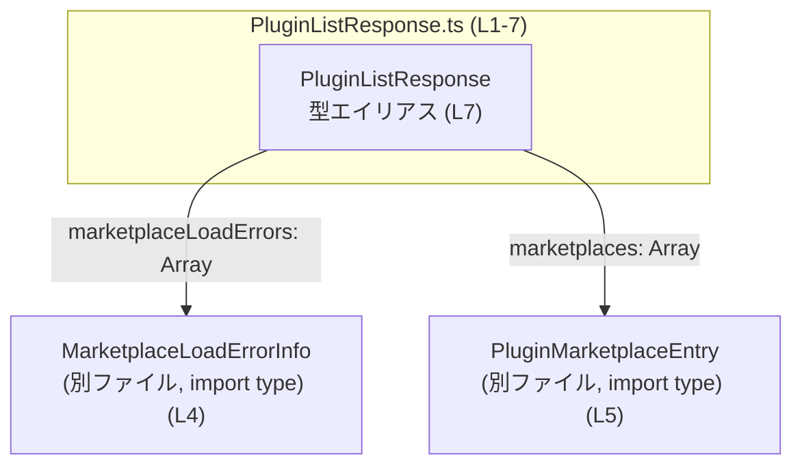
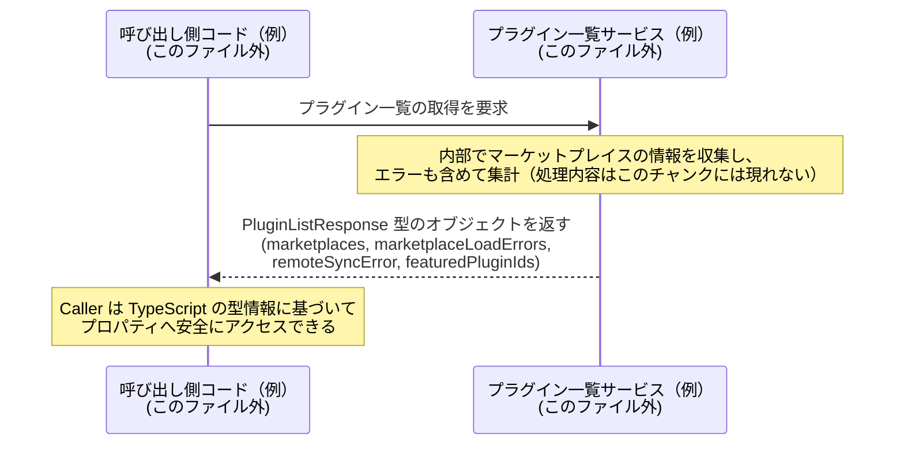

# app-server-protocol\schema\typescript\v2\PluginListResponse.ts コード解説

## 0. ざっくり一言

`PluginListResponse` は、プラグインマーケットプレイスに関する情報（マーケットプレイス一覧・ロードエラー・同期エラー・注目プラグインID）を 1 つのオブジェクトにまとめて表現する TypeScript の型エイリアスです（`PluginListResponse.ts:L7-7`）。

---

## 1. このモジュールの役割

### 1.1 概要

- このモジュールは、プラグイン関連の「一覧取得結果」を表現するための **レスポンス用データ構造** を提供します（`PluginListResponse.ts:L7-7`）。
- マーケットプレイスから取得したプラグイン情報と、その取得過程で発生したエラー情報、および注目プラグインIDをまとめて保持します（`PluginListResponse.ts:L4-5,7-7`）。
- ファイル先頭コメントから、この型定義は Rust から `ts-rs` によって自動生成されていることが分かります（`PluginListResponse.ts:L1-3`）。

### 1.2 アーキテクチャ内での位置づけ

このファイルは「純粋な型定義モジュール」であり、実行ロジックは持たず、他のコードから参照されることを前提とした **スキーマ定義層** に属していると解釈できます（根拠は型定義のみで関数が存在しないこと `PluginListResponse.ts:L4-7`）。

依存関係（このチャンクに現れる範囲）を Mer­maid で示します。



- `PluginListResponse` は `MarketplaceLoadErrorInfo` と `PluginMarketplaceEntry` に依存しますが、逆方向の依存や利用箇所はこのチャンクには現れません（`PluginListResponse.ts:L4-5,7-7`）。
- 実際にどの API やサービスがこの型を返すかは、このファイルからは分かりません。

### 1.3 設計上のポイント

コードから読み取れる設計上の特徴は次の通りです。

- **自動生成コードであることの明示**  
  - 「GENERATED CODE! DO NOT MODIFY BY HAND!」というコメントにより、直接編集しない前提のファイルであることが分かります（`PluginListResponse.ts:L1,3`）。
- **型エイリアスによるオブジェクト形状の定義**  
  - `export type PluginListResponse = { ... }` という形で、インターフェースではなく型エイリアスとして定義されています（`PluginListResponse.ts:L7-7`）。
- **必須プロパティのみ**  
  - すべてのプロパティがオプショナル記号 `?` を持たないため、`PluginListResponse` 型の値にはこれらすべてのプロパティが必須です（`PluginListResponse.ts:L7-7`）。
- **エラー情報をデータとして保持**  
  - `marketplaceLoadErrors` と `remoteSyncError` によって、エラーを例外ではなくフィールド値として表現しています（`PluginListResponse.ts:L7-7`）。
- **`null` を用いたエラーの有無の表現**  
  - `remoteSyncError: string | null` により、「同期エラーがない状態」を `null` で表現しています（`PluginListResponse.ts:L7-7`）。

---

## コンポーネント一覧（インベントリー）

このチャンクに現れる型・構成要素の一覧です。

| 種別 | 名前 | 内容 | 根拠 |
|------|------|------|------|
| 型エイリアス | `PluginListResponse` | プラグインマーケットプレイスに関する一覧レスポンスを表すオブジェクト型 | `PluginListResponse.ts:L7-7` |
| import type | `MarketplaceLoadErrorInfo` | マーケットプレイス読み込みエラーの詳細を表す型（内容は別ファイル） | `PluginListResponse.ts:L4-4` |
| import type | `PluginMarketplaceEntry` | マーケットプレイス上のプラグインエントリを表す型（内容は別ファイル） | `PluginListResponse.ts:L5-5` |

---

## 2. 主要な機能一覧

このファイルは関数やメソッドを持たず、**データ構造の定義のみ** を提供します。主要な「機能」はそれぞれのプロパティが持つ役割として整理できます（`PluginListResponse.ts:L7-7`）。

- `marketplaces`: 利用可能なプラグインマーケットプレイスエントリの一覧を保持する
- `marketplaceLoadErrors`: マーケットプレイスのロード時に発生したエラー情報一覧を保持する
- `remoteSyncError`: リモートとの同期処理におけるエラーメッセージ（エラーがなければ `null`）
- `featuredPluginIds`: 注目・特集扱いのプラグインID一覧を保持する

---

## 3. 公開 API と詳細解説

### 3.1 型一覧（構造体・列挙体など）

`PluginListResponse` 型エイリアスの詳細です。

| 名前 | 種別 | フィールド | 役割 / 用途 | 根拠 |
|------|------|-----------|-------------|------|
| `PluginListResponse` | 型エイリアス（オブジェクト型） | `marketplaces`, `marketplaceLoadErrors`, `remoteSyncError`, `featuredPluginIds` | プラグインマーケットプレイスに関する一覧取得結果を表現するコンテナ型 | `PluginListResponse.ts:L7-7` |

フィールドごとの詳細:

| フィールド名 | 型 | 説明 | 根拠 |
|-------------|----|------|------|
| `marketplaces` | `Array<PluginMarketplaceEntry>` | マーケットプレイス上のプラグインエントリの一覧。各要素の構造は `PluginMarketplaceEntry` 型で定義される（別ファイル）。 | `PluginListResponse.ts:L5,7-7` |
| `marketplaceLoadErrors` | `Array<MarketplaceLoadErrorInfo>` | マーケットプレイスの読み込み時に発生したエラー情報の一覧。各要素の構造は `MarketplaceLoadErrorInfo` 型で定義される（別ファイル）。 | `PluginListResponse.ts:L4,7-7` |
| `remoteSyncError` | `string \| null` | リモート同期処理で発生したエラーのメッセージ文字列。エラーがない場合は `null`。 | `PluginListResponse.ts:L7-7` |
| `featuredPluginIds` | `Array<string>` | 特集・注目扱いなどで「フィーチャー」されているプラグインの ID の一覧。 | `PluginListResponse.ts:L7-7` |

#### TypeScript の安全性・エラー表現・並行性の観点

- **型安全性**  
  - 上記プロパティはすべて明示的な型を持ち、コンパイル時に型チェックされます。例えば `featuredPluginIds` には `number` を含む配列は代入できません（`PluginListResponse.ts:L7-7`）。
  - ただし TypeScript はコンパイル時の静的チェックであり、実行時に外部入力から生成されたオブジェクトがこの形状を満たすかどうかは、別途ランタイムバリデーションをしない限り保証されません。このファイル内にはランタイムバリデーション処理は存在しません（`PluginListResponse.ts:L1-7`）。
- **エラー表現**  
  - 例外ではなく、`marketplaceLoadErrors`（配列）と `remoteSyncError`（`string | null`）でエラー状態を表現する「エラーをデータとして扱う」設計になっています（`PluginListResponse.ts:L7-7`）。
- **並行性**  
  - このファイルには非同期処理や並行処理に関する記述は一切なく、並行性に関する制約や注意点はコードからは読み取れません（`PluginListResponse.ts:L1-7`）。

### 3.2 関数詳細（最大 7 件）

このファイルには関数・メソッド・クラスは定義されていません（`PluginListResponse.ts:L1-7`）。  
したがって、関数詳細テンプレートに基づく解説対象はありません。

### 3.3 その他の関数

同様に、このファイル内に補助関数やラッパー関数も存在しません（`PluginListResponse.ts:L1-7`）。

---

## 4. データフロー

### 4.1 このファイルから分かる範囲

- このチャンクには、`PluginListResponse` を生成・受信・送信する処理は一切含まれていません（`PluginListResponse.ts:L1-7`）。
- したがって、**実際のアプリケーション内での具体的なデータフロー（どの関数からどの関数へ渡るか）は不明**です。

分かるのは以下の構造的な関係のみです。

- `PluginListResponse` オブジェクトの内部には、次のようなデータが「同時に」存在しうる（`PluginListResponse.ts:L7-7`）:
  - プラグインマーケットプレイスの一覧 (`marketplaces`)
  - そのロード時のエラー一覧 (`marketplaceLoadErrors`)
  - リモート同期エラー (`remoteSyncError`)
  - 注目プラグインID一覧 (`featuredPluginIds`)

### 4.2 一般的な利用イメージ（参考のシーケンス図）

以下は **一般的な利用例をイメージした図** であり、どのコンポーネント名もこのファイルには現れません。  
「TypeScript 型として `PluginListResponse` を返すような処理」が存在した場合の典型的な流れの例です。



この図は、「`PluginListResponse` がレスポンス型として使われることが多いと考えられる」という名前からの推測に基づく **参考イメージ** であり、実際の構成はこのチャンクからは確定できません。

---

## 5. 使い方（How to Use）

### 5.1 基本的な使用方法

この型は、関数の戻り値や状態管理の型注釈として利用できます。  
以下は `PluginListResponse` を返す関数を定義し、呼び出す例です。

```typescript
// PluginListResponse 型をインポートする                         // 型定義ファイルから PluginListResponse を読み込む
import type { PluginListResponse } from "./PluginListResponse"; // 実際の相対パスはプロジェクト構成に依存

// プラグイン一覧を返す関数の型定義                              // 戻り値として PluginListResponse 型を利用
function getPluginListMock(): PluginListResponse {              // この例では同期的なモック実装
    return {                                                    // PluginListResponse 型のオブジェクトリテラルを返す
        marketplaces: [],                                       // PluginMarketplaceEntry 型の配列（ここでは空）
        marketplaceLoadErrors: [],                              // MarketplaceLoadErrorInfo 型の配列（ここでは空）
        remoteSyncError: null,                                  // エラーがない状態を null で表現
        featuredPluginIds: ["plugin-A", "plugin-B"],            // 注目プラグインID一覧（string 配列）
    };
}

// 呼び出し側コード                                              // 上記関数を呼び出して結果を利用
const response = getPluginListMock();                           // 型推論により response は PluginListResponse 型
console.log(response.featuredPluginIds);                        // string[] として安全にアクセスできる
```

この例のポイント:

- すべてのプロパティが必須なので、オブジェクトリテラルで **4 つのプロパティをすべて指定** する必要があります（`PluginListResponse.ts:L7-7`）。
- `remoteSyncError` を省略したり `undefined` を代入しようとすると、TypeScript のコンパイルエラーになります。

### 5.2 よくある使用パターン

1. **API クライアントの戻り値型として利用**

```typescript
import type { PluginListResponse } from "./PluginListResponse";

// 非同期にプラグイン一覧を取得する関数                        // 実際の HTTP 通信は省略
async function fetchPluginList(): Promise<PluginListResponse> { // Promise で PluginListResponse を返す
    // 実際は fetch / axios などでサーバーから取得する想定
    const responseJson = await fakeHttpCall();                  // any 型に近い JSON が返ると仮定

    // ここでは簡略化のため型アサーションを使う例               // 実運用では runtime バリデーションを推奨
    return responseJson as PluginListResponse;                  // コンパイル時の型チェック用にアサーション
}
```

1. **アプリケーション状態（State）の型として利用**

```typescript
import type { PluginListResponse } from "./PluginListResponse";

type PluginListState = {
    isLoading: boolean;                                        // ローディング状態
    data: PluginListResponse | null;                           // データがまだない場合は null
    error: string | null;                                      // API 呼び出し自体のエラー
};

const initialState: PluginListState = {
    isLoading: false,
    data: null,
    error: null,
};
```

### 5.3 よくある間違い

1. **`remoteSyncError` を `undefined` にする**

```typescript
// 誤り例: 型にない undefined を使っている
const badResponse: PluginListResponse = {
    marketplaces: [],
    marketplaceLoadErrors: [],
    remoteSyncError: undefined, // エラー: string | null に undefined は代入不可
    featuredPluginIds: [],
};
```

```typescript
// 正しい例: エラーがない状態は null で表現する
const okResponse: PluginListResponse = {
    marketplaces: [],
    marketplaceLoadErrors: [],
    remoteSyncError: null,   // OK: string | null に適合
    featuredPluginIds: [],
};
```

1. **必須プロパティの入れ忘れ**

```typescript
// 誤り例: featuredPluginIds を省略している
const badResponse2: PluginListResponse = {
    marketplaces: [],
    marketplaceLoadErrors: [],
    remoteSyncError: null,
    // featuredPluginIds が欠けている → コンパイルエラー
};
```

1. **ランタイムでは型が保証されないことを忘れる**

```typescript
// 外部から来た未知の JSON データ
const raw: unknown = JSON.parse(someJsonString);

// 誤りに近い例: そのまま PluginListResponse として扱う
const maybeResponse = raw as PluginListResponse; // コンパイルは通るが、実行時に形が異なる可能性がある
// → 実際には runtime バリデーション（zod, io-ts 等）の利用が望ましい
```

### 5.4 使用上の注意点（まとめ）

- **直接編集しない**  
  - ファイル先頭コメントにある通り、このファイルは `ts-rs` による自動生成コードであり、手動編集は想定されていません（`PluginListResponse.ts:L1-3`）。  
    型の変更が必要な場合は、元になっている Rust 側やスキーマ定義を変更し、再生成する必要があります。
- **`remoteSyncError` は `null` チェックが必要**  
  - 型が `string | null` のため、`response.remoteSyncError.toUpperCase()` のように直接文字列メソッドを呼び出すとコンパイルエラーになります。使用前に `null` チェックが必要です（`PluginListResponse.ts:L7-7`）。
- **配列フィールドは空配列になり得る**  
  - `marketplaces`, `marketplaceLoadErrors`, `featuredPluginIds` はいずれも `Array<...>` であり、空配列が入る可能性があります。呼び出し側で「要素がある前提」で最初の要素にアクセスする場合は事前に長さチェックが必要です（`PluginListResponse.ts:L7-7`）。
- **並行性に関する制約は特にない**  
  - 純粋なデータ型であり、ミュータブルな共有状態や I/O を直接扱わないため、この型自体には並行性に起因する問題（レースコンディション等）はありません。ただし、この型の値がどのようなコンテキストで共有されるかは別途設計に依存します。

---

## 6. 変更の仕方（How to Modify）

### 6.1 新しい機能を追加する場合

このファイルは自動生成されているため、**直接コードを編集して新しいフィールドを追加することは推奨されません**（`PluginListResponse.ts:L1-3`）。

一般的な手順は次のようになります（具体的な Rust 側の構成はこのチャンクからは不明です）。

1. 元になっている Rust の型定義やスキーマ定義を特定する  
   - 通常 `ts-rs` は Rust の構造体・列挙体から TypeScript 型を生成します。  
   - どの Rust 型が `PluginListResponse` に対応しているかは、このファイルだけでは分かりません（不明）。
2. Rust 側の型に新しいフィールドを追加する  
   - 例: `featuredPluginIds` に加え、`featuredPluginNames` などを追加するなど。
3. `ts-rs` のコード生成を再実行する  
   - これにより TypeScript 側の `PluginListResponse` にも自動的に新フィールドが反映されます。
4. TypeScript 側の利用コードで、新フィールドを使用するように更新する。

### 6.2 既存の機能を変更する場合

同様に、既存フィールドの型変更や削除も **直接このファイルを編集すべきではありません**（`PluginListResponse.ts:L1-3`）。

変更時の注意点:

- **影響範囲の確認**
  - `PluginListResponse` を import している全ファイルが影響を受けます。  
  - どのファイルが import しているかは、このチャンクからは分かりません（不明）。
- **契約（前提条件）の保護**
  - 例: `remoteSyncError` を `string | null` から `string[]` に変えるなどの変更は、呼び出し側のエラーハンドリングロジックを壊します。
- **後方互換性**
  - API レスポンスとして公開されている場合、クライアントとのインターフェースが変わるため、バージョニングや移行期間が必要になる可能性があります。この点も、このファイルだけでは API 公開範囲は分かりません。

---

## 7. 関連ファイル

このモジュールと直接的に関係するファイルは、`import type` によって読み取れます。

| パス（相対） | 役割 / 関係 | 根拠 |
|-------------|------------|------|
| `./MarketplaceLoadErrorInfo` | `MarketplaceLoadErrorInfo` 型を定義するファイル。`PluginListResponse.marketplaceLoadErrors` の要素型として利用される。具体的な構造はこのチャンクには現れません。 | `PluginListResponse.ts:L4-4,7-7` |
| `./PluginMarketplaceEntry` | `PluginMarketplaceEntry` 型を定義するファイル。`PluginListResponse.marketplaces` の要素型として利用される。具体的な構造はこのチャンクには現れません。 | `PluginListResponse.ts:L5-5,7-7` |

その他:

- `ts-rs` によってこのファイルが生成されていることから、対応する **Rust 側の型定義ファイル** が必ず存在しますが、その場所や名前はこのチャンクには現れません（不明）（`PluginListResponse.ts:L1-3`）。

---

### Bugs / Security / Contracts / Edge Cases まとめ（このファイルに関して）

- **バグの可能性（構造上）**
  - ランタイムで外部から受け取った JSON を `as PluginListResponse` として扱う場合、実際にはフィールドが欠けている・型が異なるといった不整合が発生し得ます。これは TypeScript の型システムの範囲外であり、このファイル単体では防げません。
- **セキュリティ**
  - このファイル自体はデータ構造定義のみであり、入力のサニタイズやアクセス制御は行いません。外部入力が入る場合は、別レイヤーで検証・フィルタリングが必要です。
- **契約（Contracts）**
  - 全プロパティが必須であり、`remoteSyncError` のみ `null` 許容である、というのがこの型の契約です（`PluginListResponse.ts:L7-7`）。
- **エッジケース**
  - 配列が空（マーケットプレイスが 0 件、エラーが 0 件、フィーチャーIDが 0 件）のケースを呼び出し側が考慮する必要があります。
  - `remoteSyncError` が `null` の場合と空文字列 `""` の場合をどう解釈するかは、このファイルからは分かりません（不明）ため、利用側で仕様を統一する必要があります。
