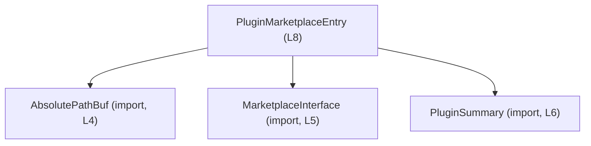
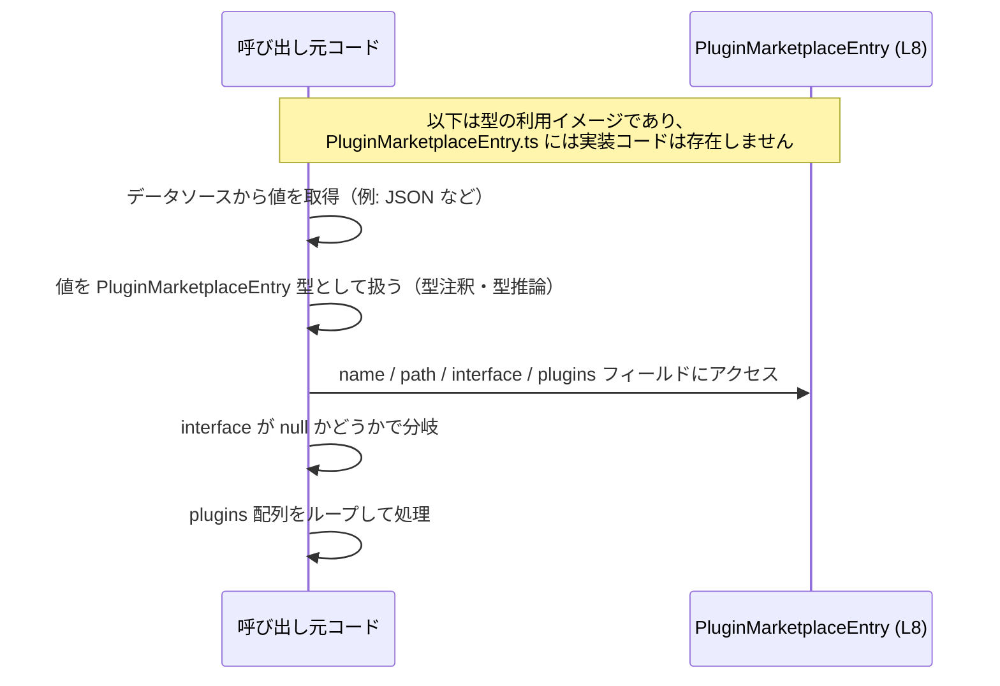

# app-server-protocol/schema/typescript/v2/PluginMarketplaceEntry.ts コード解説

## 0. ざっくり一言

プラグインマーケットプレイス内の「エントリ」1件分の情報を表す `PluginMarketplaceEntry` 型エイリアスを定義する、自動生成 TypeScript スキーマファイルです【PluginMarketplaceEntry.ts:L1-3,L8-8】。

---

## 1. このモジュールの役割

### 1.1 概要

- このモジュールは、プラグインマーケットプレイスのエントリを表すデータ構造 `PluginMarketplaceEntry` を公開します【PluginMarketplaceEntry.ts:L8-8】。
- エントリは以下の情報を持ちます【PluginMarketplaceEntry.ts:L8-8】:
  - `name`: エントリ名（文字列）
  - `path`: 絶対パスを表す型 `AbsolutePathBuf`
  - `interface`: `MarketplaceInterface` か `null`
  - `plugins`: `PluginSummary` の配列

ファイル先頭のコメントから、この定義はツール `ts-rs` によって自動生成されており、手動編集しない前提であることが明示されています【PluginMarketplaceEntry.ts:L1-3】。

### 1.2 アーキテクチャ内での位置づけ

このモジュールは、他のスキーマ型に依存する **単一のデータ型定義モジュール** です。

- 依存している型（いずれも型としてのみ import）【PluginMarketplaceEntry.ts:L4-6】:
  - `AbsolutePathBuf` … 上位ディレクトリ `../AbsolutePathBuf` から
  - `MarketplaceInterface` … 同一ディレクトリ `./MarketplaceInterface` から
  - `PluginSummary` … 同一ディレクトリ `./PluginSummary` から

Mermaid 図で示す依存関係（このチャンクに含まれる範囲のみ）:



※ 上記 3 型の内部構造や意味は、このチャンクには現れていないため不明です。  
　このファイルから分かるのは「型として参照している」という事実のみです【PluginMarketplaceEntry.ts:L4-6】。

### 1.3 設計上のポイント

- **自動生成ファイル**  
  - `// GENERATED CODE! DO NOT MODIFY BY HAND!` というコメントで、手動編集しない前提が明示されています【PluginMarketplaceEntry.ts:L1-1】。
  - `ts-rs` による生成であることがコメントされています【PluginMarketplaceEntry.ts:L3-3】。
- **状態を持たない純粋なデータ型**  
  - クラスや関数は存在せず、`export type` による構造的な型定義のみです【PluginMarketplaceEntry.ts:L8-8】。
- **型レベルでの必須／任意の表現**  
  - `name`, `path`, `plugins` は必須プロパティ（`?` が付いていない）【PluginMarketplaceEntry.ts:L8-8】。
  - `interface` は `MarketplaceInterface | null` で、存在しないケースを `null` で表現します【PluginMarketplaceEntry.ts:L8-8】。
- **TypeScript の型安全性**  
  - すべて `import type` を用いており【PluginMarketplaceEntry.ts:L4-6】、コンパイル時専用の依存（ランタイムには影響しない）になっています。

---

## 2. 主要な機能一覧

このファイルは関数を持たず、単一のデータ型を提供します。

- `PluginMarketplaceEntry` 型:  
  プラグインマーケットプレイスにおける 1 つのエントリ情報を保持する構造的な型定義【PluginMarketplaceEntry.ts:L8-8】。

---

## 3. 公開 API と詳細解説

### 3.1 型一覧（コンポーネントインベントリー）

#### このモジュールで定義される型

| 名前 | 種別 | 役割 / 用途 | 定義位置 |
|------|------|-------------|----------|
| `PluginMarketplaceEntry` | 型エイリアス（オブジェクト型） | マーケットプレイスのエントリ 1 件分の情報を表す | `PluginMarketplaceEntry.ts:L8-8` |

#### 依存する外部型（このモジュールでは未定義）

| 名前 | 種別 | 役割 / 用途（このファイルから分かる範囲） | 参照箇所 |
|------|------|-------------------------------------------|----------|
| `AbsolutePathBuf` | 型（`import type`） | `PluginMarketplaceEntry.path` の型として使用される【PluginMarketplaceEntry.ts:L8-8】 | インポート【PluginMarketplaceEntry.ts:L4-4】 |
| `MarketplaceInterface` | 型（`import type`） | `PluginMarketplaceEntry.interface` の一方の型として使用される【PluginMarketplaceEntry.ts:L8-8】 | インポート【PluginMarketplaceEntry.ts:L5-5】 |
| `PluginSummary` | 型（`import type`） | `PluginMarketplaceEntry.plugins` 配列の要素型として使用される【PluginMarketplaceEntry.ts:L8-8】 | インポート【PluginMarketplaceEntry.ts:L6-6】 |

※ これら外部型の中身・意味は、このチャンクには現れません。

#### `PluginMarketplaceEntry` フィールド詳細

`PluginMarketplaceEntry` は次のようなオブジェクト型です【PluginMarketplaceEntry.ts:L8-8】。

```ts
export type PluginMarketplaceEntry = {
    name: string,
    path: AbsolutePathBuf,
    interface: MarketplaceInterface | null,
    plugins: Array<PluginSummary>,
};
```

フィールドごとの説明:

| フィールド名 | 型 | 必須 | 説明（このファイルから分かる範囲） | 根拠 |
|--------------|----|------|--------------------------------------|------|
| `name` | `string` | 必須 | エントリ名を表す文字列 | `PluginMarketplaceEntry.ts:L8-8` |
| `path` | `AbsolutePathBuf` | 必須 | エントリに関連するパスを表す型 | `PluginMarketplaceEntry.ts:L8-8` |
| `interface` | `MarketplaceInterface \| null` | 必須（プロパティ自体は必須だが値は `null` 可） | 関連するマーケットプレイスインターフェース、または存在しない場合は `null` | `PluginMarketplaceEntry.ts:L8-8` |
| `plugins` | `Array<PluginSummary>` | 必須 | 関連する `PluginSummary` の配列 | `PluginMarketplaceEntry.ts:L8-8` |

### 3.2 関数詳細（最大 7 件）

このファイルには、関数・メソッド・クラスコンストラクタなどの **実行可能コードは定義されていません**【PluginMarketplaceEntry.ts:L1-8】。  
そのため、ここで詳細解説すべき関数はありません。

### 3.3 その他の関数

- なし（ヘルパー関数やラッパー関数も存在しません）【PluginMarketplaceEntry.ts:L1-8】。

---

## 4. データフロー

このファイルは型定義のみですが、`PluginMarketplaceEntry` がどのように利用されるかの典型的な流れを、型レベルの観点で整理します。

### 概念的なデータフロー（利用イメージ）

- あるコードが、プラグインマーケットプレイスの情報を取得し、それを `PluginMarketplaceEntry` 型として扱う。
- 呼び出し側は `name`, `path`, `interface`, `plugins` を参照して UI 表示やロジック分岐を行う。

以下はその概念図です（処理自体はこのファイルには定義されておらず、利用イメージです）。



---

## 5. 使い方（How to Use）

### 5.1 基本的な使用方法

ここでは、他ファイルから `PluginMarketplaceEntry` を利用する想定での基本例を示します。  
（インポートパスはこのファイルの相対パス表記に基づきます【PluginMarketplaceEntry.ts:L4-6】。）

```typescript
// PluginMarketplaceEntry 型と、その依存型をインポートする例                    // このファイルと同じディレクトリ構成を想定
import type { AbsolutePathBuf } from "../AbsolutePathBuf";                        // path フィールドで利用される型
import type { MarketplaceInterface } from "./MarketplaceInterface";               // interface フィールドで利用される型
import type { PluginSummary } from "./PluginSummary";                             // plugins 配列の要素型
import type { PluginMarketplaceEntry } from "./PluginMarketplaceEntry";           // 本ファイルで定義された型

// それぞれの値は、実際には別の処理から取得される想定                       // ここでは型的な形だけを示している
const path: AbsolutePathBuf = /* AbsolutePathBuf 型の値を用意する */ null as any;
const marketplaceInterface: MarketplaceInterface | null = /* あるいは null */ null as any;
const plugins: PluginSummary[] = /* PluginSummary の配列 */ [];

// PluginMarketplaceEntry 型の値を構築する                                     // フィールド名と型が一致している必要がある
const entry: PluginMarketplaceEntry = {
    name: "example-entry",                                                       // name: string
    path,                                                                        // path: AbsolutePathBuf
    interface: marketplaceInterface,                                             // interface: MarketplaceInterface | null
    plugins,                                                                     // plugins: PluginSummary[]
};

// 利用側では、型安全にフィールドへアクセスできる                           // TypeScript の補完や型チェックの恩恵を受ける
console.log(entry.name);                                                        // string として扱える
console.log(entry.plugins.length);                                              // plugins は必ず配列
```

この例では、`PluginMarketplaceEntry` は純粋なデータキャリアとして利用されます。

### 5.2 よくある使用パターン

#### 1. `interface` が `null` である可能性のハンドリング

`interface` は `MarketplaceInterface | null` なので、利用時には null チェックが必要です【PluginMarketplaceEntry.ts:L8-8】。

```typescript
function describeEntry(entry: PluginMarketplaceEntry): string {      // PluginMarketplaceEntry を受け取る関数
    // interface が null かどうかで分岐する                               // null チェックにより型が絞り込まれる
    if (entry.interface === null) {                                  // interface が null の場合
        return `${entry.name} (no interface)`;                       // interface 未設定のケースの表示
    } else {                                                         // interface が MarketplaceInterface の場合
        // entry.interface に対して MarketplaceInterface としての操作が可能   // 具体的なメソッド等はこのチャンクからは不明
        return `${entry.name} (has interface)`;                      // interface 有りのケースの表示
    }
}
```

#### 2. `plugins` 配列をループ処理

`plugins` は常に配列として存在するため（null/undefined ではない）【PluginMarketplaceEntry.ts:L8-8】、map / for-of 等で直接処理できます。

```typescript
function listPluginNames(entry: PluginMarketplaceEntry): string[] {  // PluginMarketplaceEntry を受け取り
    // plugins は PluginSummary[] 型のため、map で変換できる                  // PluginSummary の構造はこのチャンクでは不明
    return entry.plugins.map(plugin => {
        // plugin のフィールドはこのファイルからは分からないため              // 実際のプロパティ名は使用側で確認する必要がある
        // ここでは仮に `name` プロパティがあると仮定したコメントのみ記載    // 実コードでは型定義に基づいてアクセスする
        return (plugin as any).name as string;                      // any 経由は例示のため、実際には不要なはず
    });
}
```

※ `PluginSummary` の具体的なフィールド名はこのチャンクにはないため、上記の `name` アクセスはコメントレベルの仮定であることに注意してください。

### 5.3 よくある間違い

型定義から推測される、起こりやすい誤用と正しい利用方法を示します。

```typescript
// 間違い例: interface が null でない前提でプロパティアクセスしてしまう
function wrong(entry: PluginMarketplaceEntry) {
    // const type = entry.interface.type;  // コンパイルエラー: interface が null の可能性がある
}

// 正しい例: null チェックやオプショナルチェーンを利用する
function correct(entry: PluginMarketplaceEntry) {
    if (entry.interface) {                                      // truthy チェックで null を除外
        // const type = entry.interface.type;                  // ここでは MarketplaceInterface として扱える
    }
}
```

```typescript
// 間違い例: plugins を単一の PluginSummary として扱う
function wrong2(entry: PluginMarketplaceEntry) {
    // const plugin = entry.plugins;                           // 型は PluginSummary[] なので、単一要素ではない
}

// 正しい例: 配列として扱う
function correct2(entry: PluginMarketplaceEntry) {
    for (const plugin of entry.plugins) {                      // PluginSummary[] を for-of でループ
        // plugin は PluginSummary 型として扱える
    }
}
```

### 5.4 使用上の注意点（まとめ）

- **`interface` は必ずしも存在しない**  
  - 型が `MarketplaceInterface | null` であり、常に null チェックを行う必要があります【PluginMarketplaceEntry.ts:L8-8】。
- **`plugins` は配列だが、中身が空の可能性はある**  
  - 型は `Array<PluginSummary>` であり、空配列を禁止する制約はありません【PluginMarketplaceEntry.ts:L8-8】。
- **型はコンパイル時のみ有効**  
  - `import type` で取り込んだ型情報はランタイムには存在しないため、外部データ（JSON 等）をこの型として扱う場合は別途バリデーションが必要です【PluginMarketplaceEntry.ts:L4-6】。
- **ファイル自体は自動生成であり、直接編集しない**  
  - コメントで「Do not edit this file manually」と明示されているため、変更は生成元に対して行う必要があります【PluginMarketplaceEntry.ts:L1-3】。

---

## 6. 変更の仕方（How to Modify）

### 6.1 新しい機能を追加する場合

このファイルは自動生成であり、直接編集しない前提です【PluginMarketplaceEntry.ts:L1-3】。  
そのため、新しいフィールドを追加したい場合などの手順は概念的には次のようになります。

1. **生成元の定義を探す**  
   - コメントに `ts-rs` とあるため【PluginMarketplaceEntry.ts:L3-3】、おそらく別言語（例: Rust）の型定義から生成されていますが、生成元の場所はこのチャンクには現れていません。
2. **生成元の構造体／型にフィールドを追加・変更する**  
   - `name`, `path`, `interface`, `plugins` に相当する元定義を更新する必要があります。
3. **コード生成を再実行する**  
   - `ts-rs` 等のツールを再実行し、このファイルを再生成します。
4. **利用側コードを更新する**  
   - 追加されたフィールドを利用するコードを別ファイル側で追加します。

このファイル自体に新しい関数やロジックを追加する設計にはなっていません【PluginMarketplaceEntry.ts:L1-8】。

### 6.2 既存の機能を変更する場合

`PluginMarketplaceEntry` の変更（例: フィールド名の変更、型の変更）による影響範囲と注意点:

- **影響範囲の確認**  
  - この型を参照している TypeScript コードはすべて影響を受けます（コンパイラの参照検索機能で確認するのが一般的です）。
- **契約（Contract）の維持**  
  - `name`, `path`, `plugins` が「必須のプロパティ」であるという契約を変えると、多くの呼び出し側で修正が必要になります【PluginMarketplaceEntry.ts:L8-8】。
  - `interface` の `null` 許容性を変えると、null チェックに依存したロジックが破綻する可能性があります【PluginMarketplaceEntry.ts:L8-8】。
- **テスト・利用箇所の再確認**  
  - 実行時に JSON 等からデシリアライズしている箇所があれば、フィールド名や型の変更に追従しているか確認が必要です。

---

## 7. 関連ファイル

このモジュールと直接的に関係するファイル（インポート元）を整理します。

| パス（import 文字列） | 役割 / 関係（このファイルから分かる範囲） | 根拠 |
|------------------------|--------------------------------------------|------|
| `../AbsolutePathBuf` | 型 `AbsolutePathBuf` を提供し、`PluginMarketplaceEntry.path` の型として使用される | インポート【PluginMarketplaceEntry.ts:L4-4】、フィールド【PluginMarketplaceEntry.ts:L8-8】 |
| `./MarketplaceInterface` | 型 `MarketplaceInterface` を提供し、`PluginMarketplaceEntry.interface` の型の一部として使用される | インポート【PluginMarketplaceEntry.ts:L5-5】、フィールド【PluginMarketplaceEntry.ts:L8-8】 |
| `./PluginSummary` | 型 `PluginSummary` を提供し、`PluginMarketplaceEntry.plugins` の要素型として使用される | インポート【PluginMarketplaceEntry.ts:L6-6】、フィールド【PluginMarketplaceEntry.ts:L8-8】 |

補足:

- `app-server-protocol/schema/typescript/v2` というパス情報から、このファイルはアプリケーションサーバのプロトコル v2 スキーマの一部として利用されている可能性がありますが、利用箇所や具体的なプロトコル仕様はこのチャンクには現れていません。

---

## Bugs / Security / Contracts / Edge Cases / Tests / Performance 概要

最後に、ユーザー指定の観点ごとに、このファイルから読み取れる内容を簡潔にまとめます。

### Bugs / Security

- このファイルは型定義のみであり、直接的なバグやセキュリティホールとなるロジックは含みません【PluginMarketplaceEntry.ts:L1-8】。
- ただし、**ランタイムデータがこの型に適合しているかどうかは別問題**であり、外部入力（JSON 等）をそのまま信じると、想定外の構造が流入する可能性があります。
  - 型レベルでは `path` の正当性・安全性（パストラバーサル等）までは保証されません。

### Contracts / Edge Cases

- **契約（Contract）**
  - `name`, `path`, `plugins` は必ず存在する前提（プロパティに `?` がない）【PluginMarketplaceEntry.ts:L8-8】。
  - `interface` は常にプロパティとして存在するが、値としては `null` を許容する【PluginMarketplaceEntry.ts:L8-8】。
- **代表的なエッジケース**
  - `interface` が `null` の場合の取り扱い。
  - `plugins` が空配列 `[]` の場合（型レベルで禁止されていない）。
  - `name` が空文字列 `""` などのケースは、この型だけでは制約されていません。

### Tests

- このファイルにはテストコードや型テストは含まれていません【PluginMarketplaceEntry.ts:L1-8】。
- 型定義の性質上、利用側で型に適合しないコードがあればコンパイル時に検出されることがテストの一部を代替します。

### Performance / Scalability

- TypeScript の型定義のみであり、ランタイムの性能への直接的影響はありません【PluginMarketplaceEntry.ts:L1-8】。
- 大量の `PluginMarketplaceEntry` オブジェクトを扱う場合でも、本ファイル自体は性能ボトルネックにはなりません。

### Tradeoffs / Refactoring / Observability

- **Tradeoffs**:  
  - `interface` に `null` を含める設計により、値の不在を明示できますが、利用側での null チェックが必須になります【PluginMarketplaceEntry.ts:L8-8】。
- **Refactoring**:  
  - 自動生成ファイルであるため、リファクタリングは生成元の定義から行う必要があります【PluginMarketplaceEntry.ts:L1-3】。
- **Observability**:  
  - ログ出力やメトリクスなどの仕組みは一切含まれておらず、観測可能性はこの型を利用する上位コード側に委ねられます。
