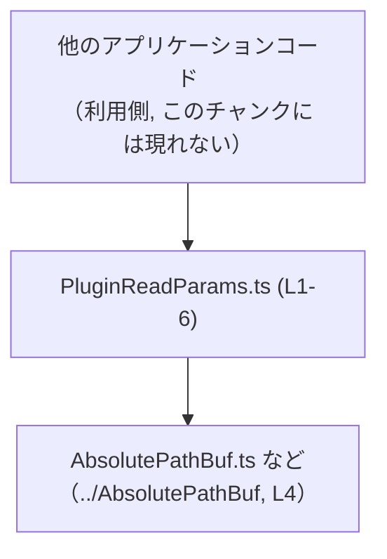
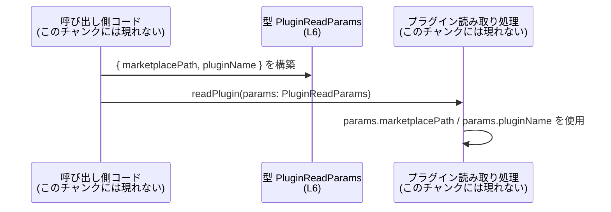

# app-server-protocol/schema/typescript/v2/PluginReadParams.ts

## 0. ざっくり一言

`PluginReadParams.ts` は、プラグインを読み取る際のパラメータを表現する **型エイリアス（オブジェクト型）** を 1 つだけ定義する、自動生成された TypeScript ファイルです（`PluginReadParams.ts:L1-3, L6-6`）。

---

## 1. このモジュールの役割

### 1.1 概要

- このモジュールは、`PluginReadParams` という型を公開し、  
  - `marketplacePath`: `AbsolutePathBuf` 型  
  - `pluginName`: `string` 型  
 から成るオブジェクト構造を定義します（`PluginReadParams.ts:L4-4, L6-6`）。
- ファイル先頭のコメントから、この型は **Rust 側の定義から `ts-rs` によって自動生成されている** ことが分かります（`PluginReadParams.ts:L1-3`）。

### 1.2 アーキテクチャ内での位置づけ

このファイルは、TypeScript 側での **データ転送用の型定義レイヤ** に属していると解釈できます。コードから読み取れる依存関係は次のとおりです。

- 依存元: `PluginReadParams.ts`
- 依存先: `../AbsolutePathBuf`（`AbsolutePathBuf` 型の定義ファイル）（`PluginReadParams.ts:L4-4`）
- `PluginReadParams` 自体は他モジュールからインポートされ、プラグイン読み取りの API パラメータとして使われることが想定されますが、実際の利用箇所はこのチャンクには現れません。



この図は、「利用側コード」が `PluginReadParams` を使い、その中の `marketplacePath` が `AbsolutePathBuf` に依存している関係を表しています。  
利用側コードの具体的なファイル名や関数名は、このチャンクからは分かりません。

### 1.3 設計上のポイント

コードから読み取れる設計上の特徴は次のとおりです。

- **自動生成コードであることの明示**  
  - ファイル先頭に「GENERATED CODE! DO NOT MODIFY BY HAND!」とあり、手で編集しない前提です（`PluginReadParams.ts:L1-3`）。
- **状態やロジックを持たないピュアな型定義のみ**  
  - フィールドを持つ構造体や関数・メソッドは存在せず、シリアル化可能なオブジェクト型のみを定義しています（`PluginReadParams.ts:L6-6`）。
- **パス表現の型安全性を高める設計**  
  - `marketplacePath` が単なる `string` ではなく、`AbsolutePathBuf` 型で表現されているため、「絶対パスである」という意味を型レベルで区別しようとしています（`PluginReadParams.ts:L4-4, L6-6`）。
- **エラーハンドリングや並行性の制御は一切行わない**  
  - このファイルには実行時ロジックがないため、エラー処理や並行処理（スレッド・非同期）の記述は存在しません。

---

## 2. 主要な機能一覧

このファイルが提供する「機能」は型定義のみです。

- `PluginReadParams` 型: プラグイン読み取り処理に必要なパラメータ（マーケットプレイス内のパスとプラグイン名）をまとめたオブジェクト型（`PluginReadParams.ts:L6-6`）

---

## 2.5 コンポーネントインベントリー

このチャンクに現れる型・モジュールの一覧です。

| 名前 | 種別 | 定義/参照 | 役割 / 説明 | 根拠 |
|------|------|-----------|-------------|------|
| `PluginReadParams` | 型エイリアス（オブジェクト型） | `export type` | `marketplacePath` と `pluginName` をまとめたパラメータ型。外部モジュールから利用される公開 API | `PluginReadParams.ts:L6-6` |
| `marketplacePath` | オブジェクトプロパティ | `PluginReadParams` のフィールド | プラグインのマーケットプレイス上のパスを表すフィールド。型は `AbsolutePathBuf` | `PluginReadParams.ts:L6-6` |
| `pluginName` | オブジェクトプロパティ | `PluginReadParams` のフィールド | プラグイン名を表す文字列フィールド | `PluginReadParams.ts:L6-6` |
| `AbsolutePathBuf` | 型（別ファイル定義） | `import type` | 絶対パスを表す型と解釈できる名称。実体は `../AbsolutePathBuf` に定義されているが、このチャンクには現れない | `PluginReadParams.ts:L4-4` |

---

## 3. 公開 API と詳細解説

### 3.1 型一覧（構造体・列挙体など）

| 名前 | 種別 | フィールド | 役割 / 用途 | 根拠 |
|------|------|-----------|-------------|------|
| `PluginReadParams` | 型エイリアス（オブジェクト型） | `marketplacePath: AbsolutePathBuf`, `pluginName: string` | プラグイン読み取り時の入力パラメータを表す。マーケットプレイス上の絶対パスとプラグイン名をセットで渡すためのコンテナ | `PluginReadParams.ts:L4-4, L6-6` |

`PluginReadParams` は TypeScript の **オブジェクト型表現** であり、次ののような形を持ちます（`PluginReadParams.ts:L6-6`）:

```typescript
export type PluginReadParams = {
    marketplacePath: AbsolutePathBuf;
    pluginName: string;
};
```

※ 実際のファイルでは 1 行に圧縮されていますが、意味上は上記と等価です（`PluginReadParams.ts:L6-6`）。

### 3.2 関数詳細

このファイルには **関数・メソッドは一切定義されていません**（`PluginReadParams.ts:L1-6`）。  
したがって、関数用の詳細テンプレートに従って解説すべき対象はありません。

### 3.3 その他の関数

- 該当なし（ヘルパー関数やラッパー関数も存在しません）。

---

## 4. データフロー

このファイル単体には処理ロジックがなく、データフローは定義されていませんが、`PluginReadParams` がどのように使われるかの典型例を、**仮想的な利用コード** を用いて説明します。

### 4.1 代表的なシナリオ（想定）

1. ある「プラグイン管理サービス」が、プラグインを読み込む API を提供している。
2. 呼び出し側コードは、プラグインのマーケットプレイス内の絶対パス（`AbsolutePathBuf` 型）と、プラグイン名（`string`）を用意し、`PluginReadParams` オブジェクトを構築する。
3. 構築した `PluginReadParams` を引数として、「プラグイン読み取り関数」に渡す。

このシナリオは「型名・フィールド名からの推測」であり、具体的な関数名やサービス名はこのチャンクからは分かりません。



- この図のうち、このチャンクに存在するのは **`PluginReadParams` 型（Type ノード, L6）** のみです。
- `Caller` および `Service` は、利用イメージを説明するための仮想コンポーネントです。

---

## 5. 使い方（How to Use）

### 5.1 基本的な使用方法

`PluginReadParams` は **値オブジェクト** として、関数の引数やメッセージ中のフィールドに利用することを想定できます。  
以下は、プラグイン読み取り関数に渡す例です（関数自体はこのファイルには定義されていません）。

```typescript
import type { AbsolutePathBuf } from "../AbsolutePathBuf";          // パスを表す型（このチャンクには中身はない）
import type { PluginReadParams } from "./PluginReadParams";          // 本ファイルで定義される型

// プラグインを読み込む仮想的な関数のシグネチャ例
async function readPlugin(params: PluginReadParams): Promise<void> {  // params の型に PluginReadParams を使用
    // 実際の処理内容は本チャンクには存在しない
}

// どこかで AbsolutePathBuf 型の値を用意したとする
declare const marketplacePath: AbsolutePathBuf;                      // 具体的な生成方法はこのチャンクには現れない

// PluginReadParams の値を構築して関数に渡す
const params: PluginReadParams = {                                   // PluginReadParams 型のオブジェクトを作成
    marketplacePath,                                                 // AbsolutePathBuf 型の値をそのまま設定
    pluginName: "example-plugin",                                    // プラグイン名（string）
};

await readPlugin(params);                                            // 型安全に引数として渡せる
```

- `marketplacePath` は `AbsolutePathBuf` 型である必要があり、`string` を直接渡すとコンパイルエラーになります（型安全性の向上）。
- `pluginName` は任意の `string` ですが、「空でない」「有効な識別子である」などの制約は、この型からは分かりません。必要なら別途検証処理が必要です。

### 5.2 よくある使用パターン

1. **関数のパラメータオブジェクトとして使用**

```typescript
function loadPlugin(params: PluginReadParams) {
    // params.marketplacePath と params.pluginName を使って処理
}
```

1. **メッセージやリクエストボディの型として使用**

```typescript
interface PluginReadRequest {
    params: PluginReadParams;                     // リクエストの params 部分
    requestId: string;                            // 追加情報
}
```

いずれの場合も、「複数の値を 1 つのオブジェクトとしてまとめて扱う」目的で使われます。

### 5.3 よくある間違い

#### 1. `marketplacePath` に `string` を渡してしまう

```typescript
// 誤り例: marketplacePath に string を指定している
const paramsBad: PluginReadParams = {
    // コンパイラエラー: string 型は AbsolutePathBuf に代入できない
    marketplacePath: "/plugins/marketplace",     // ❌ 型が一致しない
    pluginName: "example",
};
```

```typescript
// 正しい例: AbsolutePathBuf 型の値を渡す
declare const marketplacePath: AbsolutePathBuf;   // 別のモジュールで生成済みとする

const paramsOk: PluginReadParams = {
    marketplacePath,                             // ✅ 型が一致する
    pluginName: "example",
};
```

#### 2. 必須プロパティを省略してしまう

```typescript
// 誤り例: pluginName を省略
// コンパイラエラー: プロパティ 'pluginName' が存在しない
const paramsMissing: PluginReadParams = {
    marketplacePath,
};
```

`PluginReadParams` の両フィールドはオプショナルではないため、**必ず両方を指定する必要があります**（`PluginReadParams.ts:L6-6`）。

### 5.4 使用上の注意点（まとめ）

- **ランタイム検証は行われない**  
  - TypeScript の型はコンパイル時のみ有効であり、実行時に `marketplacePath` が本当に「絶対パス」かどうか、`pluginName` が妥当かどうかは保証されません。
- **自動生成ファイルのため直接編集しない**  
  - コメントにあるように、型に変更を加えたい場合は元となる Rust 側定義を修正し、`ts-rs` による再生成を行う必要があります（`PluginReadParams.ts:L1-3`）。
- **並行性（スレッド安全性）について**  
  - 値オブジェクトであり、ミュータブルな状態や共有リソースを持たないため、この型自体に並行性上の問題はありません。  
  - ただし、実際のアプリケーションでこの型の値をどのように共有・変更するかは、別のコードの責務です。

---

## 6. 変更の仕方（How to Modify）

### 6.1 新しい機能を追加する場合

このファイルは **自動生成（`ts-rs`）** であるため、**TypeScript 側を直接編集すべきではありません**（`PluginReadParams.ts:L1-3`）。

`PluginReadParams` にフィールドを追加したい場合は、一般に次のような手順になります（具体的な Rust 側コードはこのチャンクには現れません）:

1. Rust 側で `PluginReadParams` に対応する構造体（または型定義）を探す。  
   - ts-rs では `#[derive(TS)]` などが付与された構造体から TypeScript 型が生成されます。
2. その Rust 構造体に、新しいフィールド（例: `version: String` など）を追加する。
3. `ts-rs` のコード生成プロセスを再実行し、TypeScript 側コードを再生成する。
4. TypeScript プロジェクト側で、生成された新しいフィールドを利用するように修正する。

TypeScript ファイルを直接変更すると、**次回の自動生成で上書きされる** 可能性が高いため、変更は必ず生成元で行う必要があります。

### 6.2 既存の機能を変更する場合

`marketplacePath` や `pluginName` の **名前・型・必須/任意** を変更したい場合も、同様に生成元側の変更が必要です。

変更時に注意すべき点:

- **影響範囲の確認**
  - `PluginReadParams` をインポートしているすべての TypeScript ファイルが影響を受けます。
  - 特に、フィールド名の変更や削除、型の変更はコンパイルエラーとして現れます。
- **契約（前提条件）の維持**
  - 既存の API が `PluginReadParams` を前提としている場合、互換性が保てるように注意します。
  - 例えば `pluginName` をオプショナルにすると、利用側がそのケースをハンドリングする必要が生じます。
- **テストコードの更新**
  - このチャンクにテストコードはありませんが、利用側のテストで `PluginReadParams` を直接構築している場合、そのテストも修正が必要です。このチャンクから具体的なテストファイル名は分かりません。

---

## 7. 関連ファイル

このファイルと密接に関係するファイルは、コードから次のように読み取れます。

| パス | 役割 / 関係 | 根拠 |
|------|------------|------|
| `../AbsolutePathBuf` | `AbsolutePathBuf` 型を定義する TypeScript ファイル。`marketplacePath` フィールドの型としてインポートされている | `PluginReadParams.ts:L4-4` |
| Rust 側の元定義ファイル（パス不明） | `ts-rs` により本ファイルが生成されている元の Rust 構造体や型定義。コメントから存在が推測されるが、パスや内容はこのチャンクには現れない | `PluginReadParams.ts:L1-3` |

このチャンクにはテストコードや補助ユーティリティは含まれておらず、それらの存在やパスは **不明** です。

---

### Bugs / Security / Edge Cases / Tests / Performance について

- **Bugs**  
  - このファイルにはロジックがないため、直接的なバグ（誤った計算や条件分岐など）は存在しません。
- **Security**  
  - 型定義のみであり、入力のサニタイズや権限チェックは行いません。`marketplacePath` や `pluginName` の値の妥当性チェックは、利用側のコードで行う必要があります。
- **Contracts / Edge Cases**  
  - 両フィールドは必須であり、`undefined` や欠落したプロパティはコンパイル時に検出されます（`PluginReadParams.ts:L6-6`）。
  - ただし、空文字列や不正なパス形式などのエッジケースは型レベルでは表現されていません。
- **Tests**  
  - このチャンクにテストは存在しません。型の整合性は、通常 TypeScript コンパイラと上位レイヤのテストで確認されます。
- **Performance / Scalability**  
  - 単なる型定義であり、ランタイムパフォーマンスやスケーラビリティに直接の影響はありません。
