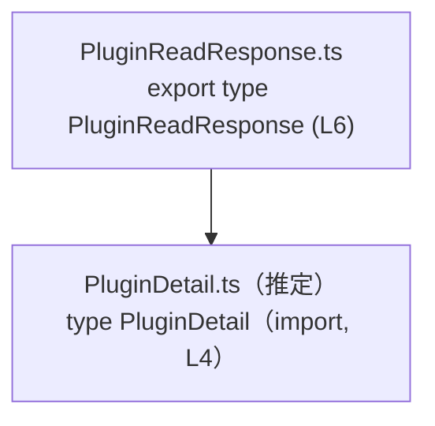
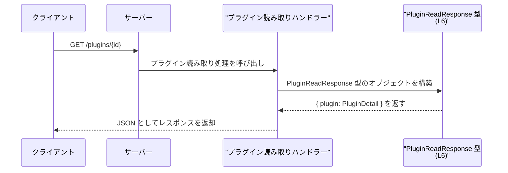

# app-server-protocol/schema/typescript/v2/PluginReadResponse.ts

## 0. ざっくり一言

`PluginReadResponse` は、`PluginDetail` 型の `plugin` プロパティを 1 つだけ持つレスポンス用の TypeScript 型エイリアスです（`PluginReadResponse.ts:L4-6`）。  
Rust 側から `ts-rs` によって自動生成されたコードであり、手動編集は想定されていません（`PluginReadResponse.ts:L1-3`）。

---

## 1. このモジュールの役割

### 1.1 概要

- このモジュールは、`PluginDetail` 型のプラグイン情報 1 件を含むレスポンスオブジェクトの型 `PluginReadResponse` を提供します（`PluginReadResponse.ts:L4-6`）。
- ファイル先頭のコメントから、この型定義は Rust の型定義から `ts-rs` によって自動生成されていることがわかります（`PluginReadResponse.ts:L1-3`）。

### 1.2 アーキテクチャ内での位置づけ

このファイルは、型レベルで `PluginDetail` に依存しています（`PluginReadResponse.ts:L4-6`）。



- `PluginReadResponse.ts` は `PluginDetail` を `import type` しており、**コンパイル時の型情報のみ**を参照します（`PluginReadResponse.ts:L4-4`）。
- 実行時にはこのファイルは JavaScript へトランスパイルされますが、`import type` は削除されるため、ランタイムの依存関係は発生しません（TypeScript の仕様による）。

※ `PluginDetail.ts` の具体的な中身はこのチャンクには現れないため不明です。

### 1.3 設計上のポイント

コードから読み取れる特徴は次の通りです。

- **自動生成コード**  
  - 「GENERATED CODE! DO NOT MODIFY BY HAND!」と `ts-rs` 生成コメントから、手書きではなく生成物であることが明示されています（`PluginReadResponse.ts:L1-3`）。
- **型のみを提供**  
  - 関数やクラスは一切定義されておらず、`export type` による型エイリアスのみを公開しています（`PluginReadResponse.ts:L6-6`）。
- **型専用インポート**  
  - `import type` を用いて `PluginDetail` を読み込んでおり、型情報だけを参照する設計です（`PluginReadResponse.ts:L4-4`）。
- **シンプルな構造**  
  - フィールドは `plugin` プロパティ 1 つだけで、型は `PluginDetail` によって表現されます（`PluginReadResponse.ts:L6-6`）。

---

## 2. 主要な機能一覧

このファイルは「機能」という意味での処理は持たず、次の **型定義** を提供します。

- `PluginReadResponse`: `plugin: PluginDetail` という 1 プロパティだけを持つレスポンスオブジェクトの型（`PluginReadResponse.ts:L6-6`）

---

## 3. 公開 API と詳細解説

### 3.1 型一覧（構造体・列挙体など）

このチャンクに現れる型・コンポーネントのインベントリーです。

| 名前 | 種別 | 役割 / 用途 | 定義 or 参照位置 | 備考 |
|------|------|-------------|------------------|------|
| `PluginReadResponse` | 型エイリアス（オブジェクト型） | `plugin: PluginDetail` という 1 プロパティを持つレスポンスオブジェクトを表現する | 定義: `PluginReadResponse.ts:L6-6` | このファイルの唯一のエクスポート |
| `PluginDetail` | 型（外部定義） | `plugin` プロパティの詳細構造を表す型。プラグインの詳細情報を表していると考えられますが、このチャンクから詳細は不明です。 | 参照: `PluginReadResponse.ts:L4-4` | `./PluginDetail` から `import type` されています |

#### `PluginReadResponse` の構造

```typescript
export type PluginReadResponse = { plugin: PluginDetail, };
```

- オブジェクト型リテラルで、**必須プロパティ** `plugin` を 1 つ持ちます（`PluginReadResponse.ts:L6-6`）。
- `plugin` の型は `PluginDetail` であり、内容は別ファイルに委譲されています（`PluginReadResponse.ts:L4-4`）。

#### 型安全性・契約

- この型を使うことで、「レスポンスには必ず `plugin` プロパティが存在し、その構造は `PluginDetail` に従う」という **コンパイル時の契約** を表現できます（`PluginReadResponse.ts:L6-6`）。
- TypeScript の型チェックにより、`plugin` が欠けていたり、別の型であった場合はコンパイルエラーとなります。  
  実行時には型情報は存在しないため、**ランタイムでのバリデーションは別途実装が必要**です。

### 3.2 関数詳細（最大 7 件）

このファイルには関数定義が存在しません。

- グローバル関数・メソッド・クラスメソッド等は一切見当たりません（`PluginReadResponse.ts:L1-6`）。
- したがって、このセクションで詳細解説すべき関数はありません。

### 3.3 その他の関数

- 該当なし（このチャンクには関数定義が現れません）。

---

## 4. データフロー

このファイルは型定義のみを提供しており、実際の処理フローは記述されていません。  
以下は、**型名と構造から推測される** 典型的な利用シナリオのイメージです（コードから直接は読み取れないため、あくまで参考イメージです）。



- `PluginReadResponse` は名前から、**特定プラグインを読み取る API のレスポンス** として使われることが想定されます。
- 実際には、サーバー側のハンドラー関数や HTTP レイヤのコードがこの型を返り値として利用する形が一般的ですが、その具体的なコードはこのチャンクには現れません。

---

## 5. 使い方（How to Use）

### 5.1 基本的な使用方法

ここでは、`PluginReadResponse` を HTTP クライアント側で利用する想定の例を示します。  
エンドポイント URL などはあくまで例であり、このリポジトリの実コードを反映したものではありません。

```typescript
// PluginReadResponse 型をインポートする
import type { PluginReadResponse } from "./PluginReadResponse";  // 同一ディレクトリを想定

// プラグイン1件を取得する関数（例）
async function fetchPlugin(id: string): Promise<PluginReadResponse> {
    // API から JSON を取得する（エンドポイントは仮の例）
    const res = await fetch(`/api/plugins/${id}`);               // 実際のパスはプロジェクト依存
    const json = await res.json();                              // unknown に近い型として取得される

    // TypeScript上の型として PluginReadResponse を付与
    const data = json as PluginReadResponse;                     // コンパイル時のみチェックされる型アサーション

    return data;                                                 // 戻り値は PluginReadResponse として扱える
}

// 呼び出し側の利用例
async function main() {
    const result = await fetchPlugin("plugin-id-123");           // result: PluginReadResponse
    console.log(result.plugin);                                  // plugin プロパティにアクセス（型は PluginDetail）
}
```

この例では、`fetchPlugin` の戻り値が `PluginReadResponse` 型になることで、呼び出し側で `result.plugin` に安全にアクセスできるようになります。

### 5.2 よくある使用パターン

1. **API レスポンスの型付け**

   - HTTP クライアントが JSON をパースした結果に `PluginReadResponse` を付与し、レスポンスの構造保証と IDE 補完を得る使い方です。

   ```typescript
   async function getPlugin(id: string): Promise<PluginReadResponse> {
       const res = await fetch(`/plugins/${id}`);
       return (await res.json()) as PluginReadResponse;
   }
   ```

2. **サーバー側の戻り値型として利用**

   - サーバー実装に TypeScript を用いている場合、ハンドラ関数の戻り値として `PluginReadResponse` を指定するパターンが考えられます（あくまで利用イメージです）。

   ```typescript
   import type { PluginReadResponse } from "./PluginReadResponse";
   import type { PluginDetail } from "./PluginDetail";

   async function handleGetPlugin(id: string): Promise<PluginReadResponse> {
       const plugin: PluginDetail = await loadPluginFromDB(id);  // 仮の関数
       return { plugin };                                        // PluginReadResponse に一致
   }
   ```

### 5.3 よくある間違い

`PluginReadResponse` は `plugin` プロパティが必須であることに注意する必要があります（`PluginReadResponse.ts:L6-6`）。

```typescript
import type { PluginReadResponse } from "./PluginReadResponse";

// 間違い例: 必須の plugin プロパティが欠けている
const badResponse: PluginReadResponse = {
    // plugin: ... がないので型エラー
    // TypeScript: Property 'plugin' is missing ...
};

// 正しい例: plugin プロパティを PluginDetail 型で指定する
const goodResponse: PluginReadResponse = {
    plugin: {
        // 実際には PluginDetail の定義に従ったフィールドをここに記述する
    } as any,  // ここでは PluginDetail の詳細が不明なため any を仮置き
};
```

- **誤用**: `plugin` を省略する、別の名前のプロパティにしてしまう。
- **正しい使い方**: `plugin` プロパティを必ず含め、その型が `PluginDetail` に一致するようにする。

### 5.4 使用上の注意点（まとめ）

- **前提条件**
  - `PluginReadResponse` 型の値は、必ず `plugin` プロパティを持つ必要があります（`PluginReadResponse.ts:L6-6`）。
- **ランタイムとのギャップ**
  - TypeScript の型はコンパイル時のみ有効であり、実行時にはチェックされません。外部から受け取った JSON を扱うときは、必要に応じてランタイムバリデーションを別途行う必要があります。
- **生成コードである点**
  - ファイル先頭コメントにあるとおり、このファイルは `ts-rs` により生成されており、**直接編集すべきではありません**（`PluginReadResponse.ts:L1-3`）。

---

## 6. 変更の仕方（How to Modify）

### 6.1 新しい機能を追加する場合

このファイルは `ts-rs` による自動生成コードであるため、**直接ここに機能を追加することは推奨されません**（`PluginReadResponse.ts:L1-3`）。

新しいフィールドや機能を追加したい場合の一般的な流れは次のようになります。

1. **生成元の定義を探す**
   - `ts-rs` は通常、Rust 側の構造体や型定義から TypeScript 型を生成します。
   - 対応する Rust 型（推定として `PluginReadResponse` あるいは同名の構造体）をリポジトリ内から探し、その定義を変更します。  
     ※ 具体的なパスやファイル名はこのチャンクには現れないため不明です。
2. **Rust 型にフィールドを追加・変更**
   - 例: Rust の構造体に `updated_at` のようなフィールドを追加する。
3. **`ts-rs` のコード生成を再実行**
   - プロジェクトで用意されている `cargo` コマンドやスクリプトを実行して TypeScript 定義を再生成します。
4. **生成された `PluginReadResponse.ts` を確認**
   - 新しいフィールドが `PluginReadResponse` に反映されていることを確認します。

### 6.2 既存の機能を変更する場合

既存フィールドを変更・削除する場合も、基本方針は同じです。

- **影響範囲の確認**
  - `PluginReadResponse` を利用している TypeScript コード全体に影響します。  
    検索（`grep`, IDE の参照検索など）で `PluginReadResponse` の利用箇所を洗い出し、変更に追従させる必要があります。
- **契約の変更に注意**
  - `plugin` の型を変える、名前を変える、オプショナルにする（`plugin?: PluginDetail` のように）といった変更は、呼び出し側の前提条件を変えることになります。
- **テストの見直し**
  - このチャンクにはテストコードは現れませんが、プロジェクトに API レスポンスを検証するテストがある場合、それらも更新が必要です。

---

## 7. 関連ファイル

このモジュールと直接関係するファイルは次の通りです。

| パス（推定を含む） | 役割 / 関係 |
|--------------------|------------|
| `app-server-protocol/schema/typescript/v2/PluginDetail.ts`（推定） | `PluginReadResponse` の `plugin` プロパティの型 `PluginDetail` を定義していると考えられます。`import type { PluginDetail } from "./PluginDetail";` という行から、同ディレクトリに存在する TypeScript ファイルであると推測できます（`PluginReadResponse.ts:L4-4`）。 |
| 対応する Rust 側の型定義（ファイル不明） | この TypeScript ファイルの生成元となる Rust の型定義です。`ts-rs` のコメントから、ここに変更を加えることで `PluginReadResponse.ts` の内容が再生成されます（`PluginReadResponse.ts:L1-3`）。 |

※ Rust 側の具体的なファイルパスや型名は、このチャンクの情報だけからは分かりません。
