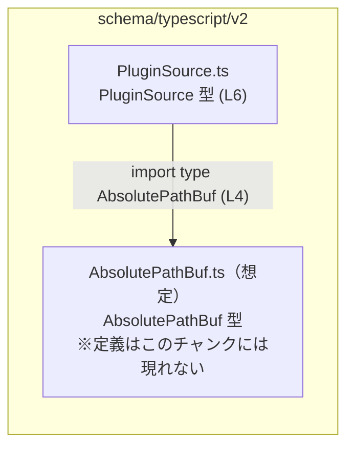
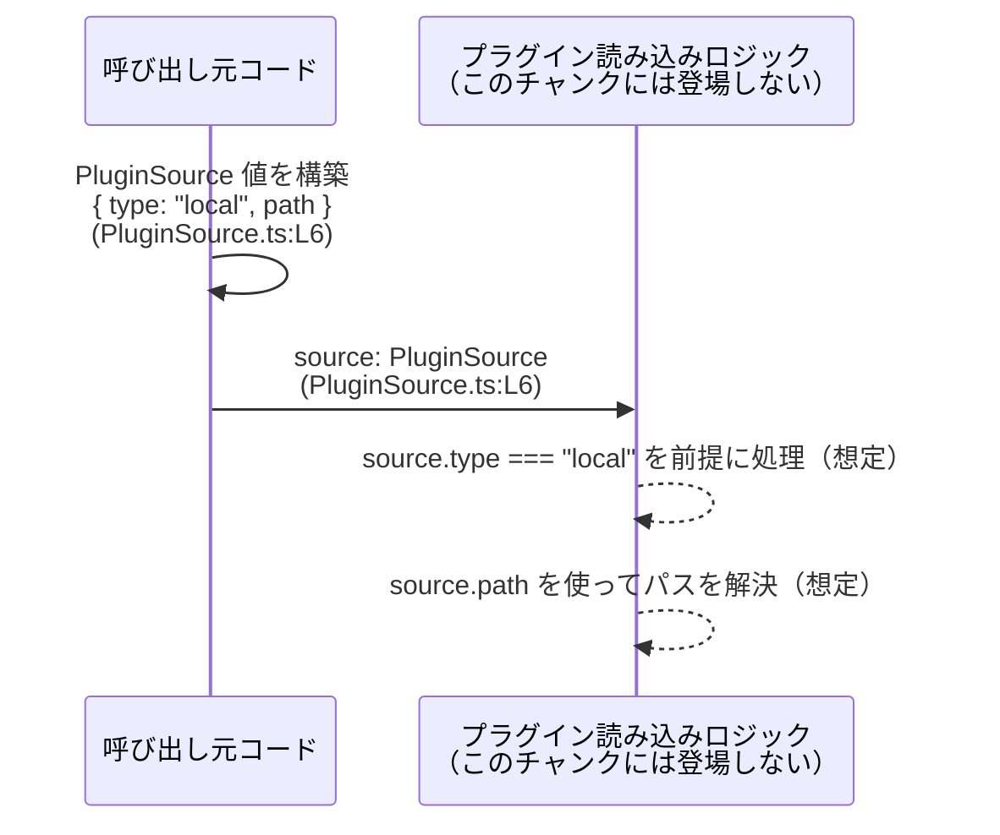

# app-server-protocol\schema\typescript\v2\PluginSource.ts

## 0. ざっくり一言

- `PluginSource` という名前の **型エイリアス** を 1 つ定義し、`{ type: "local", path: AbsolutePathBuf }` という形のオブジェクトを表現するファイルです（`PluginSource.ts:L6`）。
- ファイル全体はツール `ts-rs` によって自動生成されており、手動で編集しないことが明示されています（`PluginSource.ts:L1,L3`）。

---

## 1. このモジュールの役割

### 1.1 概要

- このモジュールは、`PluginSource` 型を TypeScript 側に提供する **スキーマ定義ファイル**です。
- `PluginSource` 型は `"type"` プロパティに文字列リテラル `"local"` を持ち、`path` プロパティに `AbsolutePathBuf` 型を持つオブジェクトとして定義されています（`PluginSource.ts:L6`）。
- 実行時の処理ロジックは一切含まず、型情報のみを提供します。

### 1.2 アーキテクチャ内での位置づけ

- `schema/typescript/v2` 配下の 1 ファイルであり、同じ階層にある `AbsolutePathBuf` 定義に依存しています（`PluginSource.ts:L4`）。
- 依存関係は **型インポートのみ** で、実行時依存関係はありません（`import type` によるインポートのため、`PluginSource.ts:L4`）。



### 1.3 設計上のポイント

- **自動生成コード**  
  - 冒頭コメントで「GENERATED CODE」「Do not edit this file manually」と明示されており（`PluginSource.ts:L1,L3`）、生成元の定義から再生成される前提になっています。
- **型専用モジュール**  
  - `import type` と `export type` のみを含み、値や関数の定義はありません（`PluginSource.ts:L4,L6`）。
- **判別可能なオブジェクト型**  
  - `"type"` プロパティに `"local"` を指定した文字列リテラル型を使っており、将来的なユニオン型の一部（判別共用体）のように設計されていることが読み取れます（`PluginSource.ts:L6`）。
- **パス表現の分離**  
  - パスそのものの表現は `AbsolutePathBuf` 型に委ねており、パス構造の詳細は別モジュールに集約されています（`PluginSource.ts:L4,L6`）。

---

## 2. 主要な機能一覧

このファイルは型定義のみですが、「機能」として次の 2 点を提供しています。

- `PluginSource` 型定義: `"type": "local"` と `path: AbsolutePathBuf` を持つオブジェクト型を公開する（`PluginSource.ts:L6`）。
- `AbsolutePathBuf` 型の再利用: `PluginSource.path` の型として `AbsolutePathBuf` を参照し、パスの表現を他モジュールと共有する（`PluginSource.ts:L4,L6`）。

---

## 3. 公開 API と詳細解説

### 3.1 型一覧（構造体・列挙体など）

#### 型・インポートのインベントリー

| 名前 | 種別 | 役割 / 用途 | 根拠 |
|------|------|-------------|------|
| `PluginSource` | 型エイリアス（オブジェクト型） | `"type": "local"` と `path: AbsolutePathBuf` プロパティを持つ値を表す。プラグインの「ソース」を表す型名ですが、このファイルだけでは具体的用途までは分かりません。 | `PluginSource.ts:L6` |
| `AbsolutePathBuf` | インポートされた型 | `PluginSource.path` プロパティの型として使用されるパス表現。詳細定義は別ファイルにあり、このチャンクには現れません。 | `PluginSource.ts:L4,L6` |

#### `PluginSource` の構造（詳細）

`PluginSource` は次のような構造を持つオブジェクト型です（`PluginSource.ts:L6`）。

```typescript
export type PluginSource = {
    "type": "local";        // 文字列リテラル型 "local" に固定
    path: AbsolutePathBuf;  // 別モジュールで定義された AbsolutePathBuf 型
};
```

- プロパティ名 `"type"` はダブルクォートで囲まれていますが、TypeScript では通常の識別子 `type` と同じ意味になります。
- `"type"` プロパティは **文字列リテラル型 `"local"`** のため、他の文字列（例: `"remote"`）を代入しようとするとコンパイルエラーになります。
- `path` プロパティは `AbsolutePathBuf` 型であり、型レベルで「何らかのパスを表す型」に制約されています。

### 3.2 関数詳細（最大 7 件）

- このファイルには関数定義は一切存在しません（コメント・import・type 定義のみ、`PluginSource.ts:L1-L6`）。
- そのため、関数詳細テンプレートに対応する API はありません。

### 3.3 その他の関数

- 該当なし（関数・メソッドは定義されていません）。

---

## 4. データフロー

このファイル自体には処理ロジックが存在しないため、**実際のコードに現れるデータフローは読み取れません**。  
ここでは、「`PluginSource` 型の値がどのように利用されうるか」という **抽象的な利用イメージ** を示します（この図に出てくる `loadPlugin` 等の名前は例示であり、このリポジトリ内に実在するとは限りません）。

### 抽象的な利用シナリオ

1. 呼び出し元コードが、`PluginSource` 型の値 `{ type: "local", path }` を生成する（`PluginSource.ts:L6`）。
2. その値を、プラグイン読み込みや初期化を行うロジックに渡す。
3. 読み込み側は `source.type` を見て `"local"` であることを前提に、`source.path` を使った処理を行う。



※ 上記の `Loader` や具体的な処理内容は、このファイルからは読み取れないため「想定」として記載しています。

---

## 5. 使い方（How to Use）

### 5.1 基本的な使用方法

`PluginSource` 型を他の TypeScript コードから利用する基本例です。  
`AbsolutePathBuf` がどのような型かはこのチャンクでは不明なので、ここでは `somePath` という変数が `AbsolutePathBuf` 型であると仮定します。

```typescript
// PluginSource 型をインポートする（相対パスはプロジェクト構成に応じて調整する）
import type { PluginSource } from "./PluginSource"; // PluginSource.ts:L6 で定義されている型

// どこか別のモジュールで定義されていると想定される AbsolutePathBuf 型の値
declare const somePath: import("./AbsolutePathBuf").AbsolutePathBuf; 
// ↑ AbsolutePathBuf の具体的な生成方法はこのチャンクには現れないため、例として declare を使用

// PluginSource 型の値を作成する
const source: PluginSource = {
    type: "local",  // "local" 以外を指定するとコンパイルエラーになる（文字列リテラル型）
    path: somePath, // AbsolutePathBuf 型の値が必要
};

// 以降、source をプラグイン関連の処理に渡して利用することが想定される
```

ポイント:

- `type` プロパティに `"local"` 以外を指定すると **コンパイルエラー** になります（型安全性）。
- `path` には `AbsolutePathBuf` 型以外の値は代入できません（型チェックにより保証されます）。

### 5.2 よくある使用パターン

#### 1. 関数の引数として受け取る

`PluginSource` を引数に取る関数のシグネチャ例です（関数本体は例示であり、このリポジトリ内の実在コードではありません）。

```typescript
import type { PluginSource } from "./PluginSource";

// PluginSource 型を受け取って何らかの処理を行う関数
function initializeFromSource(source: PluginSource) { // source の型は PluginSource に固定
    // source.type は常に "local" と推論される
    // source.path からパス情報を取得する処理を書くことが想定される
}
```

- 呼び出し側は、`type: "local"` と `path: AbsolutePathBuf` を満たすオブジェクトを渡す必要があります。
- 受け取り側では、`source.type` が `"local"` であることが型レベルで保証されるため、`switch` 文などで他のバリアントと分岐する必要は現状ありません。

### 5.3 よくある間違い

#### 間違い例: `type` に `"local"` 以外を指定する

```typescript
import type { PluginSource } from "./PluginSource";

const badSource: PluginSource = {
    // type: "remote", // ❌ コンパイルエラー: "remote" は "local" 型に代入できない
    type: "local",      // ✅ 正しい値
    path: {} as any,    // ここでは簡略化のため any からキャストしているが、実際には AbsolutePathBuf 型を使うべき
};
```

#### 間違い例: `path` に文字列などを直接入れる

```typescript
import type { PluginSource } from "./PluginSource";

const badSource2: PluginSource = {
    type: "local",
    // path: "/tmp/plugin" // ❌ string 型は AbsolutePathBuf 型に代入できない（コンパイルエラー）
    path: {} as any,      // ✅ 型チェックを回避しているが、安全ではない例（実務では避ける）
};
```

#### 正しい例（型安全）

```typescript
import type { PluginSource } from "./PluginSource";
import type { AbsolutePathBuf } from "./AbsolutePathBuf";

// AbsolutePathBuf 型の値を用意できると仮定
declare const pathBuf: AbsolutePathBuf;

const goodSource: PluginSource = {
    type: "local", // OK
    path: pathBuf, // OK: AbsolutePathBuf 型
};
```

### 5.4 使用上の注意点（まとめ）

- **コンパイル時のみの安全性**  
  - このファイルは型定義のみであり、実行時のバリデーションは行いません。実行時に渡される値が本当に `{ type: "local", path: AbsolutePathBuf }` の形をしているかは、別途チェックする必要があります。
- **`type` プロパティの値は `"local"` のみ**  
  - 現状の定義では `"local"` 以外は許可されません（`PluginSource.ts:L6`）。他の種別を扱いたい場合は生成元の定義を変更し、再生成する必要があります。
- **自動生成ファイルを直接編集しない**  
  - 冒頭コメントにある通り、手動での編集は禁止されています（`PluginSource.ts:L1,L3`）。直接編集すると、次回の自動生成で上書きされる可能性があります。
- **並行性・非同期性の懸念はない**  
  - このファイルは型情報のみを提供し、非同期処理や共有状態を扱わないため、並行性に関連する問題はありません。

---

## 6. 変更の仕方（How to Modify）

### 6.1 新しい機能を追加する場合

このファイルは `ts-rs` による **自動生成** であり、コメントでも手動変更が禁止されています（`PluginSource.ts:L1,L3`）。新しいプロパティやバリアントを追加したい場合は、次のような方針になります。

1. **生成元の定義を変更する**  
   - `PluginSource` に相当する生成元（ts-rs の入力となる定義）を変更する必要があります。  
   - その場所や言語（おそらく別の言語の型定義）は、このチャンクからは分かりません。
2. **ts-rs による再生成を行う**  
   - 変更した生成元を元に ts-rs を実行し、`PluginSource.ts` を再生成します（`PluginSource.ts:L3` から、ts-rs が生成に使われていることのみ分かります）。
3. **依存箇所の確認**  
   - `PluginSource` 型を利用している TypeScript コードがあれば、新しい構造に合わせてコンパイルエラーが出ていないか確認します。

### 6.2 既存の機能を変更する場合

例えば、`PluginSource` の構造を変更・削除したい場合の注意点です。

- **直接編集しない**  
  - `PluginSource.ts` をそのまま編集しても、次回生成で元に戻る可能性があります（`PluginSource.ts:L1,L3`）。
- **契約（コントラクト）の確認**  
  - 現在の契約:  
    - `type` は `"local"` であること（`PluginSource.ts:L6`）。  
    - `path` は `AbsolutePathBuf` 型であること（`PluginSource.ts:L6`）。  
  - これらを変更すると、それに依存するコード（`source.type` を `"local"` 前提で扱っているなど）が破壊される可能性があります。
- **型エラーによる影響範囲の検出**  
  - 生成後に TypeScript コンパイラを実行し、`PluginSource` の利用箇所での型エラーを確認することで、影響範囲を把握できます。
- **テストコードについて**  
  - このチャンクにはテストに関する記述はありません。テストの有無や場所は不明です。

---

## 7. 関連ファイル

このモジュールと直接関係するファイル・ディレクトリは、インポートやパスから次のように読み取れます。

| パス（推定を含む） | 役割 / 関係 |
|--------------------|------------|
| `app-server-protocol/schema/typescript/v2/PluginSource.ts` | 本レポートの対象。`PluginSource` 型を定義する自動生成ファイル。 |
| `app-server-protocol/schema/typescript/v2/AbsolutePathBuf.ts`（推定） | `import type { AbsolutePathBuf } from "../AbsolutePathBuf";` に対応すると考えられるファイル。`PluginSource.path` の型を提供するが、このチャンクには定義が現れない（`PluginSource.ts:L4`）。 |
| ts-rs の生成元定義（場所不明） | 冒頭コメントから、このファイルは ts-rs により生成されていることが分かる（`PluginSource.ts:L3`）。生成元がどこにあるか、どのような言語・ファイル構造かは、このチャンクからは分かりません。 |

※ 上記のうち、`AbsolutePathBuf.ts` や生成元定義の具体的な内容は、このチャンクには現れず、「相対パス」およびコメントから推測したものです。
