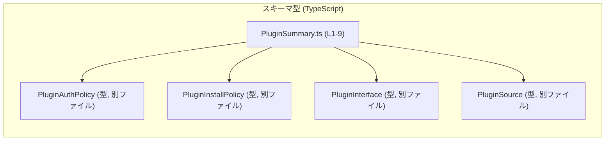
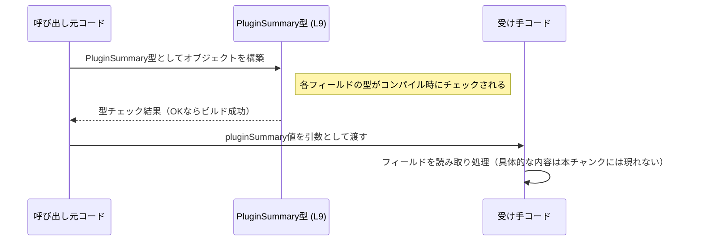

# app-server-protocol/schema/typescript/v2/PluginSummary.ts コード解説

## 0. ざっくり一言

`PluginSummary.ts` は、プラグインの概要情報を表す **TypeScript の型エイリアス**を定義した、ts-rs による自動生成ファイルです（手動編集禁止, PluginSummary.ts:L1-3）。

---

## 1. このモジュールの役割

### 1.1 概要

- このモジュールは、プラグインの **ID・名前・ソース・インストール状態・有効/無効・インストールポリシー・認証ポリシー・インターフェース** をまとめて表す `PluginSummary` 型を提供します（PluginSummary.ts:L9-9）。
- ディレクトリ構成（`app-server-protocol/schema/typescript/v2`）から、アプリケーションサーバーの **プロトコル用スキーマ**として利用される型と解釈できます。ただし、具体的な利用箇所はこのチャンクには現れません。

### 1.2 アーキテクチャ内での位置づけ

このファイルは、他の型定義モジュールに依存していますが、自身は **型定義のみ**を提供し、ロジックは持ちません。



- 依存関係の根拠:
  - `import type { PluginAuthPolicy } from "./PluginAuthPolicy";`（PluginSummary.ts:L4-4）
  - `import type { PluginInstallPolicy } from "./PluginInstallPolicy";`（L5-5）
  - `import type { PluginInterface } from "./PluginInterface";`（L6-6）
  - `import type { PluginSource } from "./PluginSource";`（L7-7）
- `export type PluginSummary = {...}` で、上記型をフィールドとして利用しています（L9-9）。

### 1.3 設計上のポイント

- **自動生成コード**  
  - 冒頭コメントに「GENERATED CODE! DO NOT MODIFY BY HAND!」とあり（L1-1, L3-3）、ts-rs により生成されたファイルです。
- **型専用インポート**  
  - すべて `import type` で読み込んでおり、ランタイムには影響しない純粋な型定義です（L4-7）。
- **単一のエクスポート**  
  - `export type PluginSummary = { ... }` だけを公開し、関数やクラスなどのロジックはありません（L9-9）。
- **null を許容するフィールド**  
  - `interface: PluginInterface | null` によって、インターフェース情報が存在しないケースを明示的に表現しています（L9-9）。
- **状態を表すブール値**  
  - `installed: boolean` および `enabled: boolean` で、プラグインの状態をシンプルに表現します（L9-9）。

---

## 2. 主要な機能一覧

このファイルは型定義のみですが、`PluginSummary` により次の情報を 1 つのオブジェクトに集約できます（PluginSummary.ts:L9-9）。

- プラグインの識別: `id: string`, `name: string`
- プラグインのソース種別: `source: PluginSource`
- インストール状態: `installed: boolean`
- 有効/無効状態: `enabled: boolean`
- インストールポリシー: `installPolicy: PluginInstallPolicy`
- 認証ポリシー: `authPolicy: PluginAuthPolicy`
- 利用可能なインターフェース: `interface: PluginInterface | null`

---

## 3. 公開 API と詳細解説

### 3.1 型一覧（構造体・列挙体など）

#### コンポーネントインベントリー

| 名前               | 種別                           | 役割 / 用途                                                                 | 根拠 |
|--------------------|--------------------------------|------------------------------------------------------------------------------|------|
| `PluginSummary`    | 型エイリアス（オブジェクト型） | プラグインの概要情報を 1 つのオブジェクトとして表現する                    | PluginSummary.ts:L9-9 |
| `PluginAuthPolicy` | 型（詳細不明, 別ファイル）     | 認証ポリシーを表す型（名前からの推測。詳細は本チャンクには現れません）      | PluginSummary.ts:L4-4 |
| `PluginInstallPolicy` | 型（詳細不明, 別ファイル）  | インストールポリシーを表す型（名前からの推測。同上）                        | PluginSummary.ts:L5-5 |
| `PluginInterface`  | 型（詳細不明, 別ファイル）     | プラグインのインターフェース定義（名前からの推測。同上）                    | PluginSummary.ts:L6-6 |
| `PluginSource`     | 型（詳細不明, 別ファイル）     | プラグインのソース種別（名前からの推測。同上）                              | PluginSummary.ts:L7-7 |

> 注: インポートされた型の中身はこのチャンクには現れないため、「用途」は名前からの推測であり、正確な定義は該当ファイルを参照する必要があります。

#### `PluginSummary` フィールド一覧

`PluginSummary` のフィールド構造は次の通りです（PluginSummary.ts:L9-9）。

```ts
export type PluginSummary = {
    id: string,
    name: string,
    source: PluginSource,
    installed: boolean,
    enabled: boolean,
    installPolicy: PluginInstallPolicy,
    authPolicy: PluginAuthPolicy,
    interface: PluginInterface | null,
};
```

| フィールド名     | 型                         | 説明（名前からの解釈）                                     | null許容 | 根拠 |
|------------------|----------------------------|------------------------------------------------------------|----------|------|
| `id`             | `string`                  | プラグインの一意な識別子                                  | 不可     | PluginSummary.ts:L9-9 |
| `name`           | `string`                  | プラグインの表示名または名称                              | 不可     | L9-9 |
| `source`         | `PluginSource`            | プラグインの入手元（マーケットプレイス、ローカル等）      | 不可     | L9-9 |
| `installed`      | `boolean`                 | プラグインがインストール済みかどうか                      | 不可     | L9-9 |
| `enabled`        | `boolean`                 | プラグインが有効化されているかどうか                      | 不可     | L9-9 |
| `installPolicy`  | `PluginInstallPolicy`      | インストールに関するポリシー設定                           | 不可     | L9-9 |
| `authPolicy`     | `PluginAuthPolicy`         | 認証・権限に関するポリシー設定                             | 不可     | L9-9 |
| `interface`      | `PluginInterface \| null` | プラグインが提供するインターフェース情報（ない場合は null）| 可       | L9-9 |

> 空文字や特定形式などの制約はこの型定義からは分からず、上位レイヤーのバリデーションに依存します。

### 3.2 関数詳細（最大 7 件）

本ファイルには **関数・メソッドの定義は存在しません**（PluginSummary.ts:L1-9）。  
したがって、このセクションで詳細解説すべき関数はありません。

### 3.3 その他の関数

同様に、補助的な関数やラッパー関数も定義されていません（PluginSummary.ts:L1-9）。

---

## 4. データフロー

このファイル自体には処理ロジックはありませんが、`PluginSummary` 型の値が他モジュールを行き来する **一般的な利用イメージ**を示します。  
実際の呼び出し元・呼び出し先は本チャンクからは分からないため、あくまで抽象的な例です。



この図が表すポイント:

- `PluginSummary` は **コンパイル時の型チェック**に利用され、実行時には通常プレーンなオブジェクトとして扱われます。
- フィールド値の妥当性（空文字禁止など）は、この型定義では保証されず、呼び出し元・呼び出し先の実装に依存します。

---

## 5. 使い方（How to Use）

### 5.1 基本的な使用方法

`PluginSummary` 型を利用して、プラグイン情報オブジェクトを型安全に扱う例です。

```ts
// 型のインポート（実際のパスはプロジェクト構成に依存します）
import type { PluginSummary } from "./PluginSummary"; // パスは例示

// プラグイン情報を構築する
const plugin: PluginSummary = {
    id: "plugin-123",             // string 必須
    name: "Sample Plugin",        // string 必須
    source: "Marketplace" as any, // PluginSource 型の値（ここではダミー）
    installed: true,              // boolean 必須
    enabled: false,               // boolean 必須
    installPolicy: {} as any,     // PluginInstallPolicy 型の値（ダミー）
    authPolicy: {} as any,        // PluginAuthPolicy 型の値（ダミー）
    interface: null,              // PluginInterface | null
};

// 利用する側でのフィールドアクセスの例
if (plugin.enabled && plugin.installed) {
    console.log(`有効なプラグイン: ${plugin.name}`);
}
```

- すべてのフィールドが必須であり、欠けているとコンパイルエラーになります（PluginSummary.ts:L9-9）。
- 実際には `PluginSource` や `PluginInstallPolicy` などに適切な型値を渡す必要がありますが、その定義は本チャンクにはありません。

### 5.2 よくある使用パターン

#### パターン1: プラグイン一覧の管理

`PluginSummary` の配列としてプラグイン一覧を管理し、フィルターする例です。

```ts
import type { PluginSummary } from "./PluginSummary";

const plugins: PluginSummary[] = /* どこかから取得した配列 */ [];

// 有効かつインストール済みのプラグインのみ抽出
const activePlugins = plugins.filter(
    (p) => p.installed && p.enabled, // boolean フィールドに基づいてフィルタリング
);

// インターフェース情報が存在するものだけ抽出
const withInterface = plugins.filter(
    (p) => p.interface !== null,     // interface は null 許容なのでチェックが必要
);
```

#### パターン2: interface フィールドの安全な利用

```ts
import type { PluginSummary } from "./PluginSummary";

function usePluginInterface(plugin: PluginSummary) {
    if (plugin.interface === null) {
        // インターフェースが未提供の場合の処理
        console.warn(`プラグイン ${plugin.name} はインターフェースを提供していません`);
        return;
    }

    // ここでは plugin.interface は PluginInterface 型として安全に扱える
    const pluginInterface = plugin.interface;
    // pluginInterface に対する処理（詳細は PluginInterface の定義に依存）
}
```

### 5.3 よくある間違い

#### 間違い例: `interface` の null を考慮しない

```ts
import type { PluginSummary } from "./PluginSummary";

function badUse(plugin: PluginSummary) {
    // 間違い: interface フィールドが null の可能性を無視している
    // TypeScript 的には plugin.interface の型に null が含まれているため、
    // strictNullChecks 有効時にはコンパイルエラーになる可能性が高い。
    plugin.interface.doSomething(); // 実行時にエラーになりうる
}
```

#### 正しい例: null チェックを行う

```ts
function goodUse(plugin: PluginSummary) {
    if (!plugin.interface) {
        // null または falsy な場合の処理
        return;
    }

    // ここでは PluginInterface 型として安全に扱える
    plugin.interface.doSomething();
}
```

### 5.4 使用上の注意点（まとめ）

- **このファイルを直接編集しない**  
  - L1-3 に明示されている通り、自動生成ファイルであり、変更は元の定義（Rust 側など）で行う必要があります。
- **null の扱い**  
  - `interface` は `PluginInterface | null` であるため、利用前に null チェックが必要です（PluginSummary.ts:L9-9）。
- **値の妥当性検証は別途必要**  
  - `id` や `name` は単なる `string` であり、空文字や特定形式の制約は型からは読み取れません。必要であれば上位でバリデーションを行う必要があります。
- **セキュリティ上の意味付けは型からは分からない**  
  - `authPolicy` や `installPolicy` はポリシーを表す型ですが、本チャンクだけではポリシー内容や強制方法は不明です。実際のアクセス制御は別のロジックで行われます。

---

## 6. 変更の仕方（How to Modify）

### 6.1 新しい機能を追加する場合

このファイルは ts-rs による自動生成であり、直接編集すべきではありません（PluginSummary.ts:L1-3）。

一般的な手順（具体的な元定義の場所はこのチャンクからは不明）:

1. **元の型定義を特定する**  
   - コメントから ts-rs で生成されていることが分かるため、通常は Rust 側に `PluginSummary` 相当の struct などが存在します（L3-3）。
2. **元定義にフィールドを追加・変更**  
   - 例えば Rust の struct にフィールドを追加し、ts-rs の属性により TypeScript 型を生成する設定を行います。
3. **コード生成を再実行する**  
   - ts-rs を再度実行し、`PluginSummary.ts` を再生成します。
4. **コンパイルエラーで影響範囲を確認する**  
   - フィールド追加・型変更により、`PluginSummary` を利用している TypeScript コードがコンパイルエラーになる可能性があります。それらを修正します。

### 6.2 既存の機能を変更する場合

- **フィールドの削除・型変更の注意点**
  - 例えば `enabled: boolean` を削除したり型を変更すると、既存コードの多くがコンパイルエラーになる可能性があります（PluginSummary.ts:L9-9）。
  - 変更前に、コードベース全体で `PluginSummary` の使用箇所を検索し、影響範囲を確認する必要があります。
- **null 許容から非許容への変更**
  - `interface: PluginInterface | null` を `PluginInterface` に変更した場合、null を前提にしたコードが壊れます。移行期間を設けるなどの配慮が必要です。
- **後方互換性**
  - プロトコルのスキーマとして利用されている場合（ディレクトリ構成からの推測）、クライアント／サーバー間の互換性にも影響するため、バージョニング（例: v2 → v3 ディレクトリ）との整合を取る必要があります。

---

## 7. 関連ファイル

このモジュールと密接に関係するファイル（インポート先）は次の通りです。

| パス                     | 役割 / 関係 |
|--------------------------|------------|
| `./PluginAuthPolicy`     | `PluginAuthPolicy` 型を提供するモジュール。`authPolicy` フィールドの型として利用されています（PluginSummary.ts:L4-4, L9-9）。中身はこのチャンクには現れません。 |
| `./PluginInstallPolicy`  | `PluginInstallPolicy` 型を提供するモジュール。`installPolicy` フィールドの型として利用されています（L5-5, L9-9）。 |
| `./PluginInterface`      | `PluginInterface` 型を提供するモジュール。`interface` フィールドの型として利用されています（L6-6, L9-9）。 |
| `./PluginSource`         | `PluginSource` 型を提供するモジュール。`source` フィールドの型として利用されています（L7-7, L9-9）。 |
| ts-rs（外部ツール）      | コメントにより、このファイルを生成したツールとして言及されています（PluginSummary.ts:L3-3）。元となる型定義は ts-rs の入力側に存在すると考えられます。 |

---

### Bugs / Security / Edge cases / Tests / Performance について（このファイルに関する要点）

- **バグの可能性**
  - このファイル単体にはロジックがなく、バグは主に「型の誤解」から生じます（例: `interface` の null を扱わない）。
- **セキュリティ**
  - `authPolicy` がセキュリティ関連情報を持つと推測されますが、実際のチェックは別モジュールです。この型定義だけではセキュリティを保証しません。
- **エッジケース**
  - `id` や `name` が空文字でも型としては許容されるなど、入力値の制約は型レベルでは表現されていません。
- **テスト**
  - TypeScript の型はランタイムには現れないため、主にコンパイル時に正しく利用されているか（`PluginSummary` を期待通りに使用しているか）を確認するテストが対象になりますが、このチャンクから具体的なテストコードは読み取れません。
- **パフォーマンス**
  - 型定義のみであり、実行時のパフォーマンスへの直接的な影響はありません。プラグイン一覧のサイズなど、実際のデータ量による影響はこのファイル外の設計に依存します。
