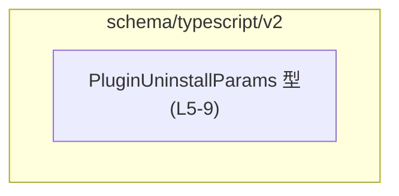
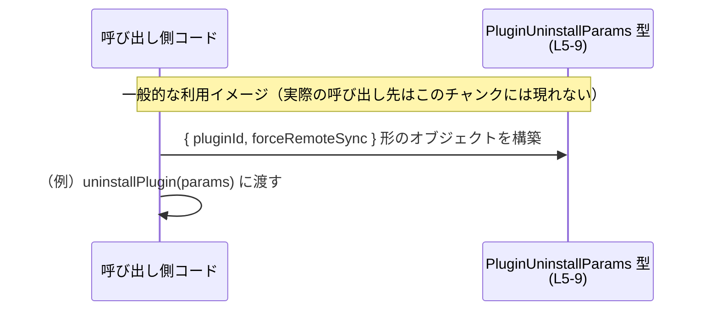

# app-server-protocol\schema\typescript\v2\PluginUninstallParams.ts コード解説

## 0. ざっくり一言

プラグインのアンインストール処理に関する「パラメータの形」を表現する、TypeScript の型定義（生成コード）です（`PluginUninstallParams.ts:L1-5`）。  
`pluginId` と、オプションの `forceRemoteSync` フラグから成るシンプルなデータ構造を提供します（`PluginUninstallParams.ts:L5-9`）。

---

## 1. このモジュールの役割

### 1.1 概要

- このモジュールは、`PluginUninstallParams` という TypeScript の型エイリアスを 1 つだけエクスポートしています（`PluginUninstallParams.ts:L5-5`）。
- `PluginUninstallParams` は、プラグインをアンインストールする際に利用されるパラメータの構造を記述するための型として設計されています（命名とフィールド構成からの解釈）。
- ファイル先頭のコメントから、このコードは Rust 向けライブラリ `ts-rs` によって自動生成されており、手動で編集すべきではないことが分かります（`PluginUninstallParams.ts:L1-3`）。

### 1.2 アーキテクチャ内での位置づけ

このファイルから直接分かるのは、次の点だけです。

- ディレクトリ構成から、`app-server-protocol/schema/typescript/v2` 下にある「スキーマ定義群」の 1 つであると推測されますが、このチャンクだけでは他ファイルとの具体的な依存関係は分かりません。
- import / export は `export type` のみであり、ほかの型を参照していない、完全に自己完結した型定義です（`PluginUninstallParams.ts:L5-9`）。

この範囲で表せる依存関係図は次のようになります。



- 他モジュールや関数からの利用関係は、このチャンクには現れません（不明）。

### 1.3 設計上のポイント

- **自動生成コード**  
  - ファイル先頭に「GENERATED CODE」「Do not edit this file manually」と明記され、`ts-rs` により生成されたことが書かれています（`PluginUninstallParams.ts:L1-3`）。
- **状態を持たないデータ定義のみ**  
  - 実行時のロジック（関数・クラスなど）は一切なく、コンパイル時の型チェックにのみ関わるデータ構造定義です（`PluginUninstallParams.ts:L5-9`）。
- **シンプルな構造**  
  - フィールドは必須の `pluginId: string` と、オプションの `forceRemoteSync?: boolean` の 2 つのみです（`PluginUninstallParams.ts:L5-9`）。
- **エラーハンドリング／並行性**  
  - 型定義のみのため、実行時のエラーハンドリングや並行処理に関するロジックは存在しません。この型を利用する関数やサービス側で、それらを扱う必要があります（このチャンクには現れません）。

---

## 2. 主要な機能一覧

このファイルが提供する「機能」は、すべて型レベルのものです。

- `PluginUninstallParams` 型: プラグインのアンインストール処理に必要なパラメータの形（`pluginId` とオプションの `forceRemoteSync`）を表現する（`PluginUninstallParams.ts:L5-9`）。

---

## 3. 公開 API と詳細解説

### 3.1 型一覧（構造体・列挙体など）

このチャンクに現れる公開コンポーネント（型エイリアス）のインベントリです。

| 名前                   | 種別        | 役割 / 用途                                                                                      | 根拠                             |
|------------------------|-------------|---------------------------------------------------------------------------------------------------|----------------------------------|
| `PluginUninstallParams` | 型エイリアス | プラグインのアンインストール処理に渡すパラメータのオブジェクト形状を定義する。`pluginId` と `forceRemoteSync` を含む。 | `PluginUninstallParams.ts:L5-9` |

#### `PluginUninstallParams` のフィールド

| フィールド名       | 型       | 必須/任意 | 説明                                                                                              | 根拠                             |
|--------------------|----------|-----------|---------------------------------------------------------------------------------------------------|----------------------------------|
| `pluginId`         | `string` | 必須      | 対象プラグインを識別する文字列 ID。                                                              | `PluginUninstallParams.ts:L5-5` |
| `forceRemoteSync`  | `boolean` (`?`) | 任意（オプション） | `true` のとき、ローカルなアンインストール処理より前に「リモート側のプラグイン変更を適用」することを示すフラグ。 | `PluginUninstallParams.ts:L6-9` |

- `forceRemoteSync` の説明コメントは JSDoc 形式で埋め込まれており、「When true, apply the remote plugin change before the local uninstall flow.」と記載されています（`PluginUninstallParams.ts:L6-8`）。

### 3.2 関数詳細

- このファイルには、関数・メソッド・クラスコンストラクタなどの実行可能なコードは一切定義されていません（`PluginUninstallParams.ts:L1-9`）。
- そのため、「関数詳細テンプレート」を適用できる対象はありません。

### 3.3 その他の関数

- 補助関数やラッパー関数も、このチャンクには存在しません（`PluginUninstallParams.ts:L1-9`）。

---

## 4. データフロー

このファイル自体には関数呼び出しや I/O は登場しませんが、`PluginUninstallParams` 型がどのように利用されるかの「一般的なイメージ」を示します。  
※以下の図は、この型の典型的な使い方の例であり、具体的な呼び出し先関数名などはこのチャンクからは分かりません。



この図が表している要点:

- 呼び出し側コードは、`PluginUninstallParams` に適合するオブジェクトを組み立てる必要があります。
- `forceRemoteSync` はオプションなので、省略するかどうかは呼び出し側の判断に委ねられます。
- 型定義だけでは、実際にどのサービス・API に渡されるかは分かりません。

---

## 5. 使い方（How to Use）

### 5.1 基本的な使用方法

ここでは、`PluginUninstallParams` 型を使用したオブジェクト生成と、仮想的なアンインストール関数への渡し方の例を示します。  
※`uninstallPlugin` 関数は、このファイルには定義されていない「例示用の関数」です。

```typescript
// 型定義のインポート例（実際のパスはプロジェクト構成に依存する）
import type { PluginUninstallParams } from "./schema/typescript/v2/PluginUninstallParams";

// （例）プラグインをアンインストールする関数のシグネチャ例
// 実際には別のファイルに定義されていると想定されます（このチャンクには現れません）。
async function uninstallPlugin(params: PluginUninstallParams): Promise<void> {
    // ここで params.pluginId や params.forceRemoteSync を使って処理すると想定されます
}

// PluginUninstallParams を使った基本的な呼び出し例
const params: PluginUninstallParams = {
    pluginId: "my-plugin-id",         // 必須フィールド: string 型で指定
    forceRemoteSync: true,           // オプション: 必要な場合のみ指定
};

await uninstallPlugin(params);
```

この例から分かる点:

- TypeScript の型チェックにより、`pluginId` が `string` でない場合や、存在しないフィールド名を使った場合にはコンパイル時にエラーになります。
- `forceRemoteSync` はオプションなので、指定しなければ `undefined` と同等になり、「デフォルトの挙動（リモート同期の有無）」は呼び出し先の実装に委ねられます。

### 5.2 よくある使用パターン

#### パターン 1: 最小限の情報だけ渡す（`forceRemoteSync` を省略）

```typescript
const paramsMinimal: PluginUninstallParams = {
    pluginId: "plugin-basic",       // 必須のみ
    // forceRemoteSync は省略可能
};
```

- この場合、`forceRemoteSync` は `undefined` になり、呼び出し側から「特別な指示」を出さない形になります。

#### パターン 2: 明示的にリモート同期を優先する

```typescript
const paramsForceRemote: PluginUninstallParams = {
    pluginId: "plugin-remote-sync",
    forceRemoteSync: true,         // コメントに記載の通り、リモート変更を先に適用する意図
};
```

- JSDoc コメント（`PluginUninstallParams.ts:L6-8`）の説明通り、「ローカルのアンインストールフローの前に、リモート側のプラグイン変更を適用したい」場合に、`forceRemoteSync: true` を指定する形になります。

### 5.3 よくある間違い

型定義自体はシンプルですが、次のような誤用が起きる可能性があります。

```typescript
// 間違い例 1: pluginId を数値で渡してしまう
const badParams1: PluginUninstallParams = {
    // pluginId: 123,              // コンパイルエラー: number は string に代入できない
    pluginId: "123",                // 正: string にする
};

// 間違い例 2: forceRemoteSync を文字列で渡してしまう
const badParams2: PluginUninstallParams = {
    pluginId: "plugin-1",
    // forceRemoteSync: "true",    // コンパイルエラー: string は boolean に代入できない
    forceRemoteSync: true,          // 正しい指定方法
};

// 間違い例 3: pluginId を指定し忘れる
// const badParams3: PluginUninstallParams = {
//     forceRemoteSync: true,       // コンパイルエラー: pluginId が必須フィールド
// };
```

- TypeScript を利用していれば、これらの誤りはコンパイル時に検出されます。
- ただし、実行時にオブジェクトを動的に構築する場合など、型チェックをすり抜ける場面では、別途バリデーションが必要になることがあります（このファイルには実行時バリデーションは含まれません）。

### 5.4 使用上の注意点（まとめ）

- **前提条件**
  - `pluginId` は必須であり、空文字列でないことなどのビジネスルールは、別途（アプリケーション側で）検証する必要があります。型定義は「string であること」までしか保証しません（`PluginUninstallParams.ts:L5-5`）。
  - `forceRemoteSync` はオプションであり、省略時のデフォルト挙動は呼び出し先に依存します（`PluginUninstallParams.ts:L6-9`）。
- **エラー・型安全性**
  - この型はコンパイル時の型チェックに寄与しますが、実行時のエラーチェックは行いません。外部入力（JSON 等）を直接この型にマッピングする場合は、実行時バリデーションも検討が必要です。
- **並行性**
  - このファイルには状態や副作用がないため、並行性やスレッドセーフティに関する問題はありません。複数の非同期処理から同じオブジェクトを共有する場合は、一般的な JavaScript/TypeScript のオブジェクト共有ルールに従います。
- **生成コードであること**
  - コメントにある通り、`ts-rs` による生成コードなので、直接編集すると再生成時に上書きされる可能性があります（`PluginUninstallParams.ts:L1-3`）。

---

## 6. 変更の仕方（How to Modify）

### 6.1 新しい機能を追加する場合

このファイルは `ts-rs` により自動生成されているため、次の方針が必要になります。

1. **直接編集しない**
   - `// GENERATED CODE! DO NOT MODIFY BY HAND!` と明記されているため（`PluginUninstallParams.ts:L1-1`）、この TypeScript ファイルを直接編集するのは前提として避けるべきです。
2. **元となる Rust 側の定義を変更する**
   - `ts-rs` は Rust の型定義から TypeScript の型を生成するライブラリです。  
     したがって、フィールドの追加・削除・型変更などを行う場合は、元の Rust 型（構造体など）を変更し、`ts-rs` のコード生成を再実行する必要があります。
   - 元の Rust ファイルのパスや型名は、このチャンクには現れないため不明です。
3. **利用側コードの更新**
   - 例えば新しいフラグ `dryRun?: boolean` を追加するような変更をした場合、`PluginUninstallParams` を利用する全ての呼び出しコードで、その新しいフィールドの扱い（指定するかどうか、デフォルト挙動など）を整理する必要があります。

### 6.2 既存の機能を変更する場合

`PluginUninstallParams` の既存フィールドを変更する際に注意すべき点です。

- **`pluginId` の型や名前を変更する場合**
  - このフィールドは必須であるため（`PluginUninstallParams.ts:L5-5`）、名前変更や型変更は多くの呼び出し側コードに影響します。
  - 変更前に、エディタや `grep` などでプロジェクト内の利用箇所を洗い出し、影響範囲を把握することが重要です。
- **`forceRemoteSync` の扱いを変更する場合**
  - オプションフィールドであるため、これを必須に変更したり、デフォルト値の扱いを変えると、既存のコードが未指定で呼び出しているケースとの互換性に影響します。
  - 「未指定のときにどのように扱うか」は、この型を受け取るロジック側の責務となるため、そちらの実装も同時に確認する必要があります。
- **契約（Contract）の維持**
  - ファイルパスと名前から、この型は「プロトコル（や API）レベルの契約」を表現している可能性がありますが、具体的なプロトコル仕様はこのチャンクには現れません。
  - そのため、サーバー／クライアント間で共有される契約である場合、双方のバージョン整合性を確保することが重要です（こちらは一般論であり、具体的な構成は不明）。

---

## 7. 関連ファイル

このチャンクには import 文がなく、他の TypeScript ファイルとの直接的な依存関係は読み取れません（`PluginUninstallParams.ts:L1-9`）。  
ただし、コメントから推測できる関連コンポーネントを整理すると、次のようになります。

| パス / コンポーネント         | 役割 / 関係                                                                                 | 根拠                                      |
|------------------------------|----------------------------------------------------------------------------------------------|-------------------------------------------|
| （Rust 側の元定義・パス不明） | `ts-rs` によってこの TypeScript 型に変換される元の Rust 型（構造体など）。                 | `This file was generated by ts-rs`（`PluginUninstallParams.ts:L2-3`） |
| 他の TypeScript スキーマ群    | 同一ディレクトリ `schema/typescript/v2` 以下に存在するであろう他の型定義ファイル（詳細不明）。 | ディレクトリ名からの推測（このチャンクには現れない）                 |

- 実際にどのファイルが `PluginUninstallParams` を import しているか、どの関数がパラメータとして受け取るか、といった具体的な依存関係は、このチャンクだけからは分かりません。

---

以上が、`app-server-protocol\schema\typescript\v2\PluginUninstallParams.ts` に含まれる公開 API とデータ構造、およびその利用・変更に関する実用的な解説です。
