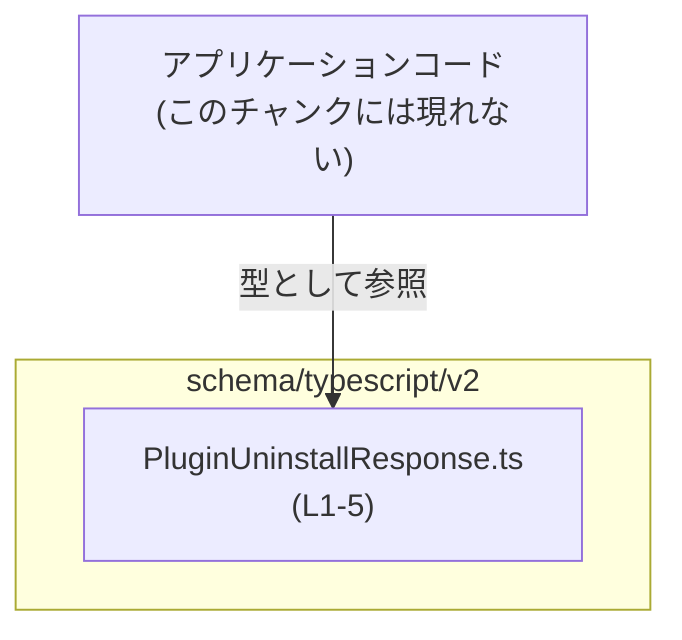

# app-server-protocol/schema/typescript/v2/PluginUninstallResponse.ts

## 0. ざっくり一言

`PluginUninstallResponse` という名前の **レスポンス型（型エイリアス）** を定義し、「キーを一切持たないオブジェクト（実質的に空オブジェクト）」のみを許可する TypeScript 型を提供するファイルです。  
このファイル自体は **ts-rs により自動生成**されており、編集禁止であることがコメントで明示されています。

---

## 1. このモジュールの役割

### 1.1 概要

- このモジュールは、`PluginUninstallResponse` という型エイリアスを定義します。
- `PluginUninstallResponse` は `Record<string, never>` として定義されており、**文字列キーを一切持たないオブジェクト**を表現する型になっています（実質的に「フィールドなしレスポンス」を表す型と解釈できます）  
  根拠: `PluginUninstallResponse.ts:L5-5`
- ファイル先頭のコメントにより、Rust 側から TypeScript 型定義を生成するツール **ts-rs** によって自動生成されたコードであることが示されています。  
  根拠: `PluginUninstallResponse.ts:L1-3`

> 型名とディレクトリ構造から、「プラグインのアンインストール操作に対するレスポンスを表現するための型」であると想定できますが、具体的な API のエンドポイントやフィールド仕様などは、このチャンクのコードからは断定できません。

### 1.2 アーキテクチャ内での位置づけ

このファイル単体から読み取れる位置づけは次のとおりです。

- `app-server-protocol/schema/typescript/v2` 配下にあるため、**アプリケーションサーバのプロトコル定義 (schema) を TypeScript で表現した一部**と位置づけられます。
- 型エイリアスのみを提供し、自身から他モジュールを import していないため、**依存先はなく、依存される側（参照される側）専用の定義モジュール**になっています。  
  根拠: import 文や他の式が存在しない `PluginUninstallResponse.ts:L1-5`

このチャンク内だけでわかる範囲の依存関係イメージは以下のとおりです。



- `APP` ノード（アプリケーションコード側）は、このチャンクには登場しませんが、`PluginUninstallResponse` 型を import して利用する側として図示しています。

### 1.3 設計上のポイント

このファイルから読み取れる設計上の特徴は次のとおりです。

- **自動生成コードであることの明示**  
  - ファイル先頭のコメントで「GENERATED CODE」「Do not edit manually」と明示し、手動編集を防ぐ設計になっています。  
    根拠: `PluginUninstallResponse.ts:L1-3`
- **状態やロジックを持たない純粋な型定義**  
  - クラス・関数・変数定義が存在せず、型エイリアスのみを提供しています。  
    根拠: `PluginUninstallResponse.ts:L5-5`
- **空オブジェクトのみを許容する契約の明文化**  
  - `Record<string, never>` により、「どのキーにも値を持てないオブジェクト」を表す型になっており、レスポンスペイロードが空であることを型レベルで表現しています。  
    根拠: `PluginUninstallResponse.ts:L5-5`
- **エラーハンドリングや並行処理はこのファイルには存在しない**  
  - 実行時コードがないため、エラーハンドリング・同期/非同期制御はここでは行っていません。

---

## 2. 主要な機能一覧

このモジュールは「機能」と呼べる実行時ロジックを持たず、**1 つの型定義のみ**を提供します。

- `PluginUninstallResponse`: 「文字列キーを一切持たないオブジェクト（実質的に空オブジェクト）」を表すレスポンス型エイリアス

---

## 3. 公開 API と詳細解説

### 3.0 コンポーネントインベントリー（このチャンク）

このチャンクに現れる型・関数の一覧です。

| 名前                     | 種別         | 役割 / 用途                                                                 | 定義位置                                   |
|--------------------------|--------------|------------------------------------------------------------------------------|--------------------------------------------|
| `PluginUninstallResponse` | 型エイリアス | プラグインアンインストールに関するレスポンスとして、空オブジェクトのみを許容する型 | `PluginUninstallResponse.ts:L5-5` |

※ 関数・クラス・列挙体はこのチャンクには存在しません。

### 3.1 型一覧（構造体・列挙体など）

| 名前                     | 種別         | 役割 / 用途                                                                                           | フィールド / 型の概要                                            | 定義位置                                   |
|--------------------------|--------------|--------------------------------------------------------------------------------------------------------|------------------------------------------------------------------|--------------------------------------------|
| `PluginUninstallResponse` | 型エイリアス | プラグインアンインストール操作のレスポンスを表すと解釈できる型。空オブジェクトのみを許容する。 | `Record<string, never>`（任意の文字列キーに対して値の型が `never`） | `PluginUninstallResponse.ts:L5-5` |

#### `PluginUninstallResponse` の意味（TypeScript 観点）

- `Record<string, never>` は、**任意の文字列キーを持つオブジェクト**を表すユーティリティ型ですが、値の型が `never` であるため、
  - そのキーに実際に値を持つことができない（`never` は決して存在しない値の型）という性質があります。
- したがって、通常の静的型チェックの範囲では、「**文字列プロパティを一切持たないオブジェクト**」として扱われます。
  - 例: `{}` は `PluginUninstallResponse` に代入可能
  - 例: `{ message: "ok" }` は `PluginUninstallResponse` には代入不可（型エラー）

TypeScript の型システムの範囲で、「レスポンスボディにはフィールドが存在しないこと」を表現するための型と見ることができます。

### 3.2 関数詳細（最大 7 件）

このファイルには関数定義が存在しないため、このセクションで詳細に説明すべき関数はありません。  
根拠: `PluginUninstallResponse.ts:L1-5` に `function` / `=>` を含む関数宣言が存在しない。

### 3.3 その他の関数

このファイルには補助関数やラッパー関数も含め、一切の関数が存在しません。

---

## 4. データフロー

このファイル自体には実行時ロジックはありませんが、`PluginUninstallResponse` 型がどのように利用されるかの典型的なデータフローを、「型利用の観点」で図示します。

ここでは、**アプリケーションコードがプラグインアンインストール API のレスポンスを処理するときにこの型を使う**、という想定シナリオを示します（具体的な API 名や URL はこのチャンクには現れないため、不明です）。

```mermaid
sequenceDiagram
    participant Caller as 呼び出し側コード
    participant Schema as PluginUninstallResponse型(L5)

    Note over Schema: 定義: Record&lt;string, never&gt;\n(PluginUninstallResponse.ts L5)

    Caller->>Schema: 型注釈として利用
    Schema-->>Caller: 「空オブジェクトのみ許容」という制約を提供
    Caller->>Caller: 受信データを PluginUninstallResponse として扱う
```

この図が表している要点は次のとおりです。

- 実際の通信処理（HTTP など）は別のコードが担当します（このチャンクには現れません）。
- その結果として得られる「レスポンスオブジェクト」に対して、`PluginUninstallResponse` 型が静的型注釈として適用されることを想定しています。
- 型システム上、「レスポンスには追加フィールドを定義しない」という契約を強制する役割を果たします。

---

## 5. 使い方（How to Use）

### 5.1 基本的な使用方法

`PluginUninstallResponse` 型を利用して、「プラグインアンインストール API のレスポンスは空オブジェクトである」という前提を TypeScript に伝える使い方の例です。

```typescript
// 型をインポートする（実際の相対パスはプロジェクト構成によって異なる）
import type { PluginUninstallResponse } from "./PluginUninstallResponse";

// プラグインアンインストール処理のレスポンスを扱う関数
function handlePluginUninstallResponse(
    response: PluginUninstallResponse, // レスポンスはフィールドを持たない前提
): void {
    // 空オブジェクトなので、中身を参照する処理は存在しない
    // ここでは、単に「成功した」前提でログを出力するといった用途が考えられます
    console.log("Plugin uninstall finished.");
}

// 実際の使用イメージ（例）
// 実行時には、何らかの HTTP クライアント等が空オブジェクト {} を返すことを想定
const res: PluginUninstallResponse = {};  // OK: 空オブジェクトは代入可能
handlePluginUninstallResponse(res);
```

この例では、`response` が空オブジェクトであると型レベルで保証されているため、`response.someField` のようなアクセスはコンパイルエラーになります。

### 5.2 よくある使用パターン

1. **API クライアントの戻り値に使用する**

```typescript
import type { PluginUninstallResponse } from "./PluginUninstallResponse";

// プラグインアンインストール API を呼び出す関数の戻り値型に使用
async function uninstallPlugin(pluginId: string): Promise<PluginUninstallResponse> {
    // 実際の通信処理は、別の HTTP クライアント等に委譲される想定です（このチャンクには現れません）
    const res = await fetch(`/api/plugins/${pluginId}`, { method: "DELETE" });

    // 空 JSON オブジェクト {} を返すと仮定（実際の仕様はこのファイルからは不明）
    return (await res.json()) as PluginUninstallResponse;
}
```

1. **レスポンスの型によって分岐しない（副作用だけ行う）処理に使用する**

```typescript
import type { PluginUninstallResponse } from "./PluginUninstallResponse";

async function uninstallAndLog(pluginId: string): Promise<void> {
    const _res: PluginUninstallResponse = await uninstallPlugin(pluginId);
    // _res は空オブジェクトなので中身は使わず、
    // 副作用（ログ出力、状態更新など）のみを行う
    console.log(`Plugin ${pluginId} uninstalled.`);
}
```

上記のように、「レスポンスの中身を参照しない」処理で、**成功/失敗を HTTP ステータスコードや別の手段で判断する設計**と相性が良い型です（ただし、実際の HTTP ステータス等の仕様はこのチャンクからは不明です）。

### 5.3 よくある間違い

`PluginUninstallResponse` は空オブジェクトのみを許容する型であるため、次のような使い方は型エラーとなります。

```typescript
import type { PluginUninstallResponse } from "./PluginUninstallResponse";

// 間違い例: フィールドを持つオブジェクトを代入してしまう
const bad: PluginUninstallResponse = {
    message: "uninstalled", // ❌ Type 'string' is not assignable to type 'never'
};

// 正しい例: 空オブジェクトのみを使う
const ok: PluginUninstallResponse = {}; // ✅
```

また、`null` や `undefined` をそのまま代入することもできません。

```typescript
// 間違い例: null を代入
const badNull: PluginUninstallResponse = null; // ❌ 型が合わない

// 間違い例: undefined を代入
const badUndefined: PluginUninstallResponse = undefined; // ❌ 型が合わない
```

### 5.4 使用上の注意点（まとめ）

- **レスポンスの中身に依存しない設計であること**  
  - `PluginUninstallResponse` は、フィールドを一切持たないことを前提としています。
  - 結果の詳細をこのレスポンスから読み取ることはできないため、成功/失敗の判断は **別の情報（例: HTTP ステータスや別の API）** に依存する設計であると考えられます（ただし、具体的な判断方法はこのチャンクからは不明です）。
- **型と実行時データの乖離に注意**  
  - TypeScript の型はコンパイル時のみ有効です。実行時には、サーバが誤って `{ error: "..." }` のようなオブジェクトを返しても、別途バリデーションを行わない限りランタイムでの検出はできません。
- **明示的な型アサーションの乱用に注意**  
  - `as PluginUninstallResponse` を多用すると、型安全性が低下します。
  - 可能な限り、実際に空オブジェクトを扱うコードだけにこの型を適用することが安全です。

---

## 6. 変更の仕方（How to Modify）

### 6.1 新しい機能を追加する場合

このファイルは ts-rs による自動生成コードであり、コメントで「手動で編集してはいけない」と明記されています。  
根拠: `PluginUninstallResponse.ts:L1-3`

そのため、**このファイルに直接変更を加えるのは推奨されません**。新しい機能を追加する場合は、次の方針が考えられます（一般論としての説明であり、具体的な Rust 側の構造はこのチャンクには現れません）。

1. **Rust 側の元定義を変更する**
   - ts-rs は通常、Rust の構造体や型定義に `#[ts(export)]` などの属性を付けて TypeScript 型を生成します。
   - プラグインアンインストールレスポンスにフィールドを追加したい場合は、Rust 側のレスポンス型にフィールドを追加し、ts-rs のコード生成を再実行する必要があります（Rust 側の定義はこのチャンクには現れないため、具体的な型名や場所は不明です）。

2. **別名の TypeScript 型を手動で用意する**
   - どうしても TypeScript 側だけで拡張が必要な場合、`PluginUninstallResponse` をラップした独自の型を定義する方法があります。
   - 例:

     ```typescript
     import type { PluginUninstallResponse } from "./PluginUninstallResponse";

     // 既存の自動生成型に独自フィールドを加えた型（実際には元型は空）
     export type ExtendedPluginUninstallResponse = PluginUninstallResponse & {
         // アプリ側でのみ使うメタ情報など
         receivedAt: Date;
     };
     ```

   - ただし、この方法はサーバから返ってくる JSON とは無関係な「アプリ内の拡張表現」である点に注意が必要です。

### 6.2 既存の機能を変更する場合

`PluginUninstallResponse` の定義そのものを変更したい場合も、基本的には **ts-rs が参照する元定義（Rust 側）を変更してから再生成する**必要があります。

変更時の注意点:

- **契約（Contract）の変更に注意**
  - `Record<string, never>` から別の型（例: `{ success: boolean }`）へ変更すると、クライアントコード側はフィールドを参照できるようになりますが、既存コードとの互換性が失われる可能性があります。
- **影響範囲の確認**
  - プロジェクト全体で `PluginUninstallResponse` を参照している箇所を検索し、型変更に伴う修正が必要かどうかを確認する必要があります（このチャンクには使用箇所は現れません）。
- **テストや API ドキュメントとの整合性**
  - API のレスポンス仕様を表す型であるため、サーバ側実装・API ドキュメント・クライアント側テストがこの変更と整合しているかを確認する必要があります。

---

## 7. 関連ファイル

このチャンクには、他ファイルへの import や参照が存在しないため、**直接の関連ファイルはコード上からは特定できません**。  
根拠: import 文が存在しない `PluginUninstallResponse.ts:L1-5`

推測できる範囲（推測であることを明示します）としては、次のようなファイルが存在している可能性があります。

| パス（想定）                                             | 役割 / 関係                                                                                             |
|----------------------------------------------------------|----------------------------------------------------------------------------------------------------------|
| `app-server-protocol/schema/typescript/v2/index.ts` など | 複数のスキーマ型 (`PluginUninstallResponse` を含む) を再エクスポートする集約モジュールである可能性（このチャンクには現れない） |
| Rust 側のスキーマ定義ファイル（例: `plugin.rs` 等）      | ts-rs が入力としている元の Rust 型定義。ここでの変更がこの TypeScript ファイルに反映されると考えられる（このチャンクには現れない） |

いずれも、**実際の存在やパスはこのチャンクからは確認できないため、不明**です。

---

## Bugs / Security / Contracts / Edge Cases / Tests / Performance の要点

最後に、トピック別に現状の整理をまとめます。

### Bugs（潜在的な問題）

- このファイル自体には実行時ロジックがないため、**直接的なバグは存在しません**。
- 間接的な問題としては、「サーバ側が空オブジェクト以外を返す可能性があるのに、クライアント側の型がそれを表現していない」という **型と実際の挙動の不整合**が考えられますが、これはこのチャンクからは確認できません。

### Security（セキュリティ）

- 型定義のみであり、**直接的なセキュリティリスク（SQL インジェクションなど）はありません**。
- ただし、TypeScript の型は実行時に強制されないため、外部入力（サーバレスポンス）をそのまま信頼せず、必要に応じて実行時バリデーションを行うことが一般的に推奨されます（このファイル単体ではバリデーションコードは提供されません）。

### Contracts / Edge Cases（契約とエッジケース）

- 契約:
  - `PluginUninstallResponse` は「文字列キーを持たないオブジェクト」を表す。
  - `null` や `undefined` は許容されない。
- エッジケース:
  - `{}` は OK。
  - 追加プロパティを持つオブジェクト `{ foo: 1 }` は型エラー。
  - ランタイムでは、型アサーションや any 経由でこれらが紛れ込む可能性があるため注意が必要です。

### Tests（テスト）

- このチャンクにはテストコードは含まれていません（`*.test.ts` 等のファイルも現れません）。
- 型定義に対しては、通常はコンパイル時に型チェックが効くため、**型チェックそのものが「テストの一部」の役割を果たします**。

### Performance / Scalability（性能・スケーラビリティ）

- 型定義のみであり、実行時のオーバーヘッドはありません。
- このファイルがパフォーマンスやスケーラビリティに与える影響は **実質的にゼロ** と見なせます。

---

このファイルは、プラグインアンインストールに関するレスポンスが「何も返さない」ことを TypeScript の型として明示する役割を持っており、自動生成であるため、変更は元となるスキーマ定義（Rust 側）から行う必要がある、という点が主なポイントです。
