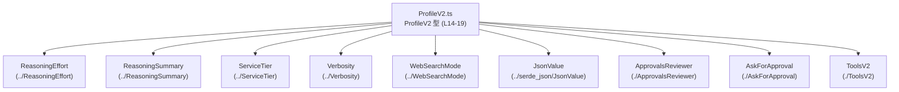
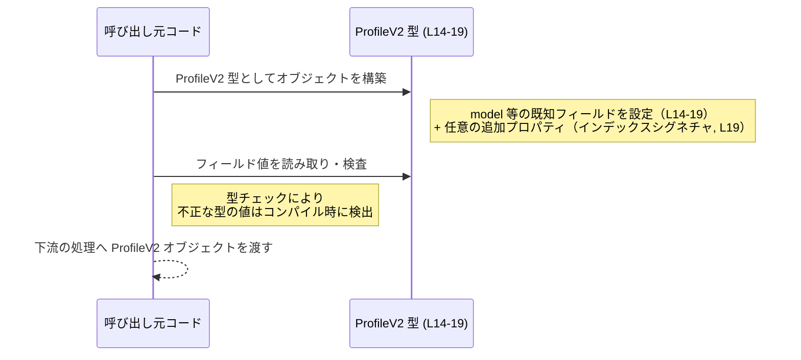

# app-server-protocol/schema/typescript/v2/ProfileV2.ts コード解説

## 0. ざっくり一言

`ProfileV2` 型は、モデルや推論設定、承認ポリシー、Web 検索やツール設定などをまとめた **「プロファイル設定オブジェクトのスキーマ」** を表す型定義です（`ProfileV2.ts:L14-19`）。  
このファイルは ts-rs による自動生成コードであり、手動編集しない前提になっています（`ProfileV2.ts:L1-3`）。

---

## 1. このモジュールの役割

### 1.1 概要

- このモジュールは TypeScript から利用するための **`ProfileV2` 型エイリアス**を 1 つだけ公開します（`ProfileV2.ts:L14-19`）。
- `ProfileV2` は、モデル名やサービス階層、推論関連の設定、承認フロー、Web 検索やツール定義などをフィールドとして持つ「構造化設定オブジェクト」です（`ProfileV2.ts:L14-19`）。
- さらに、任意の追加プロパティを JSON 互換の値として保持できるよう、インデックスシグネチャを組み合わせた構造になっています（`ProfileV2.ts:L19`）。

### 1.2 アーキテクチャ内での位置づけ

この型は schema/typescript/v2 以下の 1 コンポーネントであり、複数の周辺スキーマ型に依存しています（`ProfileV2.ts:L4-12, L14-19`）。



このチャンクには、これら依存型の中身は現れません。どのような列挙や構造になっているかは、それぞれのファイル側を確認する必要があります。

### 1.3 設計上のポイント

コードから読み取れる設計の特徴は次の通りです。

- **型専用モジュール**  
  - 実行時ロジックや関数は一切なく、型定義のみを提供します（`ProfileV2.ts:L4-14`）。
- **既知フィールド + 任意フィールドのハイブリッド構造**  
  - 主要な設定項目は個別フィールドとして明示され（`ProfileV2.ts:L14-19`）、加えて任意の string キーに対し JSON 互換の値を持てるようになっています（`ProfileV2.ts:L19`）。
- **null 許容による「省略」の表現**  
  - 明示的に定義された全フィールドは `string | null` や `SomeType | null` のように `null` を許容します（`ProfileV2.ts:L14-19`）。  
    これにより、「設定は存在するが未指定」という状態を型で表現しています。
- **自動生成コード**  
  - 冒頭コメントで ts-rs による生成ファイルであることが明記され、手動編集しないことが示されています（`ProfileV2.ts:L1-3`）。

---

## 2. 主要な機能一覧

このモジュールは 1 つの型定義のみを提供します。

- `ProfileV2` 型:  
  プロファイル設定（モデル、サービス階層、推論設定、承認ポリシー、Web 検索、ツール、任意の追加 JSON フィールド）を 1 つのオブジェクトとして表現する型（`ProfileV2.ts:L14-19`）。

---

## 3. 公開 API と詳細解説

### 3.0 コンポーネントインベントリー

このチャンクに現れるコンポーネント（型）の一覧です。

| 名前               | 種別         | 役割 / 用途                                           | 定義/利用位置                     |
|--------------------|--------------|--------------------------------------------------------|------------------------------------|
| `ProfileV2`        | 型エイリアス | プロファイル設定オブジェクトの型                      | 定義: `ProfileV2.ts:L14-19`       |
| `ReasoningEffort`  | 型（外部）   | `model_reasoning_effort` フィールドの型               | import: `ProfileV2.ts:L4`         |
| `ReasoningSummary` | 型（外部）   | `model_reasoning_summary` フィールドの型              | import: `ProfileV2.ts:L5`         |
| `ServiceTier`      | 型（外部）   | `service_tier` フィールドの型                         | import: `ProfileV2.ts:L6`         |
| `Verbosity`        | 型（外部）   | `model_verbosity` フィールドの型                      | import: `ProfileV2.ts:L7`         |
| `WebSearchMode`    | 型（外部）   | `web_search` フィールドの型                           | import: `ProfileV2.ts:L8`         |
| `JsonValue`        | 型（外部）   | 追加プロパティの値に使用される JSON 互換の値型       | import: `ProfileV2.ts:L9`         |
| `ApprovalsReviewer`| 型（外部）   | `approvals_reviewer` フィールドの型                   | import: `ProfileV2.ts:L10`        |
| `AskForApproval`   | 型（外部）   | `approval_policy` フィールドの型                      | import: `ProfileV2.ts:L11`        |
| `ToolsV2`          | 型（外部）   | `tools` フィールドの型                                | import: `ProfileV2.ts:L12`        |

※ 外部型の具体的な構造は、このチャンクには含まれていません。

---

### 3.1 型一覧（構造体・列挙体など）

| 名前       | 種別         | 役割 / 用途                                             | 定義位置                    |
|------------|--------------|----------------------------------------------------------|-----------------------------|
| `ProfileV2`| 型エイリアス | 既知フィールド + 任意 JSON プロパティを持つオブジェクト | `ProfileV2.ts:L14-19`       |

#### `ProfileV2` の構造

`ProfileV2` は 2 つの型の交差（intersection）として定義されています（`ProfileV2.ts:L14-19`）。

1. **既知フィールドをまとめたオブジェクト型**

   ```ts
   { 
     model: string | null,
     model_provider: string | null,
     approval_policy: AskForApproval | null,
     /**
      * [UNSTABLE] Optional profile-level override for where approval requests
      * are routed for review. If omitted, the enclosing config default is
      * used.
      */
     approvals_reviewer: ApprovalsReviewer | null,
     service_tier: ServiceTier | null,
     model_reasoning_effort: ReasoningEffort | null,
     model_reasoning_summary: ReasoningSummary | null,
     model_verbosity: Verbosity | null,
     web_search: WebSearchMode | null,
     tools: ToolsV2 | null,
     chatgpt_base_url: string | null
   }
   ```

2. **任意キー用のインデックスシグネチャ**

   ```ts
   { 
     [key in string]?: 
       number | string | boolean | Array<JsonValue> | 
       { [key in string]?: JsonValue } | 
       null 
   }
   ```

   これにより、既知フィールド以外にも任意の string キーを追加でき、その値は以下のいずれかになります（`ProfileV2.ts:L19`）。

   - `number`
   - `string`
   - `boolean`
   - `Array<JsonValue>`
   - `{ [key in string]?: JsonValue }`（string キー → JsonValue のオブジェクト）
   - `null`

> `JsonValue` 自体の詳細な定義は `../serde_json/JsonValue` にあり、このチャンクからは分かりません（`ProfileV2.ts:L9`）。

##### ProfileV2 のプロパティ一覧（既知フィールド）

| プロパティ名              | 型                                       | 説明（コードから読める範囲）                                  | 定義位置              |
|---------------------------|------------------------------------------|----------------------------------------------------------------|-----------------------|
| `model`                   | `string \| null`                         | モデル名を表す文字列。未設定時は `null`                         | `ProfileV2.ts:L14`    |
| `model_provider`          | `string \| null`                         | モデル提供者・ベンダー名などを表す文字列。未設定時は `null`     | `ProfileV2.ts:L14`    |
| `approval_policy`         | `AskForApproval \| null`                 | 承認ポリシー設定。未設定時は `null`                            | `ProfileV2.ts:L14`    |
| `approvals_reviewer`      | `ApprovalsReviewer \| null`             | 承認リクエストのルーティング先に関するプロファイルレベルの上書き設定（コメントより）（`[UNSTABLE]`） | `ProfileV2.ts:L15-16,19` |
| `service_tier`            | `ServiceTier \| null`                    | サービス階層・プランに関する設定。未設定時は `null`            | `ProfileV2.ts:L19`    |
| `model_reasoning_effort`  | `ReasoningEffort \| null`                | モデル推論の「努力量」に関する設定。未設定時は `null`          | `ProfileV2.ts:L19`    |
| `model_reasoning_summary` | `ReasoningSummary \| null`               | 推論内容の要約に関する設定。未設定時は `null`                  | `ProfileV2.ts:L19`    |
| `model_verbosity`         | `Verbosity \| null`                      | 応答の冗長さ・詳細さに関する設定。未設定時は `null`           | `ProfileV2.ts:L19`    |
| `web_search`              | `WebSearchMode \| null`                  | Web 検索の利用モードに関する設定。未設定時は `null`           | `ProfileV2.ts:L19`    |
| `tools`                   | `ToolsV2 \| null`                        | 利用可能なツール設定。未設定時は `null`                       | `ProfileV2.ts:L19`    |
| `chatgpt_base_url`        | `string \| null`                         | ChatGPT のベース URL 設定。未設定時は `null`                  | `ProfileV2.ts:L19`    |
| `[key in string]?`        | `number \| string \| boolean \| Array<JsonValue> \| { [key in string]?: JsonValue } \| null` | 任意の追加設定項目を JSON 互換の値で保持するためのフィールド | `ProfileV2.ts:L19`    |

`approvals_reviewer` のコメントから読み取れる仕様（`ProfileV2.ts:L15-17`）:

- プロファイルレベルで、承認リクエストのルーティング先を上書きするオプション。
- 未指定の場合（ここでは `null` か、あるいは将来のスキーマでは欠落？）、外側の config レベルでのデフォルトが使われる。
- `[UNSTABLE]` と明記されており、仕様が変わる可能性があることが示されています。

### 3.2 関数詳細

このファイルには関数・メソッドは定義されていません（`ProfileV2.ts:L1-19`）。  
したがって、関数詳細テンプレートに該当する要素はありません。

### 3.3 その他の関数

- 該当なし（関数が存在しません）。

---

## 4. データフロー

このファイルは型定義のみを提供するため、実行時処理のフローは直接は記述されていません（`ProfileV2.ts:L1-19`）。  
ここでは、「`ProfileV2` 型のオブジェクトがどのように作られ、どのように利用されるか」という概念的なデータフローを示します。



要点:

- `ProfileV2` は **静的な型** であり、インスタンス生成や操作はすべて「呼び出し元コード側」で行われます。
- TypeScript の型チェックにより、例えば `model` に数値を代入するような誤りはコンパイル時に検出されます（`ProfileV2.ts:L14`）。
- 任意の追加プロパティに対しても、許可されている値の型以外を代入するとコンパイルエラーになります（`ProfileV2.ts:L19`）。

---

## 5. 使い方（How to Use）

### 5.1 基本的な使用方法

`ProfileV2` 型を利用してプロファイル設定オブジェクトを定義する基本例です。

```typescript
// ProfileV2 型をインポートする（型専用 import）
import type { ProfileV2 } from "./ProfileV2";  // 相対パスは利用側のディレクトリ構成に依存

// ProfileV2 型のオブジェクトを作成する例
const profile: ProfileV2 = {
    // 既知フィールド（L14-19）
    model: "gpt-4.1",                       // モデル名
    model_provider: "openai",               // モデル提供元
    approval_policy: null,                  // 承認ポリシー未設定
    approvals_reviewer: null,               // デフォルトの reviewer 設定を利用
    service_tier: null,                     // サービス階層未指定
    model_reasoning_effort: null,           // 推論「努力量」未指定
    model_reasoning_summary: null,          // 推論要約設定未指定
    model_verbosity: null,                  // 冗長さ未指定
    web_search: null,                       // Web 検索設定未指定
    tools: null,                            // ツール未設定
    chatgpt_base_url: null,                 // デフォルトのベース URL を使う

    // 任意の追加プロパティ（インデックスシグネチャ, L19）
    // ここでは boolean と string を追加
    feature_flag_new_ui: true,
    notes: "Internal testing profile",
};
```

ポイント:

- 既知フィールドは **すべて必須プロパティ** であり、値として `null` を許容しています（`ProfileV2.ts:L14-19`）。
- 任意の追加プロパティは、`boolean`・`string` など、定義された union に含まれる型であれば追加できます（`ProfileV2.ts:L19`）。

### 5.2 よくある使用パターン

#### パターン 1: 既知フィールドだけを使う

追加プロパティを使わず、既知フィールドのみを設定するパターンです。

```typescript
import type { ProfileV2 } from "./ProfileV2";

const basicProfile: ProfileV2 = {
    model: "gpt-4.1-mini",
    model_provider: "openai",
    approval_policy: null,
    approvals_reviewer: null,
    service_tier: null,
    model_reasoning_effort: null,
    model_reasoning_summary: null,
    model_verbosity: null,
    web_search: null,
    tools: null,
    chatgpt_base_url: "https://api.openai.com",
};
```

#### パターン 2: JSON 拡張フィールドとしてネスト構造を持たせる

インデックスシグネチャで許可されている `{ [key in string]?: JsonValue }` を利用し、JSON 風のネスト構造を追加する例です（`ProfileV2.ts:L19`）。

```typescript
import type { ProfileV2 } from "./ProfileV2";

const extendedProfile: ProfileV2 = {
    model: "gpt-4.1",
    model_provider: "openai",
    approval_policy: null,
    approvals_reviewer: null,
    service_tier: null,
    model_reasoning_effort: null,
    model_reasoning_summary: null,
    model_verbosity: null,
    web_search: null,
    tools: null,
    chatgpt_base_url: null,

    // 任意の JSON 互換オブジェクトを追加
    metadata: {
        owner: "team-a",
        environment: "staging",
    },
};
```

`metadata` の値は `{ [key in string]?: JsonValue }` 型に適合している必要があります。`JsonValue` の具体的な中身は別ファイル定義ですが、少なくとも JSON 風の値を想定していることが読み取れます（`ProfileV2.ts:L9, L19`）。

### 5.3 よくある間違い

#### 間違い 1: `undefined` を使ってしまう

`ProfileV2` の既知フィールドは `null` を許容していますが、`undefined` は明示的には含まれていません（`ProfileV2.ts:L14-19`）。

```typescript
import type { ProfileV2 } from "./ProfileV2";

const badProfile: ProfileV2 = {
    // 間違い例: undefined を指定
    // model: undefined,               // 型エラーになる可能性が高い

    // 正しい例: 未指定を表す場合は null を使う
    model: null,
    model_provider: null,
    approval_policy: null,
    approvals_reviewer: null,
    service_tier: null,
    model_reasoning_effort: null,
    model_reasoning_summary: null,
    model_verbosity: null,
    web_search: null,
    tools: null,
    chatgpt_base_url: null,
};
```

#### 間違い 2: 許可されていない型の追加プロパティ

インデックスシグネチャは `number | string | boolean | Array<JsonValue> | { [key in string]?: JsonValue } | null` だけを許可します（`ProfileV2.ts:L19`）。

```typescript
import type { ProfileV2 } from "./ProfileV2";

const badProfile2: ProfileV2 = {
    model: "gpt-4.1",
    model_provider: "openai",
    approval_policy: null,
    approvals_reviewer: null,
    service_tier: null,
    model_reasoning_effort: null,
    model_reasoning_summary: null,
    model_verbosity: null,
    web_search: null,
    tools: null,
    chatgpt_base_url: null,

    // 間違い例: 関数は union に含まれていない
    // onSave: () => { /* ... */ },  // 型エラー

    // 正しい例: 許可された型だけを使う
    enable_feature_x: true,
};
```

### 5.4 使用上の注意点（まとめ）

- **null を使った「未指定」の表現**  
  既知フィールドは省略ではなく `null` によって「未指定」を表現します。呼び出し側で必ず `null` チェックを行う前提で設計されています（`ProfileV2.ts:L14-19`）。
- **追加プロパティの型制約**  
  インデックスシグネチャで許可されている型以外を設定しようとするとコンパイルエラーになります（`ProfileV2.ts:L19`）。
- **型専用 import の利用**  
  ランタイムには存在しない型定義なので、`import type` を用いるとバンドルサイズに影響を与えずに利用できます（TypeScript の一般的なパターン）。
- **並行性 / スレッドセーフ性**  
  このファイルはあくまで型定義であり、並行性制御は行いません。実際のオブジェクト共有時の並行アクセス制御は利用側コードの責務です。

---

## 6. 変更の仕方（How to Modify）

### 6.1 新しい機能を追加する場合（フィールド追加など）

- 冒頭コメントにある通り、このファイルは ts-rs による自動生成ファイルです（`ProfileV2.ts:L1-3`）。
- そのため、**この TypeScript ファイルを直接編集するのではなく、元となるスキーマ定義（ts-rs が参照する Rust 側の型定義など）を変更し、再生成する**必要があります。
- 新しいフィールドを追加したい場合の一般的な流れ（抽象的な説明）:
  1. 元のスキーマ（例: Rust の構造体）にフィールドを追加。
  2. ts-rs を再実行して TypeScript スキーマを再生成。
  3. 生成された `ProfileV2.ts` を利用するコードを必要に応じて更新。

このチャンクには元スキーマの位置は記載されていないため、具体的なファイルパスは分かりません。

### 6.2 既存の機能を変更する場合（型の変更など）

- 既知フィールドの型（例: `model_verbosity` の型）を変更したい場合も、同様に **元スキーマ定義**で変更し、再生成する必要があります（`ProfileV2.ts:L1-3, L14-19`）。
- 変更時に注意すべき点:
  - 変更したフィールドを利用しているすべての呼び出し側コードにコンパイルエラーが発生する可能性があります。
  - `null` を許容するかどうかを変更する場合、利用側の `null` チェックロジックに影響が出ます。
  - インデックスシグネチャの union 型を変更すると、追加プロパティの許可／不許可の範囲が変わるため、既存の設定オブジェクトに対して型エラーが発生する可能性があります（`ProfileV2.ts:L19`）。

---

## 7. 関連ファイル

このモジュールと密接に関係するファイル（インポート先）を一覧にします。

| パス                          | 役割 / 関係                                                                 |
|-------------------------------|------------------------------------------------------------------------------|
| `../ReasoningEffort`         | `model_reasoning_effort` フィールドの型定義（`ProfileV2.ts:L4, L19`）。構造はこのチャンクには現れません。 |
| `../ReasoningSummary`        | `model_reasoning_summary` フィールドの型定義（`ProfileV2.ts:L5, L19`）。   |
| `../ServiceTier`             | `service_tier` フィールドの型定義（`ProfileV2.ts:L6, L19`）。              |
| `../Verbosity`               | `model_verbosity` フィールドの型定義（`ProfileV2.ts:L7, L19`）。           |
| `../WebSearchMode`           | `web_search` フィールドの型定義（`ProfileV2.ts:L8, L19`）。                |
| `../serde_json/JsonValue`    | 追加プロパティの値に利用される JSON 互換値型の定義（`ProfileV2.ts:L9, L19`）。  |
| `./ApprovalsReviewer`        | `approvals_reviewer` フィールドの型定義（`ProfileV2.ts:L10, L19`）。       |
| `./AskForApproval`           | `approval_policy` フィールドの型定義（`ProfileV2.ts:L11, L14`）。          |
| `./ToolsV2`                  | `tools` フィールドの型定義（`ProfileV2.ts:L12, L19`）。                     |

---

## 付録: Bugs / Security / Contracts / Edge Cases / Tests / Performance の観点

このファイル自体は型定義のみですが、型から読み取れる観点を簡潔にまとめます。

- **Bugs（潜在的なバグ要因）**
  - 既知フィールドがすべて `null` を許容するため、「本来必須なはずの設定が `null` でもコンパイルが通る」設計になっています（`ProfileV2.ts:L14-19`）。実行時に `null` チェックを忘れるとバグの原因になります。
- **Security**
  - インデックスシグネチャで任意のキーを追加可能なため（`ProfileV2.ts:L19`）、外部入力をそのまま格納する場合は、利用側のコードでバリデーションやサニタイズを行う必要があります。
- **Contracts / Edge Cases**
  - コントラクトとして、「既知フィールドは常に存在しうる（ただし値は `null` になりうる）」という前提があります（`ProfileV2.ts:L14-19`）。
  - 追加プロパティの値型 union に含まれない値（関数、`Date` など）を設定しようとするとコンパイルエラーになります（`ProfileV2.ts:L19`）。
- **Tests**
  - このファイル自体にはテストコードは含まれていません（`ProfileV2.ts:L1-19`）。テストは、`ProfileV2` を利用する側で型整合性・`null` 取り扱いなどを検証する形になります。
- **Performance / Scalability**
  - 型定義のみであり、実行時のパフォーマンスへの直接の影響はありません。
  - ただし、インデックスシグネチャにより非常に多くの追加プロパティを持つオブジェクトを扱う場合、パフォーマンスおよびメモリ使用量は利用側の実装次第になります。

このチャンクから読み取れる範囲では以上です。
