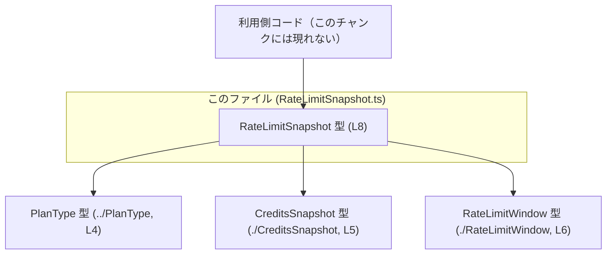
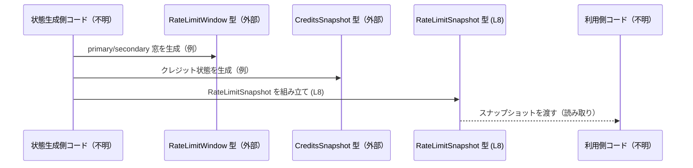

# app-server-protocol/schema/typescript/v2/RateLimitSnapshot.ts

## 0. ざっくり一言

`RateLimitSnapshot` は、レートリミット（制限値）とクレジット関連の状態を 1 つのオブジェクトとしてまとめて表現するための **型定義**です（`RateLimitSnapshot.ts:L8-8`）。  
Rust から `ts-rs` によって自動生成された TypeScript 側の表現であり、手動で編集しない前提になっています（`RateLimitSnapshot.ts:L1-3`）。

---

## 1. このモジュールの役割

### 1.1 概要

- このモジュールは **レートリミット状態を表現するデータ構造** を TypeScript で提供します（`RateLimitSnapshot.ts:L8-8`）。
- Rust 側の型定義から `ts-rs` により自動生成されており、手動編集禁止であることがコメントで明示されています（`RateLimitSnapshot.ts:L1-3`）。
- `PlanType`, `CreditsSnapshot`, `RateLimitWindow` といった他の型に依存し、それらをフィールドとして保持します（`RateLimitSnapshot.ts:L4-6, L8-8`）。

### 1.2 アーキテクチャ内での位置づけ

このファイルは **純粋な型定義モジュール** であり、実行時ロジックは含んでいません。  
他のモジュールからインポートされて利用される「データコンテナ」の役割を担うと解釈できます（型名・フィールド名からの解釈です）。

依存関係（このチャンクで確認できる範囲）は次の通りです。



- 依存元: `RateLimitSnapshot`（本ファイル）
- 依存先: `PlanType`, `CreditsSnapshot`, `RateLimitWindow`（いずれも型インポートのみ、`RateLimitSnapshot.ts:L4-6`）
- `RateLimitSnapshot` を実際に利用するモジュールは、このチャンクには登場しません。

### 1.3 設計上のポイント

- **自動生成コード**  
  - 冒頭コメントで `ts-rs` による生成コードであること、手動編集してはいけないことが明示されています（`RateLimitSnapshot.ts:L1-3`）。
- **型専用インポート**  
  - すべて `import type` を用いており、TypeScript のコンパイル後には実行時依存が発生しない形になっています（`RateLimitSnapshot.ts:L4-6`）。
- **Nullable（`| null`）による状態表現**  
  - 全フィールドが `X | null` 形式で宣言されており、「プロパティは必ず存在するが値は `null` になりうる」という設計です（`RateLimitSnapshot.ts:L8-8`）。
- **状態スナップショット指向**  
  - 型名 `RateLimitSnapshot` およびフィールド名（`primary`, `secondary`, `credits`, `planType` など）から、ある時点の状態をひとまとめに表現する「スナップショット」の意図が読み取れます（`RateLimitSnapshot.ts:L8-8`）。

---

## 2. 主要な機能一覧（コンポーネントインベントリー）

このファイルは 1 つの型エイリアスのみを公開します。

- `RateLimitSnapshot`: レートリミットおよびクレジット状態を表現する複合データ型（`RateLimitSnapshot.ts:L8-8`）

依存している外部コンポーネント（いずれも型定義、実体は別ファイル）:

- `PlanType`: プラン種別を表現する型（`RateLimitSnapshot.ts:L4-4`）
- `CreditsSnapshot`: クレジット残高などを表現する型と解釈できる名前の型（`RateLimitSnapshot.ts:L5-5`）
- `RateLimitWindow`: レートリミットの時間窓を表現する型と解釈できる名前の型（`RateLimitSnapshot.ts:L6-6`）

---

## 3. 公開 API と詳細解説

### 3.1 型一覧（構造体・列挙体など）

#### 公開型インベントリー

| 名前               | 種別        | 役割 / 用途                                                                 | 定義箇所                         |
|--------------------|-------------|-----------------------------------------------------------------------------|----------------------------------|
| `RateLimitSnapshot`| 型エイリアス | レートリミットとクレジット関連情報のスナップショットを表現する複合オブジェクト | `RateLimitSnapshot.ts:L8-8`      |

#### 依存型インベントリー（外部ファイル）

※ このチャンクに定義はなく、インポートされていることだけが分かります。

| 名前              | 種別（このチャンクから判明している範囲） | 役割 / 用途（名称からの解釈）                                    | 参照箇所                         |
|-------------------|-------------------------------------------|-------------------------------------------------------------------|----------------------------------|
| `PlanType`        | 型（`import type`）                       | 利用プランの種別を表現する列挙型またはユニオン型と解釈できます   | `RateLimitSnapshot.ts:L4, L8`    |
| `CreditsSnapshot` | 型（`import type`）                       | クレジット残高や利用履歴などの状態スナップショットと解釈できます | `RateLimitSnapshot.ts:L5, L8`    |
| `RateLimitWindow` | 型（`import type`）                       | レートリミットの「時間窓」や残り回数を表現する型と解釈できます   | `RateLimitSnapshot.ts:L6, L8`    |

#### `RateLimitSnapshot` のフィールド一覧

```ts
export type RateLimitSnapshot = {
    limitId: string | null,
    limitName: string | null,
    primary: RateLimitWindow | null,
    secondary: RateLimitWindow | null,
    credits: CreditsSnapshot | null,
    planType: PlanType | null,
};
```

（`RateLimitSnapshot.ts:L8-8`）

| フィールド名 | 型                          | 説明（名称からの解釈）                                               |
|--------------|-----------------------------|-----------------------------------------------------------------------|
| `limitId`    | `string \| null`           | レートリミット定義を一意に識別する ID。未知の場合は `null`。         |
| `limitName`  | `string \| null`           | レートリミットの人間向け名称。ない場合や非適用時は `null`。         |
| `primary`    | `RateLimitWindow \| null`  | 主となるレートリミット窓の情報。存在しない場合は `null`。           |
| `secondary`  | `RateLimitWindow \| null`  | 補助的な／サブのレートリミット窓の情報。なければ `null`。           |
| `credits`    | `CreditsSnapshot \| null`  | クレジット残高などの状態。クレジット制御がないケースでは `null`。   |
| `planType`   | `PlanType \| null`         | 適用されている利用プランの種別。プラン未確定・非適用時などは `null`。|

> 補足: すべてのフィールドが `X | null` のため、**プロパティは常に存在するが値が `null` の可能性がある**、という契約になっています（`RateLimitSnapshot.ts:L8-8`）。

### 3.2 関数詳細（最大 7 件）

このファイルには **関数・メソッドは一切定義されていません**。  
したがって、詳細解説対象となる公開関数も存在しません（`RateLimitSnapshot.ts:L1-8` からロジックコードがないことが確認できます）。

### 3.3 その他の関数

- 該当なし（このファイルには補助関数やラッパー関数も存在しません）。

---

## 4. データフロー

このファイルには実行時処理ロジックがないため、**実際のフローはコードからは分かりません**。  
ここでは、型構造に基づいて想定される典型的な利用イメージを、あくまで「例」として示します。

### 4.1 想定される利用イメージ

- あるコンポーネントがレートリミット状態を計算し、`RateLimitWindow` や `CreditsSnapshot` を生成する（定義は他ファイル、ここには現れません）。
- それらをまとめて `RateLimitSnapshot` オブジェクトに格納します（`RateLimitSnapshot.ts:L8-8`）。
- 呼び出し元やクライアント側コードは、このスナップショットを読み取り専用的に参照し、UI や制御ロジックに利用します。



> この sequence diagram は、**`RateLimitSnapshot` の構造から推測した一般的なパターンの例**であり、  
> 本リポジトリで実際に行われている処理フローを直接表すものではありません。

---

## 5. 使い方（How to Use）

### 5.1 基本的な使用方法

ここでは、`RateLimitSnapshot` を生成して利用するシンプルな例を示します。  
実際のプロジェクトでは `PlanType`, `CreditsSnapshot`, `RateLimitWindow` は本ファイルのように `import type` される前提ですが、  
例を自己完結させるために最小限のダミー定義を含めています（実プロジェクトでは削除し、実際の型をインポートする必要があります）。

```typescript
// --- ダミー型定義: 実際のプロジェクトでは別ファイルから import される --- // PlanType の簡易な例（実際の定義はこのチャンクには現れません）
type PlanType = "free" | "pro" | "enterprise";             // プランの種類を表すユニオン型のダミー

// RateLimitWindow の簡易な例
interface RateLimitWindow {                                 // レートリミット窓のダミー定義
    remaining: number;                                      // 残りリクエスト数
    resetAt: string;                                        // リセット時間（ISO 文字列）
}

// CreditsSnapshot の簡易な例
interface CreditsSnapshot {                                 // クレジット状態のダミー定義
    remainingCredits: number;                               // 残りクレジット数
}

// --- 本ファイルで定義されている RateLimitSnapshot と同じ形 --- type RateLimitSnapshot = {                               // RateLimitSnapshot 型エイリアス
    limitId: string | null;                                 // 制限 ID。ないときは null
    limitName: string | null;                               // 制限名。ないときは null
    primary: RateLimitWindow | null;                        // 主レートリミット窓
    secondary: RateLimitWindow | null;                      // サブレートリミット窓
    credits: CreditsSnapshot | null;                        // クレジット状態
    planType: PlanType | null;                              // プラン種別
};

// RateLimitSnapshot を生成する例
const snapshot: RateLimitSnapshot = {                       // RateLimitSnapshot 型に従うオブジェクトリテラル
    limitId: "rl_123",                                      // 任意の ID
    limitName: "Default global limit",                      // 任意の表示名
    primary: {                                              // primary 窓を指定
        remaining: 95,                                      // 残りリクエスト数
        resetAt: "2024-01-01T00:00:00Z",                    // リセット時刻
    },
    secondary: null,                                        // secondary 窓がない場合は null
    credits: {                                              // クレジット状態が有効な場合
        remainingCredits: 1000,                             // 残りクレジット数
    },
    planType: "pro",                                        // プラン種別（例）
};

// 利用例: null に注意しながら値を読む
if (snapshot.primary) {                                     // primary が null でないかチェック
    console.log(snapshot.primary.remaining);                // 残り数を参照
}

console.log(snapshot.planType ?? "no-plan");                // planType が null の場合は "no-plan" にフォールバック
```

### 5.2 よくある使用パターン

1. **primary だけを利用し、secondary を無効にする**

```typescript
const snapshot: RateLimitSnapshot = {
    limitId: "rl_single",
    limitName: "Single window limit",
    primary: { remaining: 50, resetAt: "2024-01-01T00:00:00Z" },
    secondary: null,               // サブ窓を使わない場合は null 固定で持つ
    credits: null,                 // クレジット制御を使わない場合も null
    planType: "free",
};
```

1. **クレジットベースで制御し、レートリミット窓は無効**

```typescript
const snapshot: RateLimitSnapshot = {
    limitId: null,                 // ID/名前が存在しない場合は null
    limitName: null,
    primary: null,                 // レートリミット窓を使わない
    secondary: null,
    credits: { remainingCredits: 10 },
    planType: "enterprise",
};
```

### 5.3 よくある間違い

**誤り例: `null` を考慮せずにフィールドへアクセス**

```typescript
// 間違い例: primary が null かもしれないのに直接アクセスしている
function getRemaining(snapshot: RateLimitSnapshot): number {
    // return snapshot.primary.remaining;                  // コンパイルは通るが、実行時に null の可能性
    return snapshot.primary!.remaining;                    // Non-null アサーションも危険（契約違反時に例外）
}
```

**正しい例: `null` をチェックし、フォールバック値を用意**

```typescript
// 正しい例: null チェックを行ってからアクセスする
function getRemainingSafe(snapshot: RateLimitSnapshot): number {
    if (!snapshot.primary) {                               // primary が null の場合
        return Infinity;                                   // 例: 制限なしを表現するなど、ポリシーに従う
    }
    return snapshot.primary.remaining;                     // null でないと確定してから参照
}
```

### 5.4 使用上の注意点（まとめ）＋ Bugs/Security 観点

- **`null` ハンドリングが必須**  
  - すべてのフィールドが `X | null` であるため、使用時には `null` チェックを怠ると `Cannot read properties of null` などの実行時エラーの原因になります（`RateLimitSnapshot.ts:L8-8`）。
- **型専用インポートである点**  
  - `import type` で読み込まれるため、このファイル自体は実行時にモジュール依存を追加しません（`RateLimitSnapshot.ts:L4-6`）。`typeof` など実行時にこれら型を参照しようとするとコンパイルエラーになります。
- **自動生成コードの直接編集禁止**  
  - コメントにある通り手動編集は禁止されています（`RateLimitSnapshot.ts:L1-3`）。直接変更すると、再生成時に上書きされる、あるいは Rust 側定義との不整合が発生する可能性があります。
- **セキュリティ面での留意点（一般論）**  
  - このファイルは型定義のみで、入力検証やサニタイズを行いません。外部入力の値をこの型に格納する場合、**検証は必ず別のレイヤーで行う必要**があります（このチャンクには検証処理は存在しません）。

---

## 6. 変更の仕方（How to Modify）

### 6.1 新しい機能を追加する場合

このファイルは `ts-rs` により生成されるため、**直接編集して新しいフィールドを追加するべきではありません**（`RateLimitSnapshot.ts:L1-3`）。

一般的な変更手順は次のようになります（`ts-rs` の通常の利用形態に基づく説明です）。

1. **元の Rust 側型定義を特定する**  
   - `RateLimitSnapshot` に対応する Rust の構造体・型が存在するはずですが、このチャンクには現れていません。
2. **Rust 側の型にフィールドを追加・変更する**  
   - たとえば `planType` に対応するフィールドの型変更などを Rust 側で行います。
3. **`ts-rs` によるコード再生成を実行する**  
   - ビルドスクリプトや専用コマンドを通じて TypeScript ファイルを再生成します。
4. **生成結果として `RateLimitSnapshot.ts` が更新される**  
   - このファイルに新しいフィールドや型が反映されます。

### 6.2 既存の機能を変更する場合（契約と影響範囲）

- **影響範囲の確認**  
  - `RateLimitSnapshot` をインポートしている TypeScript ファイルを検索し、どのフィールドが利用されているか確認する必要があります（このチャンクには利用箇所は現れません）。
- **契約（前提条件）**  
  - 全フィールドが現在 `X | null` であるという契約を維持するかどうかは重要な判断点です。  
    - もし `null` を許さないように変更する場合、利用側コードの `null` チェックやデフォルト値処理を見直す必要があります。
- **Bugs/Security 観点**  
  - `planType` や `limitId` など識別情報・権限制御に関わるフィールドの意味を変更する場合、権限制御ロジック（別レイヤー）との整合性崩壊がバグ・セキュリティ問題の原因になり得ます。
- **テストの見直し**  
  - このファイル自体にはテストは含まれていませんが、`RateLimitSnapshot` を使うユニットテスト／統合テストがあれば、フィールド追加や型変更に合わせて更新が必要です。

---

## 7. 関連ファイル

このモジュールと密接に関係するファイル（いずれもこのチャンクには中身が現れません）:

| パス / モジュール指定             | 役割 / 関係                                                                                   |
|-----------------------------------|----------------------------------------------------------------------------------------------|
| `../PlanType`                     | `PlanType` 型を提供するモジュール。`RateLimitSnapshot.planType` フィールドで利用（`L4, L8`）。 |
| `./CreditsSnapshot`               | `CreditsSnapshot` 型を提供するモジュール。`credits` フィールドで利用（`L5, L8`）。           |
| `./RateLimitWindow`               | `RateLimitWindow` 型を提供するモジュール。`primary`, `secondary` フィールドで利用（`L6, L8`）。 |

> 実際のファイル拡張子（`.ts`, `.tsx` など）やディレクトリ階層の詳細は、  
> インポートパスからは一意には分からないため、このチャンクからは不明です。
