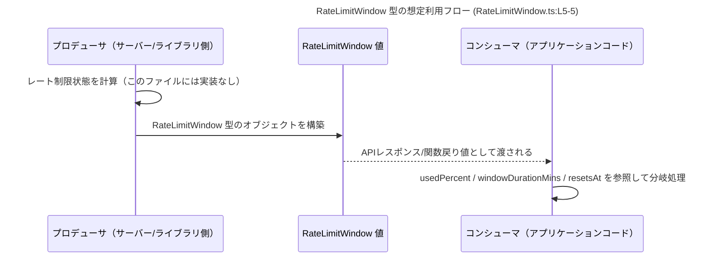

# app-server-protocol/schema/typescript/v2/RateLimitWindow.ts

## 0. ざっくり一言

`RateLimitWindow` は、レート制限（Rate Limit）の「ウィンドウ」に関する情報（使用率と時間情報）を表すための **TypeScript 型定義**です（`RateLimitWindow.ts:L5-5`）。  
このファイル自体には処理ロジックはなく、**データ構造のスキーマ**のみが定義されています。

---

## 1. このモジュールの役割

### 1.1 概要

- このモジュールは、レート制限ウィンドウに関する情報を TypeScript 側で扱うための **型定義**を提供します（`RateLimitWindow.ts:L5-5`）。
- コード先頭のコメントから、このファイルは **Rust 側の定義から ts-rs によって自動生成された TypeScript スキーマ**であることが分かります（`RateLimitWindow.ts:L1-3`）。
- 実行時の処理は一切含まれず、**コンパイル時の型安全性**を高める目的で利用されると解釈できます。

### 1.2 アーキテクチャ内での位置づけ

コメントから、Rust 定義 → ts-rs → TypeScript スキーマという生成フローが存在することが読み取れます（`RateLimitWindow.ts:L1-3`）。  
実際の利用コードはこのチャンクには含まれていませんが、一般的な位置づけは次のようになります。


- Rust 側の具体的な型名やフィールド構造はこのファイルからは分かりませんが、`ts-rs` による自動生成であることはコメントから明示されています（`RateLimitWindow.ts:L1-3`）。
- TypeScript 側のアプリケーションコードは、この `RateLimitWindow` 型を **import して型注釈として使う**ことが想定されますが、実際の利用箇所はこのチャンクには存在しません。

### 1.3 設計上のポイント

コードから読み取れる設計上の特徴は次のとおりです。

- **自動生成コードであることが明示**  
  - 「GENERATED CODE! DO NOT MODIFY BY HAND!」とコメントがあり、手動編集が禁止されています（`RateLimitWindow.ts:L1-1`）。
  - ts-rs による生成であることが明記されています（`RateLimitWindow.ts:L3-3`）。
- **単一の型エイリアスのみを公開**  
  - `export type RateLimitWindow = { ... }` の 1 行のみで、関数やクラスは存在しません（`RateLimitWindow.ts:L5-5`）。
- **nullable な数値フィールドの採用**  
  - `windowDurationMins: number | null` と `resetsAt: number | null` は `number` と `null` のユニオン型であり、「値は必須だが、その中身は null の可能性がある」設計になっています（`RateLimitWindow.ts:L5-5`）。
  - オプショナルプロパティ（`field?: type`）ではないため、プロパティ自体は常に存在すると型付けされています。
- **実行時エラー・並行性はこのファイルには関与しない**  
  - 型定義のみであり、実行時処理・エラーハンドリング・非同期処理・並行性の制御は一切含まれていません（`RateLimitWindow.ts:L5-5`）。

---

## 2. 主要な機能一覧（コンポーネントインベントリー）

このファイルが提供する「機能」は型定義のみです。

- `RateLimitWindow` 型定義: レート制限ウィンドウに関する情報（使用率・ウィンドウの長さ・リセット時刻）を表現するためのデータ構造（`RateLimitWindow.ts:L5-5`）。

コンポーネント一覧（型・関数のインベントリー）は次のとおりです。

| 名前             | 種別               | 概要                                                         | 根拠 |
|------------------|--------------------|--------------------------------------------------------------|------|
| `RateLimitWindow` | 型エイリアス（オブジェクト型） | レート制限ウィンドウ情報を表すデータ構造。3つの数値系フィールドを持つ。 | `RateLimitWindow.ts:L5-5` |

このファイルには関数・クラス・列挙体などは定義されていません（`RateLimitWindow.ts:L1-5`）。

---

## 3. 公開 API と詳細解説

### 3.1 型一覧（構造体・列挙体など）

| 名前             | 種別      | 役割 / 用途                                                                                      | 主なフィールド                                                                                   | 根拠 |
|------------------|-----------|--------------------------------------------------------------------------------------------------|--------------------------------------------------------------------------------------------------|------|
| `RateLimitWindow` | 型エイリアス | レート制限ウィンドウの状態を表すためのオブジェクト型。主に通信スキーマとして利用されると解釈できる。 | `usedPercent: number`, `windowDurationMins: number \| null`, `resetsAt: number \| null` | `RateLimitWindow.ts:L5-5` |

> 「通信スキーマとして利用される」との記述は、`schema/typescript` というパスと自動生成コメントからの解釈であり、このチャンクに利用コードは含まれていません。

#### `RateLimitWindow` のフィールド詳細

`RateLimitWindow` は次の 3 フィールドを持つオブジェクト型です（`RateLimitWindow.ts:L5-5`）。

```ts
export type RateLimitWindow = {
    usedPercent: number,
    windowDurationMins: number | null,
    resetsAt: number | null,
};
```

- `usedPercent: number`  
  - 数値型。名前からは「現在のレート制限枠の使用率（%）」を表す可能性があります。
  - 型定義上は単なる `number` であり、0〜100 などの範囲は **型レベルでは制約されていません**。
- `windowDurationMins: number | null`  
  - 数値または `null`。名前からは「レート制限ウィンドウの長さ（分）」を表す可能性があります。
  - `null` の意味（無制限／不明／適用外など）はこのチャンクだけでは分かりません。
- `resetsAt: number | null`  
  - 数値または `null`。名前からは「レート制限ウィンドウのリセット時刻」を表す可能性があります。
  - 単位（ミリ秒 / 秒 / UNIX 時刻など）や `null` の意味はコードからは読み取れません。

> フィールド名からの意味付けは推測を含むため、正確な仕様はこの型を生成している Rust 側や周辺ドキュメントを参照する必要があります。

### 3.2 関数詳細（最大 7 件）

このファイルには関数・メソッドは定義されていません（`RateLimitWindow.ts:L1-5`）。  
したがって、詳細解説すべき関数はありません。

### 3.3 その他の関数

補助的な関数やラッパー関数も存在しません。

| 関数名 | 役割 |
|--------|------|
| なし   | このファイルには関数定義がありません（`RateLimitWindow.ts:L1-5`）。 |

---

## 4. データフロー

このファイル単体には処理ロジックがなく、データフローは明示されていません。  
ただし、「型定義としてどのようにデータが流れるか」の **想定される利用イメージ**を示すと、周辺コードの設計に役立ちます。

> ※ 以下の図は `RateLimitWindow` 型（`RateLimitWindow.ts:L5-5`）の典型的な利用パターンを抽象化したものであり、具体的なクラス名や関数名はこのチャンクからは確認できません。



要点:

- `RateLimitWindow` は **値オブジェクト**として生成され、他のコンポーネントに受け渡されるだけです。
- 実際の計算ロジック（レート制限のカウント、ウィンドウ決定、リセットタイミングの算出）は、このファイルの外側で実装されます。
- TypeScript 型としては、**コンパイル時にフィールド存在・型の整合性を保証する役割**に限定されます。

---

## 5. 使い方（How to Use）

### 5.1 基本的な使用方法

`RateLimitWindow` 型を他の TypeScript ファイルで利用する基本的な例です。  
実際の import パスはプロジェクト構成に依存し、このチャンクからは確定できないため相対パスは例示にとどまります。

```ts
// RateLimitWindow 型をインポートする                           // このファイルのエクスポートを読み込む
import type { RateLimitWindow } from "./RateLimitWindow";      // 実際のパスは tsconfig / bundler 設定に依存

// レート制限情報を受け取って処理する関数の例
function handleRateLimit(window: RateLimitWindow) {            // 引数に RateLimitWindow 型を指定
    // usedPercent は常に number 型として利用できる
    if (window.usedPercent >= 100) {                           // ここでは number として比較可能
        console.warn("レート制限に達しています");
    }

    // windowDurationMins は number | null 型
    if (window.windowDurationMins !== null) {                  // null チェックが必要
        console.log(`ウィンドウ長: ${window.windowDurationMins} 分`);
    } else {
        console.log("ウィンドウ長は不明または未設定");
    }

    // resetsAt も number | null 型
    if (window.resetsAt !== null) {                            // null チェック
        console.log(`リセット時刻（数値）: ${window.resetsAt}`);
    }
}
```

TypeScript の型安全性:

- `usedPercent` は `number` なので、`string` や `null` を代入するとコンパイルエラーになります。
- `windowDurationMins` / `resetsAt` は `number | null` なので、**strictNullChecks が有効な場合**は null チェックを行わないと TypeScript がエラーを報告します。
- これにより、「null を想定していない計算でランタイムエラーが発生する」ケースを減らせます。

### 5.2 よくある使用パターン

1. **API レスポンスの型付け**

```ts
import type { RateLimitWindow } from "./RateLimitWindow";

// レート制限情報をフェッチする関数
async function fetchRateLimitInfo(): Promise<RateLimitWindow> {
    const res = await fetch("/api/rate-limit");
    const json = await res.json();
    // json の構造が RateLimitWindow と一致している前提
    return json as RateLimitWindow;                        // 実際にはバリデーションが望ましい
}

// 取得した情報を利用する
async function main() {
    const window = await fetchRateLimitInfo();
    console.log(window.usedPercent);                      // number として扱える
}
```

1. **状態管理ストアでの利用**

```ts
import type { RateLimitWindow } from "./RateLimitWindow";

type State = {
    rateLimit: RateLimitWindow | null;                    // まだ取得していない状態を null で表現
};

const state: State = {
    rateLimit: null,
};
```

### 5.3 よくある間違い

**1. `number | null` をそのまま数値として扱う**

```ts
import type { RateLimitWindow } from "./RateLimitWindow";

function incorrect(window: RateLimitWindow) {
    // 間違い例（strictNullChecks: false の場合、コンパイルは通るがランタイムで例外の可能性）
    const minutes = window.windowDurationMins + 1;        // windowDurationMins が null なら TypeError
}
```

**正しい書き方の例**

```ts
function correct(window: RateLimitWindow) {
    if (window.windowDurationMins !== null) {             // null チェックを行う
        const minutes = window.windowDurationMins + 1;    // ここでは number として安全に扱える
        console.log(minutes);
    } else {
        console.log("ウィンドウ長が null のケースに対応した処理を書く");
    }
}
```

- `resetsAt` についても同様に、`null` を考慮した分岐が必要です。
- **strictNullChecks が有効**であれば、コンパイラが null チェックの不足を検出してくれます。

### 5.4 使用上の注意点（まとめ）

- `windowDurationMins` と `resetsAt` は `null` を取りうるため、**必ず null ケースを考慮したコードを書く必要があります**。
- 型定義上は `usedPercent` の範囲が制限されていないため、0〜100 の範囲を前提とするようなロジックを書く場合は、**利用側または生成側で明示的なチェック**が必要です。
- このファイルにはランタイムのバリデーションロジックは一切含まれないため、**外部からの入力（JSON 等）をそのまま `RateLimitWindow` とみなす場合は、別途スキーマバリデーションを行うことが安全**です。
- セキュリティ・並行性に関して、この型定義自体が直接的なリスクや制御を持つことはありません（データ構造に過ぎないため）。

---

## 6. 変更の仕方（How to Modify）

### 6.1 新しい機能を追加する場合（フィールド追加など）

このファイルは自動生成コードであり、冒頭コメントで「手動で編集してはいけない」と明示されています（`RateLimitWindow.ts:L1-3`）。

- **直接このファイルを編集するべきではありません。**
- 新しいフィールドを追加したい場合の一般的な手順（コメント内容からの推定）:
  1. 対応する **Rust 側の型定義**（おそらく `RateLimitWindow` に相当）にフィールドを追加する。
  2. `ts-rs` のコード生成を再実行する。
  3. 生成された TypeScript コードを確認し、期待通りにフィールドが反映されているか確認する。

> Rust 側のファイル名や具体的な構造は、このチャンクからは分かりません。

### 6.2 既存の機能を変更する場合（フィールド名・型変更など）

`RateLimitWindow` の構造を変更する際の注意点:

- **型の契約（Contract）**  
  - 既存のクライアントコードは `RateLimitWindow` の 3 フィールドが必ず存在すると期待しています（`RateLimitWindow.ts:L5-5`）。
  - フィールド名変更・削除は、利用側に破壊的変更となる可能性があります。
- **null 許容性の変更**  
  - `number | null` を `number` のみに変更すると、「null を送っていた/受け取っていた」コードが壊れる可能性があります。
  - 逆に `number` を `number | null` に変更すると、利用側で null チェックを追加する必要があります。
- **変更手順（推奨）**
  1. Rust 側の型定義を変更する。
  2. ts-rs で TypeScript を再生成する。
  3. `RateLimitWindow` を利用している TypeScript コードすべてを検索し、影響範囲を確認する。
  4. null チェックやフィールド名を必要に応じて修正する。
  5. 型チェック・テストを実行して、コンパイルエラーやランタイムエラーがないことを確認する。

---

## 7. 関連ファイル

このチャンクには他ファイルの内容は含まれていないため、厳密な関連ファイルは特定できません。  
ただし、ファイルパスとコメントから、次のような関連が推測されます。

| パス / コンポーネント                                   | 役割 / 関係 |
|---------------------------------------------------------|-------------|
| `app-server-protocol/schema/typescript/v2/RateLimitWindow.ts` | 本ドキュメントの対象。`RateLimitWindow` 型定義を提供する（`RateLimitWindow.ts:L5-5`）。 |
| `app-server-protocol/schema/typescript/v2/*.ts`（推定） | 他のスキーマ型定義が並ぶ可能性があるが、このチャンクには現れない。 |
| Rust 側の対応する型定義（ファイル名不明）             | ts-rs の入力となる元定義。コメントから存在が示唆されるが、このチャンクには現れない（`RateLimitWindow.ts:L1-3`）。 |

> 具体的なファイル名やディレクトリ構成、テストコードの位置などは、このチャンクからは分かりません。「schema/typescript/v2」というパスと自動生成コメントから、プロトコルスキーマ群の一部と推測できます。
