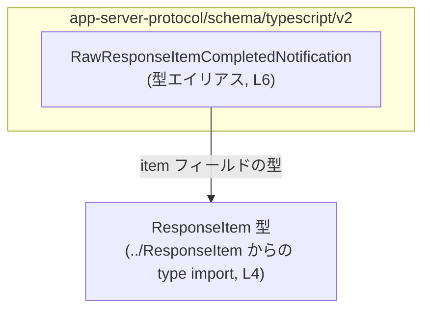
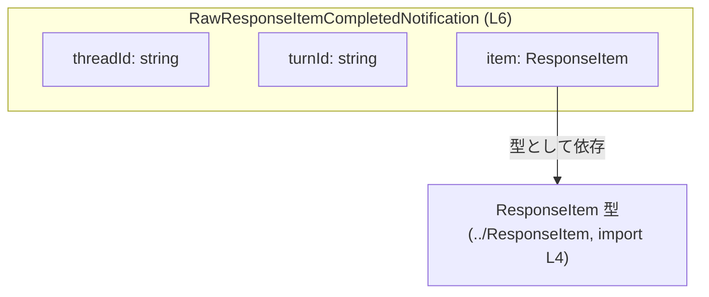
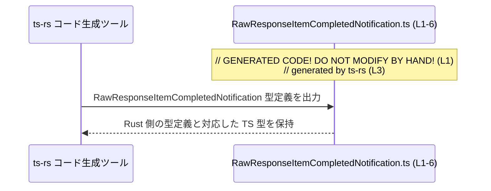

# app-server-protocol/schema/typescript/v2/RawResponseItemCompletedNotification.ts コード解説

## 0. ざっくり一言

このファイルは、`ResponseItem` 型を含む通知オブジェクト  
`RawResponseItemCompletedNotification` の TypeScript 型定義だけを提供する、自動生成コードです（`RawResponseItemCompletedNotification.ts:L1-4,6`）。

---

## 1. このモジュールの役割

### 1.1 概要

- `ts-rs` によって自動生成された TypeScript スキーマ定義ファイルです（コメントより, `RawResponseItemCompletedNotification.ts:L1-3`）。
- `ResponseItem` 型をフィールドとして持つ、オブジェクト型 `RawResponseItemCompletedNotification` をエクスポートします（`RawResponseItemCompletedNotification.ts:L4,6`）。
- 実行時ロジックや関数は一切含まず、「通知ペイロードの構造」をコンパイル時に表現する役割のみを持ちます（`RawResponseItemCompletedNotification.ts:L1-6`）。

### 1.2 アーキテクチャ内での位置づけ

- ディレクトリ構成から、このファイルは「app-server-protocol の TypeScript v2 スキーマ」の一部と位置づけられます（パス名より）。
- `ResponseItem` を型として参照することで、「レスポンス項目」に関する別定義と連携しています（`RawResponseItemCompletedNotification.ts:L4,6`）。
- `import type` を使っているため、`ResponseItem` への依存は型チェック専用であり、JavaScript 実行時には `ResponseItem` の import は生成されません（`RawResponseItemCompletedNotification.ts:L4`）。

この依存関係を簡略化して示すと次のようになります。



### 1.3 設計上のポイント

- **自動生成コード**  
  - 冒頭コメントにより、このファイルは `ts-rs` によって生成され、手動編集禁止であることが明示されています（`RawResponseItemCompletedNotification.ts:L1-3`）。
- **型専用 import**  
  - `import type { ResponseItem } from "../ResponseItem";` により、型チェック専用の依存関係として `ResponseItem` を参照しています（`RawResponseItemCompletedNotification.ts:L4`）。
- **単純なオブジェクト型エイリアス**  
  - `export type ... = { ... }` 形式で、3 つのフィールドを持つオブジェクトの構造を定義しています（`RawResponseItemCompletedNotification.ts:L6`）。
- **状態・ロジックなし**  
  - クラスや関数、実行時処理は存在せず、状態管理やエラーハンドリング・並行処理などはこのファイルには含まれていません（`RawResponseItemCompletedNotification.ts:L1-6`）。

---

## 2. 主要な機能一覧

このモジュールが提供する主な「機能」（型レベルの機能）です。

- `RawResponseItemCompletedNotification` 型:  
  通知オブジェクトの構造（`threadId`, `turnId`, `item: ResponseItem`）を表す型エイリアス（`RawResponseItemCompletedNotification.ts:L6`）。
- `ResponseItem` 型への依存定義:  
  通知が必ず 1 つの `ResponseItem` を含むことを型レベルで保証（`RawResponseItemCompletedNotification.ts:L4,6`）。

---

## 3. 公開 API と詳細解説

### 3.1 型一覧（コンポーネントインベントリー）

このファイルに登場する主要な型・シンボルの一覧です。

| 名前 | 種別 | 役割 / 用途 | 定義 / 参照行 |
|------|------|-------------|----------------|
| `RawResponseItemCompletedNotification` | 型エイリアス（オブジェクト型） | 通知ペイロードの構造を表す。`threadId`, `turnId`, `item: ResponseItem` を含む | 定義: `RawResponseItemCompletedNotification.ts:L6` |
| `ResponseItem` | 型（別モジュールからの import） | 通知ペイロード内 `item` フィールドの型。具体的な構造はこのファイルには現れない | import: `RawResponseItemCompletedNotification.ts:L4` / 利用: `RawResponseItemCompletedNotification.ts:L6` |

> 補足: `ResponseItem` 自体の定義は別ファイル（相対モジュールパス `../ResponseItem`）にあり、このチャンクには現れません（`RawResponseItemCompletedNotification.ts:L4`）。

### 3.2 型詳細（関数テンプレート相当）

このファイルには関数が存在しないため、公開 API である型  
`RawResponseItemCompletedNotification` について、関数詳細テンプレートに準じた形で説明します。

#### `RawResponseItemCompletedNotification`

**概要**

- 3 つのフィールドを持つオブジェクト型のエイリアスです（`RawResponseItemCompletedNotification.ts:L6`）。
- 通知の文脈で使用されることが型名から示唆されますが、実際の送受信ロジックはこのファイルには含まれていません（`RawResponseItemCompletedNotification.ts:L1-6`）。

**フィールド**

| フィールド名 | 型 | 説明 | 根拠 |
|--------------|----|------|------|
| `threadId` | `string` | スレッドを識別する文字列 ID と想定されるが、型としては単なる文字列です。空文字や任意の文字列も許容されます | 定義: `RawResponseItemCompletedNotification.ts:L6` |
| `turnId` | `string` | 会話のターンなどを識別する ID と推測されるが、型としては `string` です | 定義: `RawResponseItemCompletedNotification.ts:L6` |
| `item` | `ResponseItem` | 通知対象となるレスポンス項目。構造は `ResponseItem` 側で定義されており、このファイルでは詳細不明です | 定義: `RawResponseItemCompletedNotification.ts:L6` / 型 import: `RawResponseItemCompletedNotification.ts:L4` |

**内部構造**

- オブジェクトリテラル型 `{ threadId: string, turnId: string, item: ResponseItem }` を `RawResponseItemCompletedNotification` という別名でエクスポートしています（`RawResponseItemCompletedNotification.ts:L6`）。
- いずれのプロパティにも `?` は付いていないため、3 つのフィールドはすべて必須です（`RawResponseItemCompletedNotification.ts:L6`）。

**Examples（使用例）**

以下は、この型を利用する TypeScript コードの例です。  
あくまで「利用イメージ」であり、実際のプロジェクトコードではありません。

```typescript
// RawResponseItemCompletedNotification 型を import する例
// （呼び出し元から見て同じディレクトリにある場合の想定パス）
import type { RawResponseItemCompletedNotification } from "./RawResponseItemCompletedNotification";

// 通知を受け取り、IDをログに出力する処理の例
function handleCompletedNotification(
  notification: RawResponseItemCompletedNotification, // 型注釈で構造を保証
) {
  console.log("thread:", notification.threadId);       // string として補完・型チェック
  console.log("turn:", notification.turnId);           // string
  // notification.item は ResponseItem 型として扱える
  // 具体的なフィールドは ResponseItem の定義に依存するため、この例では扱いを省略
}
```

このように、`RawResponseItemCompletedNotification` を型注釈に使うことで、  
通知オブジェクトの構造がコンパイル時にチェックされます。

**Errors / Panics**

- この型自体は静的な型定義であり、実行時のエラー処理や例外は持ちません（`RawResponseItemCompletedNotification.ts:L1-6`）。
- エラーの有無は、この型を使う周辺コード（シリアライズ、受信処理など）に依存します。このチャンクからは読み取れません。

**Edge cases（エッジケース）**

TypeScript の型として許容されるが、意味的には注意が必要になりうるケースを挙げます。

- `threadId` / `turnId` が空文字列 `""` や極端に長い文字列でも、型としては許可されます。  
  型は `string` であり、内容のバリデーションは行われません（`RawResponseItemCompletedNotification.ts:L6`）。
- `item` に `null` や `undefined` を代入することは、型エラーになります（`ResponseItem` が union に含めていない限り）。  
  `item` は必須プロパティとして定義されています（`RawResponseItemCompletedNotification.ts:L6`）。
- `threadId` / `turnId` のフォーマット（UUID であるべきかなど）は型からは分からず、  
  必要であれば別途実行時バリデーションが必要です。

**使用上の注意点**

- **型だけでは値の正当性を保証しない**  
  - `string` 型は内容に制約がないため、識別子として意味のある値かどうかは別途チェックする必要があります（`RawResponseItemCompletedNotification.ts:L6`）。
- **`ResponseItem` の変更に追従**  
  - `ResponseItem` 型の構造が変わると、この通知を処理するコードにも影響します。  
    ただし、この TypeScript ファイル自体は `ts-rs` によって再生成されることで Rust 側と同期される設計になっています（コメントより, `RawResponseItemCompletedNotification.ts:L1-3,4`）。
- **並行性・スレッド安全性**  
  - この型は純粋なデータ構造であり、ミューテーションや共有状態を持たないため、  
    JavaScript の並行実行（Web Workers など）に関する懸念は、この型単体にはありません。
- **セキュリティ**  
  - 型定義だけでは、入力値のサニタイズや認可などのセキュリティ対策は行われません。  
    外部から受け取ったデータをこの型として扱う場合は、別途検証ロジックが必要です。

### 3.3 その他の関数

- このファイルには関数・メソッド・クラス定義は存在しません（`RawResponseItemCompletedNotification.ts:L1-6`）。

---

## 4. データフロー

このファイルには実行時の処理フローは存在しないため、  
ここでは「型レベルの依存関係」と「コード生成の流れ」を図示します。

### 4.1 型の構造的なデータ関係



- `RawResponseItemCompletedNotification` オブジェクトは、3 つのフィールドを 1 つのまとまりとして扱うための型です（`RawResponseItemCompletedNotification.ts:L6`）。
- `item` フィールドの実際の構造とデータフローは `ResponseItem` の定義と利用箇所に依存し、このチャンクからは分かりません（`RawResponseItemCompletedNotification.ts:L4`）。

### 4.2 コード生成に関するシーケンス

コメントから読み取れる範囲で、`ts-rs` によるコード生成の関係だけを sequence diagram で示します。



- コメントにより、このファイルは `ts-rs` により生成されることが明示されています（`RawResponseItemCompletedNotification.ts:L1-3`）。
- 実際にどの Rust 型から生成されているか、どのように利用されるかは、このチャンクからは分かりません。

---

## 5. 使い方（How to Use）

### 5.1 基本的な使用方法

`RawResponseItemCompletedNotification` 型を、通知ペイロードを扱う関数の引数などに付ける利用例です。

```typescript
// 型定義ファイルから型を import
import type { RawResponseItemCompletedNotification } from "./RawResponseItemCompletedNotification";

// 通知を処理する関数
function logCompletedNotification(
  notification: RawResponseItemCompletedNotification,  // 型注釈
) {
  // threadId と turnId は string として補完と型チェックが効く
  console.log(`thread=${notification.threadId}, turn=${notification.turnId}`);

  // item は ResponseItem 型だが、このチャンクでは構造不明のため
  // ここではそのまま別の処理に渡す例のみを示す
  forwardToAnotherHandler(notification.item);
}

// 別の処理への受け渡し用関数（例示用）
function forwardToAnotherHandler(item: unknown) {
  // 実際の実装では ResponseItem の構造に応じた処理を書く
  console.log("received item", item);
}
```

このように型を付けることで、

- 必須フィールド (`threadId`, `turnId`, `item`) の欠落がコンパイル時に検出される
- フィールド名のタイプミスが IDE / コンパイラで検出される

といった TypeScript の型安全性の恩恵を受けられます。

### 5.2 よくある使用パターン

1. **通知リスナーの引数に使う**

```typescript
function onNotification(
  notification: RawResponseItemCompletedNotification,
) {
  // 必須フィールドが全て存在する前提で処理できる
}
```

1. **配列として複数通知を扱う**

```typescript
function processNotifications(
  notifications: RawResponseItemCompletedNotification[],
) {
  for (const n of notifications) {
    // n.threadId / n.turnId / n.item が型安全に参照可能
  }
}
```

### 5.3 よくある間違い

```typescript
// 間違い例: item を省略している
const invalidNotification = {
  threadId: "t1",
  turnId: "u1",
  // item がない
} as RawResponseItemCompletedNotification;
// ↑ as で無理にアサーションすると、実行時に item が undefined となり得る

// 正しい例: 必須フィールドを全て指定する
const validNotification: RawResponseItemCompletedNotification = {
  threadId: "t1",
  turnId: "u1",
  item: someResponseItem, // ResponseItem 型の値
};
```

- **誤用パターン**: `as RawResponseItemCompletedNotification` のような型アサーションで不足フィールドを隠してしまう。  
  → 実行時に `notification.item` が `undefined` となる危険があります。
- **推奨パターン**: オブジェクトリテラルにきちんと全フィールドを指定し、コンパイラに型チェックさせる。

### 5.4 使用上の注意点（まとめ）

- **手動編集禁止**  
  - コメントに「GENERATED CODE」「Do not edit this file manually」とあるため、  
    仕様変更は Rust 側の ts-rs 対象型を変更し、再生成する必要があります（`RawResponseItemCompletedNotification.ts:L1-3`）。
- **型アサーション多用の回避**  
  - `as RawResponseItemCompletedNotification` のようなアサーションは、型安全性を弱めます。  
    通常はコンパイラに従い、型エラーを解消するか、変換ロジックを明示的に書く方が安全です。
- **実行時バリデーションは別途必要**  
  - この型は `string` と `ResponseItem` という静的型だけを規定しており、  
    値のフォーマット・権限チェック・サイズ制限などは別の層で扱う必要があります。
- **性能・並行性**  
  - 型定義のみなので、実行時性能・スレッド安全性への直接の影響はありません。

---

## 6. 変更の仕方（How to Modify）

### 6.1 新しい機能を追加する場合

このファイルは `ts-rs` により自動生成されるため、直接編集は想定されていません（`RawResponseItemCompletedNotification.ts:L1-3`）。

新しいフィールドを追加したい場合の一般的な手順は次のようになります。

1. **Rust 側の元定義を変更**  
   - `ts-rs` の対象となっている Rust の構造体または型定義（このチャンクには位置は現れません）に、新しいフィールドを追加する。
2. **`ts-rs` による再生成**  
   - コード生成コマンドを実行し、TypeScript 側の型定義を再生成する。  
     その結果、このファイルの `{ ... }` 内に新フィールドが追加されます。
3. **TypeScript 側の利用箇所を更新**  
   - 追加フィールドを期待している処理で新フィールドを参照するようにコードを更新する。

### 6.2 既存の機能を変更する場合

- **フィールド名の変更**  
  - Rust 側のフィールド名を変更し、`ts-rs` で再生成すると、TypeScript 側のフィールド名も変わります。  
    これにより `RawResponseItemCompletedNotification` を利用している全てのコードでコンパイルエラーが発生し、変更漏れを検知できます。
- **フィールド型の変更**  
  - 例えば `threadId: string` を `threadId: number` に変えるなどの変更をすると、  
    型不一致がコンパイル時に検出されます。外部 API との互換性が失われないか確認が必要です。
- **`ResponseItem` の変更**  
  - `ResponseItem` 側の変更は、この通知型を直接は書き換えませんが、通知処理やシリアライズ形式には影響し得ます。  
    このファイルからは `ResponseItem` の構造は分からないため、関連ファイル側の定義を確認する必要があります（`RawResponseItemCompletedNotification.ts:L4`）。

---

## 7. 関連ファイル

このモジュールと直接関係するファイル・資産です。

| パス / モジュール | 役割 / 関係 | 根拠 |
|-------------------|-------------|------|
| `../ResponseItem`（相対モジュールパス） | `ResponseItem` 型の定義を提供するモジュール。`item` フィールドの型として利用される | import 文: `RawResponseItemCompletedNotification.ts:L4` |
| Rust 側の ts-rs 対象型定義（ファイルパス不明） | 本 TypeScript 型定義の元となる Rust の型。ここを変更して `ts-rs` を再実行することで、このファイルが更新される | コメント: `This file was generated by [ts-rs]`（`RawResponseItemCompletedNotification.ts:L1-3`） |

---

### Bugs / Security（このファイル単体での観点）

- **Bugs**  
  - 実行ロジックがないため、このファイル単体から具体的なバグは読み取れません。
- **Security**  
  - 入力値の検証やサニタイズは型定義では行われないため、  
    外部から受け取ったデータをこの型として扱うときは、別途検証が必要です。

### Contracts / Edge Cases（契約と境界ケースのまとめ）

- **契約（前提条件）**  
  - `RawResponseItemCompletedNotification` を受け取る側は、`threadId`, `turnId`, `item` が必ず存在することを前提にできます（`RawResponseItemCompletedNotification.ts:L6`）。
- **境界ケース**  
  - `threadId` / `turnId` に任意の文字列が入ることを型は許容するため、  
    空文字や不正なフォーマットを扱うかどうかは周辺コードの責務です。

### Tests / Performance / Observability

- **Tests**  
  - 型定義のみのファイルであり、ユニットテストの対象となる振る舞いはありません。  
    通常は、この型を用いる上位レイヤー（シリアライズ／デシリアライズやハンドラ）をテストします。
- **Performance / Scalability**  
  - TypeScript の型はコンパイル時のみ存在し、実行時オーバーヘッドはありません。
- **Observability（ログ・メトリクス）**  
  - このファイルにはログ出力やメトリクス計測に関するコードは一切ありません。  
    監視や可観測性は、この型を利用する処理側で実装されることになります。
