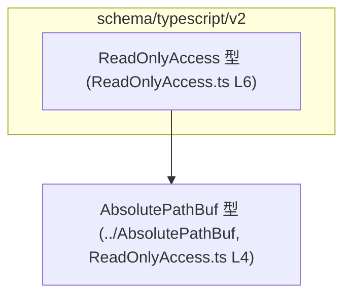

# app-server-protocol/schema/typescript/v2/ReadOnlyAccess.ts コード解説

## 0. ざっくり一言

`ReadOnlyAccess` は、「読み取り専用アクセスがどの程度許可されているか」を表現する TypeScript の判別共用体（discriminated union）型です（`ReadOnlyAccess.ts:L6-6`）。

---

## 1. このモジュールの役割

### 1.1 概要

- このファイルは、`app-server-protocol/schema/typescript/v2` に属する **プロトコル用の型定義** の一部です。
- 読み取り専用アクセスが
  - 特定のルートパスのみに制限されている状態
  - 完全にフルアクセスが許可された状態  
  のいずれかであることを、型レベルで表現します（`ReadOnlyAccess.ts:L6-6`）。
- ファイル先頭のコメントから、この型は Rust 側の定義から `ts-rs` によって自動生成されていることが分かります（`ReadOnlyAccess.ts:L1-3`）。

### 1.2 アーキテクチャ内での位置づけ

- このファイルは **TypeScript 側のスキーマ** として機能し、Rust 側のデータ構造（`ts-rs` が出力元）と 1:1 に対応していると考えられます（コメントより推測、`ReadOnlyAccess.ts:L1-3`）。
- `ReadOnlyAccess` 型は、絶対パス表現を行う `AbsolutePathBuf` 型に依存しています（`ReadOnlyAccess.ts:L4-4`）。
- 他のモジュールからは、`ReadOnlyAccess` 型を import して値の型注釈やプロトコルメッセージの型として利用されることが想定されます（export されているため、`ReadOnlyAccess.ts:L6-6`）。  
  実際の利用箇所はこのチャンクには現れません。



この図は、このチャンクに現れる依存関係のみを示しています。

### 1.3 設計上のポイント

- **判別共用体によるモード表現**  
  - `"type"` プロパティの文字列リテラル（`"restricted"` / `"fullAccess"`）でモードを判別する構造になっています（`ReadOnlyAccess.ts:L6-6`）。
- **パスの表現を型で抽象化**  
  - 制限付きモードで使用するルートパスは `AbsolutePathBuf` 型で表現され、パス表現を別型に委譲しています（`ReadOnlyAccess.ts:L4-4, L6-6`）。
- **コンパイル時の型安全性重視**  
  - TypeScript の型エイリアスのみで構成されており、実行時ロジックは一切ありません。
  - フィールドの有無・型はコンパイル時にチェックされますが、実行時チェックはこのファイルには含まれません。
- **自動生成コード**  
  - ファイル先頭のコメントに「GENERATED CODE」「Do not edit manually」とあり、このファイルを直接編集せず、元の Rust 定義を変更して再生成する前提です（`ReadOnlyAccess.ts:L1-3`）。

---

## 2. 主要な機能一覧

このファイルが提供する主な「機能」は、1 つの型定義です。

- `ReadOnlyAccess`: 読み取り専用アクセス権が「制限付き（restricted）」か「フルアクセス（fullAccess）」かを区別し、制限付きの場合には許可されたルートパス一覧を保持する判別共用体型。

---

## 3. 公開 API と詳細解説

### 3.1 型一覧（構造体・列挙体など）

このチャンクに登場する型・エイリアスのインベントリです。

| 名前 | 種別 | 役割 / 用途 | 定義・参照位置 |
|------|------|-------------|----------------|
| `ReadOnlyAccess` | 型エイリアス（判別共用体） | 読み取り専用アクセス権モードと、制限付きの場合の読み取り可能ルートパスを表す | 定義: `ReadOnlyAccess.ts:L6-6` |
| `AbsolutePathBuf` | 型（他ファイルで定義） | 絶対パスを表す型。`ReadOnlyAccess` の `readableRoots` 要素の型として使用される | import: `ReadOnlyAccess.ts:L4-4` |

#### `ReadOnlyAccess` の構造（詳細）

`ReadOnlyAccess` は次の 2 パターンの共用体です（`ReadOnlyAccess.ts:L6-6`）。

```ts
export type ReadOnlyAccess =
  | {
      "type": "restricted";
      includePlatformDefaults: boolean;
      readableRoots: Array<AbsolutePathBuf>;
    }
  | {
      "type": "fullAccess";
    };
```

- `type: "restricted"` の場合（制限付きモード）
  - `includePlatformDefaults: boolean`  
    - プラットフォームデフォルトの読み取り可能ルートを含めるかどうかを示すフラグと推測できますが、具体的な意味・デフォルト値はこのチャンクからは分かりません。
  - `readableRoots: Array<AbsolutePathBuf>`  
    - 読み取り可能なルートパスのリストです。  
    - 各要素は `AbsolutePathBuf` 型であり、絶対パスであることが型レベルで保証されます。
- `type: "fullAccess"` の場合（フルアクセスモード）
  - `type` 以外のプロパティは持ちません。

> 注: `includePlatformDefaults` や `readableRoots` が具体的に何を指すか、空配列がどのように扱われるかなどのビジネスロジック上の意味は、このチャンクだけからは読み取れません。

### 3.2 関数詳細（最大 7 件）

このファイルには **関数・メソッドは一切定義されていません**（`ReadOnlyAccess.ts:L1-6` には export 関数宣言が存在しません）。

そのため、関数用テンプレートに基づいた詳細解説は対象外となります。

### 3.3 その他の関数

- 補助的な関数やラッパー関数も、このチャンクには存在しません。

---

## 4. データフロー

このファイルには処理ロジックはありませんが、`ReadOnlyAccess` 型の値がどのように利用されるかの **典型的な流れ（型レベルのデータフロー）** をイメージ図として示します。  
実際の呼び出し元・利用先コードはこのチャンクには存在しないため、以下は型構造から一般的に想定されるパターンです。


要点:

- 呼び出し側コードは `ReadOnlyAccess` 型を使うことで、「制限付き」と「フルアクセス」の 2 通りの状態を型として区別できます。
- `type` プロパティによる判別により、TypeScript コンパイラが
  - `type === "restricted"` の分岐では `includePlatformDefaults` / `readableRoots` にアクセス可能
  - `type === "fullAccess"` の分岐ではそれらのプロパティは存在しない  
  ことを静的に保証します。
- どのようなアルゴリズムでアクセス制御を行うかは別ファイルに委ねられており、このチャンクからは分かりません。

---

## 5. 使い方（How to Use）

### 5.1 基本的な使用方法

ここでは、`ReadOnlyAccess` 型の値を作成し、モードごとに処理を分ける基本パターンを示します。  
`AbsolutePathBuf` の具体的な構造はこのチャンクにはないため、コメントで扱います。

```ts
import type { ReadOnlyAccess } from "./ReadOnlyAccess";      // このファイルの型を import する
import type { AbsolutePathBuf } from "../AbsolutePathBuf";   // 絶対パス型（別ファイルで定義）

// 制限付きアクセスの例
const restrictedAccess: ReadOnlyAccess = {
  type: "restricted",                                       // 判別用の文字列リテラル
  includePlatformDefaults: true,                            // プラットフォームデフォルトを含めるかどうか
  readableRoots: [
    // ここに AbsolutePathBuf 型の値を列挙する
    // 例: someAbsolutePath1, someAbsolutePath2, ...
  ] as AbsolutePathBuf[],
};

// フルアクセスの例
const fullAccess: ReadOnlyAccess = {
  type: "fullAccess",                                       // このモードでは他のプロパティは不要
};

// モードに応じた処理分岐の例
function handleAccess(access: ReadOnlyAccess) {
  if (access.type === "restricted") {
    // ここでは access は
    // { type: "restricted"; includePlatformDefaults: boolean; readableRoots: AbsolutePathBuf[] }
    // として扱える
    console.log(access.readableRoots, access.includePlatformDefaults);
  } else {
    // ここでは access は { type: "fullAccess" } として扱える
    console.log("Full read-only access is enabled.");
  }
}
```

このコード例では、TypeScript の **判別共用体** の特徴として、`if (access.type === "restricted")` のブロック内で `readableRoots` などのフィールドに型安全にアクセスできる点が重要です。

### 5.2 よくある使用パターン

1. **設定値としての利用**

   アクセス権設定オブジェクトの一部として、`ReadOnlyAccess` をフィールドに持つ設定型を定義するパターンが考えられます。

   ```ts
   interface AppConfig {
     // 他の設定値...
     readOnlyAccess: ReadOnlyAccess;                       // この型をそのまま設定プロパティにする
   }
   ```

2. **プロトコルメッセージの一部として利用**

   ディレクトリ列挙やファイル読み出し API のリクエスト／レスポンスに、アクセス権を含める形で利用されることが想定されますが、  
   実際にどのメッセージに組み込まれるかはこのチャンクには現れません。

### 5.3 よくある間違い

型構造から想定される誤用と、その防ぎ方を示します。

```ts
// 誤り例: restricted モードなのに必須フィールドを欠いている
const invalidRestricted: ReadOnlyAccess = {
  // @ts-expect-error: includePlatformDefaults と readableRoots が不足している
  type: "restricted",
};

// 正しい例: restricted モードでは必須フィールドをすべて定義する
const validRestricted: ReadOnlyAccess = {
  type: "restricted",
  includePlatformDefaults: false,
  readableRoots: [] as AbsolutePathBuf[],
};

// 誤り例: type の文字列を間違える
const invalidType: ReadOnlyAccess = {
  // @ts-expect-error: "restrict" は許可されたリテラル型ではない
  type: "restrict",
  includePlatformDefaults: false,
  readableRoots: [] as AbsolutePathBuf[],
};
```

- TypeScript のリテラル型により、`type` に指定できる値は `"restricted"` か `"fullAccess"` のみであり、それ以外を指定するとコンパイルエラーになります（`ReadOnlyAccess.ts:L6-6`）。
- `restricted` モードのときに `includePlatformDefaults` や `readableRoots` を省略すると、型エラーになります。

### 5.4 使用上の注意点（まとめ）

- このファイルは **自動生成コード** であり、直接編集しない前提です（`ReadOnlyAccess.ts:L1-3`）。
  - 仕様変更が必要な場合は、元になっている Rust 側の型定義を変更し、`ts-rs` によって再生成する必要があります。
- `ReadOnlyAccess` を利用するコードでは、必ず `type` プロパティによる判別を行うことで、TypeScript の **型ナローイング** を活用できます。
- 実行時には型チェックが行われないため、外部から渡される JSON などをこの型にマッピングする際は、別途ランタイムバリデーションが必要になる可能性があります（このチャンクにはランタイムバリデーションは含まれていません）。

---

## 6. 変更の仕方（How to Modify）

### 6.1 新しい機能を追加する場合

コメントにより、このファイルは `ts-rs` による自動生成であることが明示されています（`ReadOnlyAccess.ts:L1-3`）。  
したがって、**このファイルを直接変更すべきではありません**。

新しい機能（例: 新しいアクセスモード）を追加する一般的な流れは次のようになります。

1. **Rust 側の元定義を変更する**  
   - `ReadOnlyAccess` に対応する Rust の型（構造体や enum）が存在するはずです（場所はこのチャンクには現れません）。
   - そこに新しいバリアントやフィールドを追加します。
2. **`ts-rs` による TypeScript コードの再生成を行う**  
   - プロジェクトのビルド・スクリプトまたは専用コマンドで `ts-rs` を実行し、このファイルを再生成します。
3. **TypeScript 側の利用箇所を更新する**  
   - 新しいバリアントが追加された場合、`switch (access.type)` や `if` 分岐にそのバリアントを追加する必要があります。  
   - どの利用箇所があるかは、このチャンクからは分かりません。

### 6.2 既存の機能を変更する場合

既存フィールドやバリアントを変更する場合も、基本的には Rust 側を変更して再生成する必要があります。

変更時に注意すべき点:

- **後方互換性**  
  - 例えば `"fullAccess"` バリアントに新しい必須フィールドを追加すると、既存の TypeScript コードがコンパイルエラーになる可能性があります。
  - 判別用プロパティ `"type"` のリテラル値を変更すると、既存のすべての利用箇所が影響を受けます。
- **利用箇所の洗い出し**  
  - TypeScript プロジェクト全体で `ReadOnlyAccess` を参照している箇所を検索し、変更内容に応じて分岐ロジックやオブジェクト構築コードを更新する必要があります。
  - このチャンクには利用側コードが含まれていないため、具体的な影響範囲は不明です。

---

## 7. 関連ファイル

このチャンクから明確に分かる関連ファイルは次のとおりです。

| パス | 役割 / 関係 |
|------|------------|
| `app-server-protocol/schema/typescript/v2/ReadOnlyAccess.ts` | 本レポートの対象ファイル。`ReadOnlyAccess` 型エイリアスを定義する（`ReadOnlyAccess.ts:L6-6`）。 |
| `app-server-protocol/schema/typescript/v2/../AbsolutePathBuf.ts` など | `AbsolutePathBuf` 型を定義していると考えられるファイル。`readableRoots` の要素型として利用される（import: `ReadOnlyAccess.ts:L4-4`）。 |
| Rust 側の元定義ファイル（パス不明） | `ts-rs` により本ファイルを生成する元となる Rust の型定義。コメントから存在が推測されるが、具体的な場所や内容はこのチャンクには現れません（`ReadOnlyAccess.ts:L1-3`）。 |

---

### 安全性・エラー・セキュリティ観点（補足）

- **型安全性（TypeScript レベル）**
  - `type` プロパティが文字列リテラル型であるため、誤ったモード名を指定するとコンパイル時に検出されます（`ReadOnlyAccess.ts:L6-6`）。
  - `restricted` モードのときに `includePlatformDefaults` と `readableRoots` を省略するとコンパイルエラーになります。
- **実行時エラー**
  - このファイルには実行時の処理が一切ないため、直接的な実行時エラー要因は含まれていません。
  - ただし、外部から受け取ったデータをこの型として扱う場合、ランタイムバリデーションがなければ不正な形状のオブジェクトが紛れ込む可能性はあります。
- **セキュリティ**
  - 型名やフィールド名からは、アクセス制御（読み取り権限）に関わる設定であることが示唆されます。
  - 実際にどのようなセキュリティ影響があるかは、このチャンクだけでは分かりませんが、利用側のロジックにおいて `fullAccess` を安易に使用したり、`readableRoots` を不適切に設定すると、意図しないファイルにアクセスできる可能性があります。
  - このため、利用側コードでは `ReadOnlyAccess` の値の生成・変更に対して慎重な設計が必要になります（ただし、そのコードはこのチャンクには現れません）。
