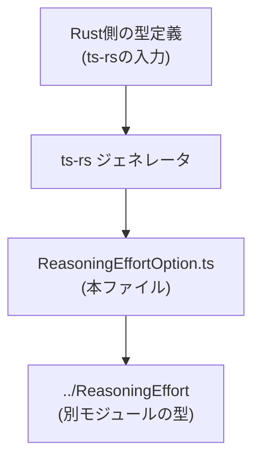
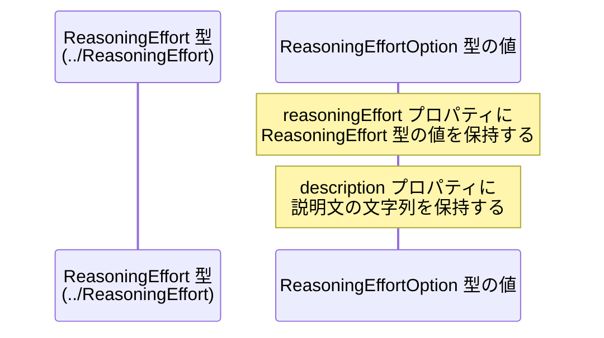

# app-server-protocol\schema\typescript\v2\ReasoningEffortOption.ts コード解説

## 0. ざっくり一言

- Rust 由来の型定義から自動生成された、`ReasoningEffort` とその説明文を 1 つのオブジェクトとして表現する TypeScript の型エイリアスです（ReasoningEffortOption.ts:L1-3, L6）。

---

## 1. このモジュールの役割

### 1.1 概要

- このモジュールは、アプリケーションサーバープロトコルの TypeScript スキーマの一部として、`ReasoningEffort` 型と説明文字列をペアにした `ReasoningEffortOption` 型を定義します（ReasoningEffortOption.ts:L4, L6）。
- ファイル先頭コメントに示されるとおり、Rust 側の型定義から `ts-rs` によって自動生成されるコードであり、手動編集を想定していません（ReasoningEffortOption.ts:L1-3）。

### 1.2 アーキテクチャ内での位置づけ

このモジュールは、TypeScript 向けスキーマ階層 `schema/typescript/v2` の中で、以下のような位置づけになっていると読み取れます。



- Rust 側の型定義から `ts-rs`（コメントで明示、ReasoningEffortOption.ts:L3）が TypeScript ファイルを生成します。
- 本ファイルは `../ReasoningEffort` モジュールの型 `ReasoningEffort` に依存しています（ReasoningEffortOption.ts:L4-6）。

### 1.3 設計上のポイント

- **自動生成コード**  
  - ファイル冒頭に「GENERATED CODE」「Do not edit this file manually」と明記されており（ReasoningEffortOption.ts:L1-3）、ソースオブトゥルースは Rust 側にあります。
- **純粋な型定義のみ**  
  - 関数やクラス、実行時ロジックは一切なく、1 つの `export type` のみを提供するモジュールです（ReasoningEffortOption.ts:L6）。
- **`import type` の利用**  
  - `ReasoningEffort` は `import type` で読み込まれており、コンパイル時のみ利用され、バンドル後の JavaScript には影響しない設計です（ReasoningEffortOption.ts:L4）。
- **必須プロパティのみ**  
  - `reasoningEffort` および `description` にはオプショナル記号 `?` が付いておらず、型レベルでは両方とも必須プロパティとして扱われます（ReasoningEffortOption.ts:L6）。

---

## 2. 主要な機能一覧（コンポーネントインベントリー）

このファイルは「機能」というより「データ構造（型）」のみを提供します。

- `ReasoningEffortOption` 型:  
  - `reasoningEffort: ReasoningEffort` と `description: string` からなるオブジェクト型のエイリアス（ReasoningEffortOption.ts:L6）。
- 依存コンポーネント:
  - `ReasoningEffort` 型（`../ReasoningEffort` モジュールからの型インポート）（ReasoningEffortOption.ts:L4, L6）。

---

## 3. 公開 API と詳細解説

### 3.1 型一覧（構造体・列挙体など）

| 名前                    | 種別          | 公開範囲 | 役割 / 用途                                                                                                                                  | 根拠 |
|-------------------------|---------------|----------|----------------------------------------------------------------------------------------------------------------------------------------------|------|
| `ReasoningEffortOption` | 型エイリアス  | `export` | `reasoningEffort` と `description` の 2 つのプロパティを持つオブジェクト型。推論負荷に関する設定値と、その説明文を 1 セットで表現する用途が想定されます。 | ReasoningEffortOption.ts:L6 |
| `ReasoningEffort`       | 型（詳細不明）| import    | `ReasoningEffortOption` の `reasoningEffort` プロパティの型。具体的な定義は `../ReasoningEffort` モジュール側にあり、このチャンクには現れません。         | ReasoningEffortOption.ts:L4, L6 |

> 用途についての「推論負荷に関する設定値と、その説明文」という解釈は、型名およびプロパティ名から推測できるものであり、コード上に明示的な説明は存在しません。

#### `ReasoningEffortOption` のフィールド構造

```typescript
export type ReasoningEffortOption = {
    reasoningEffort: ReasoningEffort,  // 別モジュールで定義された ReasoningEffort 型
    description: string,               // 説明用の文字列
};
```

（ReasoningEffortOption.ts:L4-6）

### 3.2 関数詳細（最大 7 件）

- このファイルには関数・メソッド・クラス定義は存在しません（ReasoningEffortOption.ts:L1-6）。
- したがって、「関数詳細」セクションに該当する公開 API はありません。

### 3.3 その他の関数

- 補助関数やラッパー関数も定義されていません（ReasoningEffortOption.ts:L1-6）。

---

## 4. データフロー

このファイル自体は実行時ロジックを持たないため、「処理の流れ」ではなく「データ構造内の関係」と「型依存関係」を中心に説明します。

### 4.1 データ構造内の流れ

- `ReasoningEffortOption` 型の値は、オブジェクトリテラルとして生成されることが想定されます。
- 生成された値の内部では、`reasoningEffort` プロパティに `ReasoningEffort` 型の値が入り、`description` に説明用の文字列が入ります（ReasoningEffortOption.ts:L6）。

### 4.2 シーケンス図（型間の依存関係）

以下は、`ReasoningEffortOption` 型がどのように `ReasoningEffort` 型に依存しているかを示す図です。  
実行時のメッセージ送受信ではなく、「値がどの型に属しているか」という静的な関係を表現しています。



- `ReasoningEffort` そのものの定義や生成方法は、このファイルには現れません（ReasoningEffortOption.ts:L4）。
- `ReasoningEffortOption` の値の生成・利用は、別モジュールのコードで行われますが、その具体的なフローはこのチャンクだけからは分かりません。

---

## 5. 使い方（How to Use）

### 5.1 基本的な使用方法

`ReasoningEffortOption` 型を利用する際の代表的なパターンとして、「1 つの選択肢を表すオブジェクトを作る」コード例を示します。

```typescript
// ReasoningEffortOption 型と ReasoningEffort 型を型としてインポートする
import type { ReasoningEffortOption } from "./ReasoningEffortOption"; // 本ファイルを指すパスはプロジェクト構成に依存
import type { ReasoningEffort } from "../ReasoningEffort";            // ReasoningEffort の定義元

// ReasoningEffort 型の値を仮定する（実際の値は ReasoningEffort の定義に依存）
declare const mediumEffort: ReasoningEffort;  // mediumEffort は ReasoningEffort 型

// ReasoningEffortOption 型の値を作成する
const option: ReasoningEffortOption = {
    reasoningEffort: mediumEffort,           // ReasoningEffort 型の値を割り当てる
    description: "標準的な推論負荷",          // 説明用の文字列
};

// option をどこかの API に渡したり、UI に表示したりする用途が考えられる
console.log(option.description);             // "標準的な推論負荷" と出力される想定
```

- `reasoningEffort` フィールドには `ReasoningEffort` 型の値のみを指定できます（ReasoningEffortOption.ts:L6）。
- `description` フィールドには文字列を指定しますが、内容や長さについて制約はこの型定義からは読み取れません（ReasoningEffortOption.ts:L6）。

### 5.2 よくある使用パターン

#### パターン 1: 複数候補のリストとして使う

`ReasoningEffortOption` の配列を作り、選択肢一覧として扱う例です。

```typescript
import type { ReasoningEffortOption } from "./ReasoningEffortOption";
import type { ReasoningEffort } from "../ReasoningEffort";

// 複数の ReasoningEffort 型の値があると仮定
declare const low: ReasoningEffort;
declare const medium: ReasoningEffort;
declare const high: ReasoningEffort;

// ReasoningEffortOption の配列を定義
const options: ReasoningEffortOption[] = [
    { reasoningEffort: low,    description: "低い推論負荷" },
    { reasoningEffort: medium, description: "中程度の推論負荷" },
    { reasoningEffort: high,   description: "高い推論負荷" },
];

// たとえば UI での表示や、ユーザー選択用のデータソースとして利用できる
for (const opt of options) {
    console.log(opt.description);
}
```

#### パターン 2: マップなどのキーとして扱う

`ReasoningEffortOption` の `reasoningEffort` をキー、`description` を値として別の構造に変換するなどの用途も考えられますが、そのような処理はこのファイルには定義されておらず、利用側で実装します。

### 5.3 よくある間違い

#### 間違い例 1: プロパティの欠落

```typescript
import type { ReasoningEffortOption } from "./ReasoningEffortOption";
import type { ReasoningEffort } from "../ReasoningEffort";

declare const someEffort: ReasoningEffort;

// ❌ 間違い: description を省略している
const invalidOption: ReasoningEffortOption = {
    reasoningEffort: someEffort,
    // description が無いため、型エラーになる
};
```

- `description` はオプショナル（`?`）ではなく必須プロパティのため、省略するとコンパイルエラーになります（ReasoningEffortOption.ts:L6）。

#### 間違い例 2: 型の不一致

```typescript
import type { ReasoningEffortOption } from "./ReasoningEffortOption";

// ❌ 間違い: reasoningEffort に string を渡している
const invalidOption2: ReasoningEffortOption = {
    reasoningEffort: "HIGH",      // ReasoningEffort 型ではないため、型エラー
    description: "高い推論負荷",
};
```

- `reasoningEffort` は `ReasoningEffort` 型でなければならず、文字列リテラルのような別型を渡すと型エラーになります（ReasoningEffortOption.ts:L6）。

### 5.4 使用上の注意点（まとめ）

- **自動生成ファイルを直接編集しないこと**  
  - ファイル先頭に「GENERATED CODE」「Do not edit this file manually」と明記されているため（ReasoningEffortOption.ts:L1-3）、手動編集すると Rust 側との定義不整合を招く可能性があります。
- **両プロパティは必須**  
  - `reasoningEffort` / `description` ともにオプショナル指定が無く（`?` が無い）、必須プロパティとして扱われます（ReasoningEffortOption.ts:L6）。
- **`ReasoningEffort` の具体的な内容は別モジュールに依存**  
  - このファイルだけでは `ReasoningEffort` が enum なのか、リテラルユニオンなのか等は分かりません（ReasoningEffortOption.ts:L4）。利用時は `../ReasoningEffort` の定義を確認する必要があります。
- **null / undefined の扱いは不明**  
  - `string` 型として定義されていますが（ReasoningEffortOption.ts:L6）、`--strictNullChecks` 等のコンパイラオプションにより null / undefined 許容性が変わりうるため、このチャンクだけから挙動は判断できません。

---

## 6. 変更の仕方（How to Modify）

### 6.1 新しい機能を追加する場合

- コメントにより、このファイルは `ts-rs` による自動生成であると明示されています（ReasoningEffortOption.ts:L1-3）。
- そのため、新しいフィールドの追加や型の変更を行う場合は、**直接この TypeScript ファイルを書き換えるのではなく**、元となる Rust 側の型定義や `ts-rs` の設定を変更し、再生成することが前提と考えられます。
- Rust 側のどのファイルが元定義になっているかは、このチャンクからは分かりません。

### 6.2 既存の機能を変更する場合

- `ReasoningEffortOption` のプロパティ名や型を変更すると、これを参照している他の TypeScript モジュールとの互換性が失われる可能性がありますが、どのモジュールが利用しているかはこのチャンクには現れません。
- 変更が必要な場合は、少なくとも次の点を確認する必要があります（一般論）:
  - `ReasoningEffortOption` を型注釈として使用しているすべての箇所のコンパイル結果。
  - Rust 側のモデルとの整合性（ts-rs で双方向に依存しているため）。
- 自動生成方針に反して直接 TypeScript ファイルを編集すると、次回の生成時に上書きされる可能性がある点にも注意が必要です（ReasoningEffortOption.ts:L1-3）。

---

## 7. 関連ファイル

このモジュールと密接に関係するファイル・ツールは、コードから以下のように読み取れます。

| パス / ツール                        | 役割 / 関係 |
|--------------------------------------|------------|
| `../ReasoningEffort` モジュール      | `ReasoningEffortOption` の `reasoningEffort` プロパティの型を提供します（ReasoningEffortOption.ts:L4, L6）。実際のファイル名（`ReasoningEffort.ts` など）はこのチャンクには現れません。 |
| Rust 側の型定義（ファイル名不明）    | `ts-rs` による自動生成の元になっている型定義。`ReasoningEffortOption` の本来の設計・制約は Rust 側に存在すると考えられます（ReasoningEffortOption.ts:L1-3）。 |
| `ts-rs` ジェネレータ                 | Rust の型から TypeScript の型を生成するツールとしてコメントで言及されており、本ファイルの生成元です（ReasoningEffortOption.ts:L3）。 |

---

### Bugs / Security / Contracts / Edge Cases の補足

- **Bugs / Security**  
  - 本ファイルには実行時ロジックが存在しないため、直接的なランタイムバグやセキュリティ問題は含まれていません（ReasoningEffortOption.ts:L1-6）。
  - ただし、もし Rust 側との型定義が不整合になった場合、プロトコルレベルでの食い違いがバグや不具合につながる可能性があります。
- **Contracts（契約）**  
  - 契約として読み取れるのは、「`ReasoningEffortOption` は必須プロパティ `reasoningEffort`（型: `ReasoningEffort`）と `description`（型: `string`）を持つオブジェクトである」という点です（ReasoningEffortOption.ts:L6）。
- **Edge Cases（エッジケース）**  
  - `description` が空文字列（`""`）であっても、型レベルでは許容されます。内容の妥当性チェックはこの型定義からは読み取れません。
  - `ReasoningEffort` の取りうる値の範囲（例: 未定義状態がありうるか、特定の値のみか）は `../ReasoningEffort` 側を確認する必要があり、このチャンクだけでは不明です。
