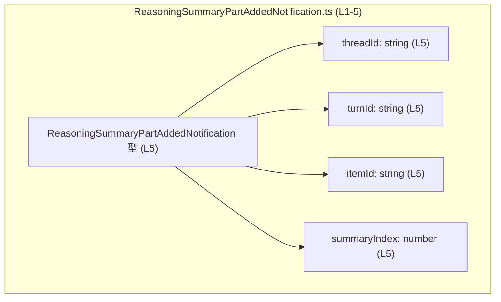
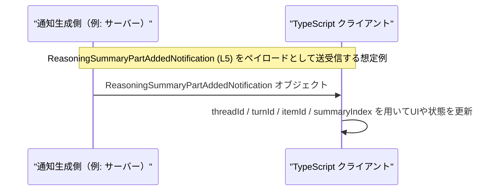

# app-server-protocol/schema/typescript/v2/ReasoningSummaryPartAddedNotification.ts コード解説

## 0. ざっくり一言

`ReasoningSummaryPartAddedNotification` という通知オブジェクトの形を表す **自動生成された TypeScript 型定義**です（`ts-rs` により生成、手動編集禁止と明記されています）。

---

## 1. このモジュールの役割

### 1.1 概要

- このファイルは、アプリケーションサーバーのプロトコルで用いると考えられる通知メッセージ `ReasoningSummaryPartAddedNotification` の **型（構造）を定義する**ために存在しています。
- 型は 4 つのプロパティ（`threadId`, `turnId`, `itemId`, `summaryIndex`）を持つオブジェクトとして定義されています（`export type ... = { ... }`）（`ReasoningSummaryPartAddedNotification.ts:L5-5`）。
- 先頭コメントから、このファイルは `ts-rs` による **自動生成コード**であり、手動編集してはいけないことが分かります（`ReasoningSummaryPartAddedNotification.ts:L1-3`）。

### 1.2 アーキテクチャ内での位置づけ

コードから直接分かる事実:

- このファイル自体は **1 つの型エイリアスをエクスポートするだけ**で、他モジュールの import などはありません（`ReasoningSummaryPartAddedNotification.ts:L5-5`）。
- コメントにより、この型は Rust 側から `ts-rs` を使って生成されていることが分かります（`ReasoningSummaryPartAddedNotification.ts:L1-3`）。

このファイル内部の関係を示す簡単な依存関係図です。



※ この図は **ファイル内の型とフィールドの関係のみ**を示します。どのモジュールから利用されるかは、このチャンクからは分かりません。

### 1.3 設計上のポイント（コードから読み取れる範囲）

- **自動生成コード**  
  - `// GENERATED CODE! DO NOT MODIFY BY HAND!` と `ts-rs` のコメントがあり、生成物であることが明示されています（`ReasoningSummaryPartAddedNotification.ts:L1-3`）。
- **単純なデータキャリア**  
  - 関数やメソッドを持たず、純粋にデータ構造のみを表す「DTO（Data Transfer Object）」的な構造になっています（`ReasoningSummaryPartAddedNotification.ts:L5-5`）。
- **TypeScript の型安全性**  
  - 各プロパティに `string` / `number` の静的型が付き、コンパイル時に誤った型の値が割り当てられることを防ぎます（`ReasoningSummaryPartAddedNotification.ts:L5-5`）。
- **エラー・並行性**  
  - このファイルには実行時処理や非同期処理が一切なく、エラーハンドリングや並行性に関するロジックは存在しません。

---

## 2. 主要な機能一覧

このファイルが提供する主要な「機能」は、1 つの型定義のみです。

- `ReasoningSummaryPartAddedNotification` 型:  
  通知ペイロードの構造を表す TypeScript 型エイリアス（`threadId`, `turnId`, `itemId`, `summaryIndex` を持つオブジェクト）（`ReasoningSummaryPartAddedNotification.ts:L5-5`）。

---

## 3. 公開 API と詳細解説

### 3.1 型一覧（構造体・列挙体など）

| 名前 | 種別 | 役割 / 用途（解釈を含む） | 根拠 |
|------|------|---------------------------|------|
| `ReasoningSummaryPartAddedNotification` | 型エイリアス（オブジェクト型） | 4 つのフィールドを持つ通知オブジェクトの形を表します。名前とパスから、何らかの「Reasoning summary の一部が追加された」ことを表す通知ペイロードと解釈できますが、利用箇所はこのチャンクからは分かりません。 | `ReasoningSummaryPartAddedNotification.ts:L5-5` |

#### フィールド一覧

| フィールド名 | 型 | 説明（事実 + 命名に基づく解釈） | 根拠 |
|-------------|----|----------------------------------|------|
| `threadId` | `string` | 文字列 ID。名前から、スレッド（会話や処理単位）を識別する ID と解釈できます。 | `ReasoningSummaryPartAddedNotification.ts:L5-5` |
| `turnId` | `string` | 文字列 ID。名前から、スレッド内の「ターン」やステップを識別する ID と解釈できます。 | `ReasoningSummaryPartAddedNotification.ts:L5-5` |
| `itemId` | `string` | 文字列 ID。名前から、何らかの要素（item）を識別する ID と解釈できます。 | `ReasoningSummaryPartAddedNotification.ts:L5-5` |
| `summaryIndex` | `number` | 数値。名前から、サマリーの何番目の要素かを表すインデックスと解釈できます。 | `ReasoningSummaryPartAddedNotification.ts:L5-5` |

※ 用途の説明は命名に基づく推測であり、コードだけでは厳密な意味や制約は分かりません。

### 3.2 関数詳細（最大 7 件）

このファイルには **関数・メソッドは定義されていません**（`ReasoningSummaryPartAddedNotification.ts:L1-5` には関数宣言が存在しません）。

したがって、関数詳細テンプレートに従って説明すべき対象はありません。

### 3.3 その他の関数

- 補助関数やラッパー関数も一切存在しません（このチャンクには現れません）。

---

## 4. データフロー

### 4.1 このファイルから分かるデータフロー

- `ReasoningSummaryPartAddedNotification` は **4 つのプリミティブ値（3 つの文字列 + 1 つの数値）を 1 つのオブジェクトとしてまとめるための型**です（`ReasoningSummaryPartAddedNotification.ts:L5-5`）。
- この型のオブジェクトがどこで生成され、どこへ渡されるかは、このチャンクには現れません。

### 4.2 想定される利用イメージ（例示・事実ではない）

以下は **典型的な利用イメージを示すための仮想シナリオ**です。実際の呼び出し関係は、このファイル単体からは分かりません。



この図は、型 `ReasoningSummaryPartAddedNotification`（`ReasoningSummaryPartAddedNotification.ts:L5-5`）が **送受信される通知メッセージのペイロード**として利用されるケースを例示しています。

---

## 5. 使い方（How to Use）

このセクションでは、TypeScript コード内でこの型定義を利用する代表的なパターンを示します。**インポートパスはプロジェクト構成によって異なる**ため、ここでは相対パスを例示します。

### 5.1 基本的な使用方法

通知オブジェクトを受け取って扱う基本的な例です。

```typescript
// ReasoningSummaryPartAddedNotification 型をインポートする
// 実際のパスはプロジェクト構成に応じて調整が必要です
import type { ReasoningSummaryPartAddedNotification } from "./ReasoningSummaryPartAddedNotification";  // 型定義（L5）を利用

// 通知を処理する関数の例                      // この関数は通知オブジェクトを引数に取る
function handleReasoningSummaryPartAdded(
    notification: ReasoningSummaryPartAddedNotification,   // 型によりフィールドの存在と型が保証される（コンパイル時）
): void {
    // 各フィールドに型付きでアクセスできる
    const threadId = notification.threadId;                // string 型
    const turnId = notification.turnId;                    // string 型
    const itemId = notification.itemId;                    // string 型
    const index = notification.summaryIndex;               // number 型

    console.log(`thread=${threadId}, turn=${turnId}, item=${itemId}, index=${index}`);
}
```

このように利用すると、TypeScript の型チェックにより:

- `summaryIndex` に誤って文字列を渡す、
- `threadId` を存在しないプロパティ名で参照する（例: `threadID`）

といったミスがコンパイル時に検出されます。

### 5.2 よくある使用パターン

#### パターン 1: 受信した生データの型チェックと変換

外部から受信した「生の」オブジェクトを、この型に合わせて検証する例です。

```typescript
import type { ReasoningSummaryPartAddedNotification } from "./ReasoningSummaryPartAddedNotification";

// runtime 型ガード関数の例                        // 実行時に unknown データを検証する
function isReasoningSummaryPartAddedNotification(
    value: unknown,
): value is ReasoningSummaryPartAddedNotification {
    // 型ガード: 各フィールドが存在し、型が一致するかをチェック
    if (typeof value !== "object" || value === null) {
        return false;
    }

    const v = value as Record<string, unknown>;
    return (
        typeof v.threadId === "string" &&
        typeof v.turnId === "string" &&
        typeof v.itemId === "string" &&
        typeof v.summaryIndex === "number"
    );
}

// 使用例
function onMessageReceived(raw: unknown) {
    if (isReasoningSummaryPartAddedNotification(raw)) {
        // ここでは raw は ReasoningSummaryPartAddedNotification 型として扱える
        console.log(raw.threadId, raw.summaryIndex);
    } else {
        console.warn("Unexpected message format:", raw);
    }
}
```

**ポイント**:

- TypeScript の型はコンパイル時情報であり、**実行時に自動でバリデーションされるわけではない**ため、外部入力にはこのような型ガードが有用です。

#### パターン 2: オブジェクトの生成

この通知を送信する側で、正しい型に従ってオブジェクトを組み立てる例です。

```typescript
import type { ReasoningSummaryPartAddedNotification } from "./ReasoningSummaryPartAddedNotification";

function createNotification(
    threadId: string,
    turnId: string,
    itemId: string,
    summaryIndex: number,
): ReasoningSummaryPartAddedNotification {
    // 型注釈を付けることで、構造の誤りを検出できる
    const notification: ReasoningSummaryPartAddedNotification = {
        threadId,
        turnId,
        itemId,
        summaryIndex,
    };

    return notification;
}
```

### 5.3 よくある間違い

この型に関連して起こりうる誤用例と、その修正例です。

```typescript
import type { ReasoningSummaryPartAddedNotification } from "./ReasoningSummaryPartAddedNotification";

// ❌ 間違い例: summaryIndex を文字列として扱っている
const wrongNotification: ReasoningSummaryPartAddedNotification = {
    threadId: "t1",
    turnId: "1",
    itemId: "i1",
    // TypeScript がエラーにできる: 'string' を 'number' に代入しようとしている
    // summaryIndex: "0",  // エラー
    summaryIndex: 0,       // ✅ 正しい: number
};

// ❌ 間違い例: 必須フィールドの欠落
const incompleteNotification /*: ReasoningSummaryPartAddedNotification*/ = {
    threadId: "t1",
    turnId: "1",
    // itemId がないため ReasoningSummaryPartAddedNotification とはみなせない
    summaryIndex: 0,
};
// ↑ 上のオブジェクトに ReasoningSummaryPartAddedNotification 型注釈を付けると、
//    itemId 不足としてコンパイルエラーになります。
```

### 5.4 使用上の注意点（まとめ）

- **自動生成であること**  
  - ヘッダーコメントに「DO NOT MODIFY BY HAND!」とあるため、このファイルを直接編集すると再生成時に上書きされます（`ReasoningSummaryPartAddedNotification.ts:L1-3`）。
- **ランタイムの型安全性**  
  - TypeScript の型はコンパイル時のみ有効であり、実行時には **構造が保証されません**。外部から受信したデータには別途バリデーションが必要です。
- **エラー・例外**  
  - このファイルには処理ロジックがないため、直接的に例外やエラーを発生させることはありません。
- **並行性・非同期性**  
  - 型定義だけなので、非同期処理やスレッドセーフティに関する懸念はこのファイル単体には存在しません。

---

## 6. 変更の仕方（How to Modify）

### 6.1 新しい機能を追加する場合

このファイルは `ts-rs` による自動生成であり、コメントに「Do not edit this file manually.」とあります（`ReasoningSummaryPartAddedNotification.ts:L1-3`）。

- そのため、**このファイルに直接コードを追加するべきではありません**。
- 通常、このようなファイルに新しいフィールドや機能を追加したい場合は:
  - 生成元（多くの場合 Rust 側の型定義）を変更し、
  - `ts-rs` によるコード生成プロセスを再実行してこの TypeScript ファイルを再生成する、
  という手順になりますが、生成元の具体的な場所やコマンドはこのチャンクからは分かりません。

### 6.2 既存の機能を変更する場合

既存フィールドを変更したい場合の注意点:

- **フィールド名の変更**  
  - `threadId` 等の名前を変更すると、この型を利用している全ての TypeScript コードに影響が及びます（コンパイルエラーが発生します）。
- **フィールド型の変更**  
  - 例えば `summaryIndex: number` を `string` に変更すると、送受信フォーマットそのものが変わるため、サーバー／クライアント双方の実装の整合性を確認する必要があります。
- **生成元側の契約**  
  - 自動生成であるため、TypeScript 側だけ書き換えると、次回生成で元に戻ってしまう／Rust 側と不整合になる可能性があります。
- このような理由から、変更を行う場合は **生成元の定義・他言語側（Rust 側と思われる）の型・プロトコル仕様**を含めて影響範囲を確認する必要があります（ただし、その詳細はこのチャンクには現れません）。

---

## 7. 関連ファイル

このチャンクに現れる情報から確実に言える関連は以下です。

| パス / ツール | 役割 / 関係 | 根拠 |
|--------------|-------------|------|
| `app-server-protocol/schema/typescript/v2/ReasoningSummaryPartAddedNotification.ts` | 本ファイル。`ReasoningSummaryPartAddedNotification` 型を定義する自動生成 TypeScript ファイル。 | `ReasoningSummaryPartAddedNotification.ts:L1-5` |
| `ts-rs`（外部ツール） | Rust の型から TypeScript の型定義を生成するツールとしてコメントに記載されています。このファイルの生成元です。 | `ReasoningSummaryPartAddedNotification.ts:L3-3` |

※ 他の TypeScript ファイルや、対応する Rust 側の型定義ファイル等の **具体的なパス**は、このチャンクには現れません。そのため、関連ファイルの詳細な一覧はここでは挙げられません。

---

### Bugs/Security / Contracts / Edge Cases / Tests / Performance などの補足

- **Bugs（バグ）**  
  - ファイル内にロジックがないため、典型的なアルゴリズム上のバグは存在しません。
  - ただし、生成元との不整合（生成側の仕様と実際の通信内容がずれる）が起きると、型が実態を反映しないという「仕様上のバグ」が起こりえますが、その有無はこのチャンクからは判断できません。
- **Security（セキュリティ）**  
  - この型は、外部から受信したデータを表す可能性があります。  
    型定義自体はセキュリティ機能を提供しませんが、**外部入力のバリデーションを行うべき**という点が重要です。
- **Contracts / Edge Cases（契約・エッジケース）**  
  - TypeScript 型としては、全フィールドが必須・非 null として定義されています（`ReasoningSummaryPartAddedNotification.ts:L5-5`）。
  - 実行時に `null` / `undefined` や型不一致が渡されるケースは、型だけでは防げないため、前述のような型ガードやスキーマバリデーションが必要です。
- **Tests（テスト）**  
  - このファイルにはテストは含まれていません。この型を利用するコード側で、入力検証やプロトコル整合性に関するテストを書くことが想定されます（が、このチャンクからは具体的なテスト構造は分かりません）。
- **Performance / Scalability（性能・スケーラビリティ）**  
  - 型定義のみであるため、性能への直接的な影響はほぼありません。
  - ただし、非常に多くの通知がやり取りされるシステムでは、`summaryIndex` のようなインデックス管理の扱いがロジック側の性能に影響する可能性がありますが、それはこのファイルの外の話です。
- **Observability（可観測性）**  
  - ログ出力やメトリクス等の仕組みはこのファイルには存在しません。
  - 可観測性は、この型を利用する上位のモジュール・サービス側で設計する必要があります。
