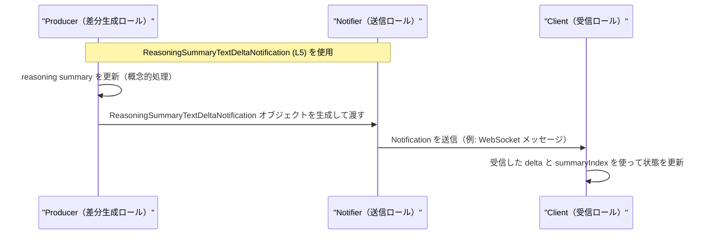

# app-server-protocol/schema/typescript/v2/ReasoningSummaryTextDeltaNotification.ts

## 0. ざっくり一言

- `ReasoningSummaryTextDeltaNotification` という **通知メッセージ用のデータ構造**（TypeScript の型エイリアス）を 1 つだけ定義しているファイルです（`ReasoningSummaryTextDeltaNotification.ts:L5-5`）。
- 文字列 ID 群と数値インデックス、テキスト差分をまとめた **純粋なデータコンテナ** になっています。

---

## 1. このモジュールの役割

### 1.1 概要

- このモジュールは、**通知メッセージに使うオブジェクトの形を型として定義する**ために存在しています（`ReasoningSummaryTextDeltaNotification.ts:L5-5`）。
- 型名とフィールド名からは、「thread / turn / item に紐づく reasoning summary のテキスト差分（delta）を、インデックス付きで表す通知メッセージ」という用途が想定されますが、この用途は名前からの推測であり、コードだけでは断定できません。

### 1.2 アーキテクチャ内での位置づけ

- このファイルは **他のモジュールを import しておらず**、依存関係はありません（`ReasoningSummaryTextDeltaNotification.ts:L1-5`）。
- 一方で、export された型は他の TypeScript ファイルから `import type` されて利用されることが想定されますが、**実際にどのファイルが使っているかはこのチャンクには現れません**。

依存関係（このファイルから見える範囲）を簡略化した図です。


### 1.3 設計上のポイント

- **自動生成コードであることが明示**されており、手動編集しない前提になっています（`ReasoningSummaryTextDeltaNotification.ts:L1-3`）。
  - `// GENERATED CODE! DO NOT MODIFY BY HAND!`
  - `// This file was generated by [ts-rs] ...`
- 型は **1 つの type エイリアスのみ**で、状態やメソッドは持ちません（`ReasoningSummaryTextDeltaNotification.ts:L5-5`）。
- フィールドはすべて **プリミティブ型（`string` / `number`）** で構成されており、JSON シリアライズしやすい構造です（`ReasoningSummaryTextDeltaNotification.ts:L5-5`）。
- ts-rs による生成であるため、Rust 側の型定義との **型レベルでの対応付け** が行われていると考えられます（コメントのツール名に基づく事実からの推測、`ReasoningSummaryTextDeltaNotification.ts:L3-3`）。

---

## 2. 主要な機能一覧

このファイルが提供する機能は、「型定義」のみです。

- `ReasoningSummaryTextDeltaNotification` 型:  
  thread / turn / item に紐づくテキスト差分とインデックスを保持する通知オブジェクトの形を表す型エイリアスです（`ReasoningSummaryTextDeltaNotification.ts:L5-5`）。

---

## 3. 公開 API と詳細解説

### 3.1 型一覧（構造体・列挙体など）

このファイルで公開されている型は 1 つです。

| 名前 | 種別 | 役割 / 用途 | 定義位置 |
|------|------|------------|----------|
| `ReasoningSummaryTextDeltaNotification` | 型エイリアス（オブジェクト型） | 通知メッセージのペイロード構造を表す。`threadId` / `turnId` / `itemId` で対象を識別し、`delta` と `summaryIndex` で差分内容と位置を表現する。 | `ReasoningSummaryTextDeltaNotification.ts:L5-5` |

フィールド構造（`ReasoningSummaryTextDeltaNotification.ts:L5-5`）:

- `threadId: string`
- `turnId: string`
- `itemId: string`
- `delta: string`
- `summaryIndex: number`

### 3.2 関数詳細（最大 7 件）

- **このファイルには関数・メソッド定義はありません**（`ReasoningSummaryTextDeltaNotification.ts:L1-5`）。
- したがって、関数詳細テンプレートに該当する項目はありません。

### 3.3 その他の関数

- **補助関数・ユーティリティ関数も存在しません**（`ReasoningSummaryTextDeltaNotification.ts:L1-5`）。

---

## 4. データフロー

このファイルには処理ロジックはなく、**データ構造のみ** が定義されています。  
ここでは、この型が「通知メッセージのペイロード」として利用されるケースを **概念的な例** として示します（実際のアーキテクチャはこのチャンクからは分かりません）。

### 概念的なデータフローの例

1. 何らかのコンポーネントが reasoning summary のテキストを更新し、その差分を算出する。
2. 差分情報を `ReasoningSummaryTextDeltaNotification` 型のオブジェクトに詰める。
3. そのオブジェクトを WebSocket や他の通信手段でクライアントへ送信する。
4. クライアント側で受信し、画面表示やキャッシュ更新に利用する。

この概念フローを sequence diagram で示します。



> 注意: 上記のコンポーネント名（Producer / Notifier / Client）は、**あくまでこの型の利用イメージを説明するための概念名**です。実際のクラス・モジュール名や構成はこのチャンクには現れません。

---

## 5. 使い方（How to Use）

### 5.1 基本的な使用方法

`ReasoningSummaryTextDeltaNotification` 型のオブジェクトを生成し、何らかの送信関数に渡す例です。送信関数自体は、このファイルには定義されていない仮のものです。

```typescript
// ReasoningSummaryTextDeltaNotification 型をインポートする
import type { ReasoningSummaryTextDeltaNotification } from "./ReasoningSummaryTextDeltaNotification";  // パスは例

// Notification オブジェクトを作成する
const notification: ReasoningSummaryTextDeltaNotification = {
    threadId: "thread-123",     // スレッドを識別する ID（string）
    turnId: "turn-001",         // 会話のターンを識別する ID（string）
    itemId: "item-42",          // 対象アイテムを識別する ID（string）
    delta: "追加されたテキスト",  // summary への追加・変更テキスト（string）
    summaryIndex: 0,            // 差分が適用される位置や番号を表す数値（number）
};

// 仮の送信関数に渡す例（この関数は別モジュールで定義される想定のコード例）
async function sendNotification(
    payload: ReasoningSummaryTextDeltaNotification,
): Promise<void> {
    // 実際には WebSocket / HTTP 送信などを行う
    console.log("send:", payload);
}

// 送信する
sendNotification(notification).catch(console.error);
```

この例から分かるポイント:

- すべてのプロパティが **必須** であり、省略するとコンパイルエラーになります（TypeScript の静的型チェックの効果）。
- `summaryIndex` が `number` 型であるため、文字列などを入れるとコンパイルエラーになります。

### 5.2 よくある使用パターン

#### 1. 受信した JSON をこの型として扱う

実行時に受信した JSON をパースし、`ReasoningSummaryTextDeltaNotification` として扱うパターンです。  
実行時の値チェックは別途必要である点に注意します。

```typescript
import type { ReasoningSummaryTextDeltaNotification } from "./ReasoningSummaryTextDeltaNotification";

function handleMessage(raw: string) {
    // JSON をパースする（ここでは例外処理は簡略化）
    const obj = JSON.parse(raw) as unknown;  // いったん unknown として扱う

    // 実運用ではここでランタイムバリデーションを行うべき
    const notification = obj as ReasoningSummaryTextDeltaNotification; // 型アサーションの例

    // notification.delta などにアクセスできる
    console.log(notification.threadId, notification.delta);
}
```

- TypeScript の型はコンパイル時のみ有効で、`JSON.parse` の結果の構造を **自動では保証しない** ため、実際は `zod` などでスキーマ検証することが推奨されます。
- このファイルには runtime バリデーションは含まれていません（`ReasoningSummaryTextDeltaNotification.ts:L1-5`）。

#### 2. `summaryIndex` を使って配列に適用する

`summaryIndex` を利用して、クライアント側で summary の部分配列に差分を適用するイメージ例です。

```typescript
import type { ReasoningSummaryTextDeltaNotification } from "./ReasoningSummaryTextDeltaNotification";

// summary の各チャンクを文字列配列として管理していると仮定
let summaryChunks: string[] = [];

// Notification を適用する関数の例
function applyDelta(
    summary: string[],
    notification: ReasoningSummaryTextDeltaNotification,
): string[] {
    const { summaryIndex, delta } = notification;

    // 境界チェックなどの詳細は利用側の責務（このファイルには実装なし）
    const newSummary = [...summary];
    newSummary[summaryIndex] = (newSummary[summaryIndex] ?? "") + delta;

    return newSummary;
}
```

- `summaryIndex` が配列範囲外である場合の扱い（エラーにするか、拡張するかなど）は、**利用側のロジックに依存**し、このファイルからは分かりません。

### 5.3 よくある間違い

この型を利用する際に起こりやすい誤用例を、コードで対比します。

```typescript
import type { ReasoningSummaryTextDeltaNotification } from "./ReasoningSummaryTextDeltaNotification";

// 間違い例: フィールド名のタイプミス
const wrong1: ReasoningSummaryTextDeltaNotification = {
    threadID: "thread-123",      // ❌ threadId ではなく threadID と書いてしまっている
    turnId: "turn-001",
    itemId: "item-42",
    delta: "text",
    summaryIndex: 0,
};

// 間違い例: 型の不一致
const wrong2: ReasoningSummaryTextDeltaNotification = {
    threadId: 123,               // ❌ number を渡しているが、型は string
    turnId: "turn-001",
    itemId: "item-42",
    delta: "text",
    summaryIndex: "0",           // ❌ string を渡しているが、型は number
};

// 正しい例
const correct: ReasoningSummaryTextDeltaNotification = {
    threadId: "thread-123",      // ✅ string
    turnId: "turn-001",          // ✅ string
    itemId: "item-42",           // ✅ string
    delta: "text",               // ✅ string
    summaryIndex: 0,             // ✅ number
};
```

- このような誤りはコンパイル時に検出されるため、**TypeScript の型システムによる安全性**が得られます。
- 一方、実行時に外部から受け取る JSON には型チェックが効かないため、**別途 runtime バリデーションが必要**です。

### 5.4 使用上の注意点（まとめ）

- **生成コードを直接編集しないこと**  
  - ファイル冒頭に `DO NOT MODIFY BY HAND` と明示されています（`ReasoningSummaryTextDeltaNotification.ts:L1-3`）。Rust 側の定義を変更して ts-rs で再生成するのが前提です。
- **runtime バリデーションは別途必要**  
  - この型はコンパイル時の型チェックのみを提供し、値の整合性（空文字禁止、インデックス範囲など）は表現していません。
- **並行性・非同期性はこの型には関与しない**  
  - このファイルは純粋な型定義のみであり、Promise・非同期処理・スレッド共有などの懸念はありません（`ReasoningSummaryTextDeltaNotification.ts:L1-5`）。
- **契約（Contract）は「すべてのフィールドが必須で正しい型であること」**  
  - それ以外の制約（ID の形式、`summaryIndex` が 0 以上かどうか等）は、この型からは読み取れません。

---

## 6. 変更の仕方（How to Modify）

### 6.1 新しい機能を追加する場合

このファイルは ts-rs による **自動生成コード** であり、直接編集は推奨されません。

新しいフィールドを追加したい場合の一般的な手順イメージ（ts-rs の標準的な利用方法に基づく説明です）:

1. **Rust 側の元となる構造体を変更する**  
   - `ReasoningSummaryTextDeltaNotification` に対応する Rust の構造体定義（このチャンクには現れません）にフィールドを追加・変更する。
2. **ts-rs を再実行する**  
   - ビルドスクリプトやコマンドにより ts-rs を実行し、TypeScript の型定義を再生成する。
3. **生成されたこのファイルをコミットする**  
   - 再生成結果として `ReasoningSummaryTextDeltaNotification.ts` が更新される。

> このチャンクには Rust 側のファイルや ts-rs 実行方法は含まれないため、具体的なコマンドや構造体名は不明です。

### 6.2 既存の機能を変更する場合

既存フィールドの名前や型を変更する場合の注意点:

- **影響範囲の確認**
  - この型を `import` している TypeScript ファイルがすべて影響を受けます。IDE や `tsc` のエラーで参照箇所を洗い出す必要があります。
- **契約の変更に注意**
  - 例: `summaryIndex: number` を `string` に変えると、利用側のロジックが壊れます。
  - このファイルだけでは利用箇所が分からないため、プロジェクト全体での検索が必要です。
- **互換性**
  - プロトコルスキーマである可能性が高いため（パス名 `app-server-protocol/schema/typescript/v2` からの推測）、既存クライアントとの互換性が重要な場合があります。
- **テスト**
  - このファイル自体にはテストは含まれていないため、利用側のテスト（通信テスト、パーステストなど）を更新して再実行する必要があります。

---

## 7. 関連ファイル

このチャンクには他ファイルの内容は含まれていませんが、パス名から推測できる範囲で整理します。

| パス | 役割 / 関係 |
|------|------------|
| `app-server-protocol/schema/typescript/v2/ReasoningSummaryTextDeltaNotification.ts` | 本レポートの対象。ts-rs により生成された、`ReasoningSummaryTextDeltaNotification` 型の定義（`ReasoningSummaryTextDeltaNotification.ts:L1-5`）。 |
| `app-server-protocol/schema/typescript/v2/` | TypeScript 形式のスキーマ定義を集めたディレクトリと解釈できますが、具体的なファイル構成や内容はこのチャンクには現れません。 |
| Rust 側の ts-rs 元定義ファイル（パス不明） | コメントから、ts-rs が TypeScript 型を生成するための Rust 型定義が存在すると推測されますが、このチャンクには登場しません。 |

---

### コンポーネントインベントリー（まとめ）

このチャンクに現れるコンポーネントを一覧で再掲します。

| 種別 | 名前 | 説明 | 定義位置 |
|------|------|------|----------|
| 型エイリアス | `ReasoningSummaryTextDeltaNotification` | 通知メッセージ用のオブジェクト構造。`threadId` / `turnId` / `itemId` / `delta` / `summaryIndex` の 5 フィールドを持つ。 | `ReasoningSummaryTextDeltaNotification.ts:L5-5` |

- 関数・クラス・列挙体など、他のコンポーネントは **このチャンクには存在しません**（`ReasoningSummaryTextDeltaNotification.ts:L1-5`）。
- バグやセキュリティ上の懸念は、この型定義だけからは特定できませんが、実行時バリデーションを行わない場合に **不正なデータを信頼してしまうリスク** がある点には注意が必要です（一般的な型定義と JSON 受信の関係に基づく注意）。
