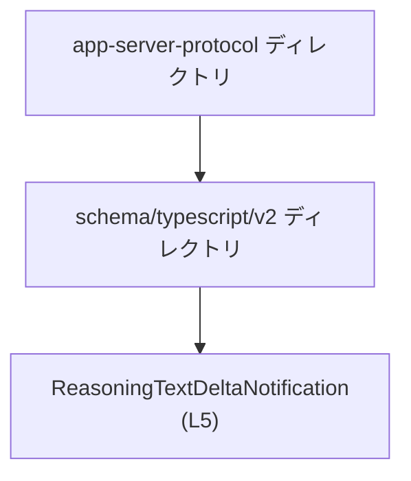
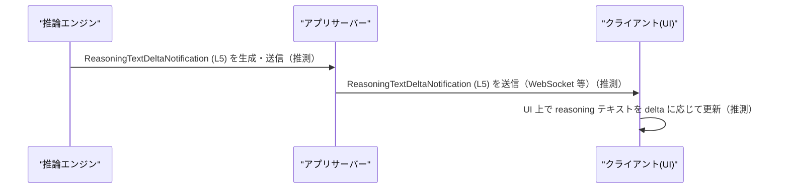

# app-server-protocol\schema\typescript\v2\ReasoningTextDeltaNotification.ts

## 0. ざっくり一言

Reasoning テキストに関する「差分通知」のペイロード構造を表す、TypeScript の型エイリアス定義です（`export type` のみ、実行時ロジックはありません）。  
ファイル全体が `ts-rs` によって自動生成されています（L1, L3）。

---

## 1. このモジュールの役割

### 1.1 概要

- このファイルは、`ReasoningTextDeltaNotification` という 1 つの公開型を定義します（L5）。
- この型は、以下の 5 つのプロパティを持つオブジェクト形状を表します（L5）。
  - `threadId: string`
  - `turnId: string`
  - `itemId: string`
  - `delta: string`
  - `contentIndex: number`
- ファイル先頭コメントから、この型は Rust 側の定義から `ts-rs` によって自動生成された TypeScript スキーマであり、手動編集は想定されていません（L1, L3）。

### 1.2 アーキテクチャ内での位置づけ

ファイルパスから、TypeScript クライアント向けの「v2 プロトコルスキーマ」の一部であることが読み取れます。



- 上位ディレクトリ `app-server-protocol` は、アプリケーションサーバーのプロトコル定義群であると推測されますが、このチャンクだけでは具体的な仕様は分かりません。
- `schema/typescript/v2` にあることから、TypeScript クライアント向けのバージョン 2 スキーマ群の 1 ファイルであると解釈できます（パス情報に基づく推測であり、詳細仕様はこのチャンクには現れません）。

### 1.3 設計上のポイント

コードから読み取れる設計上の特徴は次のとおりです。

- **自動生成コード**  
  - L1, L3 のコメントにより、`ts-rs` による自動生成であり、手動で編集すべきでないことが明示されています。  
    - `// GENERATED CODE! DO NOT MODIFY BY HAND!`（L1）  
    - `// This file was generated by [ts-rs] ... Do not edit this file manually.`（L3）
- **データ構造のみ（ロジックなし）**  
  - 実行時に動作する関数・クラス・処理ロジックはなく、静的な型エイリアスのみが定義されています（L5）。
- **構造的型付け（TypeScript 特有）**  
  - TypeScript の `type` エイリアスであるため、「`threadId` などの 5 プロパティを持つオブジェクト」であれば構造的にこの型を満たします。
- **必須プロパティのみ**  
  - すべてのプロパティに `?` が付いておらず、オプションではないため、型上は 5 プロパティすべてが必須です（L5）。

---

## 2. 主要な機能一覧

このファイルは 1 つの公開型のみを提供します。

- `ReasoningTextDeltaNotification`: Reasoning テキストの「差分通知」メッセージのペイロード構造を表す TypeScript 型エイリアス（L5）。

※ 上記の「差分通知」という意味付けは型名・プロパティ名に基づく解釈であり、詳細な仕様はコードからは分かりません。

---

## 3. 公開 API と詳細解説

### 3.1 型一覧（構造体・列挙体など）

このファイルに定義される型コンポーネントのインベントリーです。

| 名前                           | 種別        | 役割 / 用途（コードから読み取れる範囲）                                                                 | 定義位置 |
|--------------------------------|-------------|----------------------------------------------------------------------------------------------------------|----------|
| `ReasoningTextDeltaNotification` | 型エイリアス | Reasoning テキストの差分通知ペイロードを表すオブジェクトの構造を定義する。5 つの必須プロパティを持つ。 | `ReasoningTextDeltaNotification.ts:L5-5` |

#### `ReasoningTextDeltaNotification` のプロパティ一覧

同じ行にすべてのプロパティが定義されています（L5）。

| プロパティ名   | 型       | 必須/任意 | 説明（コードからの解釈）                                                | 定義位置 |
|----------------|----------|-----------|---------------------------------------------------------------------------|----------|
| `threadId`     | `string` | 必須      | スレッドを識別する ID を表す文字列と解釈できます（命名に基づく）。       | `ReasoningTextDeltaNotification.ts:L5-5` |
| `turnId`       | `string` | 必須      | あるスレッド内の「ターン」（対話単位など）を識別する ID と解釈できます。 | `ReasoningTextDeltaNotification.ts:L5-5` |
| `itemId`       | `string` | 必須      | 通知対象のアイテム（メッセージなど）を識別する ID と解釈できます。       | `ReasoningTextDeltaNotification.ts:L5-5` |
| `delta`        | `string` | 必須      | Reasoning テキストの差分（追加分）を含む文字列と解釈できます。          | `ReasoningTextDeltaNotification.ts:L5-5` |
| `contentIndex` | `number` | 必須      | 同一アイテム内のコンテンツインデックス・順序を表す数値と解釈できます。   | `ReasoningTextDeltaNotification.ts:L5-5` |

> 上記の説明は、プロパティ名からの自然な解釈であり、厳密な仕様（例えば ID のフォーマットや `contentIndex` の範囲など）はこのチャンクからは分かりません。

### 3.2 関数詳細

- このファイルには、関数・メソッド・クラスコンストラクタなどの「実行時ロジック」は定義されていません（L1–L5 のうちコード本体は型エイリアスのみ）。
- したがって、関数詳細テンプレートに基づく解説対象はありません。

### 3.3 その他の関数

- 補助関数・ユーティリティ関数なども存在しません（L1–L5 を通して `function` や `=>` を含む関数定義は見当たりません）。

---

## 4. データフロー

### 4.1 この型が関わるデータフロー（一般的なイメージ）

このファイルからは、この型がどこからどこへ渡されるかといった具体的なフローは分かりません。  
ただし、型名 `ReasoningTextDeltaNotification` と ID/インデックス/差分テキストを持つ構造から、**「推論中のテキスト更新（差分）を通知するメッセージ」** として利用される可能性が高いと考えられます（命名に基づく推測）。

一般的なクライアント–サーバー構成を想定したデータフローの例（あくまで参考イメージ）を示します。



- 上図は、この型が「サーバーからクライアントへの通知」に使われるであろう、代表的なパターンを示した推測例です。
- 実際の呼び出し元・通信経路・トランスポート（HTTP/WS 等）は、このチャンクの情報からは特定できません。

---

## 5. 使い方（How to Use）

### 5.1 基本的な使用方法

この型は TypeScript の「型エイリアス」なので、**静的型チェック** や **IDE 補完** のために使用します。

```typescript
// ReasoningTextDeltaNotification.ts から型をインポートする
// 実際のパスはプロジェクト構成に依存し、このチャンクからは特定できません。
import type { ReasoningTextDeltaNotification } from "./ReasoningTextDeltaNotification";

// 通知を受け取って処理する関数の例
function handleReasoningDelta(
    notification: ReasoningTextDeltaNotification, // 型付けすることでプロパティの補完・チェックが有効になる
): void {
    // threadId, turnId などのプロパティに型安全にアクセスできる
    console.log("thread:", notification.threadId);
    console.log("delta:", notification.delta);

    // contentIndex を使って UI 上のどのコンテンツを更新するか決定する、という使い方が考えられます（推測）
}
```

このように、`ReasoningTextDeltaNotification` 型を引数や戻り値に付けることで、

- 必須プロパティの漏れ
- 型不一致（例えば `contentIndex` を文字列にしてしまうなど）

をコンパイル時に検出できるようになります。

### 5.2 よくある使用パターン（想定）

コードから具体的な使用例は分かりませんが、型の性質から次のようなパターンが考えられます。

1. **ストリーミング応答のハンドラで使用**（推測）  
   - サーバーから流れてくるストリーミングな reasoning テキストの差分メッセージに対して、この型で型付けする。
2. **Redux など状態管理のアクションペイロード**（推測）  
   - 状態管理ライブラリにおいて、「Reasoningテキスト差分が届いた」アクションの payload 型として利用する。

いずれの場合も、「どのスレッド・ターン・アイテムのどの部分に対する差分か」を `threadId`, `turnId`, `itemId`, `contentIndex` で特定し、`delta` を適用する、という構造になっていると考えられますが、これは命名に基づく推測です。

### 5.3 よくある間違い（起こりうる誤用）

TypeScript 型はコンパイル時のみ有効であり、**実行時には消える** ため、外部から受け取ったデータに対しては注意が必要です。

```typescript
// 間違い例: any からそのまま ReasoningTextDeltaNotification だと仮定して使う
function unsafeHandle(data: any) {
    // data.threadId が存在しない / string ではない場合でも、ここではコンパイルエラーにならない
    console.log(data.threadId.toUpperCase()); // 実行時エラーになりうる
}

// 正しい例: runtime チェックまたはパーサを通す
function isReasoningTextDeltaNotification(
    value: any,
): value is ReasoningTextDeltaNotification {
    // 簡易な実行時チェックの例（必要に応じて詳細化）
    return (
        value &&
        typeof value.threadId === "string" &&
        typeof value.turnId === "string" &&
        typeof value.itemId === "string" &&
        typeof value.delta === "string" &&
        typeof value.contentIndex === "number"
    );
}

function safeHandle(data: unknown) {
    if (!isReasoningTextDeltaNotification(data)) {
        // 型に合わないデータは弾く
        return;
    }
    // ここからは ReasoningTextDeltaNotification として安全に扱える
    console.log(data.delta);
}
```

- この型自体には実行時チェックは含まれていないため、**外部入力（JSON など）には別途バリデーションが必要**です。

### 5.4 使用上の注意点（まとめ）

- このファイルは自動生成されるため、**手動で編集すると次回の自動生成で上書きされる**ことに注意する必要があります（L1, L3）。
- `ReasoningTextDeltaNotification` は **必須プロパティのみ** からなるため、すべてのプロパティを常に提供する前提でコードを書くことになります（L5）。
- TypeScript の型システムはコンパイル時のみ有効であり、**実行時には存在しない**ため、外部からのデータ受信時には別途実行時バリデーションが必要です。
- 非同期・並行処理に関する情報（スレッド安全性など）は、この型には含まれておらず、このチャンクからは読み取れません。

---

## 6. 変更の仕方（How to Modify）

### 6.1 新しい機能を追加する場合

このファイルは `ts-rs` によって生成されることが明記されているため（L1, L3）、**直接変更するのではなく、元となる Rust 側の定義を変更し、再生成する**のが前提になります。

一般的な流れ（このチャンクから Rust 側の具体的なパスは分かりません）:

1. Rust コードベース内で、`ReasoningTextDeltaNotification` に対応する構造体や型を探す（`ts-rs` のアトリビュートが付いているはず、というのは一般的な ts-rs の使われ方に基づく推測です）。
2. 必要なフィールド追加・型変更などを **Rust 側** で行う。
3. `ts-rs` を用いたスキーマ生成コマンド（`cargo` スクリプトなど）を実行し、TypeScript スキーマを再生成する。
4. TypeScript 側のコンパイルエラーを確認し、新しいフィールドを使用するコードを追加・修正する。

このチャンクには Rust 側の定義やビルドスクリプトは出てこないため、詳細な手順は不明です。

### 6.2 既存の機能を変更する場合

この型の構造（フィールド名・型など）を変更する場合も、基本的には上記と同様に Rust 側から変更することになります。

変更時に注意すべき点:

- **互換性**  
  - 既存クライアントコードが `ReasoningTextDeltaNotification` を前提としている場合、フィールド削除や型変更は広範な影響を与えます。
  - プロトコルバージョン (`v2`) のディレクトリ構成から、非互換な変更は新バージョンディレクトリ（例: `v3`）を用意して行う設計である可能性がありますが、このチャンクからは断定できません。
- **契約（コントラクト）**  
  - `threadId`, `turnId`, `itemId`, `contentIndex` などの意味・制約（ID フォーマット、インデックスの開始値など）は、このチャンクからは分からないため、仕様書や Rust 側定義を確認する必要があります。

---

## 7. 関連ファイル

このチャンクから確実に分かるのは、当該ファイル自身のみです。  
他のスキーマファイルや Rust 側の元定義のパスはここには現れません。

| パス                                                                 | 役割 / 関係                                                                                  |
|----------------------------------------------------------------------|----------------------------------------------------------------------------------------------|
| `app-server-protocol\schema\typescript\v2\ReasoningTextDeltaNotification.ts` | `ReasoningTextDeltaNotification` 型エイリアスを定義する自動生成 TypeScript スキーマファイル（L1–L5）。 |

---

## 言語固有の安全性・エラー・並行性に関する補足

- **型安全性**  
  - TypeScript の静的型チェックにより、`ReasoningTextDeltaNotification` 型として扱うオブジェクトに必須プロパティ欠落や型不一致があればコンパイル時に検出できます（L5 の型定義に基づく）。
- **エラー処理**  
  - このファイル自体にはエラーを投げるコードはなく（関数も存在しない）、エラー処理はすべてこの型を利用する側のコードに委ねられます。
  - 外部から受け取る JSON をこの型として扱う場合、**実行時の型チェックを行わないとランタイムエラーが発生しうる**点に注意が必要です（5.3 の例参照）。
- **並行性 / 非同期性**  
  - この型は純粋なデータ構造であり、スレッド・イベントループ・Promise など並行処理に直接関与する要素は含みません（L5）。
  - 並行アクセスの安全性や順序保証などは、この型を送受信・処理する上位レイヤー（ネットワークレイヤーや状態管理）で扱う必要がありますが、その実装はこのチャンクには現れません。

---

## Bugs / Security / Tests / 性能に関する所見（このチャンクから分かる範囲）

- **Bugs（バグの可能性）**  
  - 実行時ロジックを持たない単純な型定義であるため、このファイル単体に内在するバグは見当たりません（L5）。
- **Security（セキュリティ）**  
  - 型定義だけでは入力値の検証は行われません。信頼できない入力（外部からの JSON 等）をこの型として扱う場合は、**サニタイズ・バリデーションを別途実装する必要**があります。
- **Tests（テスト）**  
  - このファイル内にテストコードは存在しません（L1–L5 にテスト関連の記述はなし）。  
    型スキーマであるため、一般には上位レイヤーの統合テストや型レベルのコンパイルチェックで間接的に検証されることが多いと考えられますが、このチャンクからはテスト戦略は分かりません。
- **Performance / Scalability（性能・スケーラビリティ）**  
  - 実行時の処理を持たない型定義だけなので、このファイル自体が性能ボトルネックになることはありません。  
  - 実際の性能は、この型をどの頻度で送受信するか、どのようなデータ量の `delta` を扱うか、といった上位ロジックに依存しますが、このチャンクからは判断できません。
