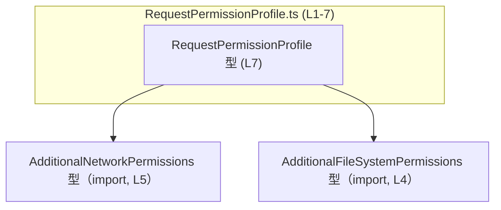
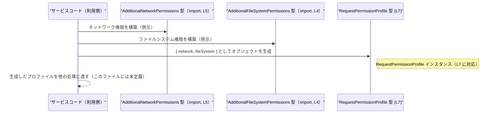

# app-server-protocol/schema/typescript/v2/RequestPermissionProfile.ts

## 0. ざっくり一言

このファイルは、**リクエスト時の権限プロファイル**を表す TypeScript の型 `RequestPermissionProfile` を 1 つだけ定義する、自動生成コードです（`ts-rs` により Rust 側の型から生成）【RequestPermissionProfile.ts:L1-3】【RequestPermissionProfile.ts:L7-7】。

---

## 1. このモジュールの役割

### 1.1 概要

- このモジュールは、TypeScript 側で **追加のネットワーク権限** と **追加のファイルシステム権限** をまとめて扱うためのオブジェクト型 `RequestPermissionProfile` を提供します【RequestPermissionProfile.ts:L4-5】【RequestPermissionProfile.ts:L7-7】。
- 各権限フィールドは、型付けされた権限情報か、権限が存在しないことを表す `null` のどちらかを取ります【RequestPermissionProfile.ts:L7-7】。
- ファイル先頭のコメントから、この型は Rust 用ライブラリ `ts-rs` により自動生成され、**手動編集しないことが前提**になっています【RequestPermissionProfile.ts:L1-3】。

> 利用用途（どの API で使われるかなど）は、このチャンクには現れないため不明です。型名やディレクトリ名からリクエスト用プロトコルであることが想定されますが、コードだけでは断定できません。

### 1.2 アーキテクチャ内での位置づけ

このモジュールは、2 つの権限型に依存するシンプルな型定義です。

- 依存している型
  - `AdditionalFileSystemPermissions`（ファイルシステム権限）【RequestPermissionProfile.ts:L4-4】
  - `AdditionalNetworkPermissions`（ネットワーク権限）【RequestPermissionProfile.ts:L5-5】
- 提供している型
  - `RequestPermissionProfile`（両者をまとめたプロファイル）【RequestPermissionProfile.ts:L7-7】

Mermaid で依存関係を図示すると、次のようになります。



> `AdditionalNetworkPermissions` / `AdditionalFileSystemPermissions` の中身は、このチャンクには現れないため不明です。

### 1.3 設計上のポイント

- **自動生成コード**  
  - 行コメントで「GENERATED CODE」「Do not edit」と明示されており【RequestPermissionProfile.ts:L1-3】、Rust 側の定義がソース・オブ・トゥルースになっています。
- **シンプルなデータキャリア**  
  - ロジックや関数を持たず、2 つのフィールドを持つだけのプレーンなオブジェクト型として定義されています【RequestPermissionProfile.ts:L7-7】。
- **`null` を使った存在有無の表現**  
  - 両フィールドとも `T | null` というユニオン型で、  
    - 権限情報がある場合: `AdditionalNetworkPermissions` / `AdditionalFileSystemPermissions`  
    - 権限情報がない場合: `null`  
    を表現します【RequestPermissionProfile.ts:L7-7】。
- **状態や並行性は持たない**  
  - 型定義のみで、インスタンス生成や更新のロジックを持たないため、このモジュール自体には非同期処理・並行処理・エラーハンドリングのコードは存在しません【RequestPermissionProfile.ts:L1-7】。

---

## 2. 主要な機能一覧（コンポーネントインベントリー）

このファイルに含まれるコンポーネントを一覧します。

| 名前 | 種別 | 役割 / 用途 | 根拠 |
|------|------|-------------|------|
| `RequestPermissionProfile` | 型エイリアス（オブジェクト型） | 追加のネットワーク権限・ファイルシステム権限をまとめて表すプロファイル | 【RequestPermissionProfile.ts:L7-7】 |
| `network` | フィールド | 追加のネットワーク権限。`AdditionalNetworkPermissions` か `null` | 【RequestPermissionProfile.ts:L7-7】 |
| `fileSystem` | フィールド | 追加のファイルシステム権限。`AdditionalFileSystemPermissions` か `null` | 【RequestPermissionProfile.ts:L7-7】 |
| `AdditionalNetworkPermissions` | 型（外部定義） | `network` フィールドの具体的な権限型 | 【RequestPermissionProfile.ts:L5-5】 |
| `AdditionalFileSystemPermissions` | 型（外部定義） | `fileSystem` フィールドの具体的な権限型 | 【RequestPermissionProfile.ts:L4-4】 |

このファイルには **関数・クラス・列挙体は一切定義されていません**【RequestPermissionProfile.ts:L1-7】。

---

## 3. 公開 API と詳細解説

### 3.1 型一覧（構造体・列挙体など）

`export` されている主要な型は 1 つです。

| 名前 | 種別 | 役割 / 用途 | フィールド概要 | 定義位置 |
|------|------|-------------|----------------|----------|
| `RequestPermissionProfile` | 型エイリアス（オブジェクト型） | ネットワークとファイルシステムの「追加権限」設定をまとめたプロファイルを表す | `network: AdditionalNetworkPermissions \| null`, `fileSystem: AdditionalFileSystemPermissions \| null` | 【RequestPermissionProfile.ts:L7-7】 |

#### `RequestPermissionProfile` の構造

```ts
export type RequestPermissionProfile = {
    network: AdditionalNetworkPermissions | null;
    fileSystem: AdditionalFileSystemPermissions | null;
};
```

- **`network` フィールド**【RequestPermissionProfile.ts:L7-7】  
  - 型: `AdditionalNetworkPermissions | null`  
  - 意味: 追加のネットワーク権限。権限がなければ `null` を設定する契約です。
- **`fileSystem` フィールド**【RequestPermissionProfile.ts:L7-7】  
  - 型: `AdditionalFileSystemPermissions | null`  
  - 意味: 追加のファイルシステム権限。不要な場合は `null` を設定します。

> 具体的にどのような権限を表すかは `AdditionalNetworkPermissions` / `AdditionalFileSystemPermissions` の定義に依存しますが、それらはこのチャンクには現れません。

### 3.2 関数詳細

このファイルには **関数・メソッドが一切定義されていません**【RequestPermissionProfile.ts:L1-7】。

そのため、「関数詳細テンプレート」を適用できる対象はありません。

### 3.3 その他の関数

- 該当なし（関数定義が存在しません）【RequestPermissionProfile.ts:L1-7】。

---

## 4. データフロー

このモジュール自体は型定義だけで処理ロジックを持ちませんが、典型的には次のようなデータフローで使われることが想定されます（例示であり、このファイルには実装はありません）。

### 4.1 概念的なフロー

1. あるサービスコードが、  
   `AdditionalNetworkPermissions` と `AdditionalFileSystemPermissions` の値を計算または取得する。
2. それらを `RequestPermissionProfile` オブジェクトにまとめる。
3. まとまったプロファイルを別モジュールや通信層に渡す（例: シリアライズして API レスポンスに含めるなど）。

### 4.2 シーケンス図（概念）



> この図は、`RequestPermissionProfile` がどのようにデータをまとめるかという **構造上の役割** を示すものであり、実際の実装はこのファイルには含まれていません【RequestPermissionProfile.ts:L1-7】。

---

## 5. 使い方（How to Use）

### 5.1 基本的な使用方法

`RequestPermissionProfile` を利用する典型的なコードフローは、次のようになります。

```ts
// RequestPermissionProfile 型と依存する権限型を import する
import type { RequestPermissionProfile } from "./RequestPermissionProfile";               // このファイル
import type { AdditionalNetworkPermissions } from "./AdditionalNetworkPermissions";       // L5 の import に対応
import type { AdditionalFileSystemPermissions } from "./AdditionalFileSystemPermissions"; // L4 の import に対応

// 具体的な権限オブジェクトを用意する（フィールド構造はそれぞれの型定義に依存）
const networkPerms: AdditionalNetworkPermissions = /* ここでネットワーク権限を構築 */;
const filePerms: AdditionalFileSystemPermissions = /* ここでファイルシステム権限を構築 */;

// RequestPermissionProfile 型の値を生成する
const profile: RequestPermissionProfile = {
    network: networkPerms,    // 追加ネットワーク権限。不要なら null でもよい
    fileSystem: filePerms,    // 追加ファイルシステム権限。不要なら null でもよい
};

// profile を別の処理に渡す、シリアライズするなど
```

- TypeScript の型システム上、`network` / `fileSystem` は **必須プロパティ** ですが、値として `null` を取れるようになっています【RequestPermissionProfile.ts:L7-7】。
- したがって、「権限が無いこと」を表したい場合は **プロパティを省略するのではなく `null` を代入する** ことが契約になります。

### 5.2 よくある使用パターン

#### パターン 1: 両方とも権限指定がない場合

```ts
const noPermissionsProfile: RequestPermissionProfile = {
    network: null,        // ネットワーク権限なし
    fileSystem: null,     // ファイルシステム権限なし
};
```

このように、`null` を明示的に設定することで、「追加権限が無い」状態を表現できます【RequestPermissionProfile.ts:L7-7】。

#### パターン 2: ネットワークのみ権限がある場合

```ts
const networkOnlyProfile: RequestPermissionProfile = {
    network: networkPerms, // 何らかの追加ネットワーク権限
    fileSystem: null,      // ファイルシステム権限は不要
};
```

サービス側では、`fileSystem === null` を条件にした処理分岐を行うことが想定されます（ただし、そのロジックはこのファイルには現れません）。

### 5.3 よくある間違い

この型定義から推測できる、起こりやすそうな誤用例と正しい記述例です。

```ts
import type { RequestPermissionProfile } from "./RequestPermissionProfile";

// 誤り例 1: 必須プロパティを省略してしまう（network が無い）
const wrong1: RequestPermissionProfile = {
    // network: ... が無い
    fileSystem: null,
    // strictNullChecks 有効ならコンパイルエラーになる
};

// 正しい例: network が不要なら null を明示する
const correct1: RequestPermissionProfile = {
    network: null,    // プロパティは存在し、値が null
    fileSystem: null,
};


// 誤り例 2: null の代わりに undefined を使う
const wrong2: RequestPermissionProfile = {
    // strictNullChecks が有効な場合、型 'undefined' を 'AdditionalNetworkPermissions | null' に代入できない
    network: undefined as any,  // any 経由などで紛れ込むと型安全性が失われる
    fileSystem: null,
};

// より安全な例: 契約どおり null を使う
const correct2: RequestPermissionProfile = {
    network: null,    // 「権限がない」ことを明示
    fileSystem: null,
};
```

- この型では `network` / `fileSystem` は `T | null` であり、`T | undefined` ではありません【RequestPermissionProfile.ts:L7-7】。
- `strictNullChecks` が有効なプロジェクトでは、`undefined` を代入するとコンパイルエラーになるため、**存在しない状態は常に `null` で表現する**のが契約として自然です。

### 5.4 使用上の注意点（まとめ）

- **プロパティは必須**  
  - `network` / `fileSystem` はオプショナル（`?`）ではなく必須プロパティです【RequestPermissionProfile.ts:L7-7】。  
    - 「権限が無い」は `null` で表現します。
- **null と undefined の区別**  
  - 型定義は `T | null` となっており、`undefined` を含んでいません【RequestPermissionProfile.ts:L7-7】。  
  - `undefined` を使うと、利用側で「undefined と null の両方を扱う」必要が生じ、バグやセキュリティチェック漏れの原因になる可能性があります。
- **型定義自体には実行時エラーはない**  
  - このファイルは型情報のみであり、実行時ロジックを含まないため、直接的なランタイムエラーや並行性の問題は発生しません【RequestPermissionProfile.ts:L1-7】。  
  - エラーやセキュリティ上の問題は、この型をどう解釈・検証するかを実装する別モジュール側に依存します（このチャンクには現れません）。

---

## 6. 変更の仕方（How to Modify）

### 6.1 新しい機能を追加する場合

ファイル先頭のコメントの通り、この TypeScript ファイルは `ts-rs` によって **自動生成** されており、**直接編集すべきではありません**【RequestPermissionProfile.ts:L1-3】。

新しいフィールドや振る舞いを追加したい場合の一般的な手順は次のとおりです（概念的な説明であり、具体的な Rust 側のファイル名などはこのチャンクには現れません）。

1. **Rust 側の元になっている型定義を探す**  
   - `ts-rs` で TypeScript にエクスポートされている Rust の構造体や型エイリアスを特定します（この情報はこのチャンクからは不明です）。
2. **Rust 側にフィールドを追加する**  
   - 例: `network` / `file_system` に相当するフィールド定義の横に、新しい権限フィールドを追加するなど。
3. **`ts-rs` を用いて TypeScript コードを再生成する**  
   - ビルドスクリプトやコマンドを実行して、本ファイルを再生成します。
4. **生成された TypeScript 側で新しいフィールドを利用する**  
   - 生成後の `RequestPermissionProfile` に新しいフィールドが追加されていることを確認し、利用側コードを更新します。

### 6.2 既存の機能を変更する場合

既存フィールドの意味や型を変更する際の注意点です。

- **影響範囲の確認**  
  - `RequestPermissionProfile` を import している TypeScript コードをすべて検索し、`network` / `fileSystem` の扱い方を確認する必要があります（このチャンクには使用箇所は現れません）。
- **契約（Contract）の明確化**  
  - `null` の意味（「権限なし」なのか「未評価」なのか）を変えたい場合、利用側のロジック・バリデーションの修正が必要です。
- **テストの更新**  
  - このファイルにはテストは存在しませんが【RequestPermissionProfile.ts:L1-7】、プロトコルのシリアライズ／デシリアライズや権限チェックをテストするコードが別の場所にある可能性があります。それらの期待値も合わせて更新する必要があります（このチャンクからは位置は分かりません）。

---

## 7. 関連ファイル

このモジュールと直接関係しているファイルは、import されている 2 つの権限型定義です。

| パス（推定） | 役割 / 関係 | 根拠 |
|-------------|------------|------|
| `./AdditionalFileSystemPermissions` | `fileSystem` フィールドの具体的な型定義。ファイルシステムに関する追加権限を表す型として使用される | `import type { AdditionalFileSystemPermissions } from "./AdditionalFileSystemPermissions";`【RequestPermissionProfile.ts:L4-4】 |
| `./AdditionalNetworkPermissions` | `network` フィールドの具体的な型定義。ネットワークに関する追加権限を表す型として使用される | `import type { AdditionalNetworkPermissions } from "./AdditionalNetworkPermissions";`【RequestPermissionProfile.ts:L5-5】 |

> これらのファイルの中身や、Rust 側の元定義、テストコードなどはこのチャンクには現れないため、詳細は不明です。

---

### Bugs / Security / Edge cases / 性能 についてのまとめ

- **Bugs（バグ）**  
  - このファイルは型定義のみでロジックを含まないため、直接的なバグは発生しません【RequestPermissionProfile.ts:L1-7】。  
  - ただし、`null` の扱いを利用側で誤る（チェック漏れなど）と、権限チェック抜けなどのバグに繋がる可能性があります。
- **Security（セキュリティ）**  
  - 権限情報を表す型であるため、利用側では `null` を「権限なし」と見なすかどうかを明確にし、その前提でチェックロジックを実装することが重要です（実装はこのチャンクにはありません）。
- **Contracts / Edge Cases（契約とエッジケース）**  
  - 契約: `network` / `fileSystem` は必須プロパティで、値として `null` を取れる【RequestPermissionProfile.ts:L7-7】。  
  - エッジケース: 両方 `null`、片方のみ `null`、`null` と非 `null` の混在など、すべて型システム上は許容されます。
- **Tests（テスト）**  
  - このファイル内にテストは存在しません【RequestPermissionProfile.ts:L1-7】。型の正しさは Rust 側の定義と `ts-rs` の動作に依存します。
- **Performance / Scalability（性能・スケーラビリティ）**  
  - 型定義だけのため、性能やスケーラビリティへの直接の影響はありません。
- **Observability（観測性）**  
  - ログ出力やメトリクスなどの仕組みはこのモジュールには存在しません【RequestPermissionProfile.ts:L1-7】。
