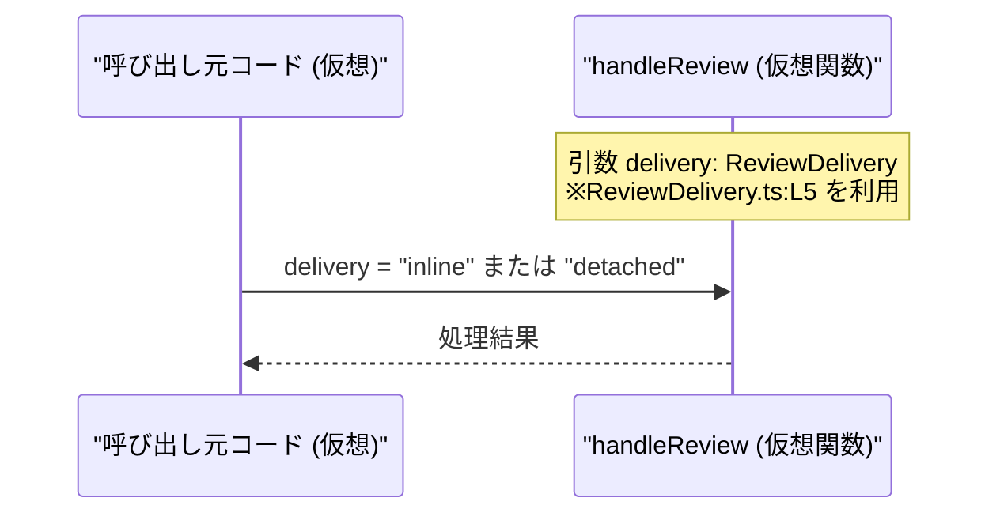

# app-server-protocol/schema/typescript/v2/ReviewDelivery.ts

## 0. ざっくり一言

レビューの「配送形式」を `"inline"` か `"detached"` の 2 通りで表現する、文字列リテラルユニオン型の定義ファイルです（`ReviewDelivery.ts:L5-5`）。  
ts-rs により自動生成されるため、手動編集は前提とされていません（`ReviewDelivery.ts:L1-3`）。

---

## 1. このモジュールの役割

### 1.1 概要

- このモジュールは、`ReviewDelivery` という TypeScript の型エイリアスを提供します（`ReviewDelivery.ts:L5-5`）。
- `ReviewDelivery` は `"inline"` または `"detached"` のいずれかの文字列のみを取れるようにし、レビューの配送形式を型レベルで制約します。
- コメントから、このファイルは ts-rs によって自動生成され、手で編集しないことが明示されています（`ReviewDelivery.ts:L1-3`）。

### 1.2 アーキテクチャ内での位置づけ

このチャンクには他モジュールとの依存関係は一切現れていません。  
したがって、実際にどのファイルから `ReviewDelivery` が参照されているかは不明です。

ここでは、**あくまで概念的な位置づけのイメージ**として、`ReviewDelivery` 型が他コードから利用される構図を示します。

```mermaid
graph TD
  subgraph "自動生成されたスキーマ (TS)"
    RD["ReviewDelivery 型\n(\"inline\" | \"detached\")\n(ReviewDelivery.ts:L5)"]
  end

  APP["アプリケーションコード\n(実体はこのチャンクには現れない)"] --> RD
```

> 図中の「アプリケーションコード」は、この型を利用しうる呼び出し元の**概念的な**表現です。  
> 実際にどのモジュールが依存しているかは、このチャンクからは分かりません。

### 1.3 設計上のポイント

- **自動生成コード**  
  - 先頭コメントで「GENERATED CODE」「Do not edit this file manually」と明示されています（`ReviewDelivery.ts:L1-3`）。
  - 変更はこのファイルではなく、元となる定義（おそらく Rust 側）と ts-rs の生成プロセスを通じて行う前提です。
- **状態を持たない純粋な型定義**  
  - 実行時の関数・クラス・状態は一切なく、型エイリアス 1 つのみです（`ReviewDelivery.ts:L5-5`）。
  - したがって並行性やスレッドセーフティに関する懸念はありません。
- **型安全性**  
  - `"inline"` と `"detached"` 以外の文字列をコンパイル時に排除できる、TypeScript の文字列リテラルユニオン型を使用しています。
- **エラーハンドリング**  
  - このファイル自体は型定義のみであり、実行時エラーや例外処理は含まれません。
  - 型安全性の観点では、`any` や未検証の外部入力に対してこの型を適用しない場合、コンパイル時の保証が弱くなる点に注意が必要です。

---

## 2. 主要な機能一覧

このファイルが提供する機能は、次の 1 点のみです。

- `ReviewDelivery` 型: レビューの配送形式を `"inline"` または `"detached"` の 2 値に制約する文字列リテラルユニオン型（`ReviewDelivery.ts:L5-5`）

### コンポーネントインベントリー（このチャンク）

| 名前             | 種別                           | 説明                                                                 | 根拠行 |
|------------------|--------------------------------|----------------------------------------------------------------------|--------|
| `ReviewDelivery` | 型エイリアス（文字列リテラルユニオン） | `"inline"` または `"detached"` の文字列しか取れない配送形式型       | `ReviewDelivery.ts:L5-5` |

> このファイルには関数・クラス・列挙体など、他のコンポーネントは定義されていません（`ReviewDelivery.ts:L1-5`）。

---

## 3. 公開 API と詳細解説

### 3.1 型一覧（構造体・列挙体など）

| 名前             | 種別                           | 役割 / 用途 | 値のバリエーション | 根拠行 |
|------------------|--------------------------------|------------|--------------------|--------|
| `ReviewDelivery` | 型エイリアス（文字列リテラルユニオン） | レビュー配送形式を表す | `"inline"` / `"detached"` | `ReviewDelivery.ts:L5-5` |

#### `type ReviewDelivery = "inline" | "detached"`

**概要**

- レビュー配送形式を `"inline"` または `"detached"` の 2 種類に限定するための型エイリアスです（`ReviewDelivery.ts:L5-5`）。
- これにより、配送形式を表す引数・プロパティに対して、許可される文字列をコンパイル時に制約できます。

**値の意味（推測を含まない範囲）**

コードから読み取れるのは文字列値そのものだけであり、**ビジネス上の意味**（例: “inline＝コメントが本文中に表示される” など）は、このチャンクからは分かりません。  
以下は「コードから分かる事実」です。

- `"inline"`: 許可される文字列の一つである（`ReviewDelivery.ts:L5-5`）。
- `"detached"`: もう一つの許可される文字列である（`ReviewDelivery.ts:L5-5`）。

**安全性・エラー・並行性**

- この型は**コンパイル時の型チェック**にのみ関与し、実行時にコードは生成されません。
- `ReviewDelivery` を使うことで、`"inline"` や `"detached"` 以外の文字列を誤って渡した場合、**コンパイルエラー**として検出できます。
- 実行時にはただの文字列であり、特別なオブジェクトではないため、並行性（非同期処理・マルチスレッド）に関する懸念はありません。
- `any` や `unknown` からキャストした場合は、コンパイル時に検出されず、実行時に不整合な値が入り得るため、**入力バリデーション**側の責任となります。

**Edge cases（エッジケース）**

- `"inline"`/`"detached"` 以外の文字列リテラルを直接記述した場合  
  - `const d: ReviewDelivery = "other";` のようなコードは TypeScript コンパイルエラーになります。
- 推論される文字列型が一般の `string` になっている場合  
  - `const fromJson = JSON.parse(...).delivery;` のような値は型が `any` や `string` になることが多く、そのまま `ReviewDelivery` に代入するとエラーになるか、型アサーションを使う必要があります。
- 大文字・小文字の違い  
  - `"Inline"` や `"INLINE"` など、大文字・小文字が異なる文字列は `ReviewDelivery` には代入できません。  
    型は `"inline"` / `"detached"` で厳密に一致する必要があります。

**使用上の注意点**

- このファイルは「GENERATED CODE! DO NOT MODIFY BY HAND!」とあるため、**直接編集しない**ことが前提です（`ReviewDelivery.ts:L1-3`）。
- `"inline"` と `"detached"` 以外のバリエーションを追加したい場合は、元の定義と ts-rs の生成設定を変更する必要があります。
- 外部入力（API 応答など）を `ReviewDelivery` として扱う場合は、文字列が `"inline"` か `"detached"` のいずれかであることを実行時に検証する必要があります。

### 3.2 関数詳細（最大 7 件）

このファイルには関数・メソッドは一切定義されていません（`ReviewDelivery.ts:L1-5`）。  
したがって、このセクションで詳細解説すべき関数はありません。

### 3.3 その他の関数

- 該当なし（関数が存在しないため、このチャンクには現れません）。

---

## 4. データフロー

このファイル自体には、実行時処理や関数呼び出しが存在しないため、**実在するコードのデータフロー**を示すことはできません。  
ここでは、`ReviewDelivery` 型がどのように利用されるかの**仮想的な使用例**として、概念的なシーケンスを示します。



> 上記の `handleReview` 関数やシーケンスは、`ReviewDelivery` 型の**利用イメージ**を説明するための仮想例です。  
> このリポジトリ内に同名の関数やフローが実在するかどうかは、このチャンクからは分かりません。

このように、`ReviewDelivery` は主に以下の場所で使われることが想定されます（あくまで一般的なパターンの説明です）。

- 関数の引数型: `function handleReview(delivery: ReviewDelivery, ...) { ... }`
- オブジェクトのプロパティ型: `type Review = { delivery: ReviewDelivery; ... }`
- API スキーマの一部: OpenAPI などに対応する TypeScript 型定義として使用

---

## 5. 使い方（How to Use）

### 5.1 基本的な使用方法

以下は、`ReviewDelivery` 型を利用する**自己完結した TypeScript の例**です。  
インポートパスはプロジェクト構成に依存するため、ここでは仮の相対パスとし、その点をコメントで明示します。

```typescript
// ReviewDelivery 型をインポートする                             
// 実際のパスはプロジェクトの構成に応じて変更が必要です。
import type { ReviewDelivery } from "./ReviewDelivery";  // パスはこのチャンクからは特定できない

// ReviewDelivery 型を使った関数の例
function sendReview(delivery: ReviewDelivery) {          // delivery は "inline" または "detached" に限定される
    if (delivery === "inline") {                         // "inline" の場合の処理
        console.log("レビューをインラインで送信します");
    } else {                                             // ここでは delivery は "detached" に絞り込まれる
        console.log("レビューを別枠で送信します");
    }
}

// 正しい呼び出し例
sendReview("inline");                                    // OK
sendReview("detached");                                  // OK

// 間違い例（コンパイルエラー）
// sendReview("INLINE");                                // エラー: 型 '"INLINE"' を型 'ReviewDelivery' に割り当てられない
```

この例から分かるポイント:

- `ReviewDelivery` を引数に使うことで、誤った文字列（スペルミスや別の表現）をコンパイル時に排除できます。
- `if (delivery === "inline")` のような分岐では、TypeScript が分岐ごとに `delivery` の型を `"inline"` / `"detached"` に絞り込みます。

### 5.2 よくある使用パターン

1. **オブジェクトプロパティとして使う**

```typescript
import type { ReviewDelivery } from "./ReviewDelivery";  // 仮のパス

// レビュー設定を表すオブジェクト型の例
interface ReviewSettings {
    delivery: ReviewDelivery;                            // 配送形式
    // 他の設定項目...
}

// 設定オブジェクトを生成する例
const settings: ReviewSettings = {
    delivery: "inline",                                  // 許可された文字列
    // ...
};
```

1. **外部入力のバリデーションと併用**

```typescript
import type { ReviewDelivery } from "./ReviewDelivery";  // 仮のパス

// 外部から来た文字列を ReviewDelivery に絞り込む型ガード関数の例
function isReviewDelivery(value: unknown): value is ReviewDelivery {
    return value === "inline" || value === "detached";   // ReviewDelivery.ts:L5-5 に対応
}

// 例: JSON から読み込んだ値を検証する
const raw = JSON.parse('{"delivery":"inline"}');

if (isReviewDelivery(raw.delivery)) {                    // 型ガードにより ReviewDelivery と確定
    const delivery: ReviewDelivery = raw.delivery;       // 安全に代入できる
} else {
    // 無効な値に対するエラーハンドリング
}
```

### 5.3 よくある間違い

```typescript
import type { ReviewDelivery } from "./ReviewDelivery";  // 仮のパス

// 間違い例: 型を一般的な string にしてしまう
function bad(delivery: string) {                         // string だと "inline" 以外も受け取れてしまう
    // ...
}

// 正しい例: ReviewDelivery を使って許可される値を制限する
function good(delivery: ReviewDelivery) {                // "inline" | "detached" のみ
    // ...
}

// 間違い例: スペルミス
// const d: ReviewDelivery = "Inline";                   // エラー: '"Inline"' を代入できない

// 正しい例
const d: ReviewDelivery = "inline";                      // OK
```

### 5.4 使用上の注意点（まとめ）

- このファイルは自動生成されるため、**直接編集しない**ことが前提です（`ReviewDelivery.ts:L1-3`）。
- `"inline"` / `"detached"` 以外の文字列は `ReviewDelivery` には代入できません。スペルや大文字・小文字を含めて完全一致が必要です（`ReviewDelivery.ts:L5-5`）。
- `any` や未検証の外部入力からこの型に値を入れる場合は、型ガードやバリデーションを併用しないと、型安全性が失われる可能性があります。
- この型は実行時コードを持たず、副作用もないため、並行処理やエラーハンドリングは**利用側のコード**で行う必要があります。

---

## 6. 変更の仕方（How to Modify）

### 6.1 新しい機能を追加する場合

このファイルは ts-rs によって自動生成されるため、**新しい配送形式を追加したい場合でも、このファイルを直接編集するべきではありません**（`ReviewDelivery.ts:L1-3`）。

一般的な流れとしては次のようになります（元の定義はこのチャンクには現れません）。

1. 元となる型定義（おそらく Rust 側）に、新しいバリアント（例: `"inline"` に加えて `"batched"` など）を追加する。
2. ts-rs のコード生成を再実行し、TypeScript ファイルを再生成する。
3. 再生成後、このファイルの `ReviewDelivery` 定義に新しい文字列リテラルが含まれていることを確認する。

> 元の Rust ファイルや ts-rs の設定場所は、このチャンクには現れないため不明です。

### 6.2 既存の機能を変更する場合

`ReviewDelivery` の値を変更・削除したい場合も、同様に元の定義側で変更し、再生成する必要があります。

変更時に注意すべき点:

- `"inline"` / `"detached"` のいずれかを削除した場合、既存コードでその値を使用している箇所は**コンパイルエラー**になります。
- 文字列自体を変更した場合（例: `"inline"` → `"inlined"`）、  
  - 型定義が変わるため、すべての呼び出し側で新しい文字列に合わせて修正が必要です。
- 生成ファイルを手で書き換えると、次回の自動生成で上書きされる可能性が高く、変更が失われる危険があります（`ReviewDelivery.ts:L1-3` のコメントが警告）。

---

## 7. 関連ファイル

このチャンクには、`ReviewDelivery` と直接関連する他ファイルに関する記述はありません。

想定レベルで言えること（実在はこのチャンクからは確認できません）:

- ts-rs は通常、Rust 側の型定義から TypeScript ファイルを生成しますが、元の Rust ファイルの場所や名前は不明です。
- 同じディレクトリ（`app-server-protocol/schema/typescript/v2/`）に、他の型定義ファイルが存在する可能性がありますが、このチャンクには現れていません。

| パス | 役割 / 関係 |
|------|------------|
| （不明） | ts-rs が参照する元の型定義ファイル。`ReviewDelivery` の生成元であると考えられるが、場所はこのチャンクからは分からない |
| app-server-protocol/schema/typescript/v2/* | 同じスキーマ階層にある他の TypeScript 型定義ファイルが存在する可能性があるが、このチャンクには列挙されていない |

---

### Bugs / Security / Contracts（まとめ）

- **Bugs**  
  - このファイル単体では実行コードを持たないため、直接のバグはありません。
  - 利用側で誤って一般の `string` を使ったり、`any` を経由すると、型安全性が低下する可能性があります。
- **Security**  
  - 型定義のみのため、直接的なセキュリティリスクはありません。
  - ただし、外部入力の値を `ReviewDelivery` として扱う場合、入力値検証を怠ると「想定外の値」がロジックに流れ込む可能性があります（これは利用側の責任範囲です）。
- **Contracts / Edge Cases**  
  - 契約: `ReviewDelivery` 型の値は `"inline"` または `"detached"` のどちらかであること（`ReviewDelivery.ts:L5-5`）。
  - エッジケース: 大文字・小文字の違いや、似た別表現（`"INLINE"`, `"in_line"` など）はすべて不正な値としてコンパイルエラーまたは実行時バリデーションエラーとなるべきです。
