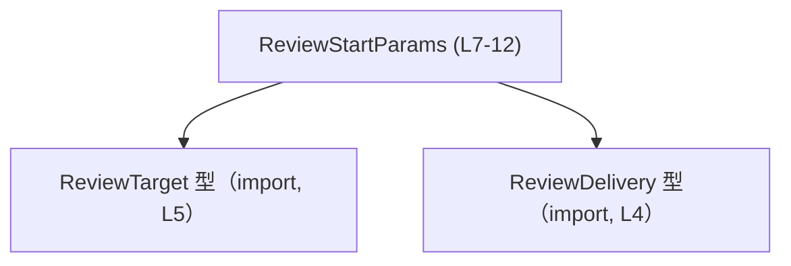

# app-server-protocol/schema/typescript/v2/ReviewStartParams.ts コード解説

## 0. ざっくり一言

このファイルは、レビュー開始リクエストのパラメータを表す TypeScript 型 `ReviewStartParams` を定義する、自動生成コードです（ReviewStartParams.ts:L1-3, L7-12）。  

---

## 1. このモジュールの役割

### 1.1 概要

- `ReviewStartParams` は、「レビューを開始する」という操作に必要な情報をまとめたオブジェクト型です（ReviewStartParams.ts:L7-12）。
- 含まれる情報は、スレッドを識別する `threadId`、レビュー対象を表す `target`、レビューをどこで実行するかを指定するオプションの `delivery` です（ReviewStartParams.ts:L7-12）。
- ファイル先頭のコメントより、この型定義は Rust から `ts-rs` で自動生成されており、**手動で編集しないこと**が前提になっています（ReviewStartParams.ts:L1-3）。

### 1.2 アーキテクチャ内での位置づけ

このファイルは、TypeScript のスキーマ定義の一部として、他の型に依存しています。

- `ReviewStartParams` は `ReviewDelivery` 型と `ReviewTarget` 型をインポートして利用します（ReviewStartParams.ts:L4-5, L7-12）。
- いずれのインポートも `import type` であり、**型情報のみ**を参照し、実行時の依存関係は持ちません（ReviewStartParams.ts:L4-5）。

依存関係を簡略化して図示すると次のようになります。



### 1.3 設計上のポイント

- **自動生成コード**  
  - `// GENERATED CODE! DO NOT MODIFY BY HAND!` というコメントにより、自動生成であることと手動編集禁止であることが明示されています（ReviewStartParams.ts:L1-3）。
- **型のみのモジュール**  
  - 関数やクラスは定義されておらず、エクスポートされるのは `type` エイリアスのみです（ReviewStartParams.ts:L7-12）。  
  - 実行時のロジックやエラーハンドリングは一切含まれません。
- **型安全性の確保**  
  - `threadId` は `string`、`target` は `ReviewTarget`、`delivery` は `ReviewDelivery | null` かつオプションプロパティとして定義され、コンパイル時に型チェックされます（ReviewStartParams.ts:L7-12）。
- **オプション + null の扱い**  
  - `delivery?: ReviewDelivery | null` により、「プロパティ自体が存在しない」状態と、「存在するが値が `null`」という状態の両方が表現可能です（ReviewStartParams.ts:L12）。
- **レビュー実行場所の指定**  
  - `delivery` のコメントから、この値が「同じスレッドでのインライン実行」か「別スレッドでのデタッチ実行」を切り替える設定に関係することが読み取れます（ReviewStartParams.ts:L8-10）。

---

## 2. 主要な機能一覧

このモジュールが提供する主な「機能」は型定義のみです。

- `ReviewStartParams`: レビュー開始リクエストのパラメータオブジェクトの形を表現する型（ReviewStartParams.ts:L7-12）。

---

## 3. 公開 API と詳細解説

### 3.1 型一覧（構造体・列挙体など）

| 名前 | 種別 | 役割 / 用途 | 定義/参照位置 |
|------|------|-------------|----------------|
| `ReviewStartParams` | 型エイリアス（オブジェクト型） | レビュー開始時に必要なパラメータの集合。`threadId`・`target`・`delivery` を持つ。 | 定義: ReviewStartParams.ts:L7-12 |
| `ReviewDelivery` | 型（詳細不明） | `delivery` プロパティの型として利用される。コメントから、レビュー実行場所に関する指定に関連する型として使われています（ReviewStartParams.ts:L8-10, L12）。 | import: ReviewStartParams.ts:L4 |
| `ReviewTarget` | 型（詳細不明） | `target` プロパティの型として利用される。名前からレビュー対象を表す型と解釈できますが、具体的な構造はこのチャンクからは分かりません（ReviewStartParams.ts:L5, L7）。 | import: ReviewStartParams.ts:L5 |

#### `ReviewStartParams` のフィールド構造

`ReviewStartParams` 自体はオブジェクト型で、次の3つのプロパティを持ちます（ReviewStartParams.ts:L7-12）。

| プロパティ名 | 型 | 必須/任意 | 説明 |
|-------------|----|-----------|------|
| `threadId` | `string` | 必須 | スレッドを識別する文字列です。フィールド名から、ある種のスレッドIDであると解釈できますが、形式や意味の詳細はこのチャンクからは分かりません（ReviewStartParams.ts:L7）。 |
| `target` | `ReviewTarget` | 必須 | レビュー対象を表す型です。`ReviewTarget` の構造やバリエーションは別モジュール側で定義されており、このチャンクからは分かりません（ReviewStartParams.ts:L5, L7）。 |
| `delivery` | `ReviewDelivery \| null`（オプション） | 任意 | コメントにより、「レビューをどこで実行するか」を指定するパラメータであり、指定しない場合は「現在のスレッドでのインライン実行（デフォルト）」、指定した場合には「新しいスレッドでのデタッチ実行」の可能性が示唆されています（ReviewStartParams.ts:L8-10, L12）。 |

### 3.2 関数詳細（最大 7 件）

このファイルには関数・メソッドは一切定義されていません（ReviewStartParams.ts:L1-12）。  
そのため、関数詳細テンプレートを適用する対象はありません。

### 3.3 その他の関数

- 該当なし（このチャンクには関数定義が存在しません）。

---

## 4. データフロー

このファイルには型定義のみが存在し、実行時の処理フローや関数呼び出しは現れていません（ReviewStartParams.ts:L1-12）。  
ここでは、「このファイル内で観測できる範囲」でのデータフローを示します。


- 実際には、別のモジュールで `ReviewStartParams` 型のオブジェクトが生成され、API 呼び出しやメッセージ送信などに用いられると考えられますが、その具体的な呼び出し元や処理内容はこのチャンクには現れません。

（上記のうち、「どのようなモジュールから使われるか」「どのようなAPIに渡されるか」といった詳細は、このチャンクからは分からないため、記述していません。）

---

## 5. 使い方（How to Use）

### 5.1 基本的な使用方法

ここでは、**同じディレクトリ内からこの型だけを利用する**ことを想定した、最小限の例を示します。  
例では `delivery` を省略し、コメントに記載された「inline (default)」のケースに対応するオブジェクトを作っています（ReviewStartParams.ts:L8-10）。

```typescript
// ReviewStartParams 型をインポートする例
import type { ReviewStartParams } from "./ReviewStartParams";  // 同一ディレクトリ想定の例

// 別モジュールで定義されている ReviewTarget 型の値
import type { ReviewTarget } from "./ReviewTarget";            // ReviewStartParams.ts:L5 に対応
declare const target: ReviewTarget;                            // ここでは既にどこかで構築された値と仮定する

// ReviewStartParams オブジェクトを構築する
const params: ReviewStartParams = {
    threadId: "thread-12345",  // string 型なので任意の文字列（形式はこのチャンクからは不明）
    target,                    // ReviewTarget 型の値
    // delivery は省略: コメントでは inline (default) と説明されている
};

// params をどこかの API に渡すなどの処理は、このファイルからは分からない
```

このコードにより、`threadId` と `target` のみを指定した `ReviewStartParams` オブジェクトが得られます。  
`delivery` を省略した場合の具体的な挙動（本当に「inline (default)」になるかどうか）は、サーバー側実装等に依存し、このファイルからは確認できません。

### 5.2 使用パターンの例（delivery の指定有無）

`delivery` プロパティは「オプション + null 許容」なので、主に次のようなパターンで利用できます（ReviewStartParams.ts:L12）。

```typescript
import type { ReviewStartParams } from "./ReviewStartParams";
import type { ReviewDelivery } from "./ReviewDelivery";  // ReviewStartParams.ts:L4 に対応
declare const detachedDelivery: ReviewDelivery;          // 詳細は別モジュール

// 1. delivery を明示的に指定するパターン
const paramsDetached: ReviewStartParams = {
    threadId: "thread-12345",
    target: /* ReviewTarget 型の値 */,
    delivery: detachedDelivery,          // ReviewDelivery 型の値を指定
};

// 2. delivery を null にするパターン
const paramsNullDelivery: ReviewStartParams = {
    threadId: "thread-12345",
    target: /* ReviewTarget 型の値 */,
    delivery: null,                      // 型的には許容される
};

// 3. delivery を完全に省略するパターン
const paramsInlineDefault: ReviewStartParams = {
    threadId: "thread-12345",
    target: /* ReviewTarget 型の値 */,
    // delivery は書かない
};
```

- 「指定しない」と「`null` を入れる」の違いが、サーバー側でどのように解釈されるかは、このチャンクからは分かりません。
- TypeScript の型としては、上記 3 パターンはいずれもコンパイル時に許容されます。

### 5.3 よくある間違い（型観点から想定されるもの）

このファイルから分かる範囲で、**型定義に反する使い方**の例を示します。

```typescript
import type { ReviewStartParams } from "./ReviewStartParams";

// ❌ 例1: 必須プロパティ threadId を指定していない
const invalidParams1: ReviewStartParams = {
    // threadId: "thread-12345",  // これを省略するとコンパイルエラー
    target: /* ReviewTarget 型の値 */,
    delivery: null,
    // → ReviewStartParams.ts:L7 により threadId は必須
};

// ❌ 例2: threadId に数値を渡してしまう
const invalidParams2: ReviewStartParams = {
    threadId: 12345,                    // number 型は string 型に代入できない
    //           ~~~~                   // コンパイルエラー
    target: /* ReviewTarget 型の値 */,
};

// ❌ 例3: delivery に全く別の型を入れてしまう
const invalidParams3: ReviewStartParams = {
    threadId: "thread-12345",
    target: /* ReviewTarget 型の値 */,
    delivery: "inline",                 // string は ReviewDelivery | null ではない
    //         ~~~~~~~                  // コンパイルエラー（ReviewStartParams.ts:L12）
};
```

これらの誤りは、TypeScript のコンパイル時チェックによって検出されます。  
実行時のバリデーション（値の形式チェックなど）は、このファイルには含まれていません。

### 5.4 使用上の注意点（まとめ）

- **自動生成コードの直接編集禁止**  
  - 先頭コメントにある通り、このファイルを直接編集すると生成元の Rust 側と不整合が生じる可能性があります（ReviewStartParams.ts:L1-3）。
- **オプション + null の二重の「値なし」表現**  
  - `delivery?: ReviewDelivery | null` により、  
    - プロパティが存在しない (`delivery` 未定義)  
    - プロパティは存在するが `null`  
    の 2 パターンがありえます（ReviewStartParams.ts:L12）。呼び出し側・受け側の両方で、この区別がどう解釈されるか設計を確認しておく必要があります。
- **エラー・例外は型レベルのみ**  
  - このモジュール自体には実行時のエラーハンドリングや並行処理は含まれず、型レベルでの静的チェックのみを提供します（ReviewStartParams.ts:L1-12）。
- **並行性の意味づけは別レイヤー**  
  - コメント上、「現在のスレッド」「新しいスレッド」という概念が登場しますが（ReviewStartParams.ts:L8-10）、それらの実際の並行実行モデルやスレッド管理は、この型定義では扱われません。

---

## 6. 変更の仕方（How to Modify）

### 6.1 新しい機能を追加する場合

このファイルは `ts-rs` による自動生成であるため、**直接編集せず、生成元を変更する**必要があります（ReviewStartParams.ts:L1-3）。

一般的な手順（このチャンクから分かる範囲で）:

1. `ReviewStartParams` に対応する Rust 側の構造体または型定義（`ts-rs` の derive 対象）を特定する。  
   - 生成元ファイルの正確なパスや名前は、このチャンクには現れません。
2. Rust 側でフィールドを追加・変更し、`ts-rs` を用いて TypeScript コードを再生成する。
3. 生成された `ReviewStartParams` 型に従って、TypeScript 側の呼び出しコードをコンパイルし、型エラーがないか確認する。

### 6.2 既存の機能を変更する場合

- **プロパティの型や必須/任意を変えたい場合**  
  - Rust 側の対応するフィールド定義を変更し、再生成します。  
  - たとえば `delivery` を必須にしたい場合は、Rust 側でオプション型をやめるなどの変更が必要です（この具体的な方法は Rust 側コードがこのチャンクにないため不明）。
- **`ReviewTarget` や `ReviewDelivery` の仕様変更**  
  - これらの型も自動生成されている可能性が高く（import の形式から推測）、それぞれの定義ファイル（`./ReviewTarget`、`./ReviewDelivery`）および生成元を変更する必要があります（ReviewStartParams.ts:L4-5）。
- 変更後は、`ReviewStartParams` を利用している TypeScript コード全体のコンパイルを行い、型エラーやビルドエラーが発生しないことを確認することが重要です。

---

## 7. 関連ファイル

このモジュールと密接に関係するモジュール・定義は次の通りです。

| パス / モジュール名 | 役割 / 関係 |
|---------------------|------------|
| `./ReviewDelivery` | `ReviewStartParams` の `delivery` プロパティの型として利用されるモジュールです。レビューをどこで実行するかに関する情報を表す型であることがコメントから示唆されますが、具体的な構造はこのチャンクからは分かりません（ReviewStartParams.ts:L4, L8-10, L12）。 |
| `./ReviewTarget` | `ReviewStartParams` の `target` プロパティの型として利用されるモジュールです。レビュー対象の指定に関わる型と解釈できますが、詳細はこのチャンクからは分かりません（ReviewStartParams.ts:L5, L7）。 |
| （生成元 Rust 定義; ファイルパス不明） | `ts-rs` により本ファイルを生成している Rust 側の型定義です。どのファイルかはこのチャンクには現れませんが、ここを変更することで `ReviewStartParams` の構造が変わります（ReviewStartParams.ts:L1-3）。 |

このファイル自体にはテストコードやユーティリティ関数は含まれておらず、専ら型情報のみを提供する役割になっています（ReviewStartParams.ts:L1-12）。
