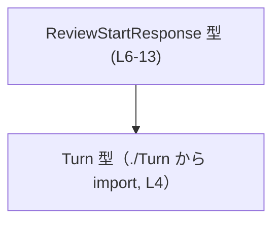
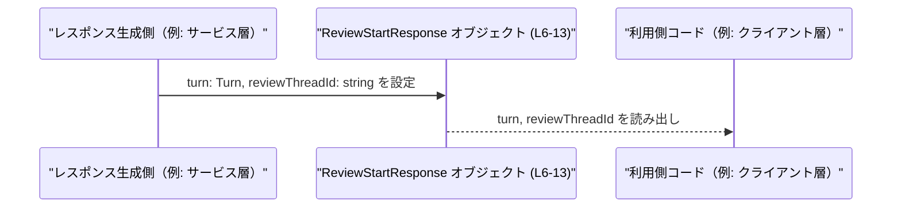

# app-server-protocol/schema/typescript/v2/ReviewStartResponse.ts コード解説

## 0. ざっくり一言

`ReviewStartResponse` は、レビューの開始時に返されるレスポンスの型を定義する TypeScript の型エイリアスです。レビューの「ターン情報」と「レビューが紐づくスレッド ID」をまとめて表現します（根拠: ReviewStartResponse.ts:L4-13）。

---

## 1. このモジュールの役割

### 1.1 概要

- このモジュールは、レビュー開始処理に対するレスポンスデータの構造を TypeScript 型として表現します（根拠: `export type ReviewStartResponse = { ... }` ReviewStartResponse.ts:L6-13）。
- 型定義のみが含まれており、ロジック（関数実装）は一切含まれていません（根拠: ファイル全体に `function` / `=>` などの定義が存在しない ReviewStartResponse.ts:L1-13）。
- ファイル冒頭コメントの通り、Rust 側の型から `ts-rs` によって自動生成された成果物であり、手動編集は想定されていません（根拠: ReviewStartResponse.ts:L1-3）。

### 1.2 アーキテクチャ内での位置づけ

- `ReviewStartResponse` は、他ファイルで定義された `Turn` 型に依存します（根拠: `import type { Turn } from "./Turn";` ReviewStartResponse.ts:L4）。
- 外部からは、このモジュールを import して `ReviewStartResponse` 型を利用することで、「レビュー開始レスポンス」を安全に取り扱う前提になっています（根拠: `export type ReviewStartResponse = ...` ReviewStartResponse.ts:L6）。

依存関係を簡易的な Mermaid 図で示します。



> この図は、このファイル内で確認できる「型レベルの依存関係」のみを表します。他にどのモジュールから参照されるかは、このチャンクには現れません。

### 1.3 設計上のポイント

- **自動生成ファイル**  
  - ts-rs により Rust 側の型定義から生成されることがコメントで明示されています（根拠: ReviewStartResponse.ts:L1-3）。
  - 手動修正ではなく、元の Rust 型を変更して再生成する設計になっています。
- **純粋な型定義モジュール**  
  - 実行時ロジックや副作用を持たず、コンパイル時の型チェックのためだけに存在します（根拠: 関数・クラス等が存在しない ReviewStartResponse.ts:L1-13）。
- **型安全性の確保**  
  - 必須プロパティ `turn: Turn` と `reviewThreadId: string` を持つオブジェクトとして定義されており、欠落プロパティや異なる型をコンパイル時に検出できます（根拠: ReviewStartResponse.ts:L6-13）。
- **ドキュメントコメントの付与**  
  - `reviewThreadId` に対して、レビューがどのスレッドで実行されるかを説明するドキュメントコメントが付いており、IDE 上での補完・説明に利用できます（根拠: ReviewStartResponse.ts:L7-12）。

---

## 2. 主要な機能一覧

このファイルは型を 1 つだけ提供します。

- `ReviewStartResponse`: レビュー開始時に返されるレスポンスの構造（`turn` と `reviewThreadId`）を表現する型エイリアス（根拠: ReviewStartResponse.ts:L6-13）。

---

## 3. 公開 API と詳細解説

### 3.1 型一覧（構造体・列挙体など）

このチャンクに現れる型・インポートのインベントリーです。

| 名前 | 種別 | 定義/参照位置 | 役割 / 用途 |
|------|------|---------------|-------------|
| `ReviewStartResponse` | 型エイリアス（オブジェクト型） | ReviewStartResponse.ts:L6-13 | レビュー開始処理のレスポンスとして利用されるオブジェクトの構造。`turn` と `reviewThreadId` の 2 プロパティを持つ。 |
| `Turn` | 型（import のみ） | ReviewStartResponse.ts:L4 | 同一ディレクトリの `./Turn` からインポートされる外部型。`ReviewStartResponse.turn` プロパティの型として使用される。定義内容はこのチャンクには現れません。 |

#### `ReviewStartResponse` の構造

```typescript
export type ReviewStartResponse = {            // ReviewStartResponse.ts:L6
    turn: Turn,                                // ReviewStartResponse.ts:L6
    /**
     * Identifies the thread where the review runs.
     *
     * For inline reviews, this is the original thread id.
     * For detached reviews, this is the id of the new review thread.
     */
    reviewThreadId: string,                    // ReviewStartResponse.ts:L7-12 (コメント), L13
};
```

- `turn: Turn`  
  - レビューの状態ややり取りを表すと推測される `Turn` 型の値です（用途は型名からの推測であり、意味的詳細はこのチャンクからは断定できません）。
  - 型としては `./Turn` で定義されており、このファイルには定義が出現しません（根拠: ReviewStartResponse.ts:L4）。
- `reviewThreadId: string`  
  - レビューが実行されるスレッド ID を表す文字列です（根拠: JSDoc コメント ReviewStartResponse.ts:L7-12）。
  - コメントによると:
    - インラインレビューの場合: 元のスレッド ID
    - 分離（detached）レビューの場合: 新しいレビュー用スレッドの ID  
    を格納する前提になっています（根拠: ReviewStartResponse.ts:L7-12）。

### 3.2 関数詳細（最大 7 件）

このファイルには関数・メソッドが定義されていないため、このセクションに該当する公開 API は存在しません（根拠: ReviewStartResponse.ts:L1-13）。

### 3.3 その他の関数

- 該当なし（このチャンクには関数が一切定義されていません）。

---

## 4. データフロー

このファイル自体には処理フローはありませんが、型レベルでのデータ構造の流れ（`Turn` → `ReviewStartResponse`）を整理します。

### 4.1 型レベルのデータフロー

- 元になるレビュー情報（`Turn` 型）が `turn` プロパティとして `ReviewStartResponse` に格納されます（根拠: ReviewStartResponse.ts:L4, L6）。
- 同時に、そのレビューが紐づくスレッド ID が `reviewThreadId: string` として同じオブジェクトに格納されます（根拠: ReviewStartResponse.ts:L7-13）。
- 利用側コードは `ReviewStartResponse` 型を受け取ることで、**1 つのオブジェクトから「レビュー内容（turn）」と「スレッド ID」** の両方を取得できます。

この「1 つのレスポンスオブジェクトに 2 種類の情報を束ねる」構造を、簡易的なシーケンス図として表現します。



> 注: 上記の「サービス層」「クライアント層」といったレイヤー構成は、このファイルからは分かりません。ここでは、一般的な「レスポンス型オブジェクト」の利用イメージとして示しています。

---

## 5. 使い方（How to Use）

### 5.1 基本的な使用方法

`ReviewStartResponse` は型エイリアスなので、主に関数の戻り値や変数宣言の型注釈として使用します。

```typescript
import type { ReviewStartResponse } from "./ReviewStartResponse"; // このファイルを import する（仮のパス）
// Turn 型も通常は別モジュールから import されます

// レビュー開始処理の戻り値として利用する例
function startReview(/* 引数は省略 */): ReviewStartResponse {   // ReviewStartResponse 型を戻り値として使用
    const turn: Turn = /* ... */;                                // Turn 型の値を用意する（定義は ./Turn 側）
    const reviewThreadId = "thread-123";                         // スレッド ID を string として用意

    return {                                                     // ReviewStartResponse 型に合致するオブジェクトを返す
        turn,                                                    // Turn 型の値
        reviewThreadId,                                          // スレッド ID
    };
}

// 受け取る側の例
const resp = startReview();                                      // resp は ReviewStartResponse 型
console.log(resp.reviewThreadId);                                // スレッド ID を利用
```

このように、TypeScript の型システムにより:

- `turn` を `Turn` 以外の型にした場合
- `reviewThreadId` に `number` など `string` 以外を入れた場合
- プロパティを省略した場合

などはコンパイル時にエラーになります（前提: 適切な型チェック設定が有効）。

### 5.2 よくある使用パターン

1. **API レスポンスの型として利用**

   ```typescript
   // 例: フロントエンドでの API クライアント
   async function fetchReviewStart(): Promise<ReviewStartResponse> {
       const res = await fetch("/api/review/start");
       const json = await res.json();
       // ここで json を ReviewStartResponse とみなしたい場合、
       // ランタイムのバリデーションは別途必要になる。
       return json as ReviewStartResponse; // 型アサーションの例（安全性には注意）
   }
   ```

   > 注: 実際の HTTP エンドポイント名や構成は、このファイルからは分かりません。ここでは「レスポンス型」としての典型的な利用例を示しています。

2. **内部サービス間での型共有**

   ```typescript
   // サービス内部の関数同士で共通の型として使う例
   function logReviewStart(response: ReviewStartResponse): void {
       console.log("Review thread:", response.reviewThreadId);
       // response.turn に対しても Turn 型としての処理が可能
   }
   ```

### 5.3 よくある間違い

この型に関して起こりやすい誤用例と、その修正例です。

```typescript
// 誤り例: 必須プロパティを欠落させている
const invalidResponse: ReviewStartResponse = {
    // turn: ... がない → コンパイルエラー
    reviewThreadId: "thread-123",
};

// 正しい例: 必須の2プロパティをすべて含める
const validResponse: ReviewStartResponse = {
    turn: someTurn,                // Turn 型の値
    reviewThreadId: "thread-123",  // string 型
};
```

```typescript
// 誤り例: reviewThreadId を number にしてしまう
const invalidResponse2: ReviewStartResponse = {
    turn: someTurn,
    reviewThreadId: 123,           // number は string 型と不一致 → コンパイルエラー
};

// 正しい例
const validResponse2: ReviewStartResponse = {
    turn: someTurn,
    reviewThreadId: String(123),   // string に変換してから代入
};
```

### 5.4 使用上の注意点（まとめ）

- **必須プロパティ**  
  - `turn`、`reviewThreadId` の両方が必須です。いずれかを省略すると型エラーになります（根拠: オプショナル修飾子 `?` が付いていない ReviewStartResponse.ts:L6-13）。
- **`reviewThreadId` の型**  
  - 型としては単なる `string` であり、空文字や特定フォーマットの強制などはこの型定義からは読み取れません。値の妥当性チェックは別の層で行う必要があります。
- **ランタイムの検証は別途必要**  
  - TypeScript の型はコンパイル時のみ有効であり、実行時には消えるため、外部入力（JSON など）を `ReviewStartResponse` として扱う場合はランタイムのバリデーションが必要になります。
- **自動生成ファイルであること**  
  - このファイルを直接編集すると、再生成時に上書きされる可能性があります（根拠: ReviewStartResponse.ts:L1-3）。構造変更は Rust 側の元定義で行う前提です。

---

## 6. 変更の仕方（How to Modify）

### 6.1 新しい機能を追加する場合

このファイルは ts-rs による自動生成ファイルであり、コメントで「手動で変更しない」ことが明示されています（根拠: ReviewStartResponse.ts:L1-3）。そのため、一般的な変更手順は次のようになります。

1. **元となる Rust 側の型定義を変更する**  
   - Rust の構造体または型にフィールド追加・削除などを行う（このチャンクには Rust コードは現れません）。
2. **ts-rs による TypeScript コード再生成を行う**  
   - ビルドスクリプトや専用コマンドで再生成します（具体的なコマンドはこのファイルからは分かりません）。
3. **生成された `ReviewStartResponse.ts` を参照する側コードを更新する**  
   - 追加されたプロパティの型に従い、TypeScript 側の利用コードを修正します。

このファイルを直接変更するのは、再生成のたびに失われるため推奨されない前提になっています。

### 6.2 既存の機能を変更する場合

`ReviewStartResponse` の構造を変更する場合の注意点です。

- **影響範囲の確認**  
  - `ReviewStartResponse` を型注釈に用いている関数・変数・クラス・コンポーネントを検索し、どこに影響するかを把握する必要があります（このチャンクには使用箇所は現れません）。
- **契約（コントラクト）の維持**  
  - 型を変更すると「レビュー開始レスポンスはこの形で来る」という契約が変わります。サーバー／クライアント間など複数コンポーネントで共有されている場合、全体で整合を取る必要があります。
- **型互換性の確認**  
  - 既存コードが新しい型に対してもコンパイル可能かどうか（プロパティ削除・型変更は破壊的変更になりやすい）を確認します。
- **テストや実行時検証**  
  - このチャンクにはテストコードは出現しませんが、実際には変更後の型に合わせてテストやランタイムバリデーションを更新する必要があります。

---

## 7. 関連ファイル

このチャンクから直接読み取れる関連ファイルは次の通りです。

| パス | 役割 / 関係 |
|------|------------|
| `./Turn` | `Turn` 型の定義元。`ReviewStartResponse.turn` プロパティの型として使用される（根拠: ReviewStartResponse.ts:L4）。実際のファイル名（`Turn.ts` など）や内容はこのチャンクには現れません。 |

---

## 付録: 安全性・エッジケース・パフォーマンス観点のまとめ

### 型安全性

- コンパイル時に:
  - `turn` が `Turn` 型でない
  - `reviewThreadId` が `string` 型でない
  - どちらかのプロパティが欠落している  
  場合はエラーとなるため、静的な型安全性が確保されます（根拠: ReviewStartResponse.ts:L4, L6-13）。

### エッジケース / Contracts

- **`reviewThreadId` の空文字や無効値**  
  - 型としては `string` であり、空文字や不正フォーマットを禁止する情報は含まれていません。このため、値の妥当性は別レイヤーの責務です。
- **`Turn` 型の詳細**  
  - このチャンクには `Turn` の中身が現れないため、`turn` にどのようなエッジケースが存在するかは不明です（明示: このチャンクには現れません）。

### セキュリティ

- 当該ファイルにはビジネスロジックや I/O 処理はなく、型定義のみです。そのため、このファイル単体に起因する直接的なセキュリティホール（入力バリデーション漏れなど）は存在しません。
- ただし、「スレッド ID」として扱う文字列は、実際の利用側でログ出力や UI 表示を行う際に扱いを誤ると情報漏洩に繋がる可能性があります。このファイル自体はそうした処理を持たない点に注意が必要です。

### 並行性

- TypeScript の型定義のみであり、スレッドや非同期処理は直接扱っていません。
- 並行アクセスの安全性は、この型を利用するランタイム環境（ブラウザ、Node.js など）のコード側で管理されます。

### パフォーマンス / スケーラビリティ

- `ReviewStartResponse` は小さなオブジェクト型（`Turn` + `string`）であり、この型の存在自体によるパフォーマンス上の問題はほぼありません。
- 型情報はコンパイル時のみ利用され、実行時には消えるため、ランタイムのオーバーヘッドはありません。
