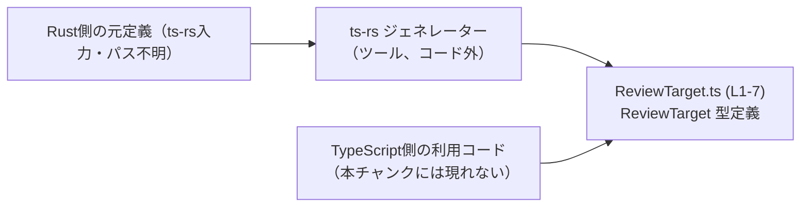
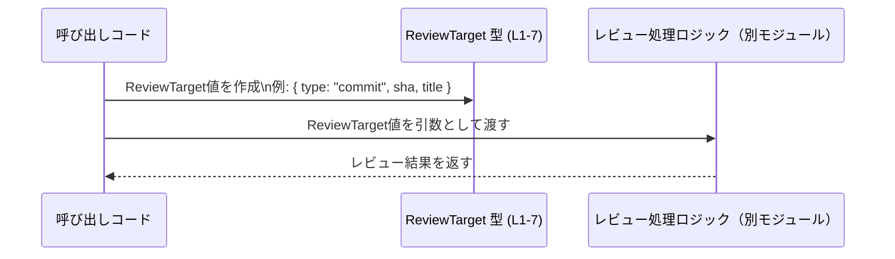

# app-server-protocol/schema/typescript/v2/ReviewTarget.ts コード解説

## 0. ざっくり一言

`ReviewTarget` は、「何をレビュー対象とするか」（未コミットの変更、ベースブランチ、特定コミット、カスタム指示）を表現する **判別共用体（discriminated union）型** を定義する TypeScript ファイルです（`ReviewTarget.ts:L1-7`）。

---

## 1. このモジュールの役割

### 1.1 概要

- このモジュールは、レビュー処理における「対象」を型として表現するために存在します（`ReviewTarget.ts:L1-7`）。
- 具体的には、以下 4 通りのレビュー対象を 1 つの union 型 `ReviewTarget` としてまとめています（`ReviewTarget.ts:L1-7`）。
  - 作業ツリーの未コミット変更（`type: "uncommittedChanges"`）
  - ベースブランチとの比較（`type: "baseBranch"` + `branch: string`）
  - 特定コミット（`type: "commit"` + `sha: string` + `title: string | null`）
  - カスタム指示（`type: "custom"` + `instructions: string`）

ファイル冒頭のコメントから、このファイルが `ts-rs` により自動生成されていることが明示されています（`ReviewTarget.ts:L1-3`）。

### 1.2 アーキテクチャ内での位置づけ

コメントによると、このファイルは Rust 側の定義から `ts-rs` によって生成された TypeScript 型定義です（`ReviewTarget.ts:L1-3`）。TypeScript 側のコードはこの `ReviewTarget` 型をインポートして使用すると考えられますが、実際の利用箇所やモジュール構成はこのチャンクには現れません。

概念的な位置づけを示すと、次のようになります。



- Rust 側の定義 → `ts-rs` → 本ファイル（`ReviewTarget.ts`）というコード生成の流れがコメントから読み取れます（`ReviewTarget.ts:L1-3`）。
- TypeScript 側では、この `ReviewTarget` 型を通じてレビュー対象を表現するだけで、ロジックや I/O はこのファイルには含まれていません（`ReviewTarget.ts:L1-7`）。

### 1.3 設計上のポイント

コードから読み取れる設計上の特徴は次のとおりです（すべて `ReviewTarget.ts:L1-7` より）:

- **自動生成された型定義**
  - `// GENERATED CODE! DO NOT MODIFY BY HAND!` と記載されており、手動編集は禁止です。
- **判別共用体（discriminated union）**
  - 全てのバリアントに共通する `"type"` プロパティを持ち、その文字列リテラル値でバリアントを区別します。
  - TypeScript の型システム上、`switch` や `if` による `target.type` の判定で安全に絞り込みができます。
- **バリアントごとに異なる必須プロパティ**
  - `baseBranch` には `branch: string` が必須。
  - `commit` には `sha: string` と `title: string | null`。
  - `custom` には `instructions: string`。
- **nullable フィールド**
  - `commit` バリアントの `title` は `string | null` になっており、「UI 用の任意のラベル」であることがコメントで説明されています。
- **状態やロジックを持たない純粋なデータ型**
  - 関数やメソッドは一切定義されておらず（`functions=0`）、このファイルはデータ構造の宣言のみに責務を限定しています。

---

## 2. 主要な機能一覧

このファイルは「機能」というより「データ表現」を提供しますが、レビュー対象の種別ごとに次のような役割があります（`ReviewTarget.ts:L1-7`）。

- `uncommittedChanges`: 作業ツリーの未コミット変更をレビュー対象とすることを表す。
- `baseBranch`: あるブランチ名（`branch: string`）を基準に差分レビューを行うことを表す。
- `commit`: 特定コミット（`sha: string`）と、その任意ラベル（`title: string | null`）をレビュー対象とする。
- `custom`: 任意の文字列指示（`instructions: string`）に基づいたカスタムレビュー対象を表す。

### コンポーネントインベントリー（型・バリアント一覧）

| 種別 | 名前 / バリアント | 主なプロパティ | 説明 | 根拠 |
|------|--------------------|----------------|------|------|
| 型エイリアス | `ReviewTarget` | `"type"` + 各バリアント固有のプロパティ | レビュー対象を表す判別共用体全体 | `ReviewTarget.ts:L1-7` |
| バリアント | `"uncommittedChanges"` | `"type": "uncommittedChanges"` | 未コミット変更を対象とする | `ReviewTarget.ts:L1-7` |
| バリアント | `"baseBranch"` | `"type": "baseBranch"`, `branch: string` | 指定ブランチとの差分レビューを表す | `ReviewTarget.ts:L1-7` |
| バリアント | `"commit"` | `"type": "commit"`, `sha: string`, `title: string \| null` | 特定コミットを対象とし、任意ラベルを持つ | `ReviewTarget.ts:L1-7` |
| バリアント | `"custom"` | `"type": "custom"`, `instructions: string` | カスタム指示に基づくレビュー対象 | `ReviewTarget.ts:L1-7` |

---

## 3. 公開 API と詳細解説

### 3.1 型一覧（構造体・列挙体など）

このファイルで公開されている主な型は 1 つです（`exports=1`）。

| 名前 | 種別 | 役割 / 用途 | 主なフィールド | 根拠 |
|------|------|-------------|----------------|------|
| `ReviewTarget` | 型エイリアス（判別共用体） | レビュー対象の種別と、その付随情報を表現する | `"type"`（判別子）、`branch`, `sha`, `title`, `instructions` など | `ReviewTarget.ts:L1-7` |

#### `ReviewTarget` の詳細構造

実際の型定義（整形したもの）は次のようになります（コメントを含む内容は `ReviewTarget.ts:L1-7` からの再構成です）。

```typescript
export type ReviewTarget =
  | { type: "uncommittedChanges" }
  | {
      type: "baseBranch";
      branch: string;
    }
  | {
      type: "commit";
      sha: string;
      /**
       * Optional human-readable label (e.g., commit subject) for UIs.
       */
      title: string | null;
    }
  | {
      type: "custom";
      instructions: string;
    };
```

**役割**

- `ReviewTarget` は、レビュー処理における「対象」を一意に識別し、その対象に必要な情報を添えるための型です（`ReviewTarget.ts:L1-7`）。
- `"type"` プロパティを使った判別共用体により、TypeScript のコンパイル時型チェックで分岐漏れやプロパティアクセスのミスを防ぎやすくなっています。

**各バリアントの意味**

- `{ type: "uncommittedChanges" }`
  - 追加プロパティはなく、「現在の作業ツリーの未コミット変更」を対象とすることを示します（`ReviewTarget.ts:L1-7`）。
- `{ type: "baseBranch", branch: string }`
  - `branch`: 比較対象となるベースブランチ名。
- `{ type: "commit", sha: string, title: string | null }`
  - `sha`: 対象とするコミットの SHA。
  - `title`: UI 用の任意ラベル。コメントに「人間が読めるラベル（例: commit subject）」と説明されています（`ReviewTarget.ts:L1-7`）。
- `{ type: "custom", instructions: string }`
  - `instructions`: 自由記述の指示文。レビュー対象をカスタマイズするために使われると考えられますが、具体的フォーマットはこのチャンクには現れません。

### 3.2 関数詳細

- このファイルには関数・メソッドは定義されていません（`functions=0`, `ReviewTarget.ts:L1-7`）。
- そのため、「関数詳細」テンプレートに該当する API はありません。

### 3.3 その他の関数

- 補助関数やラッパー関数も一切定義されていません（`ReviewTarget.ts:L1-7`）。

---

## 4. データフロー

このファイル自体にはロジックや I/O はありませんが、`ReviewTarget` 型がどのように使われるかの典型的なデータフロー像を、抽象的に示します。  
※以下は「ReviewTarget 型に準拠した値」がどう流れるかのイメージであり、実際のモジュール構成はこのチャンクには現れません。



- 呼び出しコードが `ReviewTarget` 型に準拠したオブジェクトを生成します（`ReviewTarget.ts:L1-7`）。
- そのオブジェクトは、レビュー処理ロジック（例えば API クライアントやサーバー側との通信層）に渡され、適切な分岐処理を行うための入力として使われることが想定されます。
- `ReviewTarget` は **純粋なデータ型** なので、並行性・非同期処理は全て外部のコード側が担い、この型自体はそれに対して中立です。

---

## 5. 使い方（How to Use）

### 5.1 基本的な使用方法

`ReviewTarget` 型を使ってレビュー対象を表現し、`switch` 文で安全に分岐する基本例です。  
※インポートパスは例示であり、実際のパスはプロジェクト構成に依存するため、このチャンクからは分かりません。

```typescript
// ReviewTarget 型をインポートする（実際のパスはプロジェクト依存）
import type { ReviewTarget } from "./ReviewTarget"; // ReviewTarget 型エイリアスを型として利用する

// commit を対象とする ReviewTarget の値を作成する例
const commitTarget: ReviewTarget = {                   // ReviewTarget 型の変数を宣言
  type: "commit",                                      // 判別子。文字列リテラル "commit" である必要がある
  sha: "abc123def4567890",                             // 対象コミットの SHA
  title: "Fix login bug",                              // 任意のラベル。null も許可される
};

// ReviewTarget を受け取って人間向け説明文を返す関数の例
function describeTarget(target: ReviewTarget): string { // 引数 target は ReviewTarget 型
  switch (target.type) {                                // type プロパティでバリアントを判別
    case "uncommittedChanges":                          // 未コミット変更の場合
      return "作業ツリーの未コミット変更";

    case "baseBranch":                                  // baseBranch バリアントの場合
      return `ブランチ ${target.branch} との差分`;      // branch プロパティに安全にアクセスできる

    case "commit":                                      // commit バリアントの場合
      // title が null の場合はフォールバックとして SHA を使う
      return target.title ?? `コミット ${target.sha}`;

    case "custom":                                      // custom バリアントの場合
      return `カスタム指示: ${target.instructions}`;    // instructions プロパティを利用
  }
}
```

**TypeScript 特有のポイント**

- `"type"` が文字列リテラル型になっているため、`switch (target.type)` の各 `case` で **型が自動的に絞り込まれ**、対応するプロパティが安全にアクセスできます（判別共用体）。
- `title` は `string | null` なので、`??`（Null合体演算子）や明示的な `if (target.title != null)` などで null を考慮する必要があります。

### 5.2 よくある使用パターン

1. **UI の分岐レンダリング**

```typescript
function renderBadge(target: ReviewTarget): string {      // バッジ表示用の文字列を返す例
  if (target.type === "uncommittedChanges") {             // type プロパティで判定
    return "未コミット";                                  // 未コミット変更用ラベル
  }
  if (target.type === "baseBranch") {
    return `Base: ${target.branch}`;                      // ブランチ名を表示
  }
  if (target.type === "commit") {
    return target.title ?? target.sha.slice(0, 7);        // タイトルがあれば使い、なければ短縮SHA
  }
  // ここに到達する時点で target.type は "custom" に絞り込まれている
  return "Custom";                                        // カスタム指示用の汎用ラベル
}
```

1. **API リクエストのペイロードとして使用**

```typescript
async function sendReviewRequest(target: ReviewTarget) {  // ReviewTarget をサーバーに送る例
  await fetch("/api/review", {                            // fetch で HTTP リクエストを送信
    method: "POST",                                       // POST メソッド
    headers: { "Content-Type": "application/json" },      // JSON を送る
    body: JSON.stringify({ target }),                     // ReviewTarget を JSON としてシリアライズ
  });
}
```

- このファイルにはランタイムのバリデーションは含まれていないため、外部から JSON を受け取る場合は **別途ランタイムバリデーション** が必要です（TypeScript の型はコンパイル時のみ有効）。

### 5.3 よくある間違い

#### 1. `type` のスペルミス

```typescript
// 間違い例: 判別子のスペルが異なる
const badTarget: ReviewTarget = {
  type: "Commit",                   // ❌ "commit" ではなく "Commit"（大文字）が指定されている
  sha: "abc123",
  title: "Bad example",
};
// → TypeScript の型チェックでエラーになる（"Commit" は許可されていないリテラル値）
```

```typescript
// 正しい例
const goodTarget: ReviewTarget = {
  type: "commit",                   // ✅ 定義どおりの "commit"
  sha: "abc123",
  title: "Good example",
};
```

#### 2. `title` の null を考慮しない

```typescript
function showCommitTitle(target: ReviewTarget): string {
  if (target.type === "commit") {
    // 間違い例: title が null になりうることを無視している
    // return target.title.toUpperCase();                // ❌ title が null のとき runtime error の可能性

    // 正しい例: null チェックか Null合体演算子を利用する
    return (target.title ?? target.sha).toUpperCase();    // ✅ null の場合は SHA で代用
  }
  return "not a commit";
}
```

### 5.4 使用上の注意点（まとめ）

- **自動生成コードであること**
  - ファイル冒頭に「GENERATED CODE」「Do not modify by hand」と記載されており、手動での編集は想定されていません（`ReviewTarget.ts:L1-3`）。
- **コンパイル時のみの安全性**
  - TypeScript の型は実行時には存在しないため、外部からの入力（JSON 等）に対しては **別途ランタイムチェックが必要** です。
- **nullable フィールドの扱い**
  - `title: string | null` は null を取りうるため、UI 表示などで null を前提にしないコードを書く必要があります（`ReviewTarget.ts:L1-7`）。
- **すべてのバリアントを処理すること**
  - `switch` 文などで `ReviewTarget` を扱う場合、新しいバリアントが追加される可能性を考慮し、`default` を避けて網羅性チェックを効かせるなどの工夫が有効です（このファイルにはそのロジックは含まれていません）。

---

## 6. 変更の仕方（How to Modify）

### 6.1 新しい機能を追加する場合

このファイルは `ts-rs` による **自動生成ファイル** であり、直接編集しないことが前提になっています（`ReviewTarget.ts:L1-3`）。

新しいレビュー対象種別を追加したい場合の一般的な流れ（コードから推測される範囲での手順）は次のとおりです。

1. **Rust 側の元定義を変更する**
   - `ReviewTarget` に対応する Rust の型（列挙型や構造体）に新しいバリアントやフィールドを追加する。
   - Rust 側のファイルパスや型名はこのチャンクには現れないため「不明」です。
2. **`ts-rs` による再生成を行う**
   - プロジェクトのビルドや専用スクリプトを通じて、`ts-rs` が TypeScript 定義を再生成する。
3. **TypeScript 側の利用コードを更新する**
   - 新たに追加された `type` 値に対応する分岐ロジックを追記する。
   - `switch` 文の網羅性が崩れないように注意する。

### 6.2 既存の機能を変更する場合

- **フィールド名や型の変更**
  - 例: `branch: string` を `branchName: string` に変更したい、等。
  - これも Rust 側の定義に対して変更を行い、`ts-rs` に再生成をさせるのが原則です（`ReviewTarget.ts:L1-3`）。
  - 変更後、`ReviewTarget` を使っている TypeScript コードでコンパイルエラーが出る箇所を確認し、対応を行う必要があります。
- **互換性への注意**
  - 既存のバリアントを削除したり、フィールドを削除する変更は、利用側にとって破壊的変更となる可能性があります。
  - API のバージョニング等のポリシーは、このチャンクからは分かりません。

---

## 7. 関連ファイル

このチャンクには他ファイルのパス情報は現れないため、厳密な関連ファイルは不明です。ただし、コメントとコード生成ツール名から、次のような関係が推測されます（推測であることを明示します）。

| パス | 役割 / 関係 |
|------|------------|
| `app-server-protocol/schema/typescript/v2/ReviewTarget.ts` | 本レポート対象ファイル。`ReviewTarget` 型エイリアス（判別共用体）を定義する自動生成 TypeScript ファイルです（`ReviewTarget.ts:L1-7`）。 |
| （Rust 側の ts-rs 入力定義、パス不明） | コメントから、この TypeScript 型の元となる Rust 型定義が存在すると考えられますが、具体的なファイルパスや型名はこのチャンクには現れません（`ReviewTarget.ts:L1-3`）。 |

---

### 言語固有の安全性・エラー・並行性に関する補足

- **型安全性**
  - 判別共用体により、`target.type` に応じたプロパティアクセスが型チェックされます。
  - 許可されていない `"type"` 文字列を指定するとコンパイルエラーになります。
- **エラー挙動**
  - このファイル自体にはロジックがないため、直接の実行時エラーは発生しません。
  - ただし、`title` が `null` になりうる点を考慮せずにメソッド呼び出しを行うと、利用側コードで `TypeError` などが発生し得ます。
- **並行性**
  - `ReviewTarget` はイミュータブルなプレーンオブジェクトとして扱われることが想定され、スレッド・タスク間で共有しても状態競合は発生しません。
  - 非同期処理や並行性制御は、すべてこの型を利用する外部コード側の責務となります。
