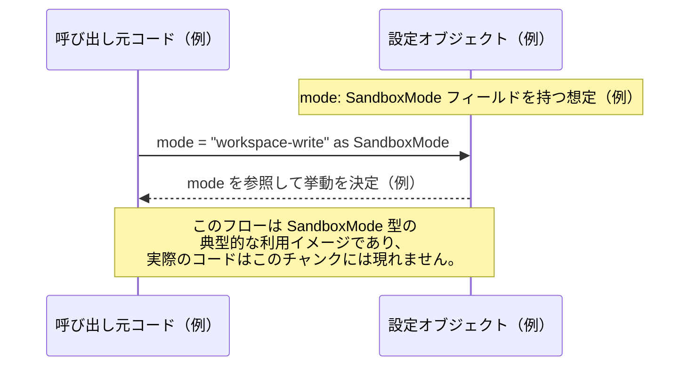

# app-server-protocol/schema/typescript/v2/SandboxMode.ts

## 0. ざっくり一言

- サンドボックスのモードを表現する、**3 種類の文字列リテラルのユニオン型 `SandboxMode` を定義しただけの自動生成ファイル**です（`SandboxMode.ts:L5-5`）。
- Rust 側の定義から [`ts-rs`](https://github.com/Aleph-Alpha/ts-rs) により生成されることがコメントで明示されています（`SandboxMode.ts:L1-3`）。

---

## 1. このモジュールの役割

### 1.1 概要

- このモジュールは、TypeScript で使うための **型エイリアス `SandboxMode`** を 1 つだけ公開しています（`SandboxMode.ts:L5-5`）。
- `SandboxMode` は `"read-only" | "workspace-write" | "danger-full-access"` のいずれかの文字列だけを許可する、**文字列リテラルユニオン型**です。
- コメントにより、このファイルは **手で編集してはいけない自動生成コード**であることが明示されています（`SandboxMode.ts:L1-3`）。

### 1.2 アーキテクチャ内での位置づけ

- ファイルパスから、この型は `app-server-protocol` の **TypeScript スキーマ（v2）** の一部として配置されています。
- このファイルには **import 行が存在しない**ため、他モジュールへの依存はありません（`SandboxMode.ts:L1-5` に import がないことから分かります）。
- 一方で、`export type SandboxMode = ...` となっているため、**他の TypeScript コードから参照される前提の公開型**であることが分かります（`SandboxMode.ts:L5-5`）。

依存関係（このチャンクで分かる範囲のみ）を簡易に示します。


- `SandboxMode` 以外のコンポーネントや、この型を利用するモジュールは **このチャンクには現れないため不明**です。

### 1.3 設計上のポイント

- **自動生成コード**  
  - 先頭コメントで「GENERATED CODE! DO NOT MODIFY BY HAND!」とあり（`SandboxMode.ts:L1-1`）、`ts-rs` による自動生成であることが明記されています（`SandboxMode.ts:L3-3`）。
- **文字列リテラルユニオンによる型安全性**  
  - `"read-only" | "workspace-write" | "danger-full-access"` という **3 つの文字列だけを許容する型**になっており（`SandboxMode.ts:L5-5`）、それ以外の文字列をコンパイル時に弾くことができます。
- **実行時の状態やロジックを持たない**  
  - このファイルは型エイリアスのみを定義しており、クラスや関数、実行時処理は含まれません（`SandboxMode.ts:L1-5` に他の定義が無いことから分かります）。

---

## 2. 主要な機能一覧（コンポーネントインベントリー）

このファイルが提供する主要コンポーネントは 1 つです。

- `SandboxMode` 型定義: `"read-only" | "workspace-write" | "danger-full-access"` のいずれかを表す文字列リテラルユニオン型（`SandboxMode.ts:L5-5`）

---

## 3. 公開 API と詳細解説

### 3.1 型一覧（構造体・列挙体など）

| 名前          | 種別                                | 定義位置                     | 役割 / 用途 |
|---------------|-------------------------------------|------------------------------|------------|
| `SandboxMode` | 型エイリアス（文字列リテラルユニオン） | `SandboxMode.ts:L5-5` | サンドボックスモードを `"read-only"`, `"workspace-write"`, `"danger-full-access"` のいずれかで表現する |

#### `SandboxMode` の詳細

- **定義**  

  ```ts
  export type SandboxMode = "read-only" | "workspace-write" | "danger-full-access";
  ```

  （`SandboxMode.ts:L5-5`）

- **意味（コードから分かる範囲）**
  - `SandboxMode` 型の値として許可されるのは、次の 3 つの文字列だけです。
    - `"read-only"`
    - `"workspace-write"`
    - `"danger-full-access"`
  - これら文字列が **具体的にどのようなアクセス権や挙動に対応するかは、このチャンクには現れません**。

- **TypeScript における安全性**
  - `SandboxMode` 型を使うことで、誤った文字列（例: `"readonly"`, `"admin"` など）をモードとして渡した場合に、**コンパイルエラー**で検出できます。
  - `string` 型そのものを使うよりも、許可された値を列挙した形になっているため、IDE の補完・リファクタリング支援が受けやすくなります。

- **null / undefined との関係**
  - 定義上 `null` や `undefined` は含まれていません。
  - したがって `SandboxMode` 型の変数は、型レベルでは **必ず 3 つの文字列のいずれか**であることが前提になります。
  - もし `null` や `undefined` を許可したい場合は、利用側で `SandboxMode | null` のようなユニオンを定義する必要があります。

### 3.2 関数詳細（最大 7 件）

- **このファイルには関数が 1 つも定義されていません**（`SandboxMode.ts:L1-5` 内に `function` / `=>` などの定義が無いことから分かります）。
- そのため、関数詳細テンプレートに基づいて解説すべき対象はありません。

### 3.3 その他の関数

- 該当なし（関数定義が存在しません）。

---

## 4. データフロー

このファイル自体は型定義のみであり、**実行時の処理フローは含まれていません**。  
ここでは、`SandboxMode` がアプリケーション内でどのように流れるかの **架空の例** を示します（このリポジトリ内の実コードではなく、説明用の例であることに注意してください）。

### 概念的なデータフロー（例）

- 設定や API レスポンスを表すオブジェクトに `SandboxMode` 型のフィールドを持たせる。
- 呼び出し元が、`SandboxMode` 型の値を引数として渡す。
- 受け取った側が、その値に応じてサンドボックス環境の構成を決める。



- 実際にどのモジュールが `SandboxMode` を使っているか、どのような処理で参照されるかは **このファイルからは分かりません**。

---

## 5. 使い方（How to Use）

### 5.1 基本的な使用方法

`SandboxMode` を変数や関数引数の型として使い、**許可された 3 つの文字列以外をコンパイル時に防ぐ**ことができます。

```typescript
// 実際の import パスは、この SandboxMode.ts との相対位置に応じて調整する必要があります。
import type { SandboxMode } from "./SandboxMode"; // SandboxMode 型をインポートする

// SandboxMode 型の変数を宣言し、許可された文字列を代入する
const mode: SandboxMode = "read-only";           // OK: 定義された 3 つのうち 1 つ

// コンパイルエラーの例（コメントアウト）
// const invalidMode: SandboxMode = "admin";     // エラー: "admin" は SandboxMode に含まれない
```

- このように型を付けることで、IDE が `"read-only"`, `"workspace-write"`, `"danger-full-access"` の候補を提示し、誤字などを防ぎやすくなります。

### 5.2 よくある使用パターン（例）

#### 1. 関数引数の型として使う

```typescript
import type { SandboxMode } from "./SandboxMode";      // SandboxMode 型をインポート

// サンドボックスを起動する関数の引数として SandboxMode を利用する（例）
function startSandbox(mode: SandboxMode) {             // mode は 3 つの文字列のどれかに限定される
    // mode の値に応じて挙動を分岐するイメージ
    if (mode === "read-only") {                        // "read-only" の場合の処理（例）
        // ...
    } else if (mode === "workspace-write") {           // "workspace-write" の場合の処理（例）
        // ...
    } else {                                           // 残るは "danger-full-access" のみ（例）
        // ...
    }
}
```

- `if` / `switch` で分岐する際、TypeScript が `mode` の取り得る値を把握しているため、**全ての分岐をカバーしているかどうか**を IDE がチェックしやすくなります。

#### 2. 設定オブジェクトのプロパティとして使う

```typescript
import type { SandboxMode } from "./SandboxMode";  // SandboxMode 型をインポート

// アプリケーション設定を表す型の一部として SandboxMode を利用する例
interface AppConfig {
    sandboxMode: SandboxMode;                     // sandboxMode プロパティに SandboxMode 型を設定
}

// 設定オブジェクトの作成例
const config: AppConfig = {
    sandboxMode: "danger-full-access",            // 3 つの文字列の 1 つを指定
};
```

### 5.3 よくある間違い（想定される誤用パターン）

このファイルから直接は分かりませんが、`SandboxMode` の型定義の性質から、起こりがちな誤用と正しい例を示します。

```typescript
import type { SandboxMode } from "./SandboxMode";

// 誤り例: string 型を使ってしまい、何でも入る状態にしてしまう
interface WrongConfig {
    sandboxMode: string;                          // 何でも入るため、"read-only" 以外も通ってしまう
}

// 正しい例: SandboxMode 型を利用して許可文字列を制限する
interface CorrectConfig {
    sandboxMode: SandboxMode;                     // "read-only" | "workspace-write" | "danger-full-access" のみに制限
}
```

- 誤り例では、**コンパイル時に不正な値を検出できない**ため、ランタイムに予期しない文字列が流れ込む可能性が高まります。
- 正しい例では、`SandboxMode` 型によって **コンパイル時に制約がかかる**ため、安全性が高まります。

### 5.4 使用上の注意点（まとめ）

- この型は **コンパイル時の制約のみ**を提供し、ランタイムには存在しません。  
  外部入力（JSON, HTTP リクエストなど）はあくまで `string` として入ってくるため、**実行時に値の妥当性を検証する処理**は別途必要です。
- ファイル先頭に「Do not edit this file manually」とある通り（`SandboxMode.ts:L1-3`）、**この TypeScript ファイルを直接変更しない**ことが前提になっています。
- `SandboxMode` には `null` / `undefined` は含まれないため、それらを許容する API を設計する場合は、利用側でユニオン型を拡張する必要があります（例: `SandboxMode | null`）。

---

## 6. 変更の仕方（How to Modify）

### 6.1 新しい機能（新しいモード）を追加する場合

- ファイル先頭コメントにより、このファイルは **自動生成される**こと、手で編集してはいけないことが明示されています（`SandboxMode.ts:L1-3`）。
- そのため、新しいモードを追加したい場合、**この TypeScript ファイルではなく、生成元の Rust 側の型定義を変更する必要があります**。
  - 具体的な Rust ファイルのパスや型名は、このチャンクには現れないため不明です。
  - 通常、`ts-rs` を利用している Rust プロジェクトでは、対応する構造体/列挙体に `#[derive(TS)]` のようなアトリビュートが付いていますが、これもここからは確認できません。

変更の一般的な流れ（推奨パターンとしての例）:

1. Rust 側でサンドボックスモードを表す型（enum など）に、新しいバリアントを追加する。
2. `ts-rs` を用いたコード生成プロセスを再実行する。
3. 生成された TypeScript コードに、新しいリテラルが `SandboxMode` 型に含まれていることを確認する。

### 6.2 既存の機能（既存モード）を変更する場合

- 既存の文字列リテラル（例: `"read-only"`）を変更すると、**その文字列を前提に書かれた既存コードすべてに影響**します。
- 契約（Contract）としては、`SandboxMode` に含まれる 3 つの文字列が、利用コード全体で前提になっている可能性が高いため、変更時は次の点に注意が必要です。

注意事項（契約・エッジケース）:

- **後方互換性**  
  - 既存モード名の変更・削除は、型レベルでのコンパイルエラーを引き起こします。これは破壊的変更となります。
- **生成元の変更が唯一の正しい変更ポイント**  
  - TypeScript 側は自動生成であり、直接編集すると後続の生成で上書きされるため、変更の持続性がありません。
- **利用箇所の確認**  
  - 変更後は、`"read-only"` などのリテラルを直接書いているコード、`SandboxMode` 型に依存する分岐処理などを再確認する必要があります。

---

## 7. 関連ファイル

このチャンクから直接分かる範囲、および自動生成という事実から推測される関連ファイルをまとめます。  
（パスや具体的なファイル名は、このチャンクには現れないため「不明」としています。）

| パス / コンポーネント | 役割 / 関係 |
|------------------------|------------|
| Rust 側の ts-rs 対象型定義ファイル（パス不明） | `ts-rs` がこの `SandboxMode` 型を生成するもとになっている Rust の型定義。自動生成コメントから存在が推測されますが、具体的な場所はこのチャンクには現れません。 |
| `app-server-protocol/schema/typescript/v2/` 配下の他ファイル（不明） | パスから、このディレクトリ内には他にも v2 向けの TypeScript スキーマ定義がある可能性がありますが、内容はこのチャンクには現れません。 |
| `SandboxMode` を import して利用する TypeScript ファイル群（不明） | `export type SandboxMode ...`（`SandboxMode.ts:L5-5`）により、他ファイルから参照されることが想定されますが、具体的な利用箇所はこのチャンクには現れません。 |

---

### 付記: Bugs / Security / Tests / 性能 などの観点（本ファイルに関するまとめ）

- **Bugs / Security**
  - このファイルは型エイリアスのみを定義しており、**実行時ロジックを持たないため、このファイル単体に起因するランタイムバグや脆弱性はありません**。
  - ただし、`"danger-full-access"` のようなモード名は、利用側の実装によっては権限管理に関わる可能性がありますが、その挙動はこのチャンクには現れません。
- **Contracts / Edge Cases**
  - 契約として、`SandboxMode` は 3 つの文字列だけを許容します（`SandboxMode.ts:L5-5`）。
  - 他の文字列、`null`、`undefined` は型レベルで認められないため、それらを扱う場合は別の型を定義する必要があります。
- **Tests**
  - このファイルにはテストコードは含まれていません（`SandboxMode.ts:L1-5` に test 関連の記述は無し）。
  - 型定義の正しさは主に **Rust 側の定義と ts-rs の生成ロジック**によって担保されると考えられます（ただし、具体的なテストの有無はこのチャンクからは分かりません）。
- **Performance / Scalability**
  - TypeScript の型定義のみであり、**ランタイム性能やスケーラビリティに直接の影響はありません**。
  - 文字列リテラルユニオンを使うことで、enum などに比べてランタイムの追加オーバーヘッドがない点は一般的な利点です。
- **Observability**
  - 本ファイル自体にはロギングやメトリクスのコードは存在しません。
  - 実際のアプリケーションでは、`SandboxMode` 型の値をログやメトリクスのラベルとして扱うことが考えられますが、それはこのチャンクには現れません。
