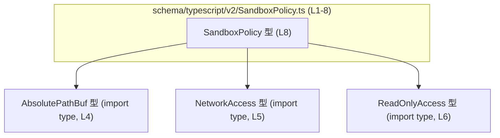
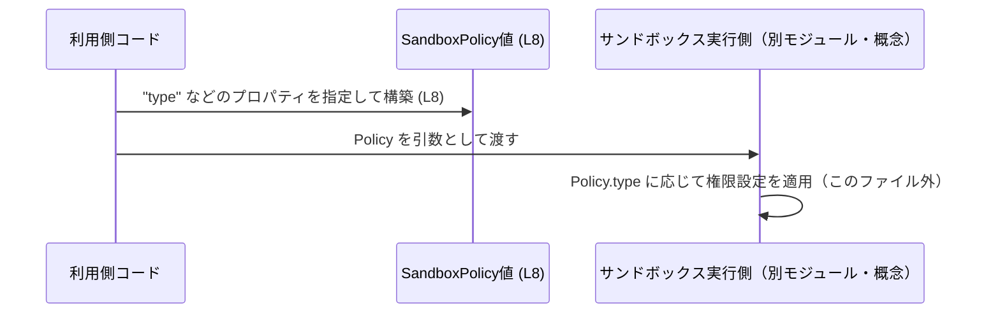

# app-server-protocol/schema/typescript/v2/SandboxPolicy.ts

## 0. ざっくり一言

`SandboxPolicy` 型は、サンドボックス実行環境の権限ポリシーを表現する **判別可能なユニオン型（discriminated union）** です。`type` フィールドの値に応じて、ファイルアクセス権やネットワークアクセス権などの異なる構造を持つ 4 パターンを区別します（根拠: `SandboxPolicy.ts:L8-8`）。

---

## 1. このモジュールの役割

### 1.1 概要

- このモジュールは、サンドボックス実行における **「どの程度の権限を与えるか」** を型として表現するために存在します（根拠: `"dangerFullAccess"`, `"readOnly"`, `"externalSandbox"`, `"workspaceWrite"` という `type` 値の並びから権限レベルを表す目的が読み取れるため `SandboxPolicy.ts:L8-8`）。
- TypeScript 側で Rust 由来のサンドボックスポリシーを安全に扱うための **データ構造定義** を提供し、ロジックはこのファイルの外で実装される前提です（根拠: 「GENERATED CODE」「Do not edit this file manually」コメント `SandboxPolicy.ts:L1-3`）。
- `ts-rs` によって自動生成されており、Rust 側の型と 1:1 に対応する境界インターフェースになっていると考えられます（根拠: `This file was generated by [ts-rs]` コメント `SandboxPolicy.ts:L3-3`）。

### 1.2 アーキテクチャ内での位置づけ

このファイルは **TypeScript スキーマ層** に属し、他の TypeScript コードから参照される「型定義モジュール」として機能します。`AbsolutePathBuf`, `NetworkAccess`, `ReadOnlyAccess` などの型に依存しており、これらを組み合わせてポリシーを表現します（根拠: type-only import `SandboxPolicy.ts:L4-6` とユニオン型定義 `SandboxPolicy.ts:L8-8`）。

#### 依存関係図（このチャンクのみ）



- `SandboxPolicy` はポリシーの一部として `AbsolutePathBuf`, `NetworkAccess`, `ReadOnlyAccess` を利用しますが、これらの中身はこのチャンクには現れません（根拠: import のみで定義が無い `SandboxPolicy.ts:L4-6`）。

### 1.3 設計上のポイント

- **自動生成コード**  
  - ファイル先頭に「GENERATED CODE」「Do not edit this file manually」と明記されており、手動編集しない前提の設計です（根拠: `SandboxPolicy.ts:L1-3`）。
- **判別可能なユニオン（discriminated union）**  
  - 共通フィールド `"type"` をタグとして持つ 4 つのオブジェクト型のユニオンになっており、`"type"` の値に応じて安全に分岐させる設計です（根拠: `export type SandboxPolicy = { "type": "dangerFullAccess" } | { "type": "readOnly", ... } | { "type": "externalSandbox", ... } | { "type": "workspaceWrite", ... };` `SandboxPolicy.ts:L8-8`）。
- **状態を持たない純データ型**  
  - クラスや関数はなく、プロパティのみからなる型定義のため、内部状態や並行実行の概念はありません（根拠: 関数・クラス定義が存在しない `SandboxPolicy.ts:L1-8`）。
- **型安全な権限表現**  
  - `dangerFullAccess`, `readOnly`, `externalSandbox`, `workspaceWrite` で必要な情報のみをプロパティとして許容しており、誤った組み合わせをコンパイル時に防ぐ意図が読み取れます（例: `readOnly` では `access: ReadOnlyAccess, networkAccess: boolean` だが、`externalSandbox` では `networkAccess: NetworkAccess` のみ `SandboxPolicy.ts:L8-8`）。

---

## 2. 主要な機能一覧

このモジュールは関数を含まないため、「機能」はすべて **データ型としての役割** に対応します。

- サンドボックス権限ポリシーの表現: `SandboxPolicy` ユニオン型で 4 種類のポリシーを表現（危険なフルアクセス / 読み取り専用 / 外部サンドボックス / ワークスペース書き込み）（根拠: `SandboxPolicy.ts:L8-8`）。
- ファイルパス制御: `workspaceWrite` 変種で `writableRoots: Array<AbsolutePathBuf>` により書き込み可能なルートディレクトリ集合を表現（根拠: `SandboxPolicy.ts:L8-8`）。
- 読み取り権限制御: `readOnly` および `workspaceWrite` 変種で `ReadOnlyAccess` を使い、どこまで読み取り可能かを表現（根拠: `SandboxPolicy.ts:L8-8`）。
- ネットワークアクセス制御:  
  - `readOnly` / `workspaceWrite` 変種では単純な `boolean` フラグとしてのネットワーク許可（根拠: `networkAccess: boolean` `SandboxPolicy.ts:L8-8`）。  
  - `externalSandbox` 変種では `NetworkAccess` 型により、より詳細なネットワーク許可設定（根拠: `networkAccess: NetworkAccess` `SandboxPolicy.ts:L8-8`）。
- 一時ディレクトリの扱い制御: `workspaceWrite` で `excludeTmpdirEnvVar` および `excludeSlashTmp` による `/tmp` や `TMPDIR` 環境変数由来パスの扱いのフラグ付け（根拠: `SandboxPolicy.ts:L8-8`）。

---

## 3. 公開 API と詳細解説

### 3.1 型一覧（構造体・列挙体など） ― コンポーネントインベントリー

#### このファイルで定義される型

| 名前 | 種別 | 役割 / 用途 | 定義箇所 |
|------|------|-------------|----------|
| `SandboxPolicy` | 型エイリアス（判別可能ユニオン） | サンドボックス実行における権限ポリシーを 4 パターンで表現する | `SandboxPolicy.ts:L8-8` |

`SandboxPolicy` の各変種（variant）は次のような構造です（すべて `SandboxPolicy.ts:L8-8` に定義）:

1. **`{ "type": "dangerFullAccess" }`**
   - プロパティ:
     - `"type": "dangerFullAccess"`
   - 他の情報は一切持たず、「フルアクセスである」という状態のみを示します。

2. **`{ "type": "readOnly", access: ReadOnlyAccess, networkAccess: boolean }`**
   - プロパティ:
     - `"type": "readOnly"`
     - `access: ReadOnlyAccess` — 読み取り対象の範囲などを表すと考えられます（詳細は他ファイル、ここでは不明）。
     - `networkAccess: boolean` — ネットワークアクセスを許可するかどうかの真偽値。

3. **`{ "type": "externalSandbox", networkAccess: NetworkAccess }`**
   - プロパティ:
     - `"type": "externalSandbox"`
     - `networkAccess: NetworkAccess` — 外部サンドボックス環境のネットワーク権限を詳細に定義すると考えられます（詳細不明）。

4. **`{ "type": "workspaceWrite", writableRoots: Array<AbsolutePathBuf>, readOnlyAccess: ReadOnlyAccess, networkAccess: boolean, excludeTmpdirEnvVar: boolean, excludeSlashTmp: boolean }`**
   - プロパティ:
     - `"type": "workspaceWrite"`
     - `writableRoots: Array<AbsolutePathBuf>` — 書き込みを許可するワークスペースルートのリスト。
     - `readOnlyAccess: ReadOnlyAccess` — 読み取り専用アクセス範囲。
     - `networkAccess: boolean` — ネットワーク許可フラグ。
     - `excludeTmpdirEnvVar: boolean` — `TMPDIR` 環境変数などによる一時ディレクトリを除外するかどうかのフラグと解釈できますが、挙動はこのファイルからは分かりません。
     - `excludeSlashTmp: boolean` — `/tmp` を除外するかどうかのフラグと解釈できますが、挙動はこのファイルからは分かりません。

#### インポートされる型一覧（このファイルでは中身不明）

| 名前 | 種別 | 役割 / 用途（このチャンクから分かる範囲） | 定義箇所 |
|------|------|---------------------------------------------|----------|
| `AbsolutePathBuf` | 型（type-only import） | 絶対パスを表す型と推測されますが、詳細不明。`writableRoots` の要素型として使用。 | import: `SandboxPolicy.ts:L4-4` |
| `NetworkAccess` | 型（type-only import） | ネットワークアクセス権限の詳細設定を表す型と推測されますが、詳細不明。`externalSandbox` 変種の `networkAccess` に使用。 | import: `SandboxPolicy.ts:L5-5` |
| `ReadOnlyAccess` | 型（type-only import） | 読み取り専用のアクセス権限設定を表す型と推測されますが、詳細不明。`readOnly` と `workspaceWrite` で使用。 | import: `SandboxPolicy.ts:L6-6` |

> 注: 上記 3 型は `import type` により参照されているだけで、実際の構造や列挙値はこのチャンクには現れないため、「詳細不明」としています（根拠: type-only import のみ `SandboxPolicy.ts:L4-6`）。

---

### 3.2 関数詳細（最大 7 件）

このファイルには関数・メソッド・クラスが定義されていません（根拠: `export type` 以外に `function` / `class` / `=>` などが存在しない `SandboxPolicy.ts:L1-8`）。  
したがって、関数の詳細テンプレートに従って説明すべき対象はありません。

---

### 3.3 その他の関数

- 該当なし（このファイルには補助関数やラッパー関数も存在しません）。

---

## 4. データフロー

このモジュール自体は関数や処理フローを含みませんが、`SandboxPolicy` 型がどのようにデータとして利用されるかの典型的な流れを **概念的に** 示します。

- TypeScript 側の利用コードが、サンドボックスを起動・設定するときに `SandboxPolicy` 型の値を構築します（根拠: 権限設定を表すプロパティ群 `SandboxPolicy.ts:L8-8`）。
- その値は別モジュール（サンドボックス実行エンジンなど）に渡され、`type` フィールドに応じて処理が分岐して実行環境の権限が決まります。この分岐ロジックはこのファイルには含まれません。

### 概念的なシーケンス図



- 上記のうち、`Policy` の構造がどのようなプロパティを持つかは `SandboxPolicy.ts:L8-8` で定義されています。
- `Executor` に相当する実装はこのチャンクには存在せず、あくまで概念上の利用者を示しています。

---

## 5. 使い方（How to Use）

### 5.1 基本的な使用方法

`SandboxPolicy` は判別可能ユニオン型なので、`type` フィールドを使って安全に分岐するのが基本的な使い方です（根拠: 共通フィールド `"type"` を持つユニオン `SandboxPolicy.ts:L8-8`）。

以下は、`SandboxPolicy` を受け取って処理を分岐する例です。

```typescript
// SandboxPolicy 型をインポートする（実際のパスはプロジェクト構成に依存）
import type { SandboxPolicy } from "./SandboxPolicy";

// ポリシーに応じてログを出し分ける例
function describePolicy(policy: SandboxPolicy): string {
    switch (policy.type) {                         // 判別キーとして "type" を利用
        case "dangerFullAccess":                  // 変種1 (L8)
            return "危険: フルアクセスが許可されています";

        case "readOnly":                          // 変種2 (L8)
            // policy.access は ReadOnlyAccess 型
            // policy.networkAccess は boolean
            return `読取専用ポリシー (ネットワーク: ${
                policy.networkAccess ? "許可" : "禁止"
            })`;

        case "externalSandbox":                   // 変種3 (L8)
            // policy.networkAccess は NetworkAccess 型
            return "外部サンドボックスで実行されます";

        case "workspaceWrite":                    // 変種4 (L8)
            // policy.writableRoots は AbsolutePathBuf[] 型
            // policy.readOnlyAccess は ReadOnlyAccess 型
            // policy.networkAccess, exclude* は boolean
            return `ワークスペース書き込み許可ポリシー（ルート数: ${
                policy.writableRoots.length
            }）`;

        default: {
            // TypeScript 4.x 以降なら、ここで never チェックを入れると
            // 変種追加時のコンパイルエラー検出に役立つ
            const _exhaustiveCheck: never = policy;
            return _exhaustiveCheck;
        }
    }
}
```

- `policy.type` には `"dangerFullAccess" | "readOnly" | "externalSandbox" | "workspaceWrite"` のいずれかしか入りません（根拠: リテラル型のユニオン `SandboxPolicy.ts:L8-8`）。
- `switch` 文で各ケースを列挙すると、コンパイラにより **型レベルでの分岐の網羅性チェック** が行いやすくなります（`default` で `never` チェックをすると変種追加漏れがコンパイルエラーになる）。

### 5.2 よくある使用パターン

#### パターン1: 各変種の生成

`SandboxPolicy` の各変種を生成する例です。`AbsolutePathBuf` や `NetworkAccess`, `ReadOnlyAccess` の具体的な構築方法はこのファイルからは分からないため、ここでは仮の値として `as` を使っています。

```typescript
import type { SandboxPolicy } from "./SandboxPolicy";
import type { AbsolutePathBuf } from "../AbsolutePathBuf";
import type { NetworkAccess } from "./NetworkAccess";
import type { ReadOnlyAccess } from "./ReadOnlyAccess";

// 危険なフルアクセス
const dangerPolicy: SandboxPolicy = {
    type: "dangerFullAccess",                   // (L8)
};

// 読み取り専用ポリシー
const readOnlyPolicy: SandboxPolicy = {
    type: "readOnly",                           // (L8)
    access: {} as ReadOnlyAccess,               // 実際は適切な ReadOnlyAccess を設定する
    networkAccess: false,
};

// 外部サンドボックス利用ポリシー
const externalPolicy: SandboxPolicy = {
    type: "externalSandbox",                    // (L8)
    networkAccess: {} as NetworkAccess,         // 実際は詳細なネットワーク設定を指定
};

// ワークスペース書き込みポリシー
const workspacePolicy: SandboxPolicy = {
    type: "workspaceWrite",                     // (L8)
    writableRoots: [] as AbsolutePathBuf[],     // 書き込みを許可するルート
    readOnlyAccess: {} as ReadOnlyAccess,
    networkAccess: true,
    excludeTmpdirEnvVar: true,
    excludeSlashTmp: true,
};
```

- 各変種で必要なプロパティが異なるため、「別の変種のプロパティ」を書こうとするとコンパイルエラーになります（たとえば `type: "readOnly"` に `writableRoots` を足そうとするとエラー、根拠: ユニオン定義 `SandboxPolicy.ts:L8-8`）。

#### パターン2: ネットワークアクセス可否の判定

`SandboxPolicy` から「ネットワークアクセスが有効かどうか」を判定するヘルパーを実装する例です。

```typescript
import type { SandboxPolicy } from "./SandboxPolicy";

function hasNetworkAccess(policy: SandboxPolicy): boolean {
    switch (policy.type) {
        case "dangerFullAccess":
            // フルアクセスならネットワークも許可される、という運用ポリシーと仮定
            return true;

        case "readOnly":
            return policy.networkAccess;

        case "externalSandbox":
            // NetworkAccess 型の詳細は不明なので、ここでは
            // 何らかの isEnabled プロパティがある想定にしている点に注意
            // 実際は NetworkAccess 型の定義を参照する必要がある
            return (policy.networkAccess as any).isEnabled ?? true;

        case "workspaceWrite":
            return policy.networkAccess;
    }
}
```

> 注意: `NetworkAccess` 型の構造がこのチャンクにはないため、上記の `isEnabled` などはあくまで説明用の仮定です。実コードでは `NetworkAccess` の定義を参照する必要があります。

### 5.3 よくある間違い

#### 間違い例1: `type` のスペルミス

```typescript
import type { SandboxPolicy } from "./SandboxPolicy";

const invalid: SandboxPolicy = {
    type: "dangerfullaccess",  // ❌ スペルミス（許可されていないリテラル）
};
```

- `SandboxPolicy` の `type` は `"dangerFullAccess" | "readOnly" | "externalSandbox" | "workspaceWrite"` のいずれかでなければならないため（根拠: `SandboxPolicy.ts:L8-8`）、上記はコンパイルエラーになります。

#### 間違い例2: 他の変種のプロパティを混在させる

```typescript
const invalid2: SandboxPolicy = {
    type: "readOnly",
    access: {} as ReadOnlyAccess,
    networkAccess: false,
    writableRoots: [] as AbsolutePathBuf[],  // ❌ readOnly 変種には存在しない
};
```

- `"readOnly"` 変種には `writableRoots` プロパティは無いため、型エラーになります（根拠: `"readOnly"` 変種の構造に `writableRoots` が含まれない `SandboxPolicy.ts:L8-8`）。

#### 間違い例3: `externalSandbox` 変種で `networkAccess` を boolean にする

```typescript
const invalid3: SandboxPolicy = {
    type: "externalSandbox",
    networkAccess: true,   // ❌ externalSandbox では NetworkAccess 型が必要
};
```

- `"externalSandbox"` 変種では `networkAccess` は `NetworkAccess` 型であり、`boolean` ではありません（根拠: `SandboxPolicy.ts:L8-8`）。

### 5.4 使用上の注意点（まとめ）

- **このファイルは手動編集しない**  
  - ファイル先頭に「GENERATED CODE」「Do NOT MODIFY BY HAND」「Do not edit this file manually」と明示されているため（根拠: `SandboxPolicy.ts:L1-3`）、この TypeScript ファイルを直接変更することは想定されていません。  
  - ポリシーの仕様変更が必要な場合は、元となる Rust 側の型定義（`ts-rs` の入力）を変更し、再生成する運用が一般的です（後半は `ts-rs` の一般的な利用方法からの補足情報であり、このファイル単独からは推測です）。
- **実行時のバリデーションは別途必要**  
  - TypeScript の型はコンパイル時チェックのみであり、JSON や外部入力から `SandboxPolicy` を復元する場合は `type` や各プロパティの検証を別途行う必要があります。このファイルにはそのようなバリデーション処理は含まれていません（根拠: 型定義以外のロジックが無い `SandboxPolicy.ts:L1-8`）。
- **判別キー `type` の扱い**  
  - ランタイムでオブジェクトを組み立てるときに `type` を動的に決める場合、スペルミスや未知の文字列が紛れ込むと `SandboxPolicy` 型として扱えず、型安全性が崩れます。`type` 値はリテラルで固定するか、専用のファクトリ関数を導入するのが安全です（ファクトリ関数はこのファイルには定義されていません）。
- **セキュリティ上の意味合い**  
  - `"dangerFullAccess"` という名前から、この変種は最も強い権限を意味することが想像されますが、具体的にどの権限が許可されるかはこのファイルからは分かりません。権限チェックの実装は必ず別モジュールを確認する必要があります。

---

## 6. 変更の仕方（How to Modify）

### 6.1 新しい機能を追加する場合

このファイルは自動生成されるため、**直接編集することは推奨されません**（根拠: `SandboxPolicy.ts:L1-3`）。

一般的な運用としては次のようになります（後半は `ts-rs` の一般的な使い方に基づく説明であり、このファイル単独からは推測を含みます）:

1. Rust 側で `SandboxPolicy` に対応する型定義（構造体・enum など）を更新し、新しい変種やフィールドを追加する。
2. `ts-rs` を用いて TypeScript コードを再生成する。
3. 生成された `SandboxPolicy.ts` の `export type SandboxPolicy` に新しい変種が自動的に反映される（想定）。
4. TypeScript 側の利用コード（`switch(policy.type)` など）で、新しい変種を扱う分岐を追加する。`never` チェックを使っていれば、コンパイルエラーとして不足分岐を検出できます（5.1 の例参照）。

### 6.2 既存の機能を変更する場合

- 既存の変種からプロパティを削除・型変更すると、すべての利用箇所で型エラーが発生する可能性があります。変更前に利用箇所の検索と影響範囲の確認が必要です。
- 特に `"dangerFullAccess"` のようなセキュリティ関連の意味を持つ変種については、意味変更がシステム全体の安全性に影響しうるため、仕様を明文化した上で変更すべきです。ただし、その具体的な意味はこのチャンクには現れないため、別途ドキュメントや Rust 側の定義を確認する必要があります。
- このファイルを直接書き換えるのではなく、Rust 側の定義＋自動生成プロセスを更新することが前提です（根拠: 自動生成コメント `SandboxPolicy.ts:L1-3`）。

---

## 7. 関連ファイル

このファイルと密接に関係する TypeScript ファイルは、imports から次の通り読み取れます。

| パス | 役割 / 関係 | 根拠 |
|------|------------|------|
| `../AbsolutePathBuf` | `AbsolutePathBuf` 型を提供するモジュール。`SandboxPolicy` の `writableRoots: Array<AbsolutePathBuf>` の要素型として使用される。 | `import type { AbsolutePathBuf } from "../AbsolutePathBuf";` `SandboxPolicy.ts:L4-4` |
| `./NetworkAccess` | `NetworkAccess` 型を提供するモジュール。`SandboxPolicy` の `externalSandbox` 変種においてネットワーク権限を詳細に表現するために使用される。 | `import type { NetworkAccess } from "./NetworkAccess";` `SandboxPolicy.ts:L5-5` |
| `./ReadOnlyAccess` | `ReadOnlyAccess` 型を提供するモジュール。`SandboxPolicy` の `readOnly` と `workspaceWrite` 変種で読み取り権限を表現するために使用される。 | `import type { ReadOnlyAccess } from "./ReadOnlyAccess";` `SandboxPolicy.ts:L6-6` |

> テストコードやサポート用ユーティリティファイルは、このチャンクには現れません。そのため、`SandboxPolicy` に対するテストの有無や場所は、このファイルからは分かりません。
