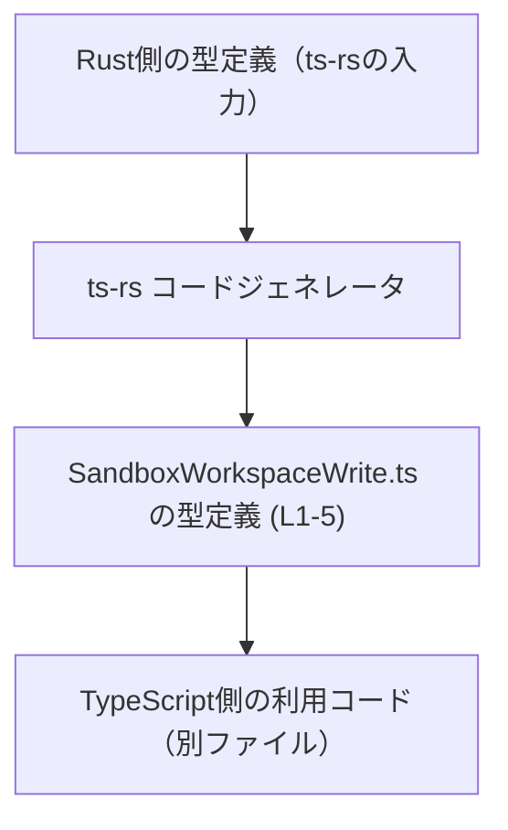
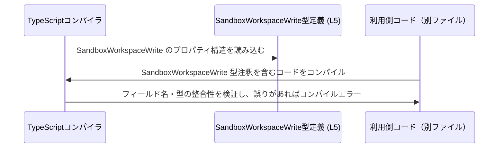

# `app-server-protocol\schema\typescript\v2\SandboxWorkspaceWrite.ts` コード解説

## 0. ざっくり一言

`SandboxWorkspaceWrite` という **サンドボックス用ワークスペースの書き込み設定らしきオブジェクト型** を 1 つだけエクスポートしている、自動生成の TypeScript 型定義ファイルです（`SandboxWorkspaceWrite.ts:L1-5`）。  
実行時のロジックは一切なく、**スキーマ（データ構造）だけ** を表現しています。

---

## 1. このモジュールの役割

### 1.1 概要

- このモジュールは、`SandboxWorkspaceWrite` という **オブジェクト型エイリアス** を定義・公開します（`SandboxWorkspaceWrite.ts:L5-5`）。
- ファイル先頭のコメントから、**Rust → TypeScript のコード生成ツール `ts-rs` によって自動生成されている** ことが分かります（`SandboxWorkspaceWrite.ts:L1-3`）。
- フィールドはすべてプリミティブ型（`Array<string>` と `boolean`）で構成され、**サンドボックス環境における書き込み可能なルートやフラグ設定** を表していると名前から解釈できます（ただし、用途は命名からの推測であり、このチャンクだけでは断定できません）。

### 1.2 アーキテクチャ内での位置づけ

- パス `app-server-protocol\schema\typescript\v2\` から、このファイルが **「app-server-protocol」の TypeScript スキーマ定義群** の一部であると把握できます（パスはユーザー入力より）。
- コメントより、このファイルは Rust 側の型定義から `ts-rs` により生成された **TypeScript 側の表現（ビュー）** です（`SandboxWorkspaceWrite.ts:L1-3`）。
- このファイル自体は **他のファイルを import しておらず**、逆に他ファイルから `SandboxWorkspaceWrite` 型として参照される前提の「純粋な型定義モジュール」です（`SandboxWorkspaceWrite.ts:L5-5`）。

概念的な位置づけを Mermaid 図で表すと、次のようになります（利用側コードは一般的なイメージであり、このチャンクから具体的なパスは分かりません）。



### 1.3 設計上のポイント

- **自動生成であることが明示**  
  - 「GENERATED CODE! DO NOT MODIFY BY HAND!」とあり、手動編集しない設計になっています（`SandboxWorkspaceWrite.ts:L1-1`）。
  - 「Do not edit this file manually.」と重ねて警告されており、変更は元の Rust 型定義側で行う前提です（`SandboxWorkspaceWrite.ts:L3-3`）。
- **データのみ・ロジックなし**  
  - `export type ... = { ... }` の 1 行だけで構成され、関数・クラス・メソッドはいっさいありません（`SandboxWorkspaceWrite.ts:L5-5`）。
- **状態とエラー／並行性**  
  - 実行時の状態や副作用をもつ処理はなく、**静的な型情報だけ** です。
  - エラー処理や並行処理（Promise、async/await など）は一切含まれていません（`SandboxWorkspaceWrite.ts:L1-5`）。
- **型安全性**  
  - すべてのフィールドに具体的な型 (`Array<string>`, `boolean`) が付いており、`any` や `unknown` は使われていません（`SandboxWorkspaceWrite.ts:L5-5`）。
  - これにより、利用側で誤ったプロパティ名や型を使うとコンパイル時にエラーになります。

---

## 2. 主要な機能一覧

このモジュールは **1 つの型定義のみ** を提供します。

- `SandboxWorkspaceWrite` 型エイリアス:  
  サンドボックス用ワークスペースの書き込み設定に関するオブジェクトの構造を表す型（型名・フィールド名からの解釈）。  
  （`SandboxWorkspaceWrite.ts:L5-5`）

---

## 3. 公開 API と詳細解説

### 3.1 型一覧（構造体・列挙体など）

このファイルの「コンポーネントインベントリー」です。

| 名前                    | 種別                         | 主なフィールド                                                                                                             | 役割 / 用途（解釈）                                                                                                                                                    | 定義位置                     |
|-------------------------|------------------------------|---------------------------------------------------------------------------------------------------------------------------|------------------------------------------------------------------------------------------------------------------------------------------------------------------------|------------------------------|
| `SandboxWorkspaceWrite` | 型エイリアス（オブジェクト） | - `writable_roots: Array<string>`<br>- `network_access: boolean`<br>- `exclude_tmpdir_env_var: boolean`<br>- `exclude_slash_tmp: boolean` | サンドボックス環境における「書き込み可能ディレクトリ」や「ネットワークアクセス」などのフラグをまとめた設定オブジェクトと解釈できる（命名からの推測）。 | `SandboxWorkspaceWrite.ts:L5-5` |

#### 各フィールドの意味（名前からの推測）

※ 以下は **フィールド名からの一般的な解釈** であり、実際の振る舞いはこのチャンクからは断定できません。

- `writable_roots: Array<string>`（`SandboxWorkspaceWrite.ts:L5-5`）  
  - 書き込みが許可されているルートパス（ディレクトリパスなど）の一覧を表す文字列配列と解釈できます。
- `network_access: boolean`（`SandboxWorkspaceWrite.ts:L5-5`）  
  - サンドボックス内からネットワークアクセスを許可するかどうかのフラグと解釈できます。
- `exclude_tmpdir_env_var: boolean`（`SandboxWorkspaceWrite.ts:L5-5`）  
  - 環境変数 `TMPDIR` に対応するディレクトリを「書き込み対象から除外する」かどうかのフラグと解釈できます。
- `exclude_slash_tmp: boolean`（`SandboxWorkspaceWrite.ts:L5-5`）  
  - 典型的な一時ディレクトリ `/tmp` を「書き込み対象から除外する」かどうかのフラグと解釈できます。

#### この型が提供する「契約」（Contracts）

この型を使う関数やモジュールが前提としうる契約（インターフェース）は次の通りです（`SandboxWorkspaceWrite.ts:L5-5`）。

- すべてのプロパティは **必須**  
  - `?` が付いていないため、省略は許されず、`writable_roots` などを欠いたオブジェクトは `SandboxWorkspaceWrite` として扱えません。
- プロパティ名は固定  
  - `writableRoots` のようなキャメルケースや別名ではなく、**正確に** `writable_roots` などの名前を使う必要があります。
- 型は厳密  
  - `writable_roots` は必ず `Array<string>`（`string[]`）であり、単なる `string` や `number[]` は許されません。
  - `network_access` などの 3 つのフラグは、`boolean` 以外（`"true"` などの文字列）はコンパイルエラーになります。

#### Edge cases（エッジケース）

型レベルで許されているが、意味的に注意が必要そうなケースを挙げます（挙動自体は利用側ロジック次第であり、このチャンクからは分かりません）。

- `writable_roots` が空配列 `[]` の場合  
  - 型的には合法ですが、「どこにも書き込めない」状態を意味するかもしれません。
- 3 つの boolean フラグの組み合わせ  
  - すべて `false` / すべて `true` といった組合せも型上は許されます。  
    どの組み合わせが有効（あるいは矛盾）かは、このファイルからは判断できません。
- `writable_roots` 内の文字列の形式  
  - パス形式（絶対 / 相対）や存在チェックなどは TypeScript の型では表現されておらず、ランタイムのチェックに委ねられます。

### 3.2 関数詳細（最大 7 件）

このファイルには **関数定義は存在しません**。

- `function` 宣言、アロー関数、メソッド定義などは一切含まれていません（`SandboxWorkspaceWrite.ts:L1-5`）。
- そのため、関数に対するエラー条件・並行性・アルゴリズムはこのチャンクには存在しません。

### 3.3 その他の関数

同様に、補助的な関数やラッパー関数も定義されていません（`SandboxWorkspaceWrite.ts:L1-5`）。

---

## 4. データフロー

このファイルは **型定義だけ** を含むため、実行時の処理フローや関数呼び出し関係はありません。  
ここでは、TypeScript のコンパイル時にこの型がどのように使われるかを **静的なデータフロー** として概念的に示します。



> このシーケンス図は **TypeScript の一般的な振る舞い** を表したものであり、  
> 実際にどのファイルが `SandboxWorkspaceWrite` を利用しているかは、このチャンクからは分かりません。

---

## 5. 使い方（How to Use）

この節のコード例は、**この型の一般的な使い方を示す仮想的な例** です。  
実際の import パスや利用箇所は、このチャンクからは分かりません。

### 5.1 基本的な使用方法

`SandboxWorkspaceWrite` 型の値を作成して利用する基本的な例です。

```typescript
// SandboxWorkspaceWrite 型を同一ディレクトリからインポートする例
// 実際のパスはプロジェクト構成によって異なります。
import type { SandboxWorkspaceWrite } from "./SandboxWorkspaceWrite";

// SandboxWorkspaceWrite 型の設定オブジェクトを定義する
const config: SandboxWorkspaceWrite = {
    writable_roots: ["/project", "/data"],   // 書き込みを許可するルートパスの一覧（string[]）
    network_access: false,                   // ネットワークアクセスを禁止
    exclude_tmpdir_env_var: true,           // TMPDIR を書き込み対象から除外（名前からの推測）
    exclude_slash_tmp: true,                // /tmp を書き込み対象から除外（名前からの推測）
};

// 以降、config を使ってサンドボックスの設定を行う、などの利用が想定されます。
// 具体的な処理はこのチャンクには現れません。
```

TypeScript の型システムにより、次のような誤りはコンパイル時に検出されます。

### 5.2 よくある使用パターン（想定される形）

あくまで一般的なパターンとして、以下のような使い方が考えられます。

1. **関数の引数として設定を受け取る**

```typescript
import type { SandboxWorkspaceWrite } from "./SandboxWorkspaceWrite";

// SandboxWorkspaceWrite 型の設定を受け取って何らかの処理を行う関数
function setupSandbox(config: SandboxWorkspaceWrite) {
    // config.writable_roots や config.network_access などを使って
    // サンドボックスの環境構築を行う、という利用が考えられます。
}
```

1. **API レスポンスや設定ファイルの型として使う**

```typescript
import type { SandboxWorkspaceWrite } from "./SandboxWorkspaceWrite";

// 例: 設定のロード結果を SandboxWorkspaceWrite 型として扱う
async function loadConfig(): Promise<SandboxWorkspaceWrite> {
    const raw = await fetch("/sandbox-config.json").then(res => res.json());
    // 型レベルでは raw が SandboxWorkspaceWrite の形をしていることを期待する
    return raw as SandboxWorkspaceWrite; // 実際の検証は別途必要
}
```

> 上記は **利用イメージ** であり、実際にこのプロジェクトでこのような関数が存在するかどうかは、このチャンクからは分かりません。

### 5.3 よくある間違い

TypeScript の型エラーになりそうな典型例を、正しい例と対比して示します。

```typescript
import type { SandboxWorkspaceWrite } from "./SandboxWorkspaceWrite";

// 間違い例: 型定義と合致しないオブジェクト
const badConfig: SandboxWorkspaceWrite = {
    writable_roots: "/project",   // ❌ string になっている（本来は string[]）
    network_access: "true",       // ❌ string になっている（本来は boolean）
    // exclude_tmpdir_env_var が欠けている（本来は必須）
    exclude_slash_tmp: false,
};

// 正しい例: 型定義に完全に一致する
const goodConfig: SandboxWorkspaceWrite = {
    writable_roots: ["/project"], // ✅ string[]
    network_access: true,         // ✅ boolean
    exclude_tmpdir_env_var: false,
    exclude_slash_tmp: false,
};
```

### 5.4 使用上の注意点（まとめ）

この型を安全に利用するうえでのポイントをまとめます。

- **自動生成ファイルを直接編集しない**  
  - ファイル先頭に「DO NOT MODIFY BY HAND」「Do not edit this file manually」とあり（`SandboxWorkspaceWrite.ts:L1-3`）、  
    このファイルを直接変更すると、再生成時に上書きされるうえ、Rust 側の定義との不整合を招きます。
- **すべてのプロパティは必須**  
  - `SandboxWorkspaceWrite` を使う側は、`writable_roots` など 4 つのプロパティをすべて埋める必要があります（`SandboxWorkspaceWrite.ts:L5-5`）。
- **型で表現されない制約に注意**  
  - `writable_roots` の要素が有効なパスかどうか、フラグの組合せが矛盾していないか、といった制約は TypeScript 型だけでは表現されません。
  - これらは **利用側のバリデーションロジック** に依存します（このチャンクには現れません）。
- **潜在的なバグ／セキュリティ観点（一般論）**  
  - 型名やフィールド名から、この型がサンドボックスの書き込み権限に関係している可能性がありますが、これは命名に基づく推測です。
  - 一般論として、この種の設定を誤って扱うと、「本来書き込めるべきでないディレクトリへの書き込み」や「不要なネットワークアクセス許可」など、セキュリティ上の問題になり得ます。
  - 実際のリスクや制御ロジックは、このファイルでは分からないため、**利用側実装のレビューが重要** です。

---

## 6. 変更の仕方（How to Modify）

### 6.1 新しい機能を追加する場合

このファイルは `ts-rs` によって自動生成されているため（`SandboxWorkspaceWrite.ts:L1-3`）、**直接編集して新しいフィールドを追加するべきではありません**。

一般的な手順は次のようになります（元の Rust ファイルのパスはこのチャンクからは不明です）。

1. **Rust 側の元となる型定義を特定する**  
   - `SandboxWorkspaceWrite` に対応する Rust 構造体や型（`struct` など）を探します。  
     通常は `ts-rs` の属性（例: `#[ts(export)]`）が付いていますが、これは一般的な説明であり、このプロジェクトの具体的なコードはこのチャンクからは分かりません。
2. **Rust 側の型にフィールドを追加・変更する**  
   - 例: 新しいフラグや設定値を追加する。
3. **`ts-rs` を再実行して TypeScript を再生成する**  
   - ビルドスクリプトやコマンド（`cargo build` など）を実行して、`SandboxWorkspaceWrite.ts` を再生成します。
4. **TypeScript 側の利用箇所を更新する**  
   - 追加されたフィールドを利用したり、既存コードを新しいスキーマに対応させます。

### 6.2 既存の機能を変更する場合

既存フィールドの名前や型を変える場合も、**必ず元の Rust 型定義側で変更する** 必要があります（`SandboxWorkspaceWrite.ts:L1-3`）。

変更時の注意点（一般論）:

- **影響範囲の確認**  
  - フィールド名や型を変更すると、`SandboxWorkspaceWrite` を使っているすべての TypeScript コードに影響します。
- **契約（インターフェース）の維持**  
  - 利用側が `writable_roots` という名前と `string[]` 型を前提にしているなら、これを変更することは API 互換性の破壊につながります。
- **テストの見直し**  
  - このファイルにはテストコードは含まれていませんが（`SandboxWorkspaceWrite.ts:L1-5`）、  
    型変更に合わせて、利用側のテスト（存在すれば）を更新し、設定の読み込み／適用ロジックが期待通り動くか確認する必要があります。

---

## 7. 関連ファイル

このチャンクから直接参照関係が分かるファイルはありませんが、論理的に関連が想定されるファイル種別を整理します（パスは不明なものがあります）。

| パス / 種別                            | 役割 / 関係                                                                                         |
|----------------------------------------|------------------------------------------------------------------------------------------------------|
| （Rust 側 ts-rs 生成元ファイル・パス不明） | `SandboxWorkspaceWrite` 型の元となる Rust の型定義を持つファイル。`ts-rs` がここから本ファイルを生成する（`SandboxWorkspaceWrite.ts:L1-3`）。 |
| TypeScript 利用側ファイル（パス不明）     | `import type { SandboxWorkspaceWrite } ...` のように本型を参照し、サンドボックス設定を利用するコード。  |
| `app-server-protocol\schema\typescript\v2\*.ts`（推測） | 同じディレクトリ配下の他のスキーマ定義ファイル群。プロトコル全体のスキーマを構成していると考えられますが、具体的な内容はこのチャンクには現れません。 |

> まとめると、このファイルは **Rust 側の型定義と TypeScript 側の利用コードの橋渡しとなる「自動生成スキーマ」** であり、  
> 実際のビジネスロジックやエラー・並行性の扱いは、すべて別ファイルに存在します。
