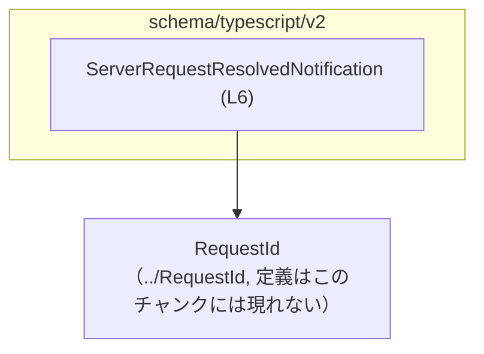
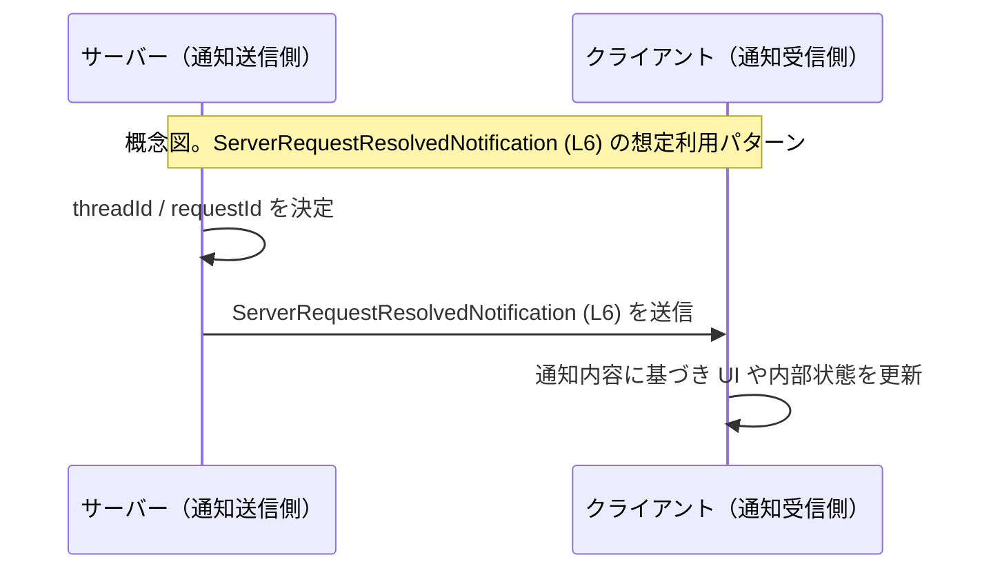

# app-server-protocol/schema/typescript/v2/ServerRequestResolvedNotification.ts コード解説

## 0. ざっくり一言

`ServerRequestResolvedNotification` 型は、スレッド ID とリクエスト ID をまとめた通知メッセージのスキーマを TypeScript で表現するための定義です（`ServerRequestResolvedNotification.ts:L6-6`）。  
ファイル全体は `ts-rs` により自動生成されており、手動で編集しない前提になっています（`ServerRequestResolvedNotification.ts:L1-3`）。

---

## 1. このモジュールの役割

### 1.1 概要

- このモジュールは、TypeScript クライアント側で利用する **「サーバーリクエスト解決通知」メッセージの型情報** を提供します（`ServerRequestResolvedNotification.ts:L6-6`）。
- フィールドは `threadId: string` と `requestId: RequestId` の 2 つで、どちらも必須プロパティです（`ServerRequestResolvedNotification.ts:L6-6`）。
- ファイルは `ts-rs` により自動生成されているため、手動編集ではなく **生成元スキーマの変更** によって更新される設計です（`ServerRequestResolvedNotification.ts:L1-3`）。

### 1.2 アーキテクチャ内での位置づけ

このファイルは、TypeScript 向けスキーマ群（`schema/typescript/v2`）の一部として、他の型から参照される「通知ペイロード型」を提供していると解釈できます。

- 依存関係（このチャンクから読み取れる範囲）:
  - 依存している型:
    - `RequestId`（`../RequestId` からの型インポート、`ServerRequestResolvedNotification.ts:L4-4`）
  - 依存されている側（この型を使うコード）はこのチャンクには現れないため不明です。

Mermaid による簡易依存関係図（概念図・ノード数を絞っています）:



- `SRRN` ノードが本ファイルのエクスポート型 `ServerRequestResolvedNotification` を表します（`ServerRequestResolvedNotification.ts:L6-6`）。
- `RequestId` の具体的な構造や定義場所（ファイルパス）は、このチャンクには現れません（`ServerRequestResolvedNotification.ts:L4-4` からインポート名のみ判明）。

### 1.3 設計上のポイント

コードから読み取れる特徴は次のとおりです。

- **自動生成コード**  
  - 先頭コメントに「GENERATED CODE」「Do not edit this file manually」と明記されています（`ServerRequestResolvedNotification.ts:L1-3`）。
  - ts-rs（Rust 用の TypeScript バインディング生成ツール）によって生成されるとコメントされています（`ServerRequestResolvedNotification.ts:L3-3`）。

- **状態を持たない純粋な型定義**  
  - クラスや関数、実行時ロジックは一切含まず、`export type` による型エイリアス 1 つだけが定義されています（`ServerRequestResolvedNotification.ts:L6-6`）。
  - ランタイムの副作用や共有状態を持ちません。

- **型のみの依存関係**  
  - `import type { RequestId }` と `type` 修飾子付きインポートが使用されており（`ServerRequestResolvedNotification.ts:L4-4`）、ランタイムにはこの依存が現れない設計です。
  - これはバンドルサイズの削減や循環依存の回避に有利です。

- **必須プロパティのみ**  
  - `threadId` と `requestId` に `?` が付いておらず、両方とも必須プロパティです（`ServerRequestResolvedNotification.ts:L6-6`）。
  - TypeScript レベルで「どちらかが欠けたオブジェクト」はコンパイルエラーとなる設計です。

- **エラー／並行性に関するロジックは未定義**  
  - このファイルにはエラーハンドリングや非同期処理、並行性制御に関するコードはありません（`ServerRequestResolvedNotification.ts:L1-6` 全体）。

---

## 2. 主要な機能一覧（コンポーネントインベントリー）

このファイルは 1 つの公開型のみを提供します。

- `ServerRequestResolvedNotification`:  
  サーバー側の「リクエストが解決された」ことを表す通知ペイロードの構造を定義する TypeScript 型エイリアスです（`ServerRequestResolvedNotification.ts:L6-6`）。  
  - `threadId: string` — 通知対象のスレッド識別子
  - `requestId: RequestId` — 対象リクエストの識別子（具体的な型は `../RequestId` に定義。構造はこのチャンクには現れない）

---

## 3. 公開 API と詳細解説

### 3.1 型一覧（構造体・列挙体など）

このファイルに定義されている型の一覧です。

| 名前                             | 種別        | 役割 / 用途                                                                 | 定義位置                                                     |
|----------------------------------|-------------|-----------------------------------------------------------------------------|--------------------------------------------------------------|
| `ServerRequestResolvedNotification` | 型エイリアス | サーバーリクエスト解決通知メッセージのペイロード構造を表すオブジェクト型 | `schema/typescript/v2/ServerRequestResolvedNotification.ts:L6-6` |

#### `ServerRequestResolvedNotification` のフィールド

| フィールド名 | 型        | 必須 | 説明                                                                                         | 定義位置                                                     |
|--------------|-----------|------|----------------------------------------------------------------------------------------------|--------------------------------------------------------------|
| `threadId`   | `string`  | 必須 | 対象スレッドを一意に識別する文字列。文字列形式であることのみがこのチャンクから読み取れます。 | `schema/typescript/v2/ServerRequestResolvedNotification.ts:L6-6` |
| `requestId`  | `RequestId` | 必須 | 対象リクエストの識別子。`RequestId` の具体的な構造は `../RequestId` にあり、このチャンクには現れません。 | `schema/typescript/v2/ServerRequestResolvedNotification.ts:L4-6` |

> `RequestId` は `import type` でインポートされているため、**コンパイル時型チェック専用の依存**であり、JavaScript 出力には現れない点が特徴です（`ServerRequestResolvedNotification.ts:L4-4`）。

### 3.2 関数詳細

このファイルには **関数・メソッド・クラスは一切定義されていません**（`ServerRequestResolvedNotification.ts:L1-6`）。  
そのため、「関数詳細テンプレート」を適用すべき対象は存在しません。

- エラー処理、例外送出、非同期処理などの **実行時ロジックはゼロ** であり、純粋な型定義ファイルです。

### 3.3 その他の関数

- 補助関数やラッパー関数も存在しません（`ServerRequestResolvedNotification.ts:L1-6`）。

---

## 4. データフロー

このファイルにはデータフローそのものを表すコード（関数呼び出しや送受信処理）は含まれていませんが、  
型名・配置から想定される利用イメージとして、「サーバーが通知を生成し、クライアントが受信・処理する」流れが考えられます。  
以下は **概念図** であり、実際の実装はこのチャンクには現れません。



- `ServerRequestResolvedNotification (L6)` というラベルは、`export type ServerRequestResolvedNotification` の定義位置を指しています（`ServerRequestResolvedNotification.ts:L6-6`）。
- 実際にどのコンポーネントがこの型を利用しているか（具体的な関数名・ファイル名など）は、このチャンクには現れません。

---

## 5. 使い方（How to Use）

### 5.1 基本的な使用方法

この型を利用した、最小限の TypeScript コード例です。  
`RequestId` の実体はこのチャンクからは分からないため、例では簡略化した `RequestId` 型を用いています。

```typescript
// 実際のプロジェクトでは "../RequestId" から RequestId をインポートする。
// このチャンクにはその定義が現れないため、例として簡略な型を置いている。
type RequestId = string;

// ServerRequestResolvedNotification 型を定義（本ファイルの型定義と同等のサンプル）
export type ServerRequestResolvedNotification = {
    threadId: string;   // スレッド識別子（必須）
    requestId: RequestId; // リクエスト識別子（必須）
};

// 通知を受け取って処理する関数の例
function handleResolvedNotification(
    notification: ServerRequestResolvedNotification, // 型安全にフィールドへアクセス可能
): void {
    console.log(
        `Thread ${notification.threadId} resolved request ${notification.requestId}`,
    );
}

// 通知オブジェクトを構築して関数に渡す例
const notification: ServerRequestResolvedNotification = {
    threadId: "thread-123",           // string 型
    requestId: "request-456" as RequestId, // RequestId 型
};

handleResolvedNotification(notification);
```

この例から分かるポイント:

- `threadId` / `requestId` が **必須プロパティ** であるため、どちらかを省略すると TypeScript コンパイラがエラーを検出します。
- IDE で `notification.` と入力すると、両フィールドが候補として表示されるなど、型アノテーションによる支援が得られます。

### 5.2 よくある使用パターン

1. **イベントハンドラのペイロード型として使う**

```typescript
type RequestId = string; // 実際の定義は ../RequestId に依存

type ServerRequestResolvedNotification = {
    threadId: string;
    requestId: RequestId;
};

function onMessageReceived(raw: unknown) {
    // ここで JSON パースやバリデーションを行い、
    // ServerRequestResolvedNotification 型であることを確認してから処理する、というパターンが想定されます。
    // （実際のバリデーション処理はこのチャンクには現れません）
}
```

1. **状態ストアに保存するレコード型として使う**

```typescript
type ServerRequestResolvedNotification = {
    threadId: string;
    requestId: RequestId;
};

// threadId ごとに、最後に解決したリクエスト ID を記録する例
const lastResolvedByThread: Map<string, RequestId> = new Map();

function updateLastResolved(
    notification: ServerRequestResolvedNotification,
) {
    lastResolvedByThread.set(notification.threadId, notification.requestId);
}
```

### 5.3 よくある間違い

この型に関して起こり得る誤用例と正しい例を示します。

```typescript
type RequestId = string;
type ServerRequestResolvedNotification = {
    threadId: string;
    requestId: RequestId;
};

// 間違い例: 必須プロパティを省略している
const badNotification1: ServerRequestResolvedNotification = {
    // threadId がない => TypeScript コンパイルエラー
    requestId: "req-1",
};

// 間違い例: プロパティ名のスペルミス
const badNotification2: ServerRequestResolvedNotification = {
    threadID: "thread-1", // threadId ではない => 余計なプロパティ扱い & 必須フィールド不足
    requestId: "req-1",
};

// 正しい例: 両方の必須フィールドを正しい名前で指定
const goodNotification: ServerRequestResolvedNotification = {
    threadId: "thread-1",
    requestId: "req-1",
};
```

**注意**:

- 実行時に外部から JSON を受け取る場合、TypeScript の型だけではプロパティの不足や型不一致を防げないため、  
  別途ランタイムバリデーション（`zod` など）を組み合わせる必要があることが多いです。  
  そのようなバリデーション処理は、このチャンクには現れません。

### 5.4 使用上の注意点（まとめ）

- **自動生成ファイルを直接編集しない**  
  - 先頭コメントにある通り、このファイルは ts-rs により生成されるため、手動編集は想定されていません（`ServerRequestResolvedNotification.ts:L1-3`）。
  - 変更が必要な場合は **生成元スキーマ（例: Rust 側の構造体定義など）を更新** する必要があります（生成元の場所はこのチャンクには現れません）。

- **必須フィールドの保証**  
  - TypeScript 上では `threadId` / `requestId` が必須であるため、これらを欠くオブジェクトを渡すとコンパイルエラーになります（`ServerRequestResolvedNotification.ts:L6-6`）。
  - ただし実行時の JSON データでは欠けている可能性があるため、必要ならランタイムチェックを組み合わせる必要があります。

- **並行性・エラー処理は別レイヤーの責務**  
  - この型は単なるデータ構造であり、並行処理やエラーハンドリングは別コンポーネントが担います（`ServerRequestResolvedNotification.ts:L1-6`）。

- **セキュリティ上の注意**  
  - `threadId` / `requestId` の値が外部入力（ユーザーや外部サービス）に由来する場合、ログへの出力や UI 表示の際には、情報漏えいや XSS などへの配慮が必要です。
  - これらの値の検証・サニタイズ処理は、このチャンクには実装されていません。

---

## 6. 変更の仕方（How to Modify）

### 6.1 新しい機能を追加する場合

このファイルは自動生成されるため、**直接この TypeScript ファイルを変更するのは前提に反します**（`ServerRequestResolvedNotification.ts:L1-3`）。

新しいフィールドや通知項目を追加したい場合の一般的な手順（コメントから推測できる範囲）:

1. **生成元スキーマの変更**  
   - コメントに ts-rs の URL が記載されていることから（`ServerRequestResolvedNotification.ts:L3-3`）、  
     Rust 等の言語側で `ts-rs` 対応の型定義（構造体など）が存在し、それがソースになっていると考えられます。
   - その生成元の型に新しいフィールドを追加します。  
     （生成元ファイルのパスや構造はこのチャンクには現れないため不明です。）

2. **コード生成の再実行**  
   - プロジェクト固有のビルド・生成コマンド（例: `cargo test` や専用スクリプト）を実行し、  
     TypeScript スキーマを再生成します。具体的なコマンドはこのチャンクには現れません。

3. **利用側コードの更新**  
   - 新フィールドを利用するクライアントコードで、型エラーを解消する形でアクセスを追加します。

### 6.2 既存の機能を変更する場合

`threadId` や `requestId` の型や意味を変更する際の注意点:

- **影響範囲の特定**  
  - `ServerRequestResolvedNotification` を参照しているすべての TypeScript ファイル（ハンドラ、ストア、UI コンポーネントなど）が影響を受けます。  
    具体的な参照箇所はこのチャンクには現れませんが、IDE の「型参照検索」等で調べるのが一般的です。

- **契約（Protocol）の維持**  
  - この型はプロトコル（サーバーとクライアント間の契約）の一部と考えられるため、フィールド名や意味の変更は互換性に注意が必要です。
  - 既存クライアントとの互換性を壊す場合は、バージョン番号（`v2` ディレクトリ名）を上げるなど、別スキーマとして定義する設計も考えられます。  
    ただし、そのバージョニング戦略自体はこのチャンクからは読み取れません。

- **テストの確認**  
  - 変更後は、通知を送受信する統合テストや型チェックが通ることを確認する必要があります。  
    テストコードはこのチャンクには現れません。

---

## 7. 関連ファイル

このモジュールと密接に関係すると思われるファイル・コンポーネントです。

| パス / 名前                                      | 役割 / 関係                                                                                     | 根拠 |
|-------------------------------------------------|--------------------------------------------------------------------------------------------------|------|
| `schema/typescript/RequestId`（../RequestId）   | `RequestId` 型の定義を提供し、本ファイルから `import type` で参照されている。具体的な構造は不明。 | `ServerRequestResolvedNotification.ts:L4-4` |
| ts-rs 生成元（Rust 等の型定義、パス不明）      | コメントに ts-rs の URL があることから、このファイルを生成する元となるスキーマが存在すると推測される。 | `ServerRequestResolvedNotification.ts:L3-3` |

> 上記のうち、`../RequestId` の実体や ts-rs の生成元ファイルの場所・内容は **このチャンクには現れません**。  
> 必要に応じてリポジトリ全体を検索し、定義元や生成設定を確認する必要があります。

---

以上が、`app-server-protocol/schema/typescript/v2/ServerRequestResolvedNotification.ts` のコードから読み取れる範囲での解説と、実務上の利用・変更のためのガイドです。
