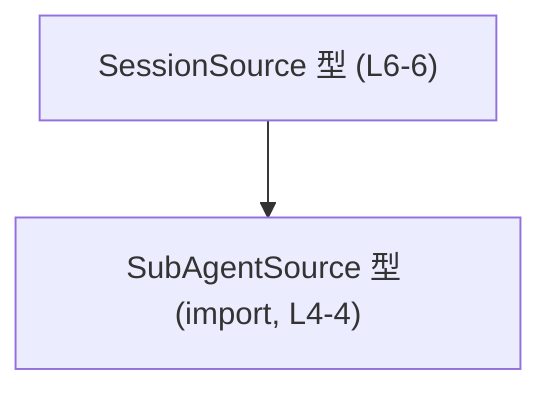
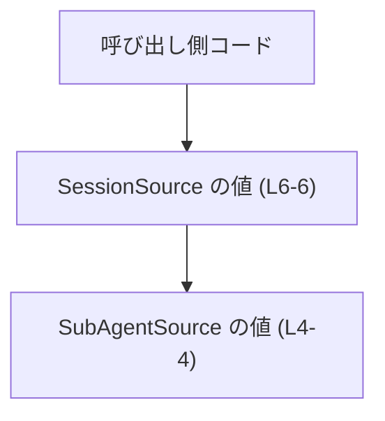
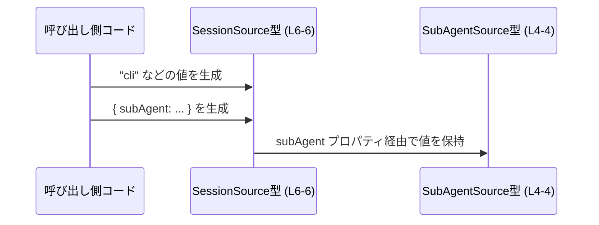

# app-server-protocol/schema/typescript/v2/SessionSource.ts コード解説

## 0. ざっくり一言

このファイルは、**セッションの発生元（source）を表す TypeScript のユニオン型 `SessionSource` を定義する自動生成コード**です（SessionSource.ts:L1-3, L6）。

---

## 1. このモジュールの役割

### 1.1 概要

- このモジュールは、`SessionSource` という型エイリアスを定義し、**セッションがどこから来たのかを表現するための定型的な値集合**を提供しています（SessionSource.ts:L6）。
- 型は文字列リテラルとオブジェクトのユニオンで構成され、`SubAgentSource` 型に依存したバリアントも含まれます（SessionSource.ts:L4, L6）。
- 冒頭コメントから、このファイルは **Rust 側の型定義から ts-rs により自動生成される成果物**であり、直接編集しないことが明示されています（SessionSource.ts:L1-3）。

### 1.2 アーキテクチャ内での位置づけ

このモジュールの依存関係は非常にシンプルです。

- 依存するもの
  - `SubAgentSource` 型（相対パス `"../SubAgentSource"` からインポート）（SessionSource.ts:L4）
- 提供するもの
  - `export type SessionSource = ...` による公開型エイリアス（SessionSource.ts:L6）

これを簡略な依存関係図で表すと次のようになります。



この図は、「`SessionSource` が `SubAgentSource` に依存している」という型レベルの関係のみを表現しています。

### 1.3 設計上のポイント

コードから読み取れる設計上の特徴は次のとおりです。

- **自動生成コード**  
  - 冒頭コメントで `// GENERATED CODE! DO NOT MODIFY BY HAND!` と ts-rs による生成元が明示されています（SessionSource.ts:L1-3）。
  - 変更は元の Rust 型定義側で行う前提の設計です。

- **データのみ（状態レス）**  
  - 関数やクラスは一切なく、`type` エイリアスのみを定義しているため、状態やロジックを持ちません（SessionSource.ts:L6）。
  - 実行時オーバーヘッドはなく、コンパイル時の型チェック専用のモジュールです。

- **文字列リテラル + オブジェクトのユニオン型**  
  - `"cli" | "vscode" | "exec" | "appServer" | "unknown"` という文字列リテラルと、  
    `{ "custom": string }`・`{ "subAgent": SubAgentSource }` というオブジェクト型をまとめたユニオンです（SessionSource.ts:L6）。
  - TypeScript の **判別可能ユニオン型**として扱いやすい形になっています（`"custom"` や `"subAgent"` というキーが判別子として使えます）。

- **拡張用バリアント**  
  - 任意文字列を保持できる `"custom"` プロパティ付きオブジェクトが含まれており、定義済みの文字列リテラル以外のソースを表現する余地が用意されています（SessionSource.ts:L6）。
  - 不明なソースを扱うためと思われる `"unknown"` も型として許可されています（SessionSource.ts:L6）。

---

## 2. 主要な機能一覧

このファイルは関数を持たないため、「機能」はすべて型レベルの表現です。

- `SessionSource` 型: セッションのソースを、決められた文字列リテラルまたはオブジェクトとして表現するユニオン型（SessionSource.ts:L6）
  - CLI 由来を示す `"cli"`
  - VS Code 由来を示す `"vscode"`
  - 任意のコマンド実行などを示す `"exec"`
  - アプリケーションサーバー由来を示す `"appServer"`
  - 任意の文字列を持つ `{ "custom": string }`
  - サブエージェント由来を示す `{ "subAgent": SubAgentSource }`（SubAgentSource は別ファイル）
  - 不明なソースを示す `"unknown"`

いずれも型レベルの選択肢であり、実行時処理はこのファイルには含まれません。

---

## 3. 公開 API と詳細解説

### 3.1 型一覧（構造体・列挙体など）

このファイルに現れる型の一覧です。

| 名前             | 種別             | 定義/参照 | 役割 / 用途 | 根拠 |
|------------------|------------------|-----------|------------|------|
| `SessionSource`  | 型エイリアス（ユニオン型） | 定義      | セッションのソースを文字列リテラルまたはオブジェクトで表現するための公開型 | SessionSource.ts:L6-6 |
| `SubAgentSource` | 型（詳細不明）   | 参照のみ  | `SessionSource` の `subAgent` バリアントで利用される型。実際の定義は `../SubAgentSource` に存在し、このファイルには含まれません。 | SessionSource.ts:L4-4 |

> `SubAgentSource` の構造や意味はこのチャンクには現れないため、詳細は不明です。

### 3.2 関数詳細

このファイルには **関数・メソッドは一切定義されていません**（SessionSource.ts:L1-6）。  
したがって、関数の詳細テンプレートに基づく解説対象はありません。

### 3.3 その他の関数

- 該当なし（ヘルパー関数やラッパー関数も定義されていません）。

---

## 4. データフロー

このファイルは型定義のみを提供しますが、**型レベルの依存関係**と、想定される利用イメージを簡潔に整理します。

### 4.1 型レベルのデータ依存

`SessionSource` の一部バリアントは `SubAgentSource` 型を内包します（SessionSource.ts:L4, L6）。



- 呼び出し側コードは `SessionSource` 型の値を生成します（例: `"cli"` や `{ subAgent: someSubAgentSource }`）。
- `{ "subAgent": SubAgentSource }` バリアントの場合、その内部に `SubAgentSource` 型の値が存在します。

### 4.2 利用イメージのシーケンス（概念図）

以下は、**あくまで典型的な利用イメージ**を示す概念図であり、このファイル内のコードから直接導かれた呼び出しではありません。



---

## 5. 使い方（How to Use）

### 5.1 基本的な使用方法

`SessionSource` 型を変数や関数の引数として利用し、**セッションのソースを限定された選択肢として扱う**形が想定されます。

以下のサンプルでは、`SubAgentSource` を簡略化したダミー定義を置いています（実コードでは `../SubAgentSource` からインポートする想定です）。

```typescript
// ダミーの SubAgentSource 定義（実際の定義とは異なる可能性があります）
type SubAgentSource = "subAgentA" | "subAgentB";

// SessionSource 型（SessionSource.ts:L6 と同等の定義を例として再掲）
type SessionSource =
  | "cli"                      // CLI からのセッション
  | "vscode"                   // VS Code からのセッション
  | "exec"                     // コマンド実行由来
  | "appServer"                // アプリケーションサーバー由来
  | { custom: string }         // カスタムソース
  | { subAgent: SubAgentSource } // サブエージェント由来
  | "unknown";                 // 不明なソース

// 基本的な使い方の例
const s1: SessionSource = "cli";                      // 文字列リテラルのバリアント
const s2: SessionSource = { custom: "scheduledJob" }; // カスタムソース
const s3: SessionSource = { subAgent: "subAgentA" };  // サブエージェントソース
const s4: SessionSource = "unknown";                  // 不明ソース
```

- `"cli"` や `"vscode"` 以外の任意文字列（例: `"web"`）を直接代入するとコンパイルエラーになります。
- `{ custom: string }` と `{ subAgent: SubAgentSource }` 以外のオブジェクト構造もコンパイルエラーになります。  
  これらは TypeScript のユニオン型と構造的部分型の仕組みによるものです（SessionSource.ts:L6）。

### 5.2 よくある使用パターン

#### パターン 1: セッションソースによる分岐処理

ユニオン型を活かし、`switch` 文や if 文でセッションソースに応じた処理を分けられます。

```typescript
function handleSession(source: SessionSource) {                     // source は SessionSource 型
  if (source === "cli") {                                           // 文字列リテラルのバリアント
    // CLI からのセッションに対する処理
  } else if (source === "vscode") {
    // VS Code からのセッションに対する処理
  } else if (typeof source === "object" && "custom" in source) {    // custom バリアント
    // カスタムソースの場合の処理
    const name = source.custom;
  } else if (typeof source === "object" && "subAgent" in source) {  // subAgent バリアント
    // サブエージェント由来の処理
    const sub = source.subAgent;
  } else if (source === "unknown") {
    // 不明ソースの場合の処理
  }
}
```

- オブジェクトバリアントは `"custom"` や `"subAgent"` のキー存在チェックで判別できます（SessionSource.ts:L6）。

#### パターン 2: 判別可能ユニオンとしての exhaustiveness チェック

TypeScript の `never` を用いて、全バリアントが処理されているか検査できます。

```typescript
function assertNever(x: never): never {
  throw new Error("Unexpected SessionSource variant: " + String(x));
}

function handleSessionExhaustive(source: SessionSource) {
  if (source === "cli") {
    // ...
  } else if (source === "vscode") {
    // ...
  } else if (source === "exec") {
    // ...
  } else if (source === "appServer") {
    // ...
  } else if (typeof source === "object" && "custom" in source) {
    // ...
  } else if (typeof source === "object" && "subAgent" in source) {
    // ...
  } else if (source === "unknown") {
    // ...
  } else {
    // SessionSource の定義に変更が入ったときにここで検出可能
    assertNever(source);
  }
}
```

### 5.3 よくある間違い

```typescript
// 間違い例: 許可されていない文字列リテラル
// const bad: SessionSource = "web";         // コンパイルエラー: 型 '"web"' を割り当てられません

// 正しい例: custom バリアントとして包む
const ok: SessionSource = { custom: "web" };  // 許可されたオブジェクトバリアント
```

```typescript
// 間違い例: オブジェクト構造が不正
// const bad2: SessionSource = { type: "cli" }; // エラー: { type: string } は SessionSource と互換性がない

// 正しい例: 定義済みの文字列リテラルを使う
const ok2: SessionSource = "cli";
```

### 5.4 使用上の注意点（まとめ）

- **自動生成ファイルを直接編集しない**  
  - 冒頭コメントに「Do not edit this file manually」とあるため、手動編集は再生成で上書きされます（SessionSource.ts:L1-3）。

- **Runtime のバリデーションが別途必要**  
  - `SessionSource` はコンパイル時の型制約のみを提供します。  
    外部入力（JSON など）から値を受け取る場合は、`"cli"` 等であること、`{ custom: string }` 形式であることなどを実行時に確認する必要があります。

- **エラー・例外**  
  - このファイル自体には実行コードがないため、ここから直接発生するランタイムエラーや例外はありません。
  - 型を利用するコード側での不完全なパターンマッチなどが、将来のバリアント追加時のバグ要因となり得ます。

- **並行性**  
  - この型定義は純粋な型情報であり、スレッドや非同期処理などの並行性に関する要素は一切含まれていません。

---

## 6. 変更の仕方（How to Modify）

### 6.1 新しい機能（バリアント）を追加する場合

- このファイルは **ts-rs により自動生成**されるため（SessionSource.ts:L1-3）、直接編集しても再生成で失われます。
- 新しいセッションソースのバリアントを追加するには：
  1. ts-rs の生成元となる Rust 側の型定義（例: enum や struct）にバリアントを追加する。
  2. ts-rs を再実行して TypeScript 側のコードを再生成する。
- `SubAgentSource` に関連するバリアントを追加したい場合も、同様に元の Rust 定義・`SubAgentSource` 側を変更する必要があります（詳細はこのチャンクからは不明です）。

### 6.2 既存の機能を変更する場合

- **影響範囲の確認**
  - `SessionSource` を参照している全ての TypeScript コード・Rust コード（ts-rs 経由のシリアライズ/デシリアライズ）が影響を受けます。
  - 特に `switch` や `if` でバリアントごとに分岐している箇所は、追加・変更に応じた調整が必要です。

- **契約の維持**
  - `"cli"` や `"unknown"` など既存の文字列リテラルは、他のコンポーネントとのインターフェース契約になっている可能性が高いため、削除や意味の変更は慎重な調整が必要です。
  - `{ custom: string }` や `{ subAgent: SubAgentSource }` の形も、外部とのプロトコルに直結しているはずで、互換性が問題になります。

---

## 7. 関連ファイル

このモジュールと密接に関係するファイル・ディレクトリ（コードから直接読み取れる範囲）は次のとおりです。

| パス（推定）                                         | 役割 / 関係 |
|------------------------------------------------------|------------|
| `app-server-protocol/schema/typescript/SubAgentSource.(ts/tsx/d.ts 等)` | `import type { SubAgentSource } from "../SubAgentSource";` で参照されている型の定義ファイル。具体的な拡張子や中身はこのチャンクには現れません（SessionSource.ts:L4-4）。 |

> パスは相対インポート `"../SubAgentSource"` を `SessionSource.ts` の位置から解決した結果として推定していますが、実際の拡張子やモジュール構成はこのチャンクからは特定できません。

---

## バグ・セキュリティ・テスト・性能に関する補足

- **バグの潜在箇所（型レベル）**
  - 新しいバリアントを Rust 側に追加した際、TypeScript 側が再生成されても、呼び出し側の分岐処理が更新されていないとロジックの抜けが発生します。
  - `unknown` を安易に多用すると、本来区別すべきソースが不明扱いになり、ロギングや監査情報の精度が下がる可能性があります。

- **セキュリティ上の観点**
  - 型によってソースを明示的に管理することで、**権限や制限をソース単位で切り替える実装**がしやすくなりますが、このファイル単体ではそのロジックは存在しません。
  - 外部入力から `SessionSource` を構築する場合は、期待しない `"custom"` 値や `subAgent` の組み合わせを防ぐために入力検証が必要です。

- **テスト**
  - このファイルにはテストコードは含まれていません（SessionSource.ts:L1-6）。
  - 実務では、`SessionSource` を受け取る関数や API に対して、各バリアントごとの挙動を確認するテストを書くのが有効です。

- **性能・スケーラビリティ**
  - このファイルは型定義のみであり、実行時コストはありません。
  - スケーラビリティ上の懸念も直接は存在せず、主にコンパイル時間や開発者体験（型補完）の観点でのみ影響します。
