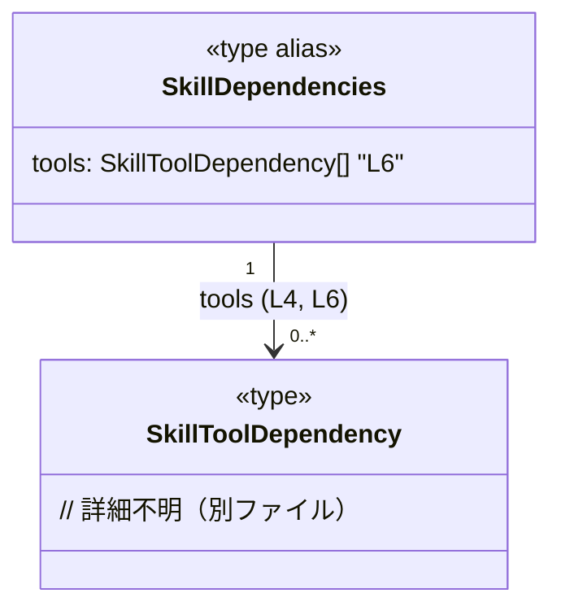

# app-server-protocol\schema\typescript\v2\SkillDependencies.ts

## 0. ざっくり一言

このファイルは、スキルの依存関係を表す `SkillDependencies` という型エイリアスを定義する、自動生成された TypeScript 型定義ファイルです（SkillDependencies.ts:L1-3,6）。

---

## 1. このモジュールの役割

### 1.1 概要

- ts-rs によって自動生成されたファイルであり、手動で編集しないことがコメントで明示されています（SkillDependencies.ts:L1,3）。
- `SkillToolDependency` 型の配列 `tools` をプロパティに持つ `SkillDependencies` 型エイリアスを 1 つ公開し、スキルが依存するツールの集合を表現します（SkillDependencies.ts:L4,6）。

### 1.2 アーキテクチャ内での位置づけ

- このファイルは、同一ディレクトリ内の `SkillToolDependency` から型を **import type** し、それをプロパティ型として利用しています（SkillDependencies.ts:L4,6）。
- 実行時のロジックや関数は一切含まれておらず、**純粋な型定義レイヤー**に位置づけられます（SkillDependencies.ts:L1-6）。
- `SkillDependencies` がどこから利用されているか（API 入出力、内部ロジックなど）は、このチャンクには現れません。

Mermaid による簡易依存関係図です。


### 1.3 設計上のポイント

- **自動生成コード**  
  - `// GENERATED CODE! DO NOT MODIFY BY HAND!` と `Do not edit this file manually.` というコメントにより、生成物であることと手動編集禁止が明示されています（SkillDependencies.ts:L1,3）。
- **型専用ファイル**  
  - `import type` を用いた型専用インポートと `export type` のみで構成されており、実行時に残る値や関数は定義されていません（SkillDependencies.ts:L4,6）。
- **単一責務**  
  - 役割は「`SkillDependencies` という 1 つの型エイリアスを定義すること」に限定されています（SkillDependencies.ts:L6）。
- **安全性 / エラーハンドリング / 並行性**  
  - 実行時コードがないため、ランタイムエラーや並行性の問題は直接は発生せず、型チェック時の型安全性のみを提供します（SkillDependencies.ts:L1-6）。

---

## 2. 主要な機能一覧

このファイルは関数ではなく型のみを提供します。機能は次の 1 点です。

- `SkillDependencies` 型: `tools` プロパティに `SkillToolDependency` の配列を持つ依存関係オブジェクトの型定義（SkillDependencies.ts:L4,6）。

---

## 3. 公開 API と詳細解説

### 3.1 型一覧（構造体・列挙体など）

コンポーネント（型）インベントリーです。

| 名前                   | 種別        | 定義位置                         | 役割 / 用途                                                                 |
|------------------------|-------------|----------------------------------|------------------------------------------------------------------------------|
| `SkillDependencies`    | 型エイリアス | SkillDependencies.ts:L6         | `tools` プロパティに `SkillToolDependency` の配列を持つ依存関係を表すオブジェクト型 |
| `SkillToolDependency`  | 型（別ファイル） | SkillDependencies.ts:L4     | 各ツール依存性を表す型。ここでは `tools` 配列要素の型としてのみ参照されます       |

#### `export type SkillDependencies = { tools: Array<SkillToolDependency>, };`（SkillDependencies.ts:L6）

**概要**

- `SkillDependencies` はオブジェクト型のエイリアスで、`tools` という 1 つのプロパティのみを持ちます（SkillDependencies.ts:L6）。
- `tools` は `Array<SkillToolDependency>` 型、すなわち `SkillToolDependency[]` と等価な配列型です（SkillDependencies.ts:L4,6）。

**フィールド**

| フィールド名 | 型                            | 説明 |
|-------------|--------------------------------|------|
| `tools`     | `Array<SkillToolDependency>`   | スキルが依存しているツールを表す要素の配列（SkillDependencies.ts:L6）。各要素の詳細は `SkillToolDependency` 側の定義（このチャンクには現れない）に依存します。 |

**型アノテーションの意味**

- `Array<SkillToolDependency>` は TypeScript のジェネリック配列型で、要素がすべて `SkillToolDependency` である配列を表します（SkillDependencies.ts:L4,6）。
  - シンタックスとしては `SkillToolDependency[]` と同じ意味です。

**内部処理の流れ（アルゴリズム）**

- この型は **データ構造のみ** を表しており、実行時の処理・アルゴリズムは存在しません（SkillDependencies.ts:L1-6）。

**Examples（使用例）**

以下は、この型を利用する側の典型的なコード例です。例示用に新たな関数を定義しています（実際のリポジトリ内の関数ではありません）。

```typescript
// このファイルで定義された型をインポートする例
import type { SkillDependencies } from "./SkillDependencies";          // SkillDependencies.ts から型のみをインポート

// 依存関係を受け取り、ツールの数を返すユーティリティ関数の例
function countTools(deps: SkillDependencies): number {                 // 引数に SkillDependencies 型を指定
    return deps.tools.length;                                          // tools プロパティの長さを返す
}

// 使用例
const deps: SkillDependencies = {                                      // SkillDependencies 型のオブジェクトを作成
    tools: [],                                                         // SkillToolDependency 型の配列（ここでは空配列）
};

console.log(countTools(deps));                                         // => 0
```

**Errors / Panics**

- このファイル自体は実行時コードを含まないため、ランタイムエラーや例外は発生しません（SkillDependencies.ts:L1-6）。
- 型チェック時に、`tools` に `SkillToolDependency` 以外の型を含めようとすると、TypeScript コンパイラが型エラーとして検出します（SkillDependencies.ts:L4,6）。

**Edge cases（エッジケース）**

`SkillDependencies` 自体は構造だけを規定するため、挙動は利用側のコードに依存します。型レベルで想定されるケースは次のとおりです。

- `tools` が空配列 `[]` の場合  
  - 型としては問題なく許容されます（SkillDependencies.ts:L6）。意味づけ（「依存ツールがないスキル」など）は、このチャンクからは分かりません。
- `tools` に `null` や `undefined` を含める場合  
  - `SkillToolDependency` が `null` や `undefined` を許容しない型であれば、コンパイルエラーになります（SkillDependencies.ts:L4,6）。実際に許容しているかどうかは、`SkillToolDependency` の定義がこのチャンクには現れないため不明です。

**使用上の注意点**

- このファイルは「手で編集しない」ことがコメントで明示されているため（SkillDependencies.ts:L1,3）、型の形を変えたい場合は **生成元（ts-rs 側の定義）を変更する必要がある** と解釈できます。
- `tools` プロパティは必須フィールドとして定義されており（オプショナル記号 `?` が付いていない）、`SkillDependencies` 型の値を作るときには必ず指定する必要があります（SkillDependencies.ts:L6）。
- `tools` の要素型を誤って `any` にするなどの回避策を取ると、`SkillToolDependency` による型安全性を失うため、通常は避けるべきです（SkillDependencies.ts:L4,6）。

### 3.2 関数詳細（最大 7 件）

- このファイルには関数・メソッドは定義されていません（SkillDependencies.ts:L1-6）。

### 3.3 その他の関数

- 補助関数やラッパー関数も定義されていません（SkillDependencies.ts:L1-6）。

---

## 4. データフロー

このチャンクには実行時の処理フローを持つ関数やクラスが存在しないため、**動的なデータフローや呼び出し関係** は分かりません（SkillDependencies.ts:L1-6）。

ここでは、型同士の関係（静的なデータ構造）としての「フロー」を図示します。



- `SkillDependencies` は 1 つの `tools` プロパティを通じて、0 個以上の `SkillToolDependency` 要素を保持しうる構造になっています（SkillDependencies.ts:L4,6）。
- `SkillDependencies` がどの関数から受け渡されるか、どのようにシリアライズ／デシリアライズされるかは、このチャンクには現れません。

---

## 5. 使い方（How to Use）

### 5.1 基本的な使用方法

`SkillDependencies` を他ファイルから利用する際の基本的なパターン例です。

```typescript
// SkillDependencies 型をインポートする
import type { SkillDependencies } from "./SkillDependencies";     // SkillDependencies.ts を参照

// 依存関係を受け取って処理する関数の例
function logToolCount(deps: SkillDependencies): void {            // 型注釈で SkillDependencies を使用
    console.log(`Tool count: ${deps.tools.length}`);              // tools 配列の長さにアクセス
}

// 呼び出し側の例
const deps: SkillDependencies = {                                 // SkillDependencies 型に準拠したオブジェクト
    tools: [],                                                    // SkillToolDependency[] として空配列を指定
};

logToolCount(deps);                                               // => "Tool count: 0"
```

### 5.2 よくある使用パターン

1. **依存関係の検査**

```typescript
import type { SkillDependencies } from "./SkillDependencies";

function hasDependencies(deps: SkillDependencies): boolean {
    return deps.tools.length > 0;                                 // 何か 1 つでもツールがあれば true
}
```

1. **依存関係のマッピング**

`SkillToolDependency` に何らかのプロパティ（例: `name`）があると仮定した一般的なパターンです。  
プロパティ名は例示であり、このチャンクからは実在を確認できません。

```typescript
import type { SkillDependencies } from "./SkillDependencies";

function listToolNames(deps: SkillDependencies): string[] {
    // ここでの .name アクセスは、実際に SkillToolDependency に name が存在するかどうかに依存する
    return deps.tools.map(tool => (tool as any).name);            // 実際には any ではなく正しいプロパティ名を利用する
}
```

※ 上記は「こういったパターンで使われることが多い」という例であり、`SkillToolDependency` の実際のフィールドはこのチャンクには現れません。

### 5.3 よくある間違い

```typescript
import type { SkillDependencies } from "./SkillDependencies";

// ❌ 間違い例: tools を省略している
const depsBad: SkillDependencies = {
    // tools プロパティがないためコンパイルエラーになる
};

// ✅ 正しい例: tools を必ず指定する
const depsOk: SkillDependencies = {
    tools: [],                                                    // SkillToolDependency[] として妥当な値
};
```

```typescript
// ❌ 間違い例: tools を any[] にしてしまう
const depsAny: SkillDependencies = {
    tools: [1, 2, 3] as any[],                                    // SkillToolDependency と無関係な値
    // コンパイラ設定によっては許容されるが、型安全性を損なう
};

// ✅ 推奨: SkillToolDependency 型の値のみを使う
// 実際の SkillToolDependency の構造は別ファイル定義のため、このチャンクからは不明
```

### 5.4 使用上の注意点（まとめ）

- **手動編集禁止**  
  - コメントで「Do not modify by hand」と明示されており（SkillDependencies.ts:L1,3）、このファイル自体の修正ではなく、生成元（ts-rs 側）の変更が前提です。
- **必須プロパティ `tools`**  
  - `tools` は必須であり、`SkillDependencies` 型の値を定義する際には必ず指定する必要があります（SkillDependencies.ts:L6）。
- **型安全性の確保**  
  - `tools` には `SkillToolDependency` 以外の型を含めないことで、コンパイル時の型チェックの恩恵を受けられます（SkillDependencies.ts:L4,6）。
- **並行性・パフォーマンス**  
  - このファイルは型情報のみであり、スレッドセーフティやパフォーマンスへの影響はありません（SkillDependencies.ts:L1-6）。

---

## 6. 変更の仕方（How to Modify）

### 6.1 新しい機能を追加する場合

- このファイルには「手で編集しない」という方針がコメントで明示されているため（SkillDependencies.ts:L1,3）、ここに直接型やフィールドを追加することは推奨されません。
- 新しい依存関係情報を追加したい場合は、**ts-rs の生成元（Rust 側など）で対応する型を拡張し、このファイルを再生成する**必要があると解釈できます。
  - 生成元の具体的な場所・ファイル名は、このチャンクには現れません。

### 6.2 既存の機能を変更する場合

- `tools` の名前や型を変更したい場合も、同様に **生成元の定義を変更する** 必要があります（SkillDependencies.ts:L1,3,6）。
- 変更に伴い、`SkillDependencies` を利用しているすべての箇所（関数・クラス・API 定義など）に影響が出る可能性がありますが、それらの利用箇所はこのチャンクには現れないため、別途リポジトリ全体での参照検索が必要です。
- 契約（コントラクト）としての前提:
  - `tools` が必須であること（SkillDependencies.ts:L6）。
  - `tools` の各要素が `SkillToolDependency` 型であること（SkillDependencies.ts:L4,6）。
  - これらを変更すると、利用側コードの前提が崩れる可能性があります。

---

## 7. 関連ファイル

| パス / 名前              | 役割 / 関係 |
|-------------------------|------------|
| `./SkillToolDependency` | `SkillToolDependency` 型をエクスポートするファイルです。このチャンクではインポートのみが行われ、構造の詳細は分かりません（SkillDependencies.ts:L4）。 |
| ts-rs の生成元ファイル   | `SkillDependencies` に対応する Rust 側などの型定義が存在すると考えられますが、このチャンクからは具体的な場所・名前は分かりません（SkillDependencies.ts:L3）。 |

このチャンクにはテストコードやその他のユーティリティファイルへの参照は現れません。
