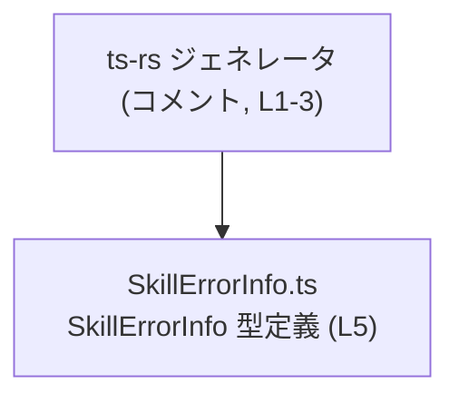
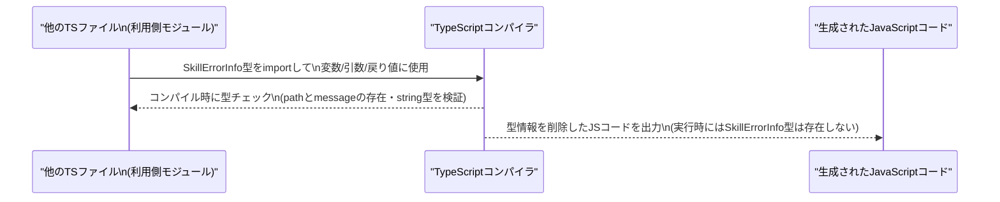

# app-server-protocol/schema/typescript/v2/SkillErrorInfo.ts コード解説

## 0. ざっくり一言

`SkillErrorInfo` というエラー情報用の TypeScript 型（`path` と `message` の 2 つの文字列プロパティ）を、コード生成ツール ts-rs により定義・公開しているファイルです。（`SkillErrorInfo.ts:L1-5`）

---

## 1. このモジュールの役割

### 1.1 概要

- このモジュールは、スキル（`Skill`）関連と思われるエラー情報を表すための **データ構造（型）** を提供します。
- 具体的には、エラーの発生箇所を示す `path` と、エラーメッセージ本文を示す `message` を持つオブジェクト型 `SkillErrorInfo` を定義し、export しています（`SkillErrorInfo.ts:L5-5`）。
- ファイル先頭のコメントにより、この型定義は Rust から TypeScript 型を生成するツール **ts-rs** による自動生成物であり、手動編集しないことが明示されています（`SkillErrorInfo.ts:L1-3`）。

### 1.2 アーキテクチャ内での位置づけ

このファイル自体は、他モジュールから利用されることを前提とした「型定義専用モジュール」です。  
ファイル内には import 文はなく、外部への依存はありません（`SkillErrorInfo.ts:L1-5`）。

コメントから読み取れる生成関係を簡単な依存図で表すと、次のようになります。



- **事実として分かること**
  - ts-rs がこのファイルを生成した（コメントより: `This file was generated by [ts-rs]` `SkillErrorInfo.ts:L3-3`）。
  - `SkillErrorInfo` は `export type` として公開されている（`SkillErrorInfo.ts:L5-5`）。
- **このチャンクからは分からないこと**
  - 具体的にどの TypeScript モジュールが `SkillErrorInfo` を import しているか
  - 対応する Rust 側の型がどのファイルに定義されているか

### 1.3 設計上のポイント

コードから読み取れる設計上の特徴は次のとおりです。

- **自動生成コード**  
  - `// GENERATED CODE! DO NOT MODIFY BY HAND!`（`SkillErrorInfo.ts:L1-1`）により、この型定義は人手で編集する前提ではないことが明示されています。
- **純粋なデータ型のみを提供**  
  - 関数やクラスは一切なく、`SkillErrorInfo` 型だけを提供しています（`SkillErrorInfo.ts:L5-5`）。
- **シンプルな構造**  
  - 2 つの必須プロパティ `path: string` と `message: string` から成るオブジェクト型です（`SkillErrorInfo.ts:L5-5`）。
- **型レベルでの安全性に寄与**  
  - TypeScript の型として定義されているため、他の TypeScript コードから利用することで、`path` と `message` が必ず文字列として存在することを **コンパイル時に保証**できます（TypeScript の言語仕様に基づく一般的な性質）。
- **実行時のロジック・エラーハンドリング・並行性制御は持たない**  
  - このファイル内には実行時処理はなく、エラーの生成・ログ出力・並行実行などのロジックは一切含まれていません（`SkillErrorInfo.ts:L1-5`）。

---

## 2. 主要な機能一覧

このファイルが提供する「機能」は、実行ロジックではなく型レベルの契約です。

- `SkillErrorInfo` 型:  
  エラーの発生箇所を表す `path` と、エラーメッセージ内容を表す `message` を持つオブジェクト型を定義・公開する（`SkillErrorInfo.ts:L5-5`）。

---

## 3. 公開 API と詳細解説

### 3.1 型一覧（構造体・列挙体など）

#### 型インベントリー

| 名前             | 種別        | フィールド                                         | 役割 / 用途                                                                                   | 定義位置                      |
|------------------|-------------|----------------------------------------------------|-----------------------------------------------------------------------------------------------|--------------------------------|
| `SkillErrorInfo` | 型エイリアス | `path: string`, `message: string`                 | エラーの発生箇所（`path`）とメッセージ（`message`）を保持するエラー情報オブジェクトの型定義 | `SkillErrorInfo.ts:L5-5` |

- `export type SkillErrorInfo = { path: string, message: string, };`  
  として定義されています（`SkillErrorInfo.ts:L5-5`）。

**言語固有の観点（TypeScript 型としての性質）**

- この定義は **型エイリアス** であり、クラスやインターフェースではありません。
- TypeScript では型はコンパイル時のみ利用され、JavaScript にトランスパイルされた後には実行時には存在しません。  
  そのため、`SkillErrorInfo` 自体に実行時のバリデーションやメソッドはありません。
- `path` と `message` は **必須プロパティ** であり、`SkillErrorInfo` 型として宣言した値には、これら 2 つのプロパティが存在し、型が `string` であることがコンパイル時に要求されます。

### 3.2 関数詳細（最大 7 件）

このファイルには関数・メソッド・クラスコンストラクタなどの実行可能なコードは一切定義されていません（`SkillErrorInfo.ts:L1-5`）。  
したがって、「関数詳細」テンプレートを適用できる対象はありません。

### 3.3 その他の関数

- なし（このチャンクには関数定義が存在しません）。

---

## 4. データフロー

このファイルは型定義のみを含み、実行時処理や関数呼び出しは存在しません。  
そのため、**このファイル内部には実行時のデータフローはありません**（`SkillErrorInfo.ts:L1-5`）。

一方で、TypeScript の型として利用される際の「コンパイル時のデータフロー」のイメージは次のようになります。

### 4.1 コンパイル時の利用フロー（一般的な利用イメージ）



- この図は、**TypeScript 型一般の挙動**にもとづく説明です。
- このリポジトリ内で実際にどのモジュールが `SkillErrorInfo` を import しているかは、このチャンクからは分かりません。

---

## 5. 使い方（How to Use）

### 5.1 基本的な使用方法

`SkillErrorInfo` を利用する典型的なコードフローの例です。  
別ファイルからこの型を import し、エラー情報オブジェクトを生成・利用します。

```typescript
// SkillErrorInfo 型を型専用 import する例
// パスはプロジェクト構成に応じて調整する必要があります。
import type { SkillErrorInfo } from "./SkillErrorInfo";

// スキル処理の結果としてエラー情報を作る関数の例
function createSkillError(path: string, reason: string): SkillErrorInfo {  // 戻り値としてSkillErrorInfo型を指定
    return {
        path,                                                              // エラーが発生した場所を表す文字列
        message: reason,                                                   // ユーザー向けまたはログ用のメッセージ
    };
}

// 呼び出し側での利用例
const errorInfo = createSkillError("skills[0].name", "必須項目です");
// errorInfo は { path: "skills[0].name", message: "必須項目です" } 型 SkillErrorInfo
```

- `SkillErrorInfo` 型を戻り値や引数の型に指定することで、`path` と `message` が必須であることを型レベルで保証できます。
- `import type` を用いると、型のみをインポートし、トランスパイル後の JavaScript には import が出力されません（TypeScript の機能）。

### 5.2 よくある使用パターン

#### パターン 1: 単一エラーの返却

```typescript
import type { SkillErrorInfo } from "./SkillErrorInfo";

function validateSkillName(name: string): SkillErrorInfo | null {  // null: エラーなしを表す例
    if (!name.trim()) {
        return {
            path: "name",                                          // どのフィールドに問題があるか
            message: "スキル名は必須です",                         // エラーメッセージ本文
        };
    }
    return null;
}
```

- バリデーション関数の戻り値として `SkillErrorInfo | null` を使うと、「エラーがあれば `SkillErrorInfo`、なければ `null`」という契約を表現できます。

#### パターン 2: 複数エラーのリスト

```typescript
import type { SkillErrorInfo } from "./SkillErrorInfo";

function validateSkill(input: { name: string; level: number; }): SkillErrorInfo[] {
    const errors: SkillErrorInfo[] = [];

    if (!input.name.trim()) {
        errors.push({
            path: "name",
            message: "スキル名は必須です",
        });
    }

    if (input.level < 1 || input.level > 10) {
        errors.push({
            path: "level",
            message: "レベルは1〜10の範囲で指定してください",
        });
    }

    return errors;
}
```

- 複数のエラーをまとめて返却する場合は、`SkillErrorInfo[]` のように配列型を用いるパターンが自然です。
- このときも、配列各要素に `path` と `message` が必ず存在することが型で保証されます。

### 5.3 よくある間違い

#### 1. 必須プロパティを省略してしまう

```typescript
import type { SkillErrorInfo } from "./SkillErrorInfo";

// 間違い例: message を指定していない
const error1: SkillErrorInfo = {
    path: "name",
    // message: "エラーです",      // これがないとコンパイルエラー
};

// コンパイラは「message プロパティが存在しない」とエラーを出します。
```

#### 2. 型の不一致

```typescript
// 間違い例: message を数値で指定
const error2: SkillErrorInfo = {
    path: "level",
    // message: 404,               // number型のためコンパイルエラー
    message: String(404),          // 正しくは string に変換する
};
```

#### 3. any を介して型安全性を失う

```typescript
// any を経由するとコンパイル時の保証が効かなくなる例
const raw: any = { path: 123, message: { text: "NG" } };

// 間違い例: as で無理やり SkillErrorInfo と見なす
const unsafe: SkillErrorInfo = raw as SkillErrorInfo;  // コンパイルは通るが、実行時は想定外の構造

// このような使い方は、型に期待される "string" プロパティが実行時に存在しない可能性を生みます。
```

### 5.4 使用上の注意点（まとめ）

- **前提条件**
  - `SkillErrorInfo` を使うコードは、TypeScript の型チェックを有効にしてコンパイルすることが前提です。
  - `path` と `message` には文字列が設定されることが前提であり、形式（例: JSONパス、ドット区切りなど）はこのファイルでは定義されていません。

- **禁止事項 / 避けた方がよいこと**
  - ファイル先頭に **「GENERATED CODE! DO NOT MODIFY BY HAND!」** とあるため、この TypeScript ファイルを直接編集することは避ける必要があります（`SkillErrorInfo.ts:L1-1`）。
  - `any` や過度な型アサーション (`as any`, `as SkillErrorInfo`) に頼ると、この型が提供する安全性（`path` と `message` の存在と型の保証）が失われます。

- **エラー・パニック条件**
  - この型自体には実行時の処理がないため、`SkillErrorInfo` の生成・利用に伴うランタイムエラーは、あくまで利用側のロジックに依存します。
  - 例えば、`message` にユーザー入力をそのまま HTML に埋め込むなどの行為は XSS の原因となり得ますが、それは `SkillErrorInfo` 型ではなく利用側の責務です。

- **並行性・スレッド安全性**
  - この型は単なるイミュータブルなデータ構造として扱われることが多く、スレッドや非同期処理と直接の関係はありません。
  - TypeScript/JavaScript の通常のオブジェクトと同様、同じオブジェクトを複数箇所から書き換える設計をとれば競合状態が起こり得ますが、`SkillErrorInfo` はその制御を行う仕組みは持ちません（純粋な型定義であるため）。

---

## 6. 変更の仕方（How to Modify）

### 6.1 新しい機能を追加する場合

このファイルは ts-rs による **自動生成コード** であるため（`SkillErrorInfo.ts:L1-3`）、直接編集ではなく、**生成元の定義** を変更する必要があります。

一般的な手順（コードから直接は分かりませんが、コメントの ts-rs 言及から推測される手順）は次のとおりです。

1. Rust 側の対応する型定義（ts-rs の derive 属性などが付与された構造体）を特定する  
   - このチャンクにはその場所は現れないため、具体的なパスは不明です。
2. 追加したいフィールド（例: `code: string` など）を Rust の型に追加する。
3. ts-rs のコード生成処理を再実行して TypeScript ファイルを再生成する。
4. 他の TypeScript コードで `SkillErrorInfo` を利用している箇所があれば、新しいフィールドへの対応を行う。

※ 直接 `SkillErrorInfo.ts` を編集しても、次回コード生成時に上書きされる可能性が高い点に注意が必要です。

### 6.2 既存の機能を変更する場合

既存フィールドの名前や型を変更したい場合も、基本的には **生成元の Rust 型を変更**します。

変更時の注意点:

- **影響範囲の確認**
  - `SkillErrorInfo` を import している TypeScript ファイル（利用側）はこのチャンクからは特定できませんが、プロジェクト全体で検索して影響範囲を確認する必要があります。
- **契約の変更**
  - 例えば `path` の型を `string` から別の型に変更した場合、「エラー位置を文字列で表す」という前提が崩れるため、呼び出し側のロジックやシリアライズ／デシリアライズ処理にも影響します。
- **生成プロセスの再実行**
  - 変更を反映させるには、ts-rs のコード生成プロセスを再実行する必要があります。
- **テストの更新**
  - `SkillErrorInfo` を使用している単体テストや統合テストがある場合、新しい構造に合わせて期待値を更新する必要があります（テストファイルはこのチャンクには現れません）。

---

## 7. 関連ファイル

このチャンクから直接参照できる関連ファイルはありませんが、コードとコメントから推測される関係を整理します。

| パス / 種別                            | 役割 / 関係                                                                                             |
|----------------------------------------|----------------------------------------------------------------------------------------------------------|
| 対応する Rust 型定義ファイル（パス不明） | ts-rs が参照している元定義。ここを変更すると、本ファイルの `SkillErrorInfo` 型定義が再生成されると考えられます（コメントより推測）。 |
| 他の TypeScript モジュール（パス不明） | `SkillErrorInfo` を import してエラー情報として利用している想定の利用側コード。このチャンクには現れません。         |

- 上記 2 種類のファイルは、この `SkillErrorInfo` 型を中心としたデータやり取りを理解・変更する際に重要になりますが、**具体的なパスやファイル名は、このチャンクだけからは分かりません**。
- 変更や調査を行う際には、プロジェクト全体で `SkillErrorInfo` というシンボル名、または ts-rs の属性を頼りに検索する必要があります。
