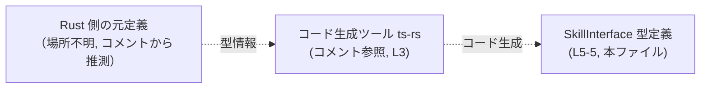
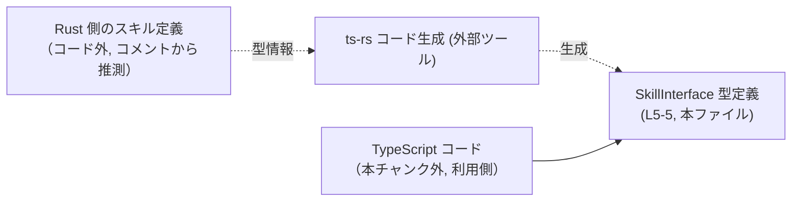

# app-server-protocol/schema/typescript/v2/SkillInterface.ts コード解説

## 0. ざっくり一言

- TypeScript で「スキルのメタ情報」を表現するための **オブジェクト型エイリアス `SkillInterface`** を定義する自動生成ファイルです（`SkillInterface.ts:L5-5`）。

---

## 1. このモジュールの役割

### 1.1 概要

- このファイルは、外部ツール `ts-rs` により生成された TypeScript 型定義ファイルです（`SkillInterface.ts:L1-3`）。
- `SkillInterface` 型は、表示名や説明文、アイコンやブランドカラーなど、スキルに関連する文字列情報をオプションプロパティとして持つオブジェクトを表現します（`SkillInterface.ts:L5-5`）。

### 1.2 アーキテクチャ内での位置づけ

コードから読み取れる範囲での位置づけは次のとおりです。

- 上流: Rust 側の定義をもとに `ts-rs` が本ファイルを生成していることがコメントから分かります（`SkillInterface.ts:L3-3`）。
- 本モジュール: 生成された TypeScript 型 `SkillInterface` を提供します（`SkillInterface.ts:L5-5`）。
- 下流: この型を import してオブジェクトの構造チェック（型チェック）に利用する側が存在すると推測されますが、このチャンク内には現れません。

Mermaid 図（生成元と本ファイルの関係）:



※ Rust 側ファイルの具体的なパスや構造は、このチャンクには現れないため不明です。

### 1.3 設計上のポイント

コードから客観的に読み取れる設計上の特徴です。

- **自動生成ファイルであることが明示**  
  - 冒頭コメントで「GENERATED CODE」「Do not edit this file manually」と明記されています（`SkillInterface.ts:L1-3`）。
- **単一の公開型のみを提供**  
  - エクスポートされているのは `SkillInterface` 型エイリアス 1 つだけです（`SkillInterface.ts:L5-5`）。
- **すべてのプロパティがオプショナル**  
  - `displayName`, `shortDescription`, `iconSmall`, `iconLarge`, `brandColor`, `defaultPrompt` のいずれも `?` が付いたオプショナルプロパティです（`SkillInterface.ts:L5-5`）。
- **文字列のみで構成された軽量なメタ情報型**  
  - すべてのプロパティの型が `string` であり、数値やネストしたオブジェクト等は含まれていません（`SkillInterface.ts:L5-5`）。
- **状態・ロジックを持たない純粋な型定義**  
  - 関数やクラスは存在せず、ランタイム動作は一切定義されていません（`SkillInterface.ts:L1-5`）。

---

## 2. 主要な機能一覧（コンポーネントインベントリー）

このファイルが提供する主要な「コンポーネント」は型定義のみです。

| 種別 | 名前 | 役割 / 用途 | 定義位置 |
|------|------|------------|----------|
| 型エイリアス | `SkillInterface` | スキルに関する表示名・説明・アイコン・ブランドカラー・デフォルトプロンプトなどの文字列プロパティを持つオブジェクト型を表現する | `SkillInterface.ts:L5-5` |

※ 関数・クラス・列挙体はこのチャンクには現れません。

---

## 3. 公開 API と詳細解説

### 3.1 型一覧（構造体・列挙体など）

`SkillInterface` 型のプロパティ構造です（すべてオプショナルで `string` 型、`SkillInterface.ts:L5-5`）。

| プロパティ名       | 型      | 必須/任意  | 説明（名前から推測） |
|--------------------|---------|-----------|----------------------|
| `displayName`      | string  | 任意 (?)  | スキルの表示名を表すと推測されます |
| `shortDescription` | string  | 任意 (?)  | 短い説明文を表すと推測されます     |
| `iconSmall`        | string  | 任意 (?)  | 小さいアイコンの識別子やパス/URL を表すと推測されます |
| `iconLarge`        | string  | 任意 (?)  | 大きいアイコンの識別子やパス/URL を表すと推測されます |
| `brandColor`       | string  | 任意 (?)  | ブランドカラー（例: `#RRGGBB`）を表すと推測されます   |
| `defaultPrompt`    | string  | 任意 (?)  | スキル利用時のデフォルトプロンプト文言を表すと推測されます |

> 上記の説明はすべてプロパティ名からの推測であり、フォーマットや必須性などの厳密な仕様は、このチャンクのコードからは断定できません。

### 3.2 関数詳細

- このファイルには関数・メソッドは一切定義されていません（`SkillInterface.ts:L1-5`）。

### 3.3 その他の関数

- 補助的な関数やラッパー関数も定義されていません。

---

## 4. データフロー

このファイル自体は型定義のみであり、ランタイム処理や関数呼び出しは記述されていません。そのため、データフローは「**他のコードがこの型をどのように利用するか**」という観点の静的なものになります。

### 4.1 型生成〜利用までの流れ（静的なフロー）

コメントに基づき、Rust 側から TypeScript 型が生成されるまでの静的フローを図示します。



- Rust 側の元定義と TypeScript 利用側コードの具体的な構造やパスは、このチャンクには現れないため不明です。
- `SkillInterface` 型は、利用側コードがデータの構造を保証するための **コンパイル時の契約（型チェック）** として機能すると考えられます。

---

## 5. 使い方（How to Use）

### 5.1 基本的な使用方法

`SkillInterface` 型を利用して、スキルのメタ情報オブジェクトの構造を TypeScript に認識させる基本例です。

```typescript
// SkillInterface 型をインポートする例（実際のパスはプロジェクト構成によって異なります）
import type { SkillInterface } from "./SkillInterface";  // パスは例示

// SkillInterface 型に準拠したオブジェクトを作成する
const skill: SkillInterface = {
    displayName: "天気予報",            // スキルの表示名
    shortDescription: "現在地の天気を表示します", // 短い説明
    iconSmall: "icons/weather_16.png",  // 小さいアイコン（想定）
    iconLarge: "icons/weather_64.png",  // 大きいアイコン（想定）
    brandColor: "#00AACC",              // ブランドカラー（想定）
    defaultPrompt: "今日の天気を教えて", // デフォルトのプロンプト文言（想定）
};

// SkillInterface 型により、存在しないプロパティを追加するとコンパイルエラーになります
// skill.unknownProp = "NG"; // エラー (Property 'unknownProp' does not exist on type 'SkillInterface')
```

この例では、すべてのプロパティを指定していますが、実際にはすべてオプショナルなので一部のみを設定することも可能です。

### 5.2 よくある使用パターン

1. **部分的な情報だけを持つオブジェクト**

```typescript
import type { SkillInterface } from "./SkillInterface";

// 表示名だけを持つ最小限のオブジェクト
const minimalSkill: SkillInterface = {
    displayName: "シンプルスキル",  // 他のプロパティは省略可能
};
```

1. **関数の引数・戻り値として利用**

```typescript
import type { SkillInterface } from "./SkillInterface";

// SkillInterface 型の配列を受け取って処理する関数
function listSkillNames(skills: SkillInterface[]): string[] {
    return skills
        .map(skill => skill.displayName ?? "名称未設定"); // displayName が未定義の場合のフォールバック
}
```

1. **フォーム入力との対応**

フォームなどから入力された値を `SkillInterface` 型のオブジェクトとして扱い、型安全に処理する、という使い方が想定されますが、その具体的な実装はこのチャンクには現れません。

### 5.3 よくある間違い

この型の構造から、起こりやすい誤用の例と正しい利用例を示します。

```typescript
import type { SkillInterface } from "./SkillInterface";

// 誤り例: プロパティを必ず存在する前提で使ってしまう
function getIconUrlWrong(skill: SkillInterface): string {
    // iconSmall はオプショナルなので、コンパイルエラーになるか、
    // strictNullChecks 設定によっては実行時に undefined を扱うことになります
    // return skill.iconSmall.toLowerCase(); // ❌ 直接アクセスは危険
    return ""; // 実際にはこう書くと意味のない実装になります
}

// 正しい例: オプショナルであることを考慮して扱う
function getIconUrlCorrect(skill: SkillInterface): string | undefined {
    // オプショナルチェーンと null 合体演算子を使った安全なアクセス
    const icon = skill.iconSmall ?? skill.iconLarge;
    return icon; // undefined の可能性を型で表現
}
```

### 5.4 使用上の注意点（まとめ）

- **すべてのプロパティはオプショナル**  
  - `?` が付いているため、どのプロパティも存在しない可能性があります（`SkillInterface.ts:L5-5`）。使用時には `undefined` を考慮する必要があります。
- **文字列フォーマットの制約は型からは分からない**  
  - URL 形式、カラーコード形式などの制約は型レベルでは記述されていません。必要であれば別途バリデーションが必要です。
- **ランタイムエラーは型定義では防げない場合がある**  
  - TypeScript の型チェックはコンパイル時のみです。実行時に外部入力から生成したオブジェクトを扱う場合、型の形を保証するための runtime validation が別途必要になりますが、本チャンクにはそうした処理は含まれていません。
- **並行性（Concurrency）**  
  - このファイルは純粋な型定義のみであり、非同期処理やスレッドセーフティに直接関係するコードはありません。

---

## 6. 変更の仕方（How to Modify）

### 6.1 新しい機能を追加する場合

このファイルは自動生成コードであり、コメントで「手動で変更しないこと」が明記されています（`SkillInterface.ts:L1-3`）。したがって、**このファイルを直接編集するべきではありません。**

新しいプロパティなどを `SkillInterface` に追加したい場合は、一般的には次のような手順になります（コメントに基づく推測であり、実際のプロジェクト構成はこのチャンクからは不明です）。

1. Rust 側の元となる型定義（おそらく構造体）にプロパティを追加する。  
   - どのファイルかはこのチャンクには現れません。
2. `ts-rs` のコード生成を再実行する。  
   - これにより、`SkillInterface.ts` が再生成され、新しいプロパティが反映されます。
3. TypeScript 側で `SkillInterface` を利用しているコードを更新し、新しいプロパティに対応させる。

### 6.2 既存の機能を変更する場合

既存プロパティの名前変更や削除・型変更も、同様に **Rust 側の元定義と `ts-rs` の設定を変更して再生成する** のが前提です。

変更時の注意点:

- **影響範囲**  
  - `SkillInterface` を利用している TypeScript コードは、名前変更・削除したプロパティを参照している部分でコンパイルエラーになります。エディタやコンパイラのエラーを手掛かりに参照箇所を洗い出す必要があります。
- **契約の変更**  
  - 任意プロパティを必須に変更した場合など、呼び出し側コードで値の準備が必須になるため、仕様変更として扱う必要があります。
- **後方互換性**  
  - 既存の JSON データやストレージに保存されたデータとの互換性も考慮が必要ですが、このチャンクにはその詳細は現れません。

---

## 7. 関連ファイル

このチャンクから直接特定できる関連コンポーネントは限定的です。

| パス / コンポーネント | 役割 / 関係 |
|------------------------|------------|
| Rust 側の元定義ファイル（不明） | コメントにある `ts-rs` によって本 TypeScript 型が生成されているため、その元となる Rust の構造体定義が存在すると考えられますが、具体的なパスや名前はこのチャンクには現れません。 |
| `ts-rs` ツール | コメントに記載のあるコード生成ツールであり（`SkillInterface.ts:L3-3`）、Rust の型を TypeScript 型に変換する役割を持ちます。 |
| `SkillInterface` を import する TypeScript ファイル群（不明） | 実際に `SkillInterface` を利用しているアプリケーションコードが存在すると考えられますが、本チャンクには現れません。 |

---

## 付録: Bugs / Security / Contracts / Edge Cases / Tests / Performance の観点まとめ

このファイルは型定義のみであるため、それぞれの観点は次のようになります。

- **Bugs（バグ）**  
  - ランタイムロジックがないため、このファイル単体に起因する実行時バグは想定されません。
- **Security（セキュリティ）**  
  - 型レベルでは、入力値のサニタイズやエスケープなどは行われません。例えば `iconSmall` が URL である場合も、XSS 対策などは利用側で行う必要がありますが、その仕様はこのチャンクには記述されていません。
- **Contracts（契約）**  
  - すべてのプロパティがオプショナルで `string` 型である、という点が唯一の型レベル契約です（`SkillInterface.ts:L5-5`）。
- **Edge Cases（エッジケース）**  
  - すべてのプロパティが `undefined` のオブジェクトも `SkillInterface` として型的には許容されます。呼び出し側でどこまでを許容するかは別途仕様で定義する必要があります。
- **Tests（テスト）**  
  - テストコードはこのチャンクには含まれていません。型定義に対しては通常、ランタイムテストではなくコンパイル時の型チェックと、必要であれば JSON スキーマ等による検証が行われます。
- **Performance / Scalability（性能 / スケーラビリティ）**  
  - 型定義はコンパイル時のみ利用されるため、ランタイムのパフォーマンスやスケーラビリティへ直接の影響はありません。
