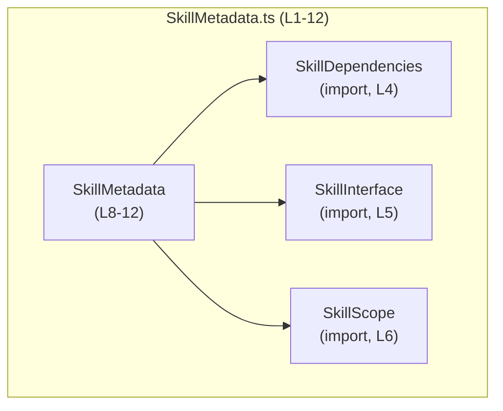
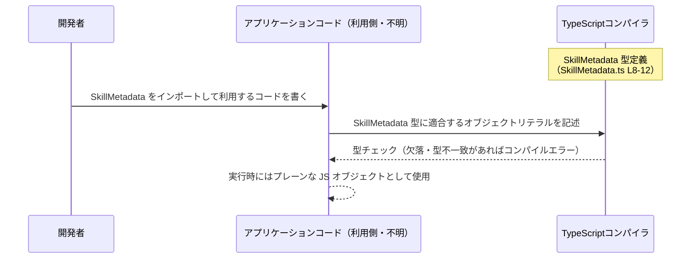

# app-server-protocol/schema/typescript/v2/SkillMetadata.ts

## 0. ざっくり一言

スキル（Skill）のメタデータを表現するための TypeScript 型 `SkillMetadata` を定義する、自動生成された型定義ファイルです（SkillMetadata.ts:L1-3, L8-12）。

---

## 1. このモジュールの役割

### 1.1 概要

- このモジュールは、1つのスキルに関するメタデータ（名前・説明・依存関係・スコープ・有効/無効など）を型として表現するために存在します（SkillMetadata.ts:L8-12）。
- Rust 側の定義から ts-rs によって自動生成される TypeScript 型であり、手動編集しないことが前提になっています（SkillMetadata.ts:L1-3）。

### 1.2 アーキテクチャ内での位置づけ

このファイルに現れる依存関係は、`SkillMetadata` が他の型定義に依存している形です。



- `SkillMetadata` は `SkillDependencies`・`SkillInterface`・`SkillScope` をプロパティ型として参照します（SkillMetadata.ts:L4-6, L12）。
- どのモジュールから `SkillMetadata` が利用されるかは、このチャンクには現れていません（不明）。

### 1.3 設計上のポイント

- **自動生成コード**  
  先頭コメントに「GENERATED CODE」「Do not edit this file manually」とあり、自動生成・非編集が前提です（SkillMetadata.ts:L1-3）。
- **純粋な型定義のみ**  
  関数やクラス、ロジックは一切なく、`export type SkillMetadata = { ... }` だけを公開します（SkillMetadata.ts:L8-12）。
- **オブジェクト型の型エイリアス**  
  `SkillMetadata` はオブジェクト型の型エイリアス（`type`）として定義されています（SkillMetadata.ts:L8）。
- **オプショナルなプロパティ**  
  `shortDescription`, `interface`, `dependencies` がオプショナル（`?`）で、存在しない可能性があります（SkillMetadata.ts:L9-12）。
- **他の型との連携**  
  `interface`, `dependencies`, `scope` が別ファイルの型を利用しており、スキルの構造・依存関係・スコープを統合したメタデータとして設計されています（SkillMetadata.ts:L4-6, L12）。

---

## 2. 主要な機能一覧

このファイルは実行時機能ではなく「型」という意味での機能を提供しています。

- スキルメタデータ型定義: 1つのスキルのメタデータ構造を `SkillMetadata` 型として定義します（SkillMetadata.ts:L8-12）。
- 依存情報との結合: スキルの依存情報を `dependencies?: SkillDependencies` プロパティで表現します（SkillMetadata.ts:L4, L12）。
- インターフェース情報との結合: スキルのインターフェース情報を `interface?: SkillInterface` プロパティで関連付けます（SkillMetadata.ts:L5, L12）。
- スコープ情報との結合: スキルのスコープを `scope: SkillScope` プロパティで表現します（SkillMetadata.ts:L6, L12）。
- レガシー情報の保持: `shortDescription` プロパティで、`SKILL.md` 由来のレガシー情報を保持しつつ、新しい `SKILL.json interface.short_description` を推奨するコメントを付けています（SkillMetadata.ts:L9-11）。

---

## 3. 公開 API と詳細解説

### 3.1 型一覧（コンポーネントインベントリー）

#### 公開型

| 名前 | 種別 | 役割 / 用途 | 定義位置 |
|------|------|------------|----------|
| `SkillMetadata` | 型エイリアス（オブジェクト型） | 1つのスキルに関するメタデータ（名前・説明・依存関係・ファイルパス・スコープ・有効フラグ等）を表現するためのメイン型です。 | app-server-protocol/schema/typescript/v2/SkillMetadata.ts:L8-12 |

#### 依存している外部型（このファイルには定義がない）

| 名前 | 種別 | 役割 / 用途（命名からの推測を含む） | このファイルでの出現位置 |
|------|------|--------------------------------------|---------------------------|
| `SkillDependencies` | import された型 | スキルの依存関係（他スキルやリソースなど）を表す型と解釈できますが、具体的な構造はこのチャンクには現れません。 | app-server-protocol/schema/typescript/v2/SkillMetadata.ts:L4 |
| `SkillInterface` | import された型 | スキルの公開インターフェース（メソッド、入力/出力など）を表す型と解釈できますが、詳細は不明です。 | app-server-protocol/schema/typescript/v2/SkillMetadata.ts:L5 |
| `SkillScope` | import された型 | スキルのスコープ（有効な環境や対象範囲）を表現する型と解釈できますが、詳細は不明です。 | app-server-protocol/schema/typescript/v2/SkillMetadata.ts:L6 |

> 上記 3 型の具体的な定義は、このチャンクには現れません（不明）。

#### `SkillMetadata` のプロパティ一覧

`SkillMetadata` は以下のプロパティを持つオブジェクト型として定義されています（SkillMetadata.ts:L8-12）。

| プロパティ名 | 型 | 必須か | 説明 | 根拠 |
|--------------|----|--------|------|------|
| `name` | `string` | 必須 | スキルの識別名または表示名を表す文字列です。 | SkillMetadata.ts:L8 |
| `description` | `string` | 必須 | スキルの説明文を表す文字列です。詳細な説明に使われると考えられます。 | SkillMetadata.ts:L8 |
| `shortDescription` | `string` | オプショナル | SKILL.md に由来するレガシーな短い説明文を表す文字列です。コメントで SKILL.json の `interface.short_description` の利用が推奨されています。 | SkillMetadata.ts:L9-12 |
| `interface` | `SkillInterface` | オプショナル | スキルのインターフェース情報を保持します。`SkillInterface` の具体的中身は不明です。 | SkillMetadata.ts:L5, L12 |
| `dependencies` | `SkillDependencies` | オプショナル | スキルの依存関係情報を保持します。`SkillDependencies` の具体的中身は不明です。 | SkillMetadata.ts:L4, L12 |
| `path` | `string` | 必須 | スキルの配置パス（ファイルシステム上のパスなど）を表すと解釈できる文字列です。 | SkillMetadata.ts:L12 |
| `scope` | `SkillScope` | 必須 | スキルのスコープを表す値です。`SkillScope` の具体的なバリエーションは不明です。 | SkillMetadata.ts:L6, L12 |
| `enabled` | `boolean` | 必須 | スキルが有効かどうかを示す真偽値です。 | SkillMetadata.ts:L12 |

### 3.2 関数詳細

このファイルには関数・メソッドは一切定義されていません（app-server-protocol/schema/typescript/v2/SkillMetadata.ts:L1-12）。  
したがって、関数詳細テンプレートに沿って説明すべき対象はありません。

### 3.3 その他の関数

補助関数やラッパー関数も存在しません（app-server-protocol/schema/typescript/v2/SkillMetadata.ts:L1-12）。

---

## 4. データフロー

このファイルは型定義のみを提供し、実行時ロジックは一切含みません。そのため、データフローは「どのように `SkillMetadata` 型のオブジェクトが生成され、型チェックされるか」という観点で説明できます。

一般的な利用イメージは次のようになります（具体的な呼び出し元モジュール名などはこのチャンクには現れないため、抽象的な表現にとどめています）。



要点:

- `SkillMetadata` は **コンパイル時の型安全性** を提供します。必須プロパティや型が合わない場合、TypeScript コンパイル時にエラーになります（SkillMetadata.ts:L8-12 に基づく一般的な TypeScript の挙動）。
- 実行時には型情報は消えるため、JavaScript から利用する場合や `any` キャストを多用した場合には、型不整合がそのまま実行時エラーになる可能性があります（TypeScript の一般仕様に基づく説明）。
- `shortDescription`, `interface`, `dependencies` はオプショナルなため、実行時に `undefined` である可能性があり、利用側コードでは null/undefined を考慮する必要があります（SkillMetadata.ts:L9-12）。

---

## 5. 使い方（How to Use）

### 5.1 基本的な使用方法

`SkillMetadata` 型を使って、スキルメタデータのオブジェクトを定義する例です。  
相対パスは実際のディレクトリ構成に合わせて調整する必要があります（このチャンクには利用側のパスは現れません）。

```typescript
// SkillMetadata 型をインポートする（パスは実際の構成に応じて変更が必要）
import type { SkillMetadata } from "./SkillMetadata"; // このファイル自身を想定

// SkillMetadata 型に適合するスキルメタデータオブジェクトを定義する
const exampleSkill: SkillMetadata = {
    name: "example-skill",                     // 必須: スキル名（string）
    description: "サンプルスキルの説明です",     // 必須: 詳細な説明（string）
    path: "/skills/example-skill",             // 必須: スキルのパス（string）
    scope: someScopeValue,                     // 必須: SkillScope 型の値（別ファイルの定義が必要）
    enabled: true,                             // 必須: 有効かどうか（boolean）

    // 以下は任意のプロパティ（存在させなくてもよい）
    shortDescription: "短い説明",             // オプショナル: レガシーな短い説明（string）
    interface: someInterfaceValue,             // オプショナル: SkillInterface 型の値
    dependencies: someDependenciesValue,       // オプショナル: SkillDependencies 型の値
};
```

このコードでは、TypeScript コンパイラが以下を保証します。

- 必須プロパティ（`name`, `description`, `path`, `scope`, `enabled`）が欠けているとコンパイルエラーになります（SkillMetadata.ts:L8-12）。
- 各プロパティの型が一致しない場合（例: `enabled` に文字列を代入）もコンパイルエラーになります（同上）。

### 5.2 よくある使用パターン

#### パターン1: オプショナルプロパティを省略した最小構成

```typescript
import type { SkillMetadata } from "./SkillMetadata";

const minimalSkill: SkillMetadata = {
    name: "minimal-skill",            // 必須
    description: "最小構成のスキル",   // 必須
    path: "/skills/minimal",          // 必須
    scope: someScopeValue,            // 必須 (SkillScope 型)
    enabled: false,                   // 必須
    // shortDescription, interface, dependencies は省略
};
```

- 省略可能なプロパティは完全に省略しても問題ありません（SkillMetadata.ts:L9-12）。

#### パターン2: オプショナルプロパティの存在チェック

オプショナルな `shortDescription` を安全に扱う例です。

```typescript
import type { SkillMetadata } from "./SkillMetadata";

function getShortDescription(meta: SkillMetadata): string {
    // shortDescription があればそれを使い、なければ description を使う
    return meta.shortDescription ?? meta.description;
}
```

- `shortDescription` は `string | undefined` のような扱いになり得るため（オプショナルプロパティ）、`??` などでフォールバックを用意する必要があります（SkillMetadata.ts:L9-12）。

### 5.3 よくある間違い

```typescript
import type { SkillMetadata } from "./SkillMetadata";

// 間違い例1: 必須プロパティの欠落
const invalidSkill1: SkillMetadata = {
    // name がない → コンパイルエラー
    description: "説明",
    path: "/skills/invalid",
    scope: someScopeValue,
    enabled: true,
};

// 間違い例2: 型の不一致
const invalidSkill2: SkillMetadata = {
    name: "invalid-skill",
    description: "説明",
    path: "/skills/invalid",
    scope: someScopeValue,
    enabled: "yes",  // string を指定 → boolean でないためコンパイルエラー
};

// 間違い例3: レガシー shortDescription の過信
const invalidSkill3: SkillMetadata = {
    name: "legacy-skill",
    description: "説明",
    path: "/skills/legacy",
    scope: someScopeValue,
    enabled: true,
    shortDescription: "短い説明", // コメント上はレガシー扱い
    // interface.short_description の方を使う設計であれば、
    // 利用側で shortDescription のみを見ると設計意図に反する可能性がある
};
```

- 間違い例1・2は TypeScript の静的型チェックにより **コンパイル時に検出** されます（SkillMetadata.ts:L8-12）。
- 間違い例3は型的には正しいですが、コメントの意図（`SKILL.json interface.short_description` の利用を推奨）に反する使い方になる可能性があります（SkillMetadata.ts:L9-11）。

### 5.4 使用上の注意点（まとめ）

- `shortDescription`, `interface`, `dependencies` はオプショナルであるため、利用時には `undefined` を許容したコード（存在チェック・フォールバック）にする必要があります（SkillMetadata.ts:L9-12）。
- `enabled` は boolean であり、truthy/falsy の乱用（例: `"true"` を使う）は静的型チェック上も意味的にも避けるべきです（SkillMetadata.ts:L12）。
- ファイル冒頭に「手動編集禁止」のコメントがあるため、このファイルを直接編集することは想定されていません（SkillMetadata.ts:L1-3）。拡張や変更は別ファイルでのラップや上流スキーマの変更で行う必要があります。

---

## 6. 変更の仕方（How to Modify）

### 6.1 新しい機能を追加する場合

このファイルは自動生成されており、手動編集しない方針が明示されています（SkillMetadata.ts:L1-3）。そのため、**直接このファイルにフィールドを追加することは推奨されません**。

一般的な変更パターンは次の二つです。

1. **上流のスキーマ定義を変更する**  
   - ts-rs の元となる Rust 側の型定義、もしくは SKILL 関連のスキーマ（`SKILL.json` など）を変更し、再生成する。
   - どのファイルが上流にあたるかは、このチャンクには現れていません（不明）。

2. **別ファイルで拡張型を定義する**

```typescript
// 拡張用の別ファイル（たとえば ExtendedSkillMetadata.ts）
import type { SkillMetadata } from "./SkillMetadata";

// SkillMetadata を拡張したアプリケーション独自の型
export type ExtendedSkillMetadata = SkillMetadata & {
    // ここに追加のプロパティを定義する
    category?: string;           // 例: スキルのカテゴリ
    tags?: string[];             // 例: タグ一覧
};
```

- この方法では自動生成コードを変更せずに、アプリケーション側で必要なメタ情報を安全に追加できます。

### 6.2 既存の機能を変更する場合

`SkillMetadata` の既存プロパティの意味や必須/任意を変更したい場合は、次の点に注意する必要があります。

- **影響範囲の確認**  
  `SkillMetadata` を使っているすべての TypeScript コードが影響を受けます。どのファイルが利用しているかは、このチャンクからは分からないため、プロジェクト全体検索などが必要です（不明）。
- **契約の変更**  
  - 例: `shortDescription` を必須に変更すると、既存コードで `shortDescription` を指定していない箇所がコンパイルエラーになります。
  - 型の意味（例: `path` のフォーマットや `scope` の解釈）を変更する場合は、利用側との合意が必要です。
- **自動生成の再実行**  
  手動でこのファイルを変更しても、次回のコード生成で上書きされる可能性が高いため、必ず上流定義側を変更し、コード生成を再実行する形にするのが安全です（SkillMetadata.ts:L1-3 より、自動生成ファイルであることが明示されています）。

---

## 7. 関連ファイル

このファイル内の import 文から分かる関連ファイルは以下の通りです。

| パス | 役割 / 関係 |
|------|------------|
| `./SkillDependencies` | `SkillDependencies` 型を提供します。`SkillMetadata.dependencies` プロパティの型として利用されています（SkillMetadata.ts:L4, L12）。具体的な中身はこのチャンクには現れません。 |
| `./SkillInterface` | `SkillInterface` 型を提供します。`SkillMetadata.interface` プロパティの型として利用されています（SkillMetadata.ts:L5, L12）。具体的な中身は不明です。 |
| `./SkillScope` | `SkillScope` 型を提供します。`SkillMetadata.scope` プロパティの型として利用されています（SkillMetadata.ts:L6, L12）。列挙体かユニオン型などの可能性がありますが、このチャンクからは断定できません。 |

また、ファイル先頭のコメントから、次のような上流要素の存在が示唆されます。

| パス / コンポーネント | 役割 / 関係 |
|----------------------|------------|
| ts-rs の入力定義（Rust 側の型など、パス不明） | この TypeScript 型定義を生成するための元定義と考えられますが、このチャンクにはその位置や内容は現れません（SkillMetadata.ts:L1-3）。 |

---

## Bugs / Security / Contracts / Edge Cases の要点

- **Bugs（バグの可能性）**  
  - このファイル自体は型定義のみであり、ロジックは含みません。そのため、直接的なバグは存在しません。
  - ただし利用側が `any` キャストや JavaScript からの直接利用を行う場合、`SkillMetadata` の契約を破ってもコンパイル時に検出されないため、実行時バグにつながる可能性があります（TypeScript の一般仕様）。

- **Security（セキュリティ）**  
  - 型定義のみであり、入出力の検証やサニタイズなどの処理は行いません。セキュリティ上のチェックは利用側ロジックに委ねられます。
  - `path` や `name` に外部入力をそのまま入れる場合、別途バリデーションが必要です（このファイルでは何も保証しません）。

- **Contracts（契約）**  
  - 必須プロパティ: `name`, `description`, `path`, `scope`, `enabled` は常に存在し、指定された型であることが契約です（SkillMetadata.ts:L8, L12）。
  - オプショナルプロパティ: `shortDescription`, `interface`, `dependencies` は存在しない場合があるため、利用側は `undefined` を許容したコードで扱う必要があります（SkillMetadata.ts:L9-12）。
  - コメント上の契約として、`shortDescription` はレガシーであり、新しい設計では `SKILL.json interface.short_description` を優先することが示唆されています（SkillMetadata.ts:L9-11）。

- **Edge Cases（エッジケース）**  
  - `shortDescription` が常に `undefined` のスキル: 利用側が `shortDescription` のみを想定していると想定外の `undefined` に遭遇します。
  - `dependencies` や `interface` が未定義のスキル: 「依存関係なし」「インターフェース定義なし」と解釈するか、「情報不足」と解釈するかは利用側の設計次第であり、この型定義だけでは判別できません。
  - 空文字列の `name` や `description`: 型的には許容されますが、意味的に妥当かどうかはこのファイルからは判断できません（バリデーションは行われません）。

---

## 並行性・エラー処理・パフォーマンスに関する補足

- **並行性**  
  このファイルは型定義のみであり、非同期処理やスレッドに関するコードは含みません（SkillMetadata.ts:L1-12）。並行性に関する安全性は、この型を利用するロジック側で決まります。
- **エラー処理**  
  実行時エラー処理は行いません。TypeScript のコンパイル時型チェックによる「静的なエラー検出」だけに関わります。
- **パフォーマンス / スケーラビリティ**  
  型定義そのものはランタイムコストを持ちません。`SkillMetadata` 型のオブジェクトを大量に扱う場合のパフォーマンスやメモリ使用量は、オブジェクトのサイズや利用パターンに依存し、このファイル自体の設計からは特別な制約は読み取れません。
