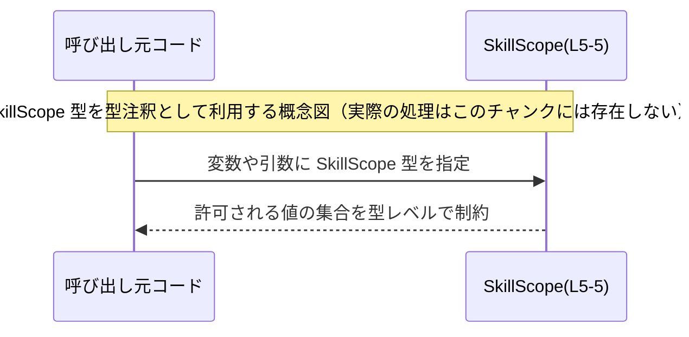

# app-server-protocol/schema/typescript/v2/SkillScope.ts コード解説

## 0. ざっくり一言

このファイルは、`SkillScope` という TypeScript の **文字列リテラル型エイリアス**を定義するだけの、自動生成ファイルです。  
`"user" | "repo" | "system" | "admin"` のいずれかの文字列だけを許容する型として宣言されています（`export type SkillScope = ...`、L5）。

---

## 1. このモジュールの役割

### 1.1 概要

- このモジュールは、`SkillScope` という型を 1 つエクスポートします（L5）。
- `SkillScope` は TypeScript の **ユニオン型（union type）** で、4 種類の文字列リテラル `"user" | "repo" | "system" | "admin"` のいずれかを表す型になっています（L5）。
- 冒頭コメントから、このファイルは Rust 向けライブラリ `ts-rs` によって自動生成されていることが分かります（L1, L3）。

### 1.2 アーキテクチャ内での位置づけ

- ディレクトリ `schema/typescript/v2` に置かれていることから、**アプリケーションサーバプロトコルのスキーマ定義群の一部**であると解釈できますが、実際にどのモジュールから参照されているかはこのチャンクからは分かりません。
- このファイル自身は **他のモジュールを import しておらず**（import 文なし）、**外部に型のみを export** しています（L5）。

依存関係を示すと、次のようになります（本チャンクで確認できる範囲のみ）。


- 上図のとおり、このファイルは他の TypeScript ファイルへの依存を持たず、単独で `SkillScope` 型を定義するモジュールとして存在しています。

### 1.3 設計上のポイント

- **自動生成コードであることの明示**  
  - `// GENERATED CODE! DO NOT MODIFY BY HAND!`（L1）  
  - `// This file was generated by [ts-rs](...)`（L3）  
  手動で編集すべきではないことが明記されています。
- **型レベルの制約のみを提供**  
  - 実行時の処理は一切なく、コンパイル時の型チェックのためだけの宣言です（L5）。
- **閉じた集合の文字列値**  
  - `"user" | "repo" | "system" | "admin"` の 4 つ以外の文字列を代入するとコンパイルエラーになるよう、ユニオン型で制約しています（L5）。

---

## 2. 主要な機能一覧

このファイルは 1 つの公開型だけを提供します。

- `SkillScope` 型: `"user" | "repo" | "system" | "admin"` のいずれかの文字列のみを許可する TypeScript の文字列リテラルユニオン型（L5）。

---

## 3. 公開 API と詳細解説

### 3.1 型一覧（構造体・列挙体など）

| 名前        | 種別                             | 役割 / 用途                                                                                         | 定義位置 |
|------------|----------------------------------|------------------------------------------------------------------------------------------------------|----------|
| `SkillScope` | 型エイリアス（文字列リテラルユニオン型） | 値を `"user" \| "repo" \| "system" \| "admin"` の 4 パターンのいずれかに制約するための型。実行時ロジックはなく、コンパイル時の型安全性向上のために利用される想定です。 | `SkillScope.ts:L5-5` |

補足（事実と推測の切り分け）:

- 文字列リテラルのラインナップ（`"user"`, `"repo"`, `"system"`, `"admin"`）から、何らかの「スコープ」や「権限レベル」を表す型であると解釈できますが、このファイル単体からは具体的な意味づけや利用箇所は分かりません。

### 3.2 関数詳細（最大 7 件）

- このファイルには **関数定義は存在しません**（import/export を含め、`function` / `=>` を持つ実行時関数コードはありません）。

### 3.3 その他の関数

- 補助関数やラッパー関数も定義されていません。

---

## 4. データフロー

このチャンクには `SkillScope` を実際に利用する関数・メソッドが存在しないため、**実際の処理フローは読み取れません**。

参考として、「他のコードから `SkillScope` 型を参照する」という典型的な利用イメージを概念図として示します（※実在する処理ではなく、あくまで型の使い方の例です）。



要点:

- `SkillScope` はあくまで「型」であり、実行時オブジェクトではありません。
- 実際のデータフロー（API 呼び出し、DB I/O など）は、このファイルからは把握できません。

---

## 5. 使い方（How to Use）

### 5.1 基本的な使用方法

`SkillScope` を import し、変数や関数の引数・戻り値の型として利用することで、許可される文字列を `"user" | "repo" | "system" | "admin"` に限定できます。

```typescript
// SkillScope 型のインポート例（実際のパスは利用側からの相対パスに依存します）
import type { SkillScope } from "./SkillScope";  // 型専用のimportなので `import type` を利用

// SkillScope 型の値を受け取る関数の例
function setSkillScope(scope: SkillScope) {      // scope は SkillScope 型
    // ここでは scope は 4 種類の文字列のいずれかに限定される
    console.log(`scope = ${scope}`);
}

setSkillScope("user");   // OK: SkillScope に含まれる文字列
setSkillScope("admin");  // OK

// setSkillScope("other"); // コンパイルエラー: '"other"' 型は 'SkillScope' 型に代入できない
```

このように、**型アノテーション**として `SkillScope` を利用することで、IDE の補完とコンパイル時チェックの両方を活用できます。

### 5.2 よくある使用パターン

1. **オブジェクトのプロパティとして利用**

```typescript
import type { SkillScope } from "./SkillScope";

interface SkillConfig {
    scope: SkillScope;            // プロパティを SkillScope 型で制約
    name: string;
}

const config: SkillConfig = {
    scope: "repo",                // OK
    name: "example",
};

// config.scope = "invalid";     // コンパイルエラー
```

1. **API パラメータ・レスポンスの型として利用**

```typescript
import type { SkillScope } from "./SkillScope";

// SkillScope を受け取るAPI関数の型定義例
type UpdateSkillScopeRequest = {
    id: string;
    scope: SkillScope;            // API パラメータとしての利用
};

function updateSkillScope(req: UpdateSkillScopeRequest): void {
    // req.scope は 4つのうちいずれかに限定
}
```

※ 上記の API 関数やインターフェースは、このリポジトリ内に存在するとは限らないサンプルコードです。

### 5.3 よくある間違い

#### 1. `string` 型のままにしてしまう

```typescript
// 間違い例: 単なる string 型として定義している
type SkillConfigBad = {
    scope: string;                // どんな文字列でも許可してしまう
};

// 正しい例: SkillScope 型で制約する
import type { SkillScope } from "./SkillScope";

type SkillConfigGood = {
    scope: SkillScope;
};
```

#### 2. スペルミスしたリテラルを使う

```typescript
import type { SkillScope } from "./SkillScope";

const s1: SkillScope = "admin";   // OK
// const s2: SkillScope = "Admin"; // エラー: 大文字小文字の違いも検出される
```

### 5.4 使用上の注意点（まとめ）

- **許可される値は 4 種類のみ**  
  `"user" | "repo" | "system" | "admin"` 以外の文字列を使いたい場合は、型定義の側を変更する必要があります（ただしこのファイルは自動生成なので、直接編集すべきではありません）。
- **自動生成コードであること**  
  コメントに記載のとおり、`ts-rs` によって生成されており、手動編集は想定されていません（L1, L3）。
- **並行性・エラーハンドリング**  
  このファイルは型定義のみであり、実行時処理やエラー処理、並行処理に関わるコードは存在しません。

---

## 6. 変更の仕方（How to Modify）

### 6.1 新しい機能を追加する場合

このファイルは自動生成であり、コメントに「DO NOT MODIFY BY HAND!」とあるため（L1, L3）、**直接修正することは推奨されません**。

- `ts-rs` によって生成されていることから、元となる Rust 側の型定義（struct / enum など）が別のリポジトリまたはディレクトリに存在していると考えられますが、**このチャンクからその具体的な場所は特定できません**。
- 新しいスコープ値（たとえば `"guest"` など）を追加したい場合は、通常は **Rust 側の元定義を変更 → ts-rs による再生成** という手順になると考えられます（推測）。

### 6.2 既存の機能を変更する場合

- `SkillScope` のリテラルのいずれかを削除・変更した場合、その型を利用しているすべての TypeScript コードにコンパイルエラーが発生する可能性があります。
- とくに `"admin"` のような特別な意味を持つ可能性のある値を変更・削除する際は、**利用側コードの契約（前提条件）** が壊れないかどうかの確認が必要です。
- ただし、このファイルは自動生成であるため、実際の変更は元定義側（Rust）で行い、このファイル自体は再生成に任せるのが前提と考えられます。

---

## 7. 関連ファイル

このチャンクには import 文や他ファイルへの参照が存在しないため、**具体的な関連ファイルをコード上から特定することはできません**。

推測ベースの情報（事実ではないことを明示）:

- コメントより、このファイルは `ts-rs` ライブラリによって生成されていると記載されています（L3）。したがって、Rust 側には対応する型定義が存在していると考えられますが、そのパスやファイル名はこのチャンクには現れません。

| パス | 役割 / 関係 |
|------|------------|
| （不明） | `SkillScope` の元定義となる Rust ファイル。`ts-rs` によって本ファイルが生成されているとコメントされているが、具体的な場所はこのチャンクからは特定不能。 |

---

### 付録: コンポーネントインベントリー（このチャンク分）

| 種別       | 名前        | 説明                                                                                         | 定義位置                             |
|------------|------------|----------------------------------------------------------------------------------------------|--------------------------------------|
| 型エイリアス | `SkillScope` | `"user" \| "repo" \| "system" \| "admin"` の 4 種類の文字列リテラルのみに値を制約する TypeScript の公開型。 | `app-server-protocol/schema/typescript/v2/SkillScope.ts:L5-5` |

- バグ・セキュリティ・パフォーマンス・並行性に関して、この型定義自体には実行時ロジックがないため、**ファイル単体に起因する問題はありません**。  
  実際の影響は、この型をどう利用するか（権限チェックなど）に依存しますが、その部分はこのチャンクには含まれていません。
