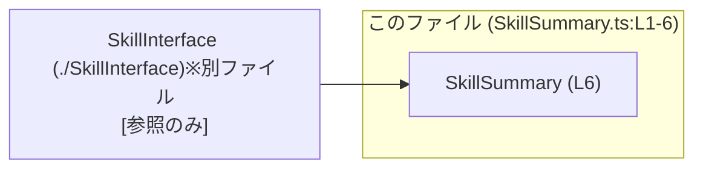
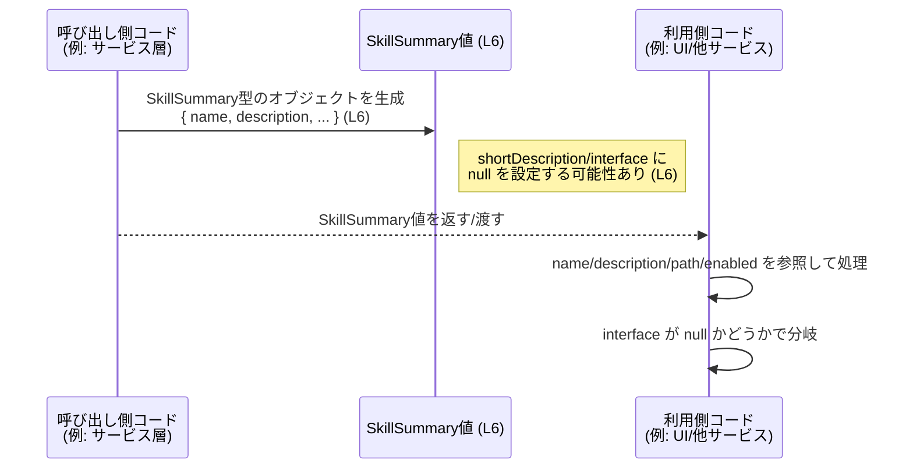

# app-server-protocol/schema/typescript/v2/SkillSummary.ts

## 0. ざっくり一言

`SkillSummary` という **1つのオブジェクト型エイリアス** を定義し、「スキルの概要情報」をひとまとまりのデータとして扱うための型付けを行うファイルです（`SkillSummary.ts:L6`）。

---

## 1. このモジュールの役割

### 1.1 概要

- このモジュールは、`SkillSummary` 型を定義することで、スキルに関する複数の属性（名前・説明・インターフェース・パス・有効フラグなど）を **型安全にまとめるため** に存在しています（`SkillSummary.ts:L6`）。
- TypeScript 側のコードは ts-rs によって自動生成されており、**Rust 側の定義を反映したスキーマ表現** になっています（`SkillSummary.ts:L1-3`）。

### 1.2 アーキテクチャ内での位置づけ

確認できる依存関係は次のとおりです。

- このモジュールは、`./SkillInterface` で定義されている `SkillInterface` 型に依存します（`SkillSummary.ts:L4`）。
- 逆方向（どこから `SkillSummary` が使われるか）は、このチャンクには現れないため不明です。

これを簡易な依存関係図で表すと次のようになります。



- `SkillSummary` は `SkillInterface` をフィールド型として参照する **データコンテナ** という位置づけです。

### 1.3 設計上のポイント

コードから読み取れる設計上の特徴は次のとおりです。

- **自動生成コード**  
  - ファイル先頭に「GENERATED CODE」「Do not edit manually」と明記されており（`SkillSummary.ts:L1-3`）、手動編集ではなく、Rust 側定義から ts-rs により生成される前提になっています。
- **状態は持たない純粋なデータ型**  
  - クラスや関数は存在せず、`export type SkillSummary = { ... }` のみで、**振る舞いを持たない構造的な型定義** です（`SkillSummary.ts:L6`）。
- **null 許容で存在しない値を表現**  
  - `shortDescription` と `interface` は `... | null` になっており、「値がない」状態を `null` で表現する方針になっています（`SkillSummary.ts:L6`）。
- **TypeScript の型専用 import**  
  - `import type` を使って `SkillInterface` を読み込んでおり、実行時にはこの import が消える（型情報のみ）構成です（`SkillSummary.ts:L4`）。

---

## 2. 主要な機能一覧

このファイルに関数は存在せず、主な「機能」は型定義のみです。

- `SkillSummary` 型: スキルの名称・説明・（省略可能な）短い説明・スキルインターフェース・パス・有効/無効フラグを 1 つのオブジェクトとして表現するための型（`SkillSummary.ts:L6`）。

---

## 3. 公開 API と詳細解説

### 3.1 型一覧（構造体・列挙体など）

このファイルおよびその直接の依存に関するコンポーネント一覧です。

| 名前            | 種別           | 役割 / 用途                                                                                          | 定義 / 参照位置                 |
|-----------------|----------------|------------------------------------------------------------------------------------------------------|----------------------------------|
| `SkillSummary`  | 型エイリアス   | スキルの概要情報をまとめたオブジェクト型。呼び出し側がスキルのメタ情報を扱う際の型安全な入れ物。        | 定義: `SkillSummary.ts:L6`      |
| `SkillInterface` | 型（詳細不明） | スキルのインターフェース仕様を表現していると推測される型。`SkillSummary.interface` フィールドで利用。 | import: `SkillSummary.ts:L4`    |

> `SkillInterface` の中身はこのチャンクには現れないため、具体的な構造や役割は不明です。

#### `SkillSummary` のフィールド一覧

`SkillSummary` は次のプロパティを持つオブジェクト型です（`SkillSummary.ts:L6`）。

| プロパティ名        | 型                           | 説明（名前からの推測を含む）                                                    | null 許容 | 根拠                     |
|---------------------|------------------------------|-------------------------------------------------------------------------------|-----------|--------------------------|
| `name`              | `string`                     | スキルの識別名または表示名と考えられます。                                   | いいえ    | `SkillSummary.ts:L6`     |
| `description`       | `string`                     | スキルの詳細な説明テキストと考えられます。                                   | いいえ    | `SkillSummary.ts:L6`     |
| `shortDescription`  | `string \| null`             | より短い説明文。存在しない場合は `null`。                                     | はい      | `SkillSummary.ts:L6`     |
| `interface`         | `SkillInterface \| null`     | このスキルが提供するインターフェース情報。未定義の場合は `null`。            | はい      | `SkillSummary.ts:L4,6`   |
| `path`              | `string`                     | スキルの格納場所や識別パス（ファイルパスや論理パス）を表すと推測されます。   | いいえ    | `SkillSummary.ts:L6`     |
| `enabled`           | `boolean`                    | スキルが有効かどうかを表すフラグ。`true` なら有効、`false` なら無効と解釈できます。 | いいえ    | `SkillSummary.ts:L6`     |

※ 説明列はプロパティ名からの推測を含みます。コード上にはコメントがないため、厳密な意味はこのチャンクだけでは断定できません。

### 3.2 関数詳細（最大 7 件）

このファイルには **関数・メソッドは定義されていません**（`SkillSummary.ts:L1-6` すべて確認済み）。

したがって、関数詳細テンプレートに従って説明すべき公開関数はありません。

### 3.3 その他の関数

- 補助関数・ラッパー関数も存在しません。

---

## 4. データフロー

### 4.1 代表的なシナリオの概要

コードからは具体的な呼び出し元は分かりませんが、`SkillSummary` は「スキルのメタ情報をひとまとめにした値」として、次のようなデータフローで使われると考えられます。

1. ある処理（例: 設定読み込み、API レスポンス変換など）が `SkillSummary` 型のオブジェクトを **生成** する。
2. UI 層や別のサービス層が、この `SkillSummary` 値を受け取り、表示やフィルタリングなどに **利用** する。
3. `interface` が `null` の場合は「インターフェース情報なし」として扱われる。

※ 1〜3はフィールド名と型からの一般的な推測であり、このチャンクのコードだけでは実際の呼び出し元は特定できません。

### 4.2 シーケンス図（概念的なデータフロー）

`SkillSummary` 値の生成と利用のイメージを、概念的なシーケンス図で示します。



- 図中の `(L6)` は `SkillSummary` 型定義が存在する行番号を表しています（`SkillSummary.ts:L6`）。

---

## 5. 使い方（How to Use）

### 5.1 基本的な使用方法

`SkillSummary` は単なるオブジェクト型なので、リテラルで値を作る使い方が基本になります。

```typescript
// SkillSummary型をインポートする
import type { SkillSummary } from "./SkillSummary";  // このファイル自身を他のモジュールから参照する想定

// SkillSummary値を作成する例
const summary: SkillSummary = {                      // SkillSummary型の変数を宣言
    name: "example-skill",                           // スキル名（任意の文字列）
    description: "An example skill for demonstration.", // 詳細説明
    shortDescription: "Example skill",               // 短い説明（ない場合は null でもよい）
    interface: null,                                 // インターフェース情報がまだない場合は null
    path: "/skills/example-skill",                   // スキルの識別パス（用途はコードからは不明）
    enabled: true,                                   // このスキルを有効とする
};

// 使用例: enabled なスキルだけを表示する
if (summary.enabled) {                               // boolean フラグで有効/無効を判定
    console.log(summary.name, summary.shortDescription ?? summary.description);
}
```

- `shortDescription` や `interface` は `null` を許容するため、利用側では **null チェック** もしくは `??` 演算子などでのフォールバックが必要です。

### 5.2 よくある使用パターン（想定）

このチャンクから具体的な利用箇所は分かりませんが、フィールド構成から一般的に考えられる使用パターンを挙げます。

1. **一覧表示用のメタ情報**  
   - 複数の `SkillSummary` 値を配列で持ち、UI で一覧表示する。
   - `enabled` フラグで絞り込み、`name` と `shortDescription` をリストに表示する。

2. **設定/ディスカバリ用メタデータ**  
   - `path` をキーとしてスキルをロードし、`interface` を使って呼び出し方法を決定する。

> 上記はフィールド名に基づく一般的な利用イメージであり、本リポジトリの実際の用途はこのチャンクからは断定できません。

### 5.3 よくある間違い（起こりうる注意点）

この型構造から起こりうる誤用例と注意点を挙げます。

```typescript
// 誤り例: null 許容フィールドをそのまま使ってしまう
function printShort(summary: SkillSummary) {
    // console.log(summary.shortDescription.toUpperCase()); // コンパイルエラー: null の可能性あり
}

// 正しい例: null チェックまたはフォールバックを行う
function printShortSafe(summary: SkillSummary) {
    const text = summary.shortDescription ?? summary.description; // null の場合は description を利用
    console.log(text.toUpperCase());
}
```

```typescript
// 誤り例: interface フィールドがある前提でアクセスする
function useInterface(summary: SkillSummary) {
    // summary.interface.someMethod(); // コンパイルエラー: SkillInterface | null
}

// 正しい例: null を考慮したガードを入れる
function useInterfaceSafe(summary: SkillSummary) {
    if (summary.interface) {                 // null でないことを確認
        // summary.interface.someMethod();   // ここでは SkillInterface 型として扱える
    }
}
```

### 5.4 使用上の注意点（まとめ）

- **null 許容フィールドの扱い**  
  - `shortDescription` と `interface` は `null` を許容するため（`SkillSummary.ts:L6`）、利用時には **必ず null を考慮した分岐** や `??` 演算子を使用する必要があります。
- **型のみ定義であり、ロジックはない**  
  - このファイル自体は振る舞いを持たないため、バリデーションやデフォルト値補完などは別の層で実装する必要があります。
- **並行性・非同期性との関係**  
  - `SkillSummary` は単なるイミュータブルなオブジェクト型であり、JavaScript/TypeScript におけるスレッド・並行実行（Web Worker など）に対して特別な制約はありません。  
    並行処理で共有する場合も、**値自体に可変状態がない** ため、競合状態はこの型だけからは発生しません。
- **型安全性**  
  - すべてのフィールドに型が明示されているため、ミス（`enabled` に文字列を入れるなど）はコンパイル時に検出されます。

---

## 6. 変更の仕方（How to Modify）

### 6.1 新しい機能を追加する場合

このファイルは自動生成コードであり、先頭コメントで「DO NOT MODIFY BY HAND」と明記されています（`SkillSummary.ts:L1-3`）。  
したがって **直接編集すべきではありません**。

新しいフィールドや機能を追加したい場合は、一般的には次の手順になります（ts-rs ベースのプロジェクトを前提とした一般論です）。

1. **元となる Rust 側の構造体/型定義を変更する**  
   - `SkillSummary` に対応する Rust の型（構造体など）に新しいフィールドを追加する。
   - この Rust ファイルの場所はこのチャンクからは分かりません。
2. **ts-rs のコード生成を再実行する**  
   - ビルドスクリプトや専用コマンドにより TypeScript コードを再生成する。
3. **生成された `SkillSummary.ts` に新フィールドが反映されることを確認する**。

### 6.2 既存の機能を変更する場合

既存フィールドの型や名前を変更する場合も、手順は基本的に同じです。

- **影響範囲の確認**  
  - `SkillSummary` を利用している TypeScript ファイル（コンパイラエラーで抽出可能）を確認し、新しいフィールド名/型に合わせて修正する必要があります。
- **契約（前提条件）の維持**  
  - 例えば `enabled` の意味を変える、`shortDescription` を `null` 非許容にする、といった変更は、呼び出し側の前提を壊す可能性があります。  
    既存コードが `null` を前提としていた場合はマイグレーションが必要です。
- **自動生成コードの直接編集は避ける**  
  - 直接変更すると、再生成時に上書きされる可能性が高く、変更が失われます。

---

## 7. 関連ファイル

このモジュールと、コード上から直接関係が読み取れるファイルは次のとおりです。

| パス                     | 役割 / 関係                                                                 |
|--------------------------|----------------------------------------------------------------------------|
| `./SkillInterface`       | `SkillSummary.interface` フィールドの型 `SkillInterface` を定義しているファイル（`SkillSummary.ts:L4`）。具体的な内容はこのチャンクには現れません。 |

その他、`SkillSummary.ts` を参照するファイル（SkillSummary を import しているコード）は、このチャンクには現れないため不明です。

---

## Bugs / Security / Contracts / Edge Cases / Tests などの補足

- **バグの可能性**  
  - このファイルは型定義のみでロジックを含まないため、ランタイムバグはここからは発生しません。  
    ただし、`null` 許容フィールドを利用側で適切に扱わない場合、`TypeError`（プロパティアクセスの失敗）などが起こりえます。
- **セキュリティ観点（一般論）**  
  - `path: string` の具体的な用途は不明ですが、もしファイルシステムのパスや URL として使う場合、**パス・トラバーサル** や **オープンリダイレクト** などのリスクは、利用側のバリデーション次第です。この型自体はセキュリティ制約を課しません。
- **契約 / エッジケース**  
  - `shortDescription`・`interface` が `null` であるケースが想定されているため、利用側は「必ず存在する」とみなしてはいけません。
  - 空文字列（`""`）や空の説明も型上は許容されており、ビジネス上の制約（必ず非空など）は別途バリデーションで担保する必要があります。
- **テスト**  
  - この型に対しては、通常はコンパイル時型チェックにより整合性が保証されます。  
    ロジックテストは、この型を利用する関数やクラス側で行うことになります。
- **パフォーマンス / スケーラビリティ**  
  - `SkillSummary` は小さなオブジェクトであり、単体では性能問題を生みません。大量の配列として扱う場合も、一般的なオブジェクト配列と同程度のコストです。
