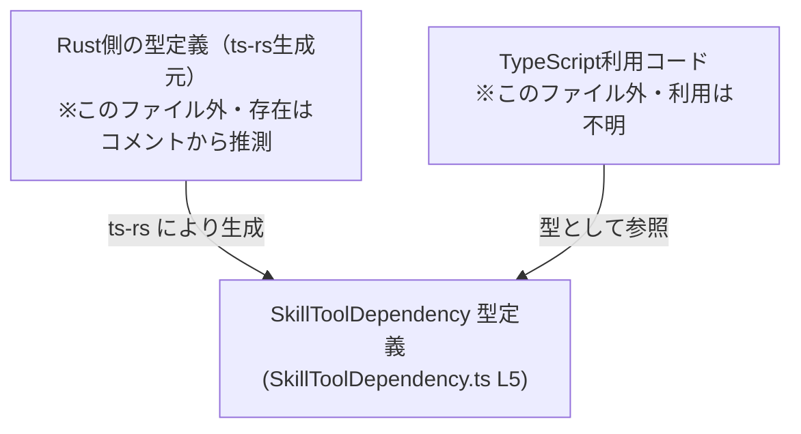
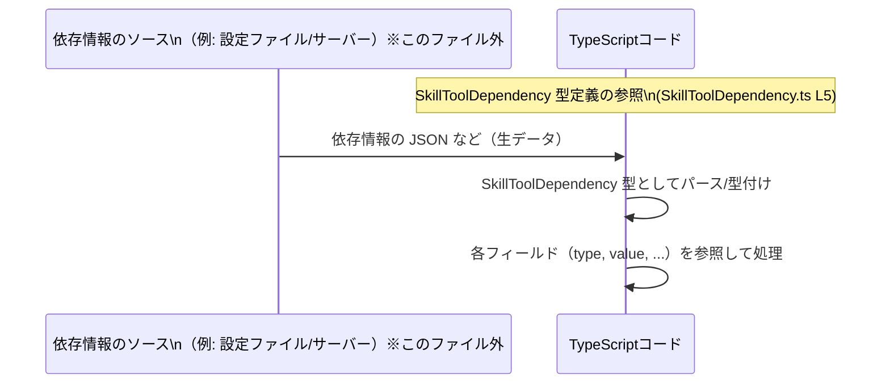

# app-server-protocol\schema\typescript\v2\SkillToolDependency.ts

## 0. ざっくり一言

`SkillToolDependency` という **スキルのツール依存関係を表す TypeScript のオブジェクト型**を 1 つだけ定義して公開している、自動生成ファイルです（SkillToolDependency.ts:L1-5）。

---

## 1. このモジュールの役割

### 1.1 概要

- このモジュールは、スキルが利用するツールや外部リソースへの依存情報を表現するための **スキーマ型** `SkillToolDependency` を提供します（SkillToolDependency.ts:L5-5）。
- コード冒頭のコメントから、この型は Rust 側の定義から `ts-rs` によって自動生成されており、手動で編集しない前提になっています（SkillToolDependency.ts:L1-3）。

### 1.2 アーキテクチャ内での位置づけ

- ファイルパスから、この型は `schema/typescript/v2` 配下の 1 つとして、**プロトコル（App Server Protocol）でやり取りするデータ構造を表す TypeScript 定義**の一部と考えられますが、実際の利用箇所はこのチャンクには現れません。
- コメントにより、生成元は Rust + `ts-rs` であることが明記されています（SkillToolDependency.ts:L1-3）。

以下の Mermaid 図は、このファイルの確実な事実と、一般的な ts-rs 利用形態をあわせて示した概略図です。  
※「Rust側定義」「利用コード」はこのチャンクには登場せず、存在は推測レベルであることを明示しています。



### 1.3 設計上のポイント

- **データ専用の型定義のみ**を持ち、関数やクラスなどの振る舞いは一切ありません（SkillToolDependency.ts:L5-5）。
- すべてのフィールド型は `string` で統一されており、2 つの必須フィールド（`type`, `value`）と 4 つのオプションフィールド（`description`, `transport`, `command`, `url`）で構成されています（SkillToolDependency.ts:L5-5）。
- ファイル全体が **自動生成コード**であり、手動変更を禁止するコメントが付与されています（SkillToolDependency.ts:L1-3）。
- エラー処理・並行性・状態管理などは一切含まれず、**純粋な型宣言のみ**です。そのため安全性やエラー処理は、利用側コードの書き方に依存します。

---

## 2. 主要な機能一覧

このファイルが提供する機能は 1 つです。

- `SkillToolDependency` 型: スキルのツール依存情報を表現するオブジェクト型（SkillToolDependency.ts:L5-5）

---

## 3. 公開 API と詳細解説

### 3.1 型一覧（構造体・列挙体など）

このチャンクに現れる公開型は次の 1 つです。

| 名前                  | 種別                            | 役割 / 用途の概要                                                                                       | 定義位置                          |
|-----------------------|---------------------------------|---------------------------------------------------------------------------------------------------------|-----------------------------------|
| `SkillToolDependency` | 型エイリアス（オブジェクト型） | スキルが依存するツールや外部リソースに関するメタデータを表すためと思われる構造。用途はこのファイル単体では断定できません。 | SkillToolDependency.ts:L5-5       |

#### フィールド構成

`SkillToolDependency` の内部フィールドは次の通りです（SkillToolDependency.ts:L5-5）。

```ts
export type SkillToolDependency = {
    type: string,
    value: string,
    description?: string,
    transport?: string,
    command?: string,
    url?: string,
};
```

フィールドごとの一覧です。「説明」の内容で意味を述べるときは、**用途は推測であり、このファイルからは断定できない**ことを明示します。

| フィールド名   | 型      | 必須/任意 | 説明（このファイルから分かること / 推測）                                                                 | 定義位置                          |
|----------------|---------|----------|-----------------------------------------------------------------------------------------------------------|-----------------------------------|
| `type`         | string  | 必須     | 依存の種別を表す文字列。具体的な値の制約や意味はコードからは不明です。                                  | SkillToolDependency.ts:L5-5       |
| `value`        | string  | 必須     | 依存対象を識別する値を表す文字列と推測されますが、用途はファイルからは断定できません。                 | SkillToolDependency.ts:L5-5       |
| `description`  | string  | 任意     | 説明文らしきフィールド名ですが、実際の利用・必須性はこのファイルからは不明です。                       | SkillToolDependency.ts:L5-5       |
| `transport`    | string  | 任意     | 通信方式などを表す可能性がありますが、意味はこのファイルからは判断できません。                         | SkillToolDependency.ts:L5-5       |
| `command`      | string  | 任意     | コマンド文字列を格納すると推測されますが、実際にどう使うかは不明です。                                 | SkillToolDependency.ts:L5-5       |
| `url`          | string  | 任意     | URL 形式の文字列を期待しているように見えますが、形式検証などは型からは分かりません。                   | SkillToolDependency.ts:L5-5       |

**TypeScript 特有のポイント**

- `description?` のように末尾に `?` が付いているフィールドは **オプショナルプロパティ**です。  
  これは「プロパティが存在しない（`undefined`）場合も許容する」ことを意味します。
- すべて `string` 型なので、**空文字列や特定フォーマットのチェックなどは型レベルでは行われていません**。妥当性チェックは利用側で実装する必要があります。

### 3.2 関数詳細（最大 7 件）

このファイルには **関数・メソッド・クラスメソッドは一切定義されていません**（SkillToolDependency.ts:L1-5）。

- そのため、エラー処理・並行性・パフォーマンスに関するロジックも存在しません。
- 以降の「関数詳細」テンプレートに該当する対象はありません。

### 3.3 その他の関数

- なし（このチャンクには関数定義が存在しません）。

---

## 4. データフロー

このファイル単体には、`SkillToolDependency` を実際に生成・利用するコードは含まれていません（SkillToolDependency.ts:L1-5）。  
したがって「実際のデータフロー」を断定することはできません。

ここでは、**この種のスキーマ型が一般にどう使われるか**という参考例として、典型的なフローを示します。  
※以下はあくまで一般的な利用像であり、このリポジトリが必ずしもこの通りであるとは限りません。



この図から読み取れるポイント（このファイルに関する確実な事実のみ）:

- `SkillToolDependency` は **入出力データの構造を表現するために利用される可能性が高い型**であり、  
  入力（設定/レスポンス）を受けて TypeScript 側でこの型として扱う、というパターンに適している。
- 実際にどのモジュールが読み書きするか、どのような JSON 形式と対応しているかは、このチャンクには現れません。

---

## 5. 使い方（How to Use）

### 5.1 基本的な使用方法

`SkillToolDependency` は **Plain なオブジェクト型**なので、通常の TypeScript のオブジェクトとして扱います。

以下は、この型をインポートして 1 つの依存情報を表現する例です。

```ts
// SkillToolDependency 型をインポートする
import type { SkillToolDependency } from "./SkillToolDependency"; // 相対パスは実環境に合わせて調整

// 1 件の依存情報を作成する例
const dep: SkillToolDependency = {
    type: "http",                  // 必須: 依存の種別（例として "http" を使用）
    value: "example-service",      // 必須: 依存対象の識別子（例としてサービス名）
    // 以下は任意プロパティ
    description: "Example service used by skill", // 説明（任意）
    transport: "rest",                              // 例: 通信方式（用途は推測）
    url: "https://api.example.com",                 // 例: 接続先 URL
    // command は未指定でもよい
};
```

この例から分かるポイント:

- `type` と `value` は **必須**なので、省略するとコンパイルエラーになります。
- `description`, `transport`, `command`, `url` は **指定してもしなくてもよい**フィールドです。
- 型定義上は値のフォーマット制約（URL 形式かどうかなど）は一切なく、単なる `string` として扱われます。

### 5.2 よくある使用パターン

#### 1. 複数の依存情報を配列で管理する

スキルに複数のツール依存がある場合、配列でまとめて扱うことが想定されます。

```ts
import type { SkillToolDependency } from "./SkillToolDependency";

// 複数の依存情報をまとめる例
const dependencies: SkillToolDependency[] = [
    {
        type: "http",
        value: "example-service",
        url: "https://api.example.com",
    },
    {
        type: "command",
        value: "image-magick",
        command: "convert",             // 任意プロパティ
    },
];
```

#### 2. オプショナルプロパティを安全に扱う

オプショナルプロパティは `undefined` の可能性があるため、利用時にはチェックが必要です。

```ts
function describeDependency(dep: SkillToolDependency): string {
    // description があればそれを使い、なければ type と value を使う例
    if (dep.description) {                    // truthy チェックで undefined/空文字を区別
        return dep.description;
    }
    return `${dep.type}: ${dep.value}`;       // description がない場合のフォールバック
}
```

### 5.3 よくある間違い

#### 必須フィールドの欠落

```ts
import type { SkillToolDependency } from "./SkillToolDependency";

// 間違い例: type を指定していない（コンパイルエラー）
const depBad1: SkillToolDependency = {
    // type: "http",            // 必須フィールドが欠落
    value: "example-service",
};

// 間違い例: value を指定していない（コンパイルエラー）
const depBad2: SkillToolDependency = {
    type: "http",
    // value: "example-service", // 必須フィールドが欠落
};
```

#### オプショナルプロパティを null/undefined と想定せずに直接利用

```ts
function openDependencyUrl(dep: SkillToolDependency): void {
    // 間違い例: url が必ずあると仮定して直接使う
    // window.open(dep.url);   // dep.url が undefined の可能性がある

    // 正しい例: undefined チェックを行う
    if (dep.url) {
        window.open(dep.url);
    } else {
        // url がない場合の処理（ログ出力など）
        console.warn("URL is not defined for dependency:", dep);
    }
}
```

### 5.4 使用上の注意点（まとめ）

- **前提条件**
  - `type` と `value` は常に指定する必要があります（SkillToolDependency.ts:L5-5）。
  - その他のプロパティは **未定義である可能性を常に考慮**する必要があります。
- **エラー/安全性**
  - 型レベルでフォーマット制約がないため、`url` に不正な URL、`command` に危険な文字列などが入ることを防げません。  
    実際の実行前に、利用コード側で妥当性チェックやサニタイズが必要になります（この点は一般的な注意であり、具体的な利用コードはこのチャンクにはありません）。
- **並行性**
  - この型は単なるオブジェクト型であり、スレッドセーフ/非スレッドセーフといった概念は持ちません。  
    ただし、複数箇所から同一オブジェクトインスタンスを共有して書き換える場合は、アプリケーション側のロジックで整合性を確保する必要があります。
- **変更禁止**
  - ファイル冒頭に「GENERATED CODE! DO NOT MODIFY BY HAND!」とあり（SkillToolDependency.ts:L1-3）、手動で編集しないことが前提になっています。

---

## 6. 変更の仕方（How to Modify）

### 6.1 新しい機能を追加する場合

このファイルは `ts-rs` による自動生成であり、コメントで明示的に手動変更禁止となっています（SkillToolDependency.ts:L1-3）。  
したがって、型の変更やフィールドの追加は **生成元（Rust 側の型定義）を変更**する必要があります。

一般的な手順（このリポジトリ固有のビルド手順はこのチャンクからは不明）:

1. Rust 側の `SkillToolDependency` に相当する構造体/型定義を探す（ts-rs 対応の `#[derive(TS)]` 等が付いた型であることが多いですが、実際の名称や位置は不明です）。
2. Rust の型定義にフィールドを追加/変更する。
3. `ts-rs` の生成コマンド（例: ビルドスクリプトや手動コマンド）を実行し、`SkillToolDependency.ts` を再生成する。
4. TypeScript 側の利用コードが新しいスキーマに対応しているか確認する。

### 6.2 既存の機能を変更する場合

- **フィールド名の変更・削除**  
  - Rust 側でフィールド名を変更/削除し再生成すると、TypeScript 側の `SkillToolDependency` もそれに応じて変化します。
  - 影響範囲は「`SkillToolDependency` を参照している TypeScript 全コード」になります。変更前後でコンパイルエラーになった箇所を確認するのが有効です。
- **型の変更（例: string → number）**
  - Rust 側の型変更が `ts-rs` 経由で TypeScript の型にも反映されるため、利用側で型に応じた修正（パース/フォーマット処理など）が必要です。
- **注意点**
  - この TypeScript ファイルだけを手作業で変更すると、次回の自動生成で上書きされる可能性が非常に高く、整合性が取れなくなります。  
    そのため、**必ず生成元側を変更する**のが前提条件になります。

---

## 7. 関連ファイル

このチャンクには他ファイルの具体的な情報は含まれていませんが、コメントやパス構造から、以下のファイル/領域が論理的に関連すると考えられます。

| パス / 種別                            | 役割 / 関係                                                                                             |
|----------------------------------------|----------------------------------------------------------------------------------------------------------|
| Rust 側の ts-rs 生成元ファイル（パス不明） | `SkillToolDependency` に対応する Rust の型定義を含むと推測されます。ts-rs による自動生成元です（SkillToolDependency.ts:L1-3）。 |
| `app-server-protocol/schema/typescript/v2/` 配下の他の `.ts` ファイル | 同じプロトコルバージョン v2 の別スキーマ型定義が存在すると考えられますが、このチャンクには具体名は現れません。                 |
| `SkillToolDependency.ts`（本ファイル） | `SkillToolDependency` 型を定義する TypeScript スキーマファイルです（SkillToolDependency.ts:L5-5）。      |

※ 実際のファイル名や Rust 側パスは、このチャンクには一切記載がなく、ここでは「存在しうる関連」としてのみ記載しています。
