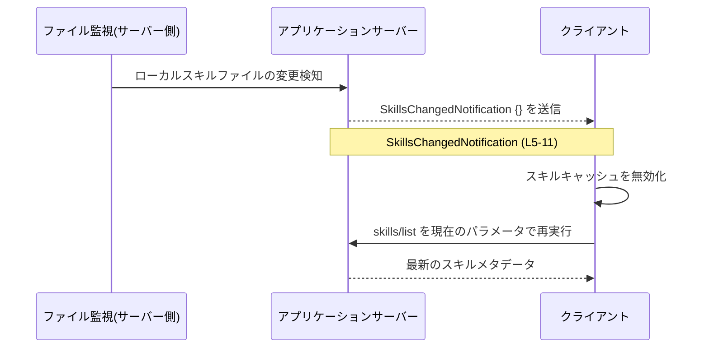
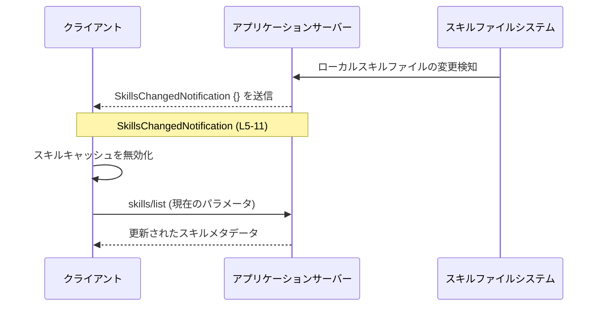

# app-server-protocol/schema/typescript/v2/SkillsChangedNotification.ts

## 0. ざっくり一言

ローカルのスキルファイルが変更されたときに送られる「スキル変更通知」のペイロード型を、空オブジェクトとして表現する TypeScript の型定義ファイルです。  
この通知を受け取ったクライアントは、`skills/list` を再実行してスキルメタデータを取り直すことが推奨されています（コメントより）  
（`app-server-protocol/schema/typescript/v2/SkillsChangedNotification.ts:L5-11`）。

---

## 1. このモジュールの役割

### 1.1 概要

- このモジュールは、「監視対象のローカルスキルファイルが変更された」ことを知らせる通知の**ペイロード型**を定義します。  
  （`app-server-protocol/schema/typescript/v2/SkillsChangedNotification.ts:L5-11`）
- 通知自体には**追加データを一切含めず**、単なる「無効化シグナル（invalidate signal）」として扱うことを意図しています。  
  （コメントの「Treat this as an invalidation signal」より  
  `app-server-protocol/schema/typescript/v2/SkillsChangedNotification.ts:L8-9`）

### 1.2 アーキテクチャ内での位置づけ

コードとファイルパスから分かる範囲での位置づけです。

- `schema/typescript/v2` 配下であることから、**アプリケーションサーバープロトコルの v2 スキーマを TypeScript で表現した一部**と解釈できます。  
  （パス名より。具体的な他ファイル構成はこのチャンクには現れません）
- コメントから、この通知は「スキルファイルの変更 → 通知 → クライアント側で `skills/list` を再実行」という流れの中で使われることが読み取れます。  
  （`app-server-protocol/schema/typescript/v2/SkillsChangedNotification.ts:L5-9`）

Mermaid 図で通知の流れを表現します（コメントに基づく論理フローです）。



### 1.3 設計上のポイント

- **自動生成コード**  
  - 冒頭コメントにより、`ts-rs` によって生成されたコードであり、手動編集は禁止されています。  
    （`app-server-protocol/schema/typescript/v2/SkillsChangedNotification.ts:L1-3`）
- **データを持たない通知**  
  - 型は `Record<string, never>` で定義されており、追加のプロパティを持たないことを型レベルで表現しています。  
    （`app-server-protocol/schema/typescript/v2/SkillsChangedNotification.ts:L11-11`）
- **プロトコルの意味づけはコメントで明示**  
  - 「ローカルスキルファイルの変更時に emit される」「無効化シグナルとして扱い、`skills/list` を再実行する」という運用上の意味が JSDoc コメントに書かれています。  
    （`app-server-protocol/schema/typescript/v2/SkillsChangedNotification.ts:L5-9`）
- **エラー・並行性に関する挙動**  
  - このファイルは型定義のみであり、実行時ロジック（エラー処理や並行処理）は含まれていません。安全性・並行性はこの型を利用する側の実装に依存します。  
    （`app-server-protocol/schema/typescript/v2/SkillsChangedNotification.ts:L1-11`）

---

## 2. 主要な機能一覧（コンポーネントインベントリー）

このファイルに現れる「公開 API」（= エクスポートされている型）は 1 つです。

| コンポーネント名 | 種別 | 役割 / 用途 | 根拠 |
|------------------|------|------------|------|
| `SkillsChangedNotification` | 型エイリアス | スキルファイル変更通知のペイロード型。データを持たない通知として表現する。 | `app-server-protocol/schema/typescript/v2/SkillsChangedNotification.ts:L5-11` |

---

## 3. 公開 API と詳細解説

### 3.1 型一覧（構造体・列挙体など）

| 名前 | 種別 | 実体 | 役割 / 用途 | 根拠 |
|------|------|------|-------------|------|
| `SkillsChangedNotification` | 型エイリアス | `Record<string, never>` | ローカルスキルファイル変更通知の**空ペイロード**型。プロトコル上、「変更があった」という事実のみを伝え、具体的な差分情報は含めない。 | コメントと型定義より（`app-server-protocol/schema/typescript/v2/SkillsChangedNotification.ts:L5-11`） |

#### `Record<string, never>` とは

- TypeScript 標準のユーティリティ型 `Record<K, V>` は、「キー `K` から値 `V` へのマッピング」を表します。
- `Record<string, never>` は「任意の文字列キーに対して、値の型が `never`」というオブジェクト型です。
  - `never` は「到達しない/存在しえない値」を表す型です。
  - そのため、**コンパイル時には `{}`（空オブジェクト）以外は代入できない**ように振る舞います。

例：

```ts
const ok: Record<string, never> = {};        // OK: プロパティがない
// const ng: Record<string, never> = { foo: 1 }; // エラー: number は never に代入できない
```

`SkillsChangedNotification` はこの性質を利用して、「この通知にはプロパティが無い」ということを型システムで表しています。  
（`app-server-protocol/schema/typescript/v2/SkillsChangedNotification.ts:L11-11`）

### 3.2 関数詳細

このファイルには**関数・メソッドは定義されていません**。  
そのため、「関数詳細テンプレート」を適用できる対象はありません。  
（`app-server-protocol/schema/typescript/v2/SkillsChangedNotification.ts:L1-11`）

### 3.3 その他の関数

- 補助関数やユーティリティ関数も、このチャンクには現れません。  
  （`app-server-protocol/schema/typescript/v2/SkillsChangedNotification.ts:L1-11`）

---

## 4. データフロー

### 4.1 代表的なシナリオ

コメントから読み取れる代表的なシナリオは次の通りです。

1. サーバー側で、ローカルの「スキルファイル」が監視されています。
2. 監視対象のスキルファイルが変更されると、サーバーは `SkillsChangedNotification` をクライアントに送信します。
3. クライアントは、この通知を「スキル情報キャッシュの無効化シグナル」とみなし、
4. 自身が現在使っているパラメータで `skills/list` を再実行し、最新のスキルメタデータを取得します。  
   （`app-server-protocol/schema/typescript/v2/SkillsChangedNotification.ts:L5-9`）

Mermaid のシーケンス図で表すと次のようになります。



### 4.2 安全性・エラー・並行性の観点

- **型レベルの安全性**  
  - ペイロードが空であることを `Record<string, never>` で表現しているため、「通知に何かフィールドがあるはず」と誤解してアクセスするコードはコンパイルエラーになります。  
    （`app-server-protocol/schema/typescript/v2/SkillsChangedNotification.ts:L11-11`）
- **実行時エラー**  
  - このファイルは型定義のみで、実行時の処理は含まないため、直接的な実行時エラー源にはなりません。
- **並行性**  
  - 並行・非同期実行（複数の通知が短時間に届くなど）に対して、この型自体が制約を持つことはありません。  
  - どのようにキューイング・デバウンスするかは、この型を利用するクライアント実装側の責務になります。

---

## 5. 使い方（How to Use）

### 5.1 基本的な使用方法

最も単純な使い方は、「通知が来たことだけをトリガーに処理を走らせる」ものです。  
通知ペイロードの中身は使いません。

```ts
// SkillsChangedNotification型をインポートする
import type { SkillsChangedNotification } from "./schema/typescript/v2/SkillsChangedNotification"; // パスは例示

// スキルリストを再取得する関数（ここでは例として自前で定義）
async function rerunSkillsList(): Promise<void> {
    // 実際にはサーバーの skills/list API を呼び出す想定
    console.log("skills/list を再実行してスキルメタデータを更新します");
}

// 通知を受け取ったときに呼ばれるハンドラ関数の例
function onSkillsChanged(_notification: SkillsChangedNotification): void {
    // _notification にはプロパティが存在しないため、値は利用しない
    void rerunSkillsList(); // 無効化シグナルとして扱い、スキルリストを再取得する
}
```

- `SkillsChangedNotification` 型として受け取ることで、「この通知から読み取れる情報は 'スキルが変わった' という事実だけ」という意図が明確になります。
- TypeScript の型チェックにより、`_notification.someField` のようなフィールドアクセスはコンパイルエラーになります。

### 5.2 よくある使用パターン

1. **イベント駆動のハンドラ登録**

```ts
type SkillsChangedListener = (notification: SkillsChangedNotification) => void;

class SkillsEventBus {
    private listeners: SkillsChangedListener[] = [];

    addListener(listener: SkillsChangedListener): void {
        this.listeners.push(listener);
    }

    // 実際の通知受信ロジックから呼ばれる想定
    emitSkillsChanged(notification: SkillsChangedNotification): void {
        for (const listener of this.listeners) {
            listener(notification);
        }
    }
}
```

- イベントバス（または WebSocket クライアントなど）の API で、`SkillsChangedNotification` を使って型安全なハンドラを表現できます。

1. **通知種別のユニオン型の一部として利用**

他の通知型と合わせてユニオンにし、ディスパッチするパターンの例です。

```ts
// 例: 他にも Notification 型があると仮定してユニオンを定義
type AnyNotification =
    | { kind: "skillsChanged"; payload: SkillsChangedNotification }
    // | { kind: "other"; payload: OtherNotification } // 他の通知を追加する余地

function handleNotification(notification: AnyNotification): void {
    switch (notification.kind) {
        case "skillsChanged":
            // payload は空オブジェクト型
            void rerunSkillsList();
            break;
    }
}
```

※ `AnyNotification` や `OtherNotification` は例示用にこのコード内で定義しているものであり、実際のコードベースに存在するとは限りません。

### 5.3 よくある間違い

コメントと型から推測できる誤用例を挙げます。

```ts
import type { SkillsChangedNotification } from "./schema/typescript/v2/SkillsChangedNotification";

// 誤り例: 通知に詳細情報が入っていると仮定している
function wrongHandler(notification: SkillsChangedNotification): void {
    // 下の行はコンパイルエラーになる:
    // プロパティ 'changedSkills' は型 'Record<string, never>' に存在しません
    // console.log(notification.changedSkills);
}
```

**正しい利用イメージ**

```ts
function correctHandler(_notification: SkillsChangedNotification): void {
    // 通知は単なるトリガーとして扱う
    void rerunSkillsList();
}
```

- **誤りポイント**: `SkillsChangedNotification` にはプロパティが存在しない設計であるため、詳細な差分情報は得られません。
- 差分情報が必要な場合は、`skills/list` の結果や別の API から取得する必要があります（このチャンクからは具体的な API 仕様は分かりません）。

### 5.4 使用上の注意点（まとめ）

- **通知ペイロードは空**  
  - 何らかのプロパティ（変更されたスキル名など）が入っていると期待してコードを書くと、コンパイルエラーになります。  
    （`app-server-protocol/schema/typescript/v2/SkillsChangedNotification.ts:L11-11`）
- **無効化シグナルとして使う**  
  - コメントが示す通り、「キャッシュの無効化 → `skills/list` の再実行」というパターンを前提とした設計です。  
    （`app-server-protocol/schema/typescript/v2/SkillsChangedNotification.ts:L8-9`）
- **手動で型を変更しない**  
  - 冒頭コメントの通り自動生成コードであるため、このファイルを直接編集すると次回生成時に上書きされます。変更が必要な場合は、元になっている Rust 側の型定義（`ts-rs` が参照する定義）を変更する必要があります。  
    （`app-server-protocol/schema/typescript/v2/SkillsChangedNotification.ts:L1-3`）

---

## 6. 変更の仕方（How to Modify）

### 6.1 新しい機能を追加する場合

このファイルは自動生成されているため、**直接の変更は推奨されていません**。冒頭コメントで「DO NOT MODIFY BY HAND」と明示されています。  
（`app-server-protocol/schema/typescript/v2/SkillsChangedNotification.ts:L1-3`）

新しい情報を含む通知にしたい場合の一般的な手順（このコードベース外の話としての一般論）:

1. `ts-rs` が生成元とする Rust 側の型定義に、必要なフィールドを追加する。
2. Rust 側で `ts-rs` による TypeScript コード生成を再実行し、このファイルを再生成する。
3. サーバー実装が新しいフィールドを正しく埋めるように修正する。
4. TypeScript クライアント側で、`SkillsChangedNotification` 型に追加されたフィールドを利用するロジックを実装する。

※ 具体的な Rust 側のファイルパスや生成コマンドは、このチャンクには現れないため不明です。

### 6.2 既存の機能を変更する場合

- **空ペイロードからの変更**  
  - `Record<string, never>` 以外の型に変えると、「プロトコルとして通知にデータを持たせる」変更になります。
  - その場合、サーバーとクライアント双方での実装変更が必要になる可能性があります。
- **影響範囲の確認方法**  
  - このファイルには import/export が `SkillsChangedNotification` のみのため、どこから参照されているかはこのチャンクからは分かりません。
  - 影響範囲を把握するには、IDE や検索で `SkillsChangedNotification` を参照している箇所を追跡する必要があります。
- **契約（前提条件・返り値の意味）**  
  - JSDoc コメントに書かれている「無効化シグナル」「`skills/list` を再実行する」という契約を変更する場合は、ドキュメントや他言語向けスキーマ（Rust など）との整合性にも注意が必要です。  
    （`app-server-protocol/schema/typescript/v2/SkillsChangedNotification.ts:L5-9`）

---

## 7. 関連ファイル

このチャンク（単一ファイル）の中から分かる関連情報は次の通りです。

| パス / 要素 | 役割 / 関係 | 根拠 |
|------------|-------------|------|
| （不明：Rust 側の元定義） | コメントより、この TypeScript ファイルは `ts-rs` による自動生成物であり、対応する Rust 側の型定義が存在すると推測されます。ただし具体的なパスやモジュール名は、このチャンクには現れません。 | `app-server-protocol/schema/typescript/v2/SkillsChangedNotification.ts:L1-3` |
| `skills/list`（文字列としてのエンドポイント名） | コメント中で言及されている API/コマンド名。`SkillsChangedNotification` を受け取ったクライアントが再実行すべきものとして位置づけられています。実際の実装ファイルやインターフェース定義は、このチャンクには現れません。 | `app-server-protocol/schema/typescript/v2/SkillsChangedNotification.ts:L8-9` |

- このファイル内には `import` 文が存在しないため、**TypeScript レベルでの直接の依存関係**はありません。  
  （`app-server-protocol/schema/typescript/v2/SkillsChangedNotification.ts:L1-11`）
- テストコードや他のスキーマファイルとの関係も、このチャンクからは把握できません。
