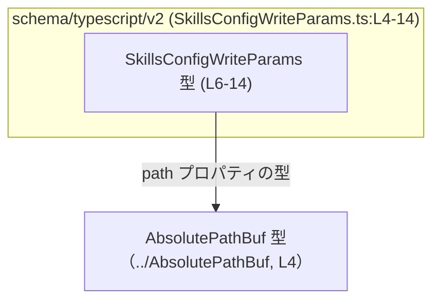
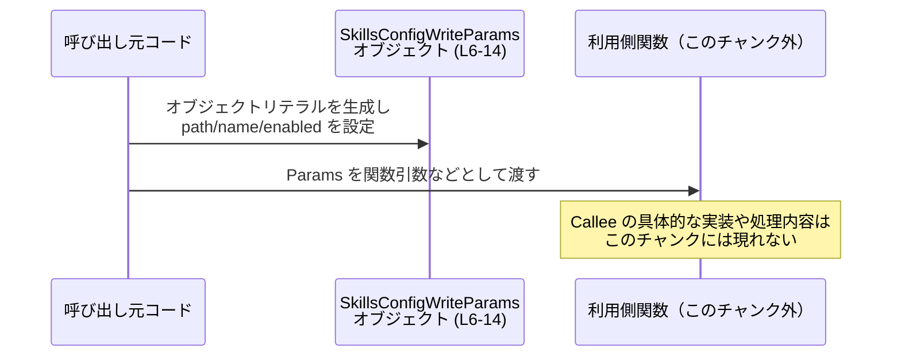

# app-server-protocol/schema/typescript/v2/SkillsConfigWriteParams.ts コード解説

## 0. ざっくり一言

- `SkillsConfigWriteParams` は、スキル設定を書き込むときに使われるパラメータの **型定義** を表す TypeScript の型エイリアスです（SkillsConfigWriteParams.ts:L6-14）。
- スキルを **パスまたは名前で選択** し、そのスキルを有効／無効にするフラグをまとめたデータ構造になっています（SkillsConfigWriteParams.ts:L7-10, L11-14）。

---

## 1. このモジュールの役割

### 1.1 概要

- このモジュールは、スキル設定の「書き込み」操作において使われるパラメータを TypeScript の型として表現するために存在しています（SkillsConfigWriteParams.ts:L6）。
- `ts-rs` によって自動生成されたコードであり、手動で編集しないことが明示されています（SkillsConfigWriteParams.ts:L1-3）。
- パラメータは、`path` または `name` によるスキルの指定と、`enabled` という有効・無効フラグから構成されます（SkillsConfigWriteParams.ts:L7-10, L11-14）。

### 1.2 アーキテクチャ内での位置づけ

このファイルが表現する関係は、次のように整理できます。

- `SkillsConfigWriteParams` 型は、このスキーマ・レイヤーの公開 API です（SkillsConfigWriteParams.ts:L6）。
- `path` プロパティの型として、別ファイルで定義される `AbsolutePathBuf` 型に依存しています（SkillsConfigWriteParams.ts:L4, L7-10）。
- 実際の「スキル設定を書き込む処理（関数やメソッド）」は、このチャンク内には存在せず不明です。



### 1.3 設計上のポイント

コードから読み取れる設計上の特徴は以下のとおりです。

- **自動生成コード**  
  - 先頭コメントで「生成コードであり手で編集しないこと」が明示されています（SkillsConfigWriteParams.ts:L1-3）。
- **純粋なデータ型定義のみ**  
  - 関数やクラスは定義されておらず、1つの型エイリアス `SkillsConfigWriteParams` だけをエクスポートしています（SkillsConfigWriteParams.ts:L6-14）。
- **セレクタの二通りの指定方法**  
  - パスで選択する `path?: AbsolutePathBuf | null`（SkillsConfigWriteParams.ts:L7-10）。
  - 名前で選択する `name?: string | null`（SkillsConfigWriteParams.ts:L11-14）。
- **必須フラグの存在**  
  - `enabled: boolean` は必須プロパティとして定義されており、常に true/false のいずれかが設定される前提です（SkillsConfigWriteParams.ts:L11-14）。
- **状態を持たない**  
  - 実行ロジック・ミューテーションを持たない純粋なデータコンテナであり、スレッド安全性や並行性に関する考慮は不要です（型定義のみであることから）。

---

## 2. 主要な機能一覧

このモジュールは 1 つの公開型のみを提供します。

- `SkillsConfigWriteParams`: スキル設定の書き込みパラメータ（`path`/`name` セレクタと `enabled` フラグ）を表すオブジェクト型（SkillsConfigWriteParams.ts:L6-14）。

---

## 3. 公開 API と詳細解説

### 3.1 型一覧（構造体・列挙体など）

| 名前                         | 種別       | 役割 / 用途                                                                 | 根拠                   |
|------------------------------|------------|-----------------------------------------------------------------------------|------------------------|
| `SkillsConfigWriteParams`    | 型エイリアス | スキル設定を書き込むときに用いるパラメータオブジェクトの型。`path` または `name` でスキルを指定し、`enabled` で有効/無効を示す。 | SkillsConfigWriteParams.ts:L6-14 |
| `AbsolutePathBuf`            | 型（別モジュール） | `path` プロパティの型として利用される絶対パス表現。具体的な中身は別ファイル側に定義されており、このチャンクからは不明。 | SkillsConfigWriteParams.ts:L4, L7-10 |

#### `SkillsConfigWriteParams` のフィールド構造

```ts
export type SkillsConfigWriteParams = {
    /**
     * Path-based selector.
     */
    path?: AbsolutePathBuf | null,
    /**
     * Name-based selector.
     */
    name?: string | null,
    enabled: boolean,
};
```

※ 上記は読みやすさのために改行・整形した形です。元コードは 1 行にまとまっています（SkillsConfigWriteParams.ts:L6-14）。

各フィールドの意味と型は次のとおりです。

| フィールド名 | 型                         | 必須/任意 | 説明                                                                                          | 根拠                         |
|--------------|----------------------------|-----------|-----------------------------------------------------------------------------------------------|------------------------------|
| `path`       | `AbsolutePathBuf \| null`  | 任意（`?`）| パスベースでスキルを選択するためのセレクタ。プロパティ自体を省略することも、`null` を明示的に設定することも可能です。 | SkillsConfigWriteParams.ts:L7-10 |
| `name`       | `string \| null`           | 任意（`?`）| 名前ベースでスキルを選択するためのセレクタ。こちらも省略または `null` が許可されています。                      | SkillsConfigWriteParams.ts:L11-14 |
| `enabled`    | `boolean`                  | 必須      | 対象スキルを有効化するかどうかを表すフラグ。必ず true/false のどちらかを設定する必要があります。                  | SkillsConfigWriteParams.ts:L11-14 |

**重要な型システム上のポイント**

- `path?` / `name?` という **オプショナルプロパティ** 記法と、`| null` という **ユニオン型** が組み合わさっているため:
  - プロパティ自体を省略する（`{ enabled: true }`）ことが可能です。
  - プロパティを明示した上で `null` を入れる（`{ path: null, enabled: true }`）ことも可能です。
- この型定義だけをみると、「`path` も `name` も両方省略 or null」の形も型としては許容されます。  
  それが業務的に意味のある状態かどうかは、この型を利用する側のロジック次第であり、このチャンクからは分かりません。

### 3.2 関数詳細（最大 7 件）

このファイルには、関数・メソッド・クラスは定義されていません（SkillsConfigWriteParams.ts:L1-14）。  
したがって、このセクションで詳細に解説すべき関数はありません。

### 3.3 その他の関数

- 補助関数やラッパー関数も一切定義されていません（SkillsConfigWriteParams.ts:L1-14）。

---

## 4. データフロー

このファイル単体では実行ロジックが定義されておらず、「どの関数から呼ばれるか」は分かりません。  
ここでは **TypeScript のコード内で `SkillsConfigWriteParams` 型の値がどのように流れるか** という、一般的な利用イメージを示します。



この図が表すのは、次のような **抽象的なデータフロー** です。

1. 呼び出し元コードが `SkillsConfigWriteParams` 型としてオブジェクトを構築する。
2. そのオブジェクトを、`SkillsConfigWriteParams` を受け取る何らかの関数・メソッド（スキル設定の書き込み処理など）に渡す。  
   ※ この関数がどこにあり何をするかは、このファイルには現れません。

---

## 5. 使い方（How to Use）

### 5.1 基本的な使用方法

この型を利用する典型的なパターンは、「呼び出し側でオブジェクトリテラルを組み立てて、どこかの処理に渡す」というものです。

```ts
// SkillsConfigWriteParams 型と AbsolutePathBuf 型をインポートする
import type { SkillsConfigWriteParams } from "./SkillsConfigWriteParams"; // 相対パスは利用側の構成に依存
import type { AbsolutePathBuf } from "../AbsolutePathBuf";

// 別の場所で AbsolutePathBuf 型の値が提供されていると仮定する
declare const skillPath: AbsolutePathBuf; // 具体的な生成方法はこのチャンクからは不明

// 例1: パスでスキルを指定して有効化する
const paramsByPath: SkillsConfigWriteParams = {
    path: skillPath,  // AbsolutePathBuf 型
    name: null,       // 名前セレクタは使用しないことを明示
    enabled: true,    // 有効化
};

// 例2: 名前でスキルを指定して無効化する
const paramsByName: SkillsConfigWriteParams = {
    path: null,          // パスセレクタは使用しないことを明示
    name: "my-skill",    // スキル名
    enabled: false,      // 無効化
};

// 例3: どちらか一方だけを指定する（プロパティ自体を省略）
const paramsOmitPath: SkillsConfigWriteParams = {
    // path は省略
    name: "my-skill",
    enabled: true,
};
```

上記は一般的な TypeScript の使い方の例です。  
このオブジェクトをどの関数に渡すか、その関数が何をするかは、このファイルには定義されていません。

### 5.2 よくある使用パターン

この型の構造から考えられる、代表的な使用パターンは次のとおりです。

1. **パスベースでの指定を優先するパターン**

   ```ts
   declare const path: AbsolutePathBuf;

   const params: SkillsConfigWriteParams = {
       path,              // パスで特定
       // name は省略するか null
       enabled: true,
   };
   ```

2. **名前ベースでの指定を使うパターン**

   ```ts
   const params: SkillsConfigWriteParams = {
       // path は省略または null
       name: "skill-A",
       enabled: false,
   };
   ```

3. **セレクタを条件に応じて切り替えるパターン**

   ```ts
   function buildParams(
       selector: { path?: AbsolutePathBuf; name?: string },
       enabled: boolean
   ): SkillsConfigWriteParams {
       return {
           path: selector.path ?? null,  // undefined の場合は null にそろえる例
           name: selector.name ?? null,
           enabled,
       };
   }
   ```

   上記は、「呼び出し側の別種の入力」をこの型に合わせて正規化するための一般的な例です。

### 5.3 よくある間違い

この型定義に基づき、発生しうる誤用の例と、その修正例を示します。

#### 1. `path` に `undefined` を代入してしまう

```ts
import type { SkillsConfigWriteParams } from "./SkillsConfigWriteParams";

const bad: SkillsConfigWriteParams = {
    // path: undefined, // コンパイルエラー: 型 'undefined' を 'AbsolutePathBuf | null' に割り当てられない
    enabled: true,
};
```

正しい例（プロパティを完全に省略するか、`null` を使う）:

```ts
const ok1: SkillsConfigWriteParams = {
    // path は使わないので省略
    enabled: true,
};

const ok2: SkillsConfigWriteParams = {
    path: null,  // 明示的に使用しないと示す
    enabled: true,
};
```

#### 2. 自動生成ファイルを直接編集してしまう

```ts
// NG: 生成済みファイルに直接フィールドを追加する
// SkillsConfigWriteParams.ts を手で書き換えるのはコメントで禁止されている
```

- 先頭コメントで「生成コード! 手動で変更するな」と明示されているため（SkillsConfigWriteParams.ts:L1-3）、直接編集すると生成元と不整合が生じます。
- フィールド追加・型変更が必要な場合は、`ts-rs` の生成元（通常は Rust 側の構造体定義など）を変更し、再生成する必要があります。

### 5.4 使用上の注意点（まとめ）

- **自動生成ファイルであること**
  - コメントに従い、このファイル自体は変更しない前提です（SkillsConfigWriteParams.ts:L1-3）。
  - 型の変更が必要な場合は、`ts-rs` の生成元定義を変更し再生成する必要があります。
- **`path` / `name` の両方が省略・null のケース**
  - 型定義上は許可されていますが、それが有効な状態かどうかはビジネスロジック依存であり、このチャンクだけでは分かりません。
  - 利用側の関数では、少なくともどちらか一方が有効に指定されているかをチェックする必要がある可能性があります。
- **`AbsolutePathBuf` の扱い**
  - このファイル内では `AbsolutePathBuf` の中身は定義されていません（SkillsConfigWriteParams.ts:L4）。
  - 適切な値の生成方法や制約は `../AbsolutePathBuf` 側の定義・ドキュメントを参照する必要があります。
- **並行性・パフォーマンス**
  - 純粋なデータ型定義であり、計算コストやスレッド安全性に関する懸念は基本的にありません。
  - ただし、これを大量に配列で保持する・シリアライズする場合のコストは、利用側の実装に依存します。

---

## 6. 変更の仕方（How to Modify）

### 6.1 新しい機能を追加する場合

このファイルは自動生成されるため、**直接変更するのではなく生成元を編集する** ことが前提です。

1. **生成元を探す**
   - 先頭コメントから、このファイルは `ts-rs` によって生成されていることが分かります（SkillsConfigWriteParams.ts:L1-3）。
   - 一般的には、Rust 側の `struct SkillsConfigWriteParams` のような定義が生成元になっていることが多いですが、具体的な場所はこのチャンクからは分かりません。
2. **生成元の構造体/型にフィールドを追加**
   - 追加したいプロパティ（例: `description?: string` など）を、生成元の定義に追加します。
   - その際、オプショナルかどうか、null を許すかどうか、といった型の設計を行います。
3. **`ts-rs` による再生成を実行**
   - プロジェクトのビルド手順やスクリプトに従い、TypeScript 型の再生成を行います。
4. **利用箇所の更新**
   - 新たに追加されたフィールドを利用するコードを、TypeScript 側で実装します。
   - 既存の利用箇所に影響が出る変更（必須フィールドの追加など）の場合は、コンパイルエラーを手掛かりに修正範囲を確認します。

### 6.2 既存の機能を変更する場合

同様に、変更も生成元側で行う必要があります。

- **影響範囲の確認**
  - `SkillsConfigWriteParams` 型の利用箇所を TypeScript IDE の「参照の検索」などで洗い出します。
  - `path` / `name` / `enabled` へのアクセスを行っているコードがどのような前提条件で使っているかを確認します。
- **契約（前提条件）の維持**
  - 例えば `enabled` をオプショナルに変更すると、従来「必ず true/false が入っている」前提で動いていたコードが壊れる可能性があります。
  - そのような破壊的変更を行う場合は、利用側での null/undefined チェックなども合わせて見直す必要があります。
- **テスト・型チェック**
  - 生成後に TypeScript の型チェックとテストを実行し、変更の影響を確認します。
  - このファイルにはテストコードは含まれていないため、テストは別ファイル側に存在すると考えられますが、このチャンクからは詳細不明です。

---

## 7. 関連ファイル

このモジュールと直接関係するファイルは次のとおりです。

| パス                                      | 役割 / 関係                                                                                          | 根拠                     |
|-------------------------------------------|-------------------------------------------------------------------------------------------------------|--------------------------|
| `schema/typescript/v2/SkillsConfigWriteParams.ts` | 本ドキュメント対象。`SkillsConfigWriteParams` 型の定義を提供する自動生成 TypeScript ファイル。          | SkillsConfigWriteParams.ts:L1-14 |
| `schema/typescript/v2/../AbsolutePathBuf.ts` など | `AbsolutePathBuf` 型の定義を提供するモジュール。`path` プロパティの型としてこのファイルから参照される。具体的なファイル名はこのチャンクからは不明だが、インポートパスは `"../AbsolutePathBuf"` として指定されています。 | SkillsConfigWriteParams.ts:L4 |

※ テストコードや、この型を実際に利用するビジネスロジック（スキル設定を書き込む処理）は、このチャンクには現れません。どのファイルに存在するかは、この情報だけからは分かりません。
